# 在 Linux 和 Windows 上使用前端工具:大性能测试

> 原文：<https://levelup.gitconnected.com/working-with-front-end-tools-on-linux-and-windows-the-grand-performance-test-b51a77a71636>

## node.js 在 Windows 上真的比较慢吗？使用 yarn 代替 npm 对您的工作流程有何影响？实时杀毒软件会影响你的构建时间吗？让我试着用一个快速的基准和真实的、通过实验收集的数字来回答这个问题。

我一直认为自己在操作系统、平台和浏览器领域远非虔诚。显然，我倾向于有所偏好——但我尽量避免激烈地将其推入讨论。有人用 Linux？酷，如果对他们有好处的话。Windows？太好了，也许他们只是喜欢这种体验。MacOS？我不介意。火狐？歌剧？Chrome？没事的。

说到操作系统，偏好很少是性能的问题——通常是方便、细节和美观的问题。显然，有人会说 macOS 快得惊人——但这主要是 Mac/MacBook 平台精确选择高性能硬件的结果。

因为我要用各种项目和工具来解决团队同事的问题，所以我倾向于频繁地转换工作环境:我的部分工作是在 macOS 上用 MacBook 完成的，部分工作是在 Windows 上完成的，有时我会跳到 Linux 上。通常，我看不出有什么明显的不同。

然而，几个月前，我开始感到有点…痒。我有一种感觉，基于 node.js 的前端开发工具的性能在 Windows 环境下受到了制约。可以工作，但我无法摆脱这样的感觉，即`npm`、`node`、`yarn`和类似的工具工作起来……比在 linux/macOS 系统上慢。[显然](https://stackoverflow.com/questions/9243221/does-node-js-perform-badly-on-windows-surely-it-cant-be-slower-than-apache-for) [不止我一个人](https://www.reddit.com/r/node/comments/4op7ey/npm_is_incredibly_slow_on_windows_10/)——有几个类似经历的报道，但没有合适的结论。

好奇心占了上风，我最终开始计算一些数字。

结果是明确的。请耐心阅读这篇文章，看看我发现了什么。

# **方法**

主要目标是比较 Windows 和 Linux 的性能，在最常见的场景中测试它们:

*   搭建新的 web 应用程序
*   安装节点依赖关系
*   创建包，即构建 web 应用程序

也有计划将 macOS 纳入测试，但我没有机会在同一个硬件上运行 Windows 和 macOS。最后，我们比较了两个流行系统的性能:

*   **Windows 10 Pro** (build 1809，2018 年 10 月更新)
*   **运行 Linux 5 . 0 . 0–23 内核的 Ubuntu 18.04.2 LTS**

在选择将提供最佳基准值的技术时，我接触了 TypeScript 和 Webpack(来自 create-react-app bundle)。此外，我已经决定在依赖性管理方面测试 NPM 和 yarn。构建时间不仅针对少数文件进行了测试，也针对数百个文件进行了测试。我最终设计了由以下步骤组成的基准大纲:

1.  使用 create-react-app 并启用 TypeScript 来搭建应用程序**(基准#1)**
2.  重置依赖关系(删除节点模块)并退出配置
3.  安装依赖项:

*   使用 npm 安装，同时保留`package-lock.json` **(基准#2)**
*   使用 npm 安装，同时在每次运行时移除`package-lock.json`**(基准#3)**
*   使用纱线同时保留`yarn.lock` **(基准#4)**
*   使用纱线安装，同时移除纱线。每次运行时锁定**(基准#5)**

4.构建搭建的应用程序:

*   有少量(3 个)源文件**(基准#6)**
*   拥有大量(300 多个)源文件**(基准#7)**

为了使基准测试的结果尽可能可靠和真实，应用了以下规则:

*   两个测试系统都在同一台没有虚拟化的机器上本机运行(华硕 P25P20L，带 i5–5200 u CPU 和 16GB RAM)。
*   两个系统都是新安装的。基准测试时没有其他应用程序在运行。
*   每项测试至少进行 5 次，以尽量减少随意性。最终结果是测试运行的平均值。
*   机器连接到基于 300/300 mbps 吞吐量的光纤的稳定互联网链接。在这两个系统上，事先都进行了互联网连接测试。
*   在系列中每个测试的第一次运行之前，都会调用一次预运行，以便准备和预热应用程序缓存。

此外，在两个平台上使用了相同版本的 node.js 和其他工具:

*   **节点 12.7.0**
*   **国家预防机制 6.10.0**
*   **创建-反应-应用 3.0.1**
*   **纱线 1.17.3**

时间显然是主要的衡量标准。当然，我没有为此使用手动秒表——为了精确地获得结果，我精心制作了一个小型 node.js 应用程序，它为我处理测试运行和测量。下面是应用程序搭建的情况:

如前所述，每个测试至少运行 5 次，计算平均值作为最终结果。

在 Windows 测试的情况下，还有另一个重要因素—在版本 10 中，安装了一个默认的防病毒软件，可以实时扫描所有文件活动。因为我认为它可能会严重影响(好家伙，我是对的！)npm 和 yarn、Windows 的性能测试是在启用和禁用上述防病毒软件的情况下独立进行的。

# **结果**

## **基准#1:使用 create react 应用程序实例化应用程序**

**描述:**

在每个测试运行期间，create-react-app 命令被调用，以便在一个全新的目录中搭建 react 和 TypeScript 应用程序。

**结果:**

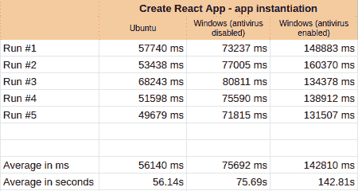

图 1.1。:应用程序实例化时间比较，5 次运行

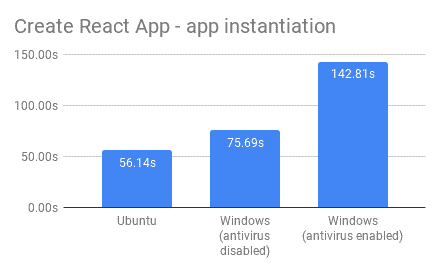

图 1.2。:图表上应用程序实例化时间和平均值的比较

**评论:**

Ubuntu 是明显的赢家，与 Windows 相比提升了 25%!此外，我们可以看到防病毒软件对性能的影响有多严重——在启用时，它需要几乎两倍的时间来搭建应用程序。

## **基准#2:使用 npm install 安装依赖项，同时保留 package-lock.json**

**描述:**

在每个测试运行期间，都会调用 npm install 命令来重建依赖关系。之前，删除了“node_modules”目录，但保留了 package-lock.json 文件。

**结果:**

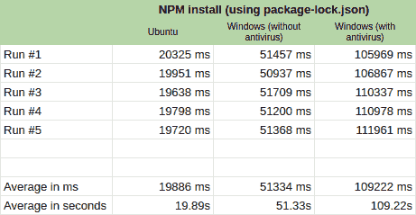

图 2.1。:使用 package-lock.json 的 NPM 安装运行时间比较，5 次运行

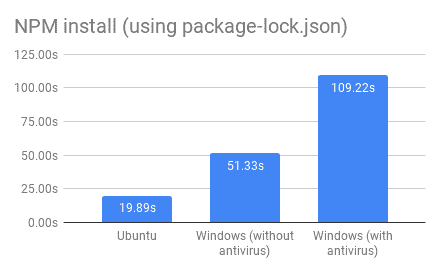

图 2.2。:使用 package-lock.json 时 NPM 安装运行时间的比较，在图表上取平均值

**备注:**

Ubuntu 和 Windows 之间有着巨大的差距——差距几乎是三倍。此外，Windows 上的防病毒软件增加了 100%的额外开销。

## **基准#3:使用 npm install 安装依赖项，同时在每次运行时删除 package-lock . JSON**

**描述:**

在每个测试运行期间，都会调用 npm install 命令来重建依赖关系。之前,“node_modules”和 package-lock.json 都被删除了。

**结果:**

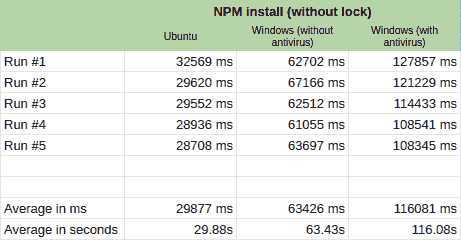

图 3.1。:不使用 package-lock.json 时 NPM 安装运行时间的比较，5 次运行

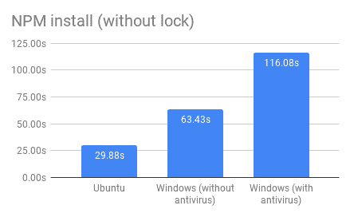

图 3.2。:不使用 package-lock.json 的情况下 NPM 安装运行时间的比较，平均值显示在图表上

**评论:**

同样，Ubuntu 和 Windows 之间的差距也很大——但是，这个比例已经降低了。请注意，与磁盘操作的变化相比，删除 package-lock.json 最终会增加所需的计算量。

## **基准#4:使用纱线安装依赖项，同时保留纱线**

**描述:**

在每个测试运行期间，调用“yarn”命令以重建依赖关系。事先，` node_modules '目录被删除，但 yarn.lock 文件被保留在原处。

**结果:**

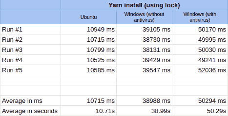

图 4.1。:纱线运行时间与使用 yarn.lock 的比较，5 次运行

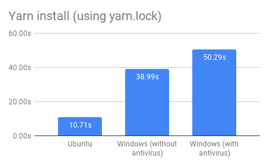

图 4.2。:使用 yarn.lock 时纱线运行时间的比较，图表上的平均值

**评论:**

与两个系统上的 npm 相比，Yarn 的使用显示了显著的改进，但是它仍然揭示了 Windows 版本的弱点。启用和禁用防病毒之间的差异要小得多，这表明与 npm 相比，磁盘操作更少。

## **基准测试#5:在每次运行时移除 yarn.lock 时使用 yarn install 安装依赖项**

**描述:**

在每个测试运行期间，调用“yarn”命令以重建依赖关系。之前,“node_modules”和 yarn.lock 都被删除了。

**结果:**

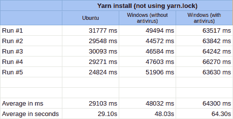

图 5.1。:不使用纱线锁的纱线运行时间的比较，5 次运行

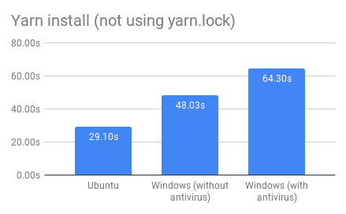

图 5.2。:未使用纱线锁时纱线运行时间的比较，图表上的平均值

**备注:**

使用 yarn 安装依赖项时不使用 lockfile 会导致性能显著下降。此外，两个操作系统之间的差异已经适度缩小。

## **基准#6:构建具有少量(3 个)源文件的搭建应用**

**描述:**

在每次测试运行期间，通过“npm run build”命令调用 Webpack 和 typescript transpiler。源代码由三个中等大小的类型脚本代码文件组成。在每次测试之前，包含包输出的目录被删除。

**结果:**

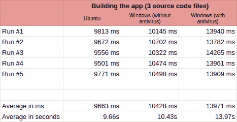

图 6.1。:构建运行时间与 3 个源文件、5 次运行的比较

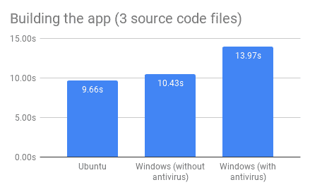

图 6.2。:在图表上比较 3 个源文件的构建运行时间和平均值

**备注:**

最后，运行在 Windows 上的 node 赶上来了，并显示出与运行在 Ubuntu 上的 node 相似的性能。这表明，尽管与磁盘/网络操作相比，我们正在处理更多的计算，但 Windows 并没有明显落后——只要我们没有启用实时防病毒。

## **基准#7:构建具有大量(300+)源文件的搭建应用**

**描述:**

在每次测试运行期间，通过“npm run build”命令调用 Webpack 和 Typescript transpiler。源代码由 300 多个中等大小的打字稿代码文件组成。每个代码文件都包括 10 个可导出变量和一个默认导出(见附件测试报告)。它们使用具有很少文件级别的树形结构聚集在一起。最后，一切都被逐渐导入到主 index.ts 文件中。和以前一样，在每个测试运行之前，带有包的目录被删除。

**结果:**

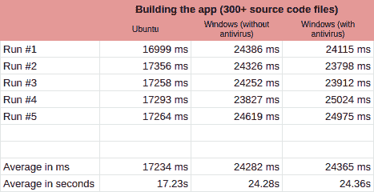

图 7.1。:构建运行时间与 300 多个源文件的比较，5 次运行

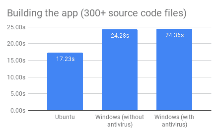

图 7.2。:在图表上比较 300 多个源文件的构建运行时间和平均值

**评论:**

与少文件版本相比，这个测试显示了运行在 Ubuntu 上的节点和运行在 Windows 上的节点之间更明显的差异。有趣的是，与上一次相反，这一次杀毒软件并没有对结果产生很大的影响。记住，我们没有输出很多文件(结果由 Webpack 连接)，这表明反病毒程序只关心被调用的可执行文件的数量。

# **结论和摘录**

是总结的时候了！平均而言，在 Ubuntu 上运行的任务比在 Windows 上运行的任务有大约 41%的性能提升。涉及的磁盘操作越多，差异就越大。

说到 Windows，事实证明，启用防病毒功能会导致性能下降 44%,这表明开发人员不应该忘记将节点和 npm 列入白名单——否则，会严重影响处理时间。

一不小心，原来实验是一个该死的利用纱线的好广告。在所有测试中，它的执行速度明显快于 npm——平均来说，它的执行速度比 NPM 快大约 32 %。

回到主要问题，数字是非常清楚的——基于 node.js 的工具在 Windows 上运行时会产生明显更差的性能。背后的原因可能是什么？问题可能不在于 Windows 或 node.js 本身——毕竟，在这两种情况下，它都是正在 CPU 上处理的本机可执行文件。

我认为问题在于它们如何在 I/O 级别进行交互。

请注意，最显著的差异发生在基于`npm`的测试中——在那些场景中，成千上万的小磁盘操作是在小文件上进行的。这就是 NTFS 文件系统可能落后于 Ubuntu 的 ext4 系统的地方——它只是对许多较小的操作不太优化。请注意，此过程还会大量使用网络—当缓存为空时，npm 会分别请求每个包。这可能表明，当数百个 HTTP 请求需要快速处理和交换时，Windows 网络层的响应能力不足以产生最大的潜在性能。这个话题并不新鲜——在谷歌上搜索一番后，可能会找到描述直接测量文件系统性能的[文章](https://www.phoronix.com/forums/forum/software/general-linux-open-source/1468-performance-of-filesystems-compared-includes-reiser4-and-ext4?1765-PERFORMANCE-OF-FILESYSTEMS-COMPARED-(includes-Reiser4-and-Ext4)_=)。

对我们这些前端开发者来说意味着什么？当然，在大多数情况下，与 Linux 相比，在 Windows 上工作每天只会损失几秒钟——对于许多人来说，放弃他们心爱的环境是不值得的。在 Windows 上使用 NPM 可能会慢一些——但毕竟，我们不会一天几次重新安装所有的依赖项。但是，如果您的项目很大(数百个源文件)，涉及更复杂的转换过程(例如多个加载器和 TypeScript)，并且需要您经常构建它(例如频繁发布到不同的环境)，您可能会损失大量时间，为了节省时间，可以考虑迁移到 Linux。这同样适用于大量使用的 CI/CD 管道—如果您使用基于 Windows 的管道(例如，在 Azure DevOps 上)，除了许可成本之外，仅由于消耗的构建时间，它的成本可能更高。

这是否意味着你应该抛弃窗户？没有。但现在你知道代价了。

如果你想自己去玩，产生自己的结果(和结论！)，请随意使用我用过的基准代码:
[【https://github.com/hzub/node-perf-test】](https://github.com/hzub/node-perf-test)
该库包括本文中使用的基准代码和示例搭建应用程序。别忘了分享你的成果！

干杯！