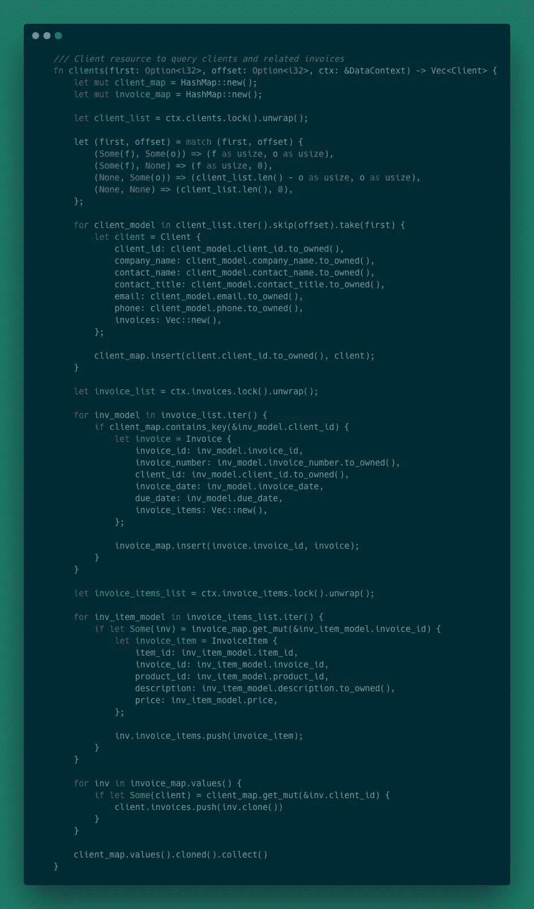
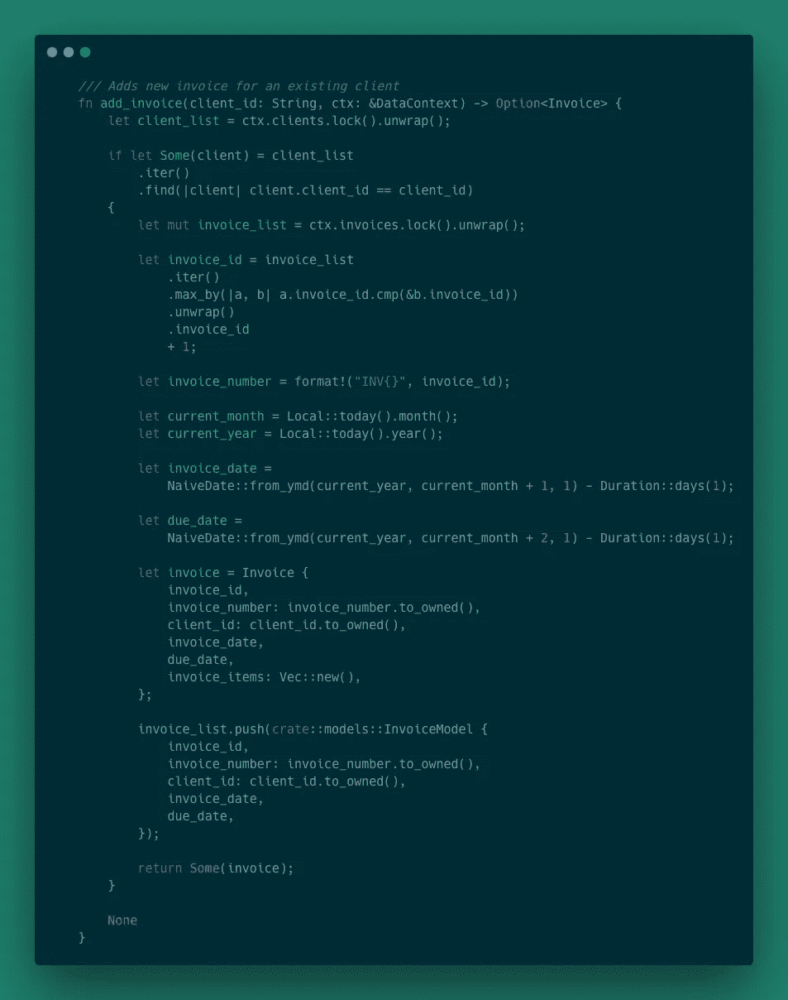

# 在 Rust 中使用 GraphQL

> 原文：<https://levelup.gitconnected.com/working-with-graphql-in-rust-dcbff7e768f1>


GraphQL 是开发面向客户端的 API 的一个非常流行的框架。本文涵盖了 GraphQL 与 Rust 集成的基础知识，包括设计一个代码优先的模式，设置一个 GraphQL 服务器，以及实现定制的解析器和变异。

# 为什么选择 GraphQL 和 Rust

这篇文章的想法源于我最近在工作中所做的事情。我通常花时间编写 Rust 代码，但最近我一直在一个 TypeScript 环境中使用 GraphQL。GraphQL 使用的类型系统让我想起了 Rust 中的结构，这让我对一起使用 GraphQL 和 Rust 感到好奇，所以我决定看看 Rust 对 GraphQL 的支持。

经过一番研究，我能够找到两个库: [*async-graphql*](https://crates.io/crates/async-graphql) 和 [*Juniper*](https://crates.io/crates/juniper) 。根据 *crates.io* 统计，Juniper 库似乎是首选库。这是一个相当稳定的机箱，支持大多数 GraphQL 规范。然而，它不支持*订阅*或*异步/等待*，尽管这两个特性在主分支中都可用。 *async-graphql* 库是更新的，并且越来越受欢迎。它还支持 GraphQL *订阅*和*异步/等待*语法。一个缺点是, *async-graphql* 正在经历 API 的快速变化，有时一天内会发布多个版本。因为这篇文章不是要比较这两种板条箱，我决定先使用 Juniper，因为它现在要稳定得多。

# 什么是 GraphQL

以防你不熟悉 GraphQL，在进入本教程的其余部分之前，我将给出一个简要的概述。GraphQL 是一种 API 查询语言和一个运行时，用于用请求的数据解析这些查询。从客户端的角度来看，GraphQL 允许在客户端和服务器端资源之间进行更好的分离。这意味着客户端不需要知道任何资源的端点，甚至不需要知道两个或更多资源是否相关。客户可以简单地要求它所需要的数据，它将得到确切的数据。在服务器端，根据类型和字段实现了一个 GraphQL API。根类型包含资源的名称以及这些资源返回的内容。其他类型定义可以从根类型中的资源返回的数据。为了更深入地了解 GraphQL，我建议从这里的开始。

# 设置一个简单的 GraphQL 服务器

既然我已经选择了一个 GraphQL 库，我还需要一个 web 框架来处理传入的 GraphQL 查询。由于 *Juniper* 不支持 *async/await* 语法，我决定在类似的情况下使用 web 框架 *Rocket* 。和 *Juniper* 一样， *Rocket* 也不支持 *async/await* ，但这将在下一个版本中有所改变。

> *Rocket 要求使用 Rust 的夜间版本。您可以通过运行命令* `*rustup default nightly*` *切换到夜间版本。如果想切换回稳定，只需运行* `*rustup default stable*` *命令即可。*

有了基本的方法，我将开始使用`cargo new rust_graphql_example`建立一个新的项目。然后在 *Cargo.toml* 文件中，我将添加以下依赖项:

```
juniper = "0.14.2" juniper_rocket = "0.5.2" rocket = "0.4.5"
```

需要注意的一点是 *Juniper* 提供了一些预构建的库，用于与一些 web 框架集成。对于这个例子，我将使用[*juniper _ rocket*](https://crates.io/crates/juniper_rocket)

> *有关支持的集成的完整列表，请查看* [*文档*](https://docs.rs/juniper/0.14.2/juniper/index.html) *中的*集成*部分。*

## 简单的模式

首先要做的是定义一个简单的 GraphQL 模式。所以我在 */src* 目录中创建了一个名为 *schema.rs* 的新文件，并添加了以下内容:


GraphQL 模式有三个主要部分:查询、变异和根节点。`Query` struct 用于定义 GraphQL 可用的资源，并定义如何解析查询。`Query`实现块上方的`juniper::object`程序宏是在 *Juniper* 中定义 GraphQL 解析器的主要方式。`Mutation`类型现在只是一个占位符，但是它将在以后定义允许客户端改变数据的资源。你会注意到`EmptyMutation`是一个泛型结构。稍后，单元类型`()`将被数据库上下文替换。最后，`Schema`基本上合并了其他两个结构，成为 GraphQL 模式的根。

## 一个简单的网络服务器

既然已经定义了一个简单的模式，我需要设置 web 服务器。juniper _ rocket 库使这变得更容易，因为它提供了一些预构建的集成。在 *main.rs* 文件中，我添加了以下内容:


在这个例子中，我设置了两个端点:一个用于 GraphiQL 接口，另一个用于处理来自实际客户端的 post 请求。juniper_rocket 的集成在这里非常有用，因为它提供了简单的请求和响应包装器以及执行 GraphQL 查询的简单方法。`juniper_rocket::graphiql_source`函数也很好，因为它允许您轻松地在应用程序中设置 GraphiQL 页面。`main`功能只是注册`Schema`，安装路由，然后启动 web 服务器。

顺便提一下，我对 *Juniper* 的一个疑问是 *EmptyMutation* 是一个通用结构。这意味着如果我不提供一个实际的数据库上下文，就像在这个例子中，我必须将模板类型设置为单元类型。在 *Rocket* 中，这意味着我必须在`Rocket::State`和`manage`函数中传递单元类型。这在我看来是不必要的。

## 启动服务器

现在我有了一个简单的模式和一个 web 服务器来处理请求。要测试它，只需运行命令`cargo run`，它将编译并启动服务器。一旦项目完成编译，打开 web 浏览器并导航到`localhost:8000`。

欢迎来到 GraphiQL！该工具支持编写和执行查询以及模式自省。由`Docs`按钮指定的*文档浏览器*允许模式自省。这意味着我可以深入模式，查看 GraphQL 可用的资源、字段和类型。这包括任何参数和文档。查询窗口允许我构造一个查询，并通过按播放图标来执行它。例如，如果我键入以下查询:

```
{
  helloWorld
}
```

来自我们的 GraphQL 服务器的响应是:

```
{
  "data": {
    "helloWorld": "Hello, world!"
  }
}
```

# 自定义 GraphQL 类型

现在我已经建立了一个简单的 GraphQL 模式和服务器。也正好完全没用。对于一个更现实的例子，我将建立一个 GraphQL API，它提供关于一个顾问的客户列表及其发票的数据。本例的数据包含在存储库的`/data`目录中。我有三个数据源: *Clients.csv* 、 *Invoices.csv、*和 *InvoiceItems.csv* 。发票通过`ClientId`与客户关联，发票项目通过`InvoiceId`与发票关联。

> *所有数据都是使用*[*Mockaroo*](https://mockaroo.com/)*随机生成的。*

## 添加数据模型

我想做的第一件事是向项目中添加另外三个依赖项。因为我正在处理 CSV 数据，所以我想拉进 *csv* 机箱。另外，`Invoices.csv`文件包含日期，所以我将把 *chrono* 箱拉进来。最后，我需要能够将 CSV 数据反序列化为定制的 Rust 类型，所以我想拉进 *serde* 机箱。将以下内容添加到 *Cargo.toml* 文件中:

```
chrono = { version = "0.4.15", features=["serde"] } csv = "1.1" serde = { version = "1.0", features = ["derive"] }
```

然后，我创建一个名为 *models.rs* 的新文件，并用一个模块声明更新 *main.rs* :

```
mod models;
```

然后我用下面的结构定义更新 *models.rs* :


## 添加数据上下文

下一个任务是添加逻辑来读取 CSV 数据，并使其可供应用程序访问。为此，我创建了一个名为 *db.rs* 的文件，并用一个模块声明来更新 *main.rs* :

```
mod db;
```

然后，我用以下内容更新 *db.rs* :


这提供了一种将 CSV 文件中的数据提供给应用程序其余部分的方法，但是 GraphQL 不知道这个 *DataContext* 结构或任何数据模型。

## 连接到 Juniper

这里要做的第一件事是让 *Juniper* 意识到一个结构是 GraphQL 类型。一个简单的方法是使用提供的宏`juniper::GraphQLObject`。举个例子，我将更新*客户端*模型，如下所示:


现在 *Juniper* 知道了*客户端*模型，但是它不知道如何与 *DataContext* 接口或者查询客户端数据。为此，我需要将 *schema.rs* 更新如下:


上面的代码做了两件事:

*   通过实现`juniper::Context`使 *Juniper* 意识到 *DataContext*
*   并创建一个名为`clients`的 GraphQL 查询，该查询使用对 *DataContext* 的引用来查询客户端数据

我还需要通过更新请求处理程序中的`context`变量，让 *Rocket* 知道 *DataContext* ，并添加一个由 *Rocket* 管理的 *DataContext* 的实例。用以下内容更新 *main.rs* :


现在我应该能够编译和运行这个例子了。当我导航到`http://localhost:8000/`时，我可以打开*文档浏览器*并点击*查询*，我会看到如下内容:

```
helloWorld: String! 
Simple "Hello, world!" query clients: [Client!]! 
Client resource to query clients
```

这意味着我可以执行如下查询:

```
{
  clients {
    clientId
    companyName
    contactName
    email
  }
}
```

并得到类似这样的响应:

```
{
"data": {
  "clients": [
    {
      "clientId": "07-3782546",
      "companyName": "Ward, McLaughlin and Hilpert",
      "contactName": "Helga Jarritt",
      "email": "hjarritt0@icio.us"
    },
    {
      "clientId": "91-7491370",
      "companyName": "Hermiston, Kilback and Runolfsson",
      "contactName": "Leonie Willshear",
      "email": "lwillshear1@amazon.co.uk"
    },
    {
      "clientId": "36-6951968",
      "companyName": "Feil-Lang",
      "contactName": "Franzen Zelake",
      "email": "fzelake2@go.com"
    }
}
```

这个例子允许我查询所有的客户端数据，但是不允许我查看任何其他与客户端相关的数据。我需要的是告诉 GraphQL 我所有的数据模型都以某种方式相关联。

# 自定义 GraphQL 解析器

这就引出了 GraphQL 解析器的概念。解析器告诉 GraphQL 如何检索 GraphQL 类型的某个字段的数据。因此，对于这个示例，我将把另外两个模型— *Invoice* 和 *InvoiceItem* —添加到 *Juniper* 中，以便我可以查询所有相关数据。为此，我需要为*客户端*和*发票*模型定制一个解析器。

首先，我需要更新*型号:*


基本上，这只是将宏`juniper::GraphQLObject`从*客户端*模型移动到 *InvoiceItem* 模型。

接下来，我用*客户端*和*发票*模型的定制解析器更新 *schema.rs* :


自定义解析器由*客户端*和*发票*的`impl`模块定义。除了一个字段之外，它们与相应的数据模型几乎相同。*客户端*有一个名为`invoices`的函数，它返回与该客户端相关的任何发票。*发票*有一个名为`invoice_items`的函数，它返回与该发票相关的任何发票项目。

现在，当我编译并运行这个例子时，我可以查看*文档浏览器*并看到*客户端*被定义为:

```
Information about a client clientId: String! 
companyName: String! 
contactName: String! 
contactTitle: String! 
phone: String! 
email: String! 
invoices: [Invoice!]!
```

而*发票*的定义是:

```
Information about an invoice for a specific client invoiceId: Int! 
invoiceNumber: String! 
clientId: String! 
invoiceDate: NaiveDate! 
dueDate: NaiveDate! 
invoiceItems: [InvoiceItems!]!
```

这意味着我可以执行如下查询:

```
{ 
  clients { 
    clientId 
    companyName 
    contactName
    email 
    invoices { 
      invoiceNumber 
      invoiceDate 
      dueDate 
      invoiceItems { 
        productId 
        description 
        price 
      } 
    } 
  } 
}
```

并得到如下所示的结果:

```
{
  "data": {
    "clients": [
      {
        "clientId": "07-3782546",
        "companyName": "Ward, McLaughlin and Hilpert",
        "contactName": "Helga Jarritt",
        "email": "hjarritt0@icio.us",
        "invoices": [
          {
            "invoiceNumber": "INV100001",
            "invoiceDate": "2020-01-31",
            "dueDate": "2020-02-29",
            "invoiceItems": [
              {
                "productId": 7929,
                "description": "leverage back-end e-business",
                "price": 3315.33
              }
            ]
          }
        ]
      }
    ]
  }
}
```

# 高效的 GraphQL 查询

然而，这种设计有一个大问题。假设可能会请求发票数据，那么这种设计是非常低效的。对于每个客户记录，都要进行一次查询，以获取该客户的所有发票。对于每条发票记录，都会进行查询以获取该发票的发票详细信息。这就是众所周知的`N + 1`查询问题，并导致寻找执行查询的有效方式。

解决这个问题的一个方法是将数据模型与 GraphQL 类型分离。有几个库可以帮助解决这个问题，例如:

*   [数据加载器](https://crates.io/crates/dataloader)
*   [杜松渴望装载](https://crates.io/crates/juniper-eager-loading)

然而，我想只关注 Juniper 的集成，所以我决定为这个例子实现一个简单的解决方案。

我需要做两件事来完成这项工作。第一项任务是在中定义 GraphQL 类型，它独立于数据模型，但允许关系数据。第二个任务是更新`clients`查询以提取所有数据，并根据来自数据模型的关系 id 正确映射数据。我将 *schema.rs* 更新为以下内容:


GraphQL 类型非常简单，但是我想浏览一下`clients`查询。目标是提前获取所有数据，这样就不需要后续的查询。我这样做的方法是使用两个哈希映射——一个用于客户，一个用于发票。我首先创建客户机散列映射，并将`invoices`字段初始化为一个空向量。然后我创建发票映射，我只在客户端映射中添加带有`client_id`的发票，并将`invoice_items`字段设置为空向量。然后，我可以将发票项目数据映射到发票映射中的适当发票，并将发票映射到适当的客户端。在所有数据被正确查询和映射后，我返回客户机列表。

## 添加查询参数

上面的示例返回所有客户端数据的列表。根据数据量，这可能是一个非常糟糕的主意。GraphQL 提供了向查询传递参数的能力。例如，我可以使用参数来实现分页，或者添加另一个查询来按 id 查找客户机。


这个例子通过添加`first`和`offset`作为参数，为`clients`查询添加了简单的分页逻辑。这些参数随后被用于 skip 和 take 函数。GraphQL 在这里提供了更深入的分页指南[。](https://graphql.org/learn/pagination/)

添加了`get_client`查询，其逻辑与`clients`相似，只是它最多只返回一个客户端。另外，`get_client`的返回类型是一个`Option`。这意味着如果`id`参数与现有的客户端不匹配，响应将如下所示:

```
{
  "data": {
    "getClient": null
  }
}
```

# GraphQL 突变

现在，我可以对数据集执行两个独立的查询。但是，我没有办法改变数据的状态。GraphQL 提供了一种使用[突变](https://graphql.org/learn/queries/#mutations)来修改服务器端数据的方法。

## 在 Juniper 中添加突变

在 *Juniper* 的上下文中，变异的实现类似于查询的实现。为了添加`Mutation`的实现，我替换了这一行:

```
pub type Mutation = EmptyMutation<DataContext>;
```

包含以下内容:


这个例子定义了一个名为`Mutation`的空结构，并添加了一个带有`juniper::object`属性的实现块。它还向 GraphQL 声明了名为`NewClient`和`NewInvoiceItem`的输入类型。在实现模块中，有三个功能目前被剔除，但将在以后实现。

由于`Mutation`从一种类型变为一种结构，需要做两个小的改变。首先，我需要更新`Schema`类型:

我还需要更新`Schema`是如何在`main`函数中被实例化的，如下所示:

```
fn main() {
  rocket::ignite()
    .manage(DataContext::init().unwrap())
    .manage(Schema::new(Query, Mutation))
    .mount(
      "/",
      rocket::routes![graphiql, get_graphql_handler, post_graphql_handler],
    )
    .launch();
}
```

现在新的`Mutation`会用 *Juniper* 注册，但是它还什么都不做。然而，在我实现`Mutation`中的函数之前，我必须做一些修改，以允许`DataContext`在函数调用中是可变的。

## 可变上下文

我在`juniper::object`宏中实例化的`Context`对象是不可变的。这是一个问题，因为这意味着上下文对象中的数据也是不可变的。我真正想做的是改变内部数据的状态，这意味着我需要线程安全的内部可变性。

为了让上下文对象支持内部可变性，我需要将`DataContext`的属性包装在`Arc`和`Mutex`中。在 *db.rs* 中，我将`DataContext`更新为:


通过添加那个`Arc`和`Mutex`包装器，我可以安全地在`DataContext`中改变数据。然而，这确实破坏了`Query`中的所有功能。为了解决这个问题，我需要更新`clients`和`get_client`查询来使用新版本的上下文对象。

我将`clients`更新为:



和`get_clients`到以下:


这将修复因更改`DataContext`实现而导致的问题。

## 添加变异函数定义

现在我可以实现`Mutation`中的功能了。这是一个有点做作的例子，所以我不打算将更新写回文件，但是只要服务器是活动的，任何更改都将存在。此外，如果添加成功，每个变异将只返回对象的实例。

对于`add_client`，我补充如下:


这个没什么特别的。它创建一个 GraphQL `Client`类型的实例返回给调用者。它还创建了一个`ClientModel`实例，并将其添加到`DataContext`的`clients`属性中。

对于`add_invoice`，还有更多的事情要做:



这个函数找到具有最大发票 id 的发票，并将其递增 1 以生成新的发票 id 和发票号。然后它使用`chrono::Local::today`获取当前月份和年份来计算发票日期(当前月份的最后一天)和到期日(下个月的最后一天)。从那里看，和`add_client`差不多。GraphQL `Invoice`的实例被创建，并且`InvoiceModel`的实例被添加到`DataContext`的`invoices`属性中。

最后，`add_invoice_item`:


像`add_invoice`一样，`add_invoice_item`找到最大的项目 id，并递增它以获得新的项目 id。然后创建 GraphQL 类型`InvoiceItem`的一个实例，并将`InvoiceItemModel`的一个实例添加到`DataContext`的`invoice_items`属性中。

## 运行突变

定义了所有的突变方法后，我现在可以测试它们了。首先通过运行命令`cargo run`启动服务器。然后，如果我想添加一个新的客户端，我将执行的变异可能如下所示:

```
mutation {
  addClient(
    newClient: {
      clientId: "99-5344573"
      companyName: "Herman-Treutel"
      contactName: "Ario Drayson"
      contactTitle: "Business Systems Development Analyst"
      phone: "499-304-2835"
     email: "wclaricoats0@ftc.gov"
 }) {
    clientId
    companyName
    contactName
    contactTitle
    phone
    email
  }
}
```

我会得到这样的回应:

```
{
  "data": {
    "addClient": {
      "clientId": "99-5344573",
      "companyName": "Herman-Treutel",
      "contactName": "Ario Drayson",
      "contactTitle": "Business Systems Development Analyst",
      "phone": "499-304-2835",
      "email": "wclaricoats0@ftc.gov"
    }
  }
}
```

然后，我可以通过执行这种变异向新客户端添加发票:

```
mutation {
  addInvoice(clientId: "99-5344573") {
    invoiceId
    invoiceNumber
    invoiceDate
    dueDate
  }
}
```

这将返回以下内容:

```
{
  "data": {
    "addInvoice": {
      "invoiceId": 101001,
      "invoiceNumber": "INV101001",
      "invoiceDate": "2020-09-30",
      "dueDate": "2020-10-31"
    }
  }
}
```

然后添加一个发票项目，我可以运行`add_invoice_item`突变:

```
mutation {
  addInvoiceItem(
    invoiceId: 101001
    newInvoiceItem: {
      productId: 2899
      description: "exploit e-business supply-chains"
      price: 4969.04
    }
  ) {
    itemId
    invoiceId
    productId
    description
    price
  }
}
```

答案会是:

```
{
  "data": {
    "addInvoiceItem": {
      "itemId": 6001,
      "invoiceId": 101001,
      "productId": 2899,
      "description": "exploit e-business supply-chains",
      "price": 4969.04
    }
  }
}
```

# 回顾

总的来说， *Juniper* 是一个设计良好的库，在 Rust 中提供 GraphQL 支持，我很喜欢使用它。集成是非常有益的，大多数类型都是结构良好的。我最喜欢的两个特性是`juniper::object`属性和 GraphQL 类型宏。

有一件事我很想看到这个库——一个新的版本。自 2019 年 12 月以来，一直没有版本发布。从那以后，repo 有了一些变化，比如对 async/await 语法和 GraphQL 订阅的支持。希望很快会有新的版本发布。

所有代码都可以在[这里](https://github.com/andrewleverette/rust_graphql_example)获得。

# 谢谢

感谢阅读！如果你想联系或想提供反馈，请随时通过 LinkedIn 联系我。


*原载于 2020 年 10 月 1 日*[*https://andrewleverette . github . io*](https://andrewleverette.github.io/graphql-and-rust/)*。*