# 如何对熊猫中的分组数据应用函数？

> 原文：<https://levelup.gitconnected.com/working-with-groupby-in-pandas-7e7823414537>

## Groupby 使用分组数据像玩球一样玩的提示和技巧

由 [Unsplash](https://unsplash.com?utm_source=medium&utm_medium=referral) 上的 [krakenimages](https://unsplash.com/@krakenimages?utm_source=medium&utm_medium=referral) 拍摄的照片

Groupby 内置功能有限。在这篇[文章](https://medium.com/star-gazers/groupby-in-pandas-5df348e293f8?source=your_stories_page-------------------------------------)中，我展示了如何在我用 groupby 创建的对象上使用一些函数，比如 mean 和 sum。但是使用 aggregate 方法，既可以使用自己编写的函数，也可以使用 groupby 内置的函数。

我要谈的是以下话题:

*   如何对分组数据应用函数？
*   如何将自己编写的函数应用于分组数据？
*   应用多个功能
*   如何为每个组的类别应用该功能？
*   处理缺失数据

在开始之前，请不要忘记订阅[我的 youtube 频道](https://www.youtube.com/channel/UCFU9Go20p01kC64w-tmFORw)，在那里我创建了关于人工智能、数据科学、机器学习和深度学习的内容。👇

让我们开始吧！

# 如何对分组数据应用函数？

首先，我们来进口熊猫和 Numpy。

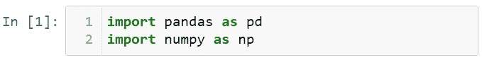

现在，让我创建一个数据集。

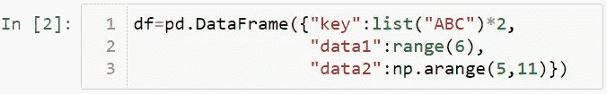

让我们来看看这个数据集。

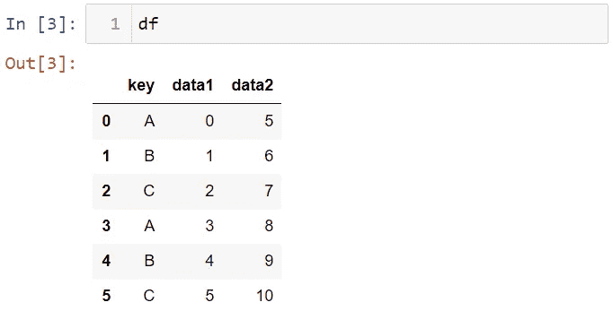

现在，让我们按键列对数据集进行分组。

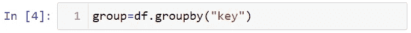

对于 A、B 和 C 组，可以使用 aggregate 方法应用 min、np.median 和 max 函数。

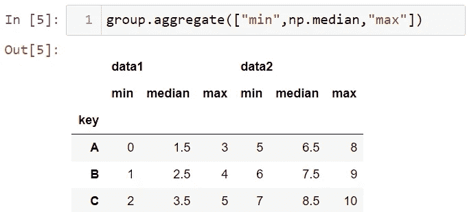

> Y 你可以用缩写 agg 代替 aggregate。

通过使用字典结构，可以对每一列应用不同的函数。让我展示这个。

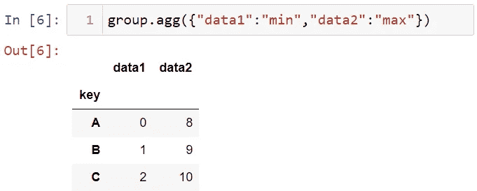

# 如何将自己编写的函数应用于分组数据？

你可以应用你写的一个函数，首先，我们来定义一个函数。让我们创建一个函数。

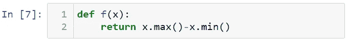

现在，让我们应用这个函数。

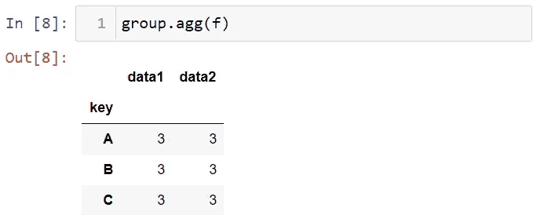

# 应用多个功能

为了展示如何应用多个函数，首先，让我们创建一个具有分层索引的数据集。

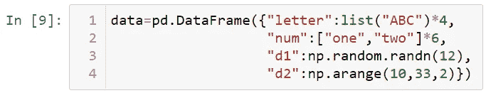

让我们来看看这个数据集。

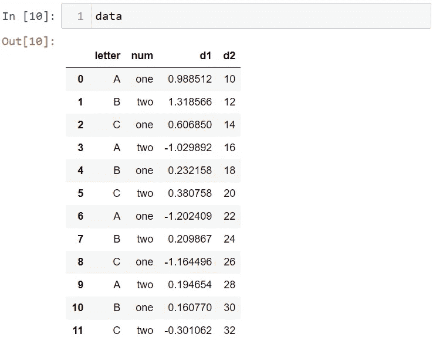

现在让我创建组对象。

接下来，让我们为 d1 数据创建组对象。

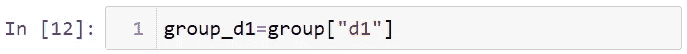

让我找出这个变量的平均值。为此，我将把 mean 函数作为字符串写入 agg 函数。

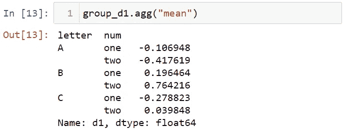

您可以对分组数据应用多个函数。为此，您需要在列表中编写函数。

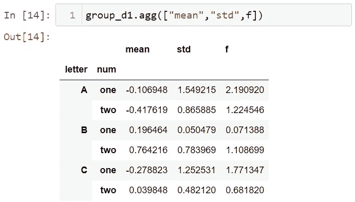

还可以通过在元组结构中编写列名和函数来应用函数。

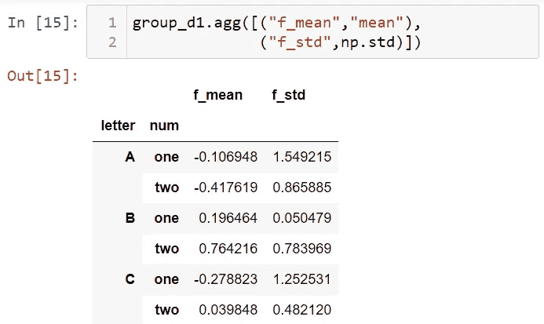

您还可以对列应用单独的函数。

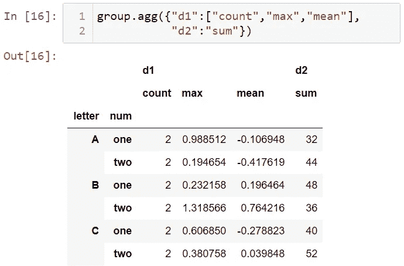

到目前为止，我们已经使用了层次索引。如果不希望索引具有层次结构，可以使用 as_index = False。

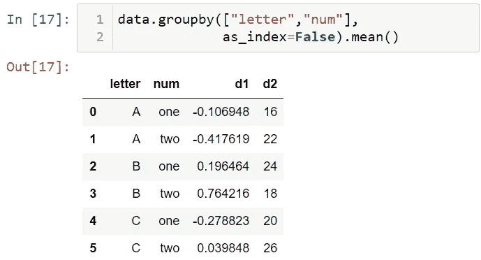

# 如何为每个组的类别应用该功能？

您可以使用 apply 方法来实现每个组的类别中的任何函数。为了说明这一点，让我们再来看看我们的数据。

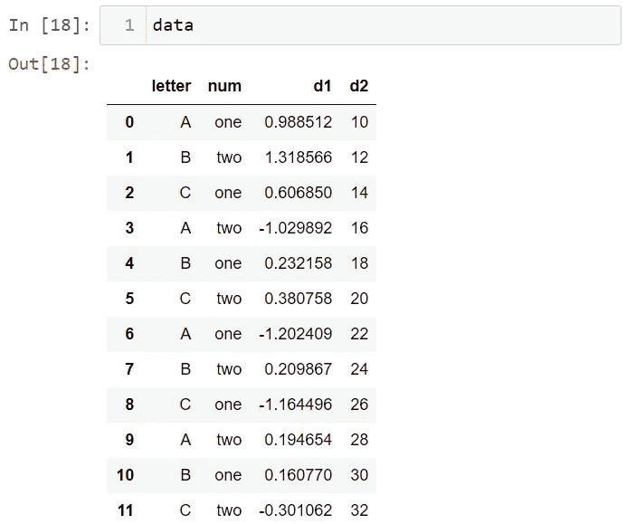

让我们按字母列对数据集进行分组。

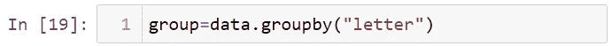

让我们找到组中每个类别的 d2 的汇总统计数据。

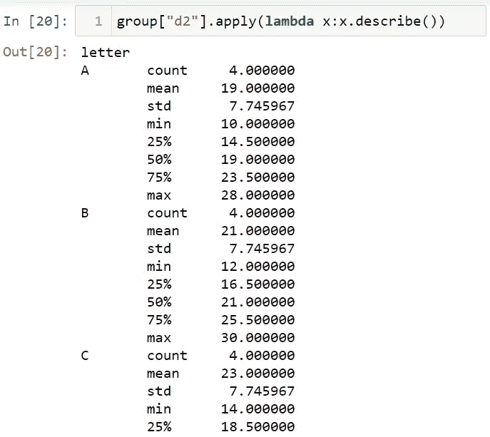

为了展示另一个例子，让我们创建一个数据集。

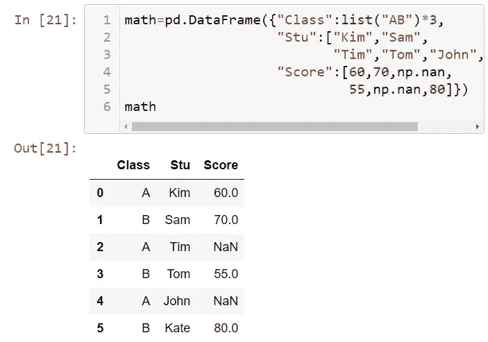

现在，让我们分组。

让我们找出各组的平均值。

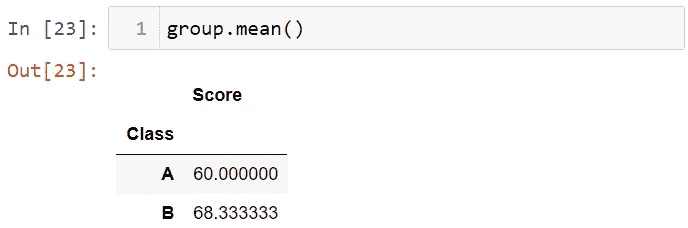

# 处理缺失数据

现在，让我们用组平均值来代替缺失值。首先，让我们编写一个函数，使用 lambda 关键字用 mean 填充缺失的数据。

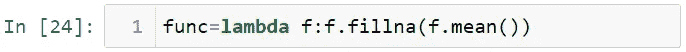

现在，让我们将 func 函数应用于 group 对象。

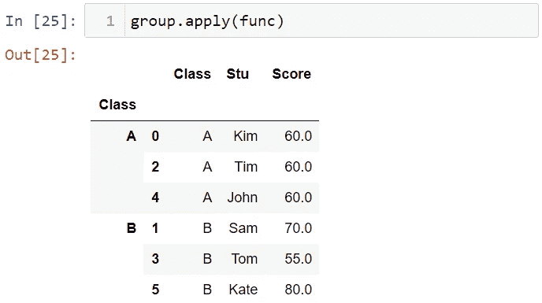

您可以为丢失的数据使用您想要的值。为了展示这一点，让我创建值变量。

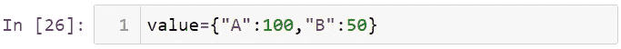

现在，让我们使用函数用这个值变量填充缺失的数据。

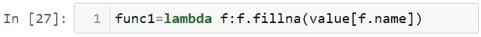

最后，让我们将这个函数应用于用 apply 分组的数据。

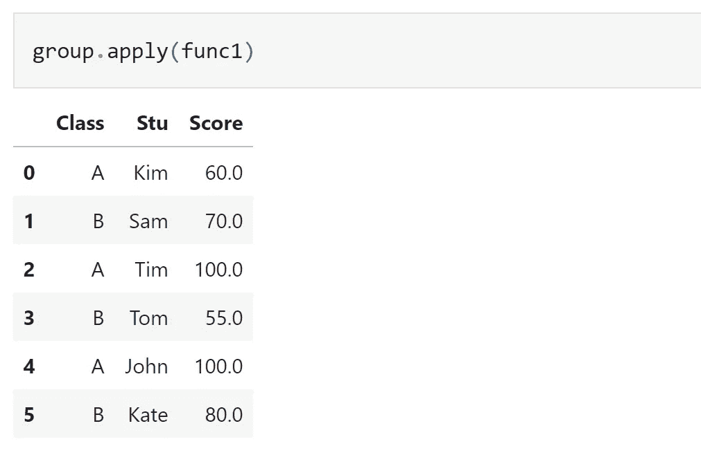

就是这样。在这篇文章中，我介绍了如何在 Pandas 中使用 groupby。我希望你喜欢这篇文章。感谢阅读。在这里可以找到笔记本[。](https://github.com/TirendazAcademy/PANDAS-TUTORIAL/blob/main/16-GroupBy.ipynb)

请不要忘记关注我们的[YouTube](http://youtube.com/tirendazacademy)|[Twitter](http://twitter.com/tirendazacademy)|[GitHub](http://github.com/tirendazacademy)|[Linkedin](https://www.linkedin.com/in/tirendaz-academy)|[ka ggle](https://www.kaggle.com/tirendazacademy)

 [## 8 个最好的 Seaborn 可视化

### Python Seaborn 使用 penguin 数据集实际绘制统计图。

medium.com](https://medium.com/geekculture/8-best-seaborn-visualizations-20143a4b3b2f)  [## 熊猫的实用数据分析

### 在我的上一篇文章中，我提到了在熊猫图书馆使用数据。Python 最重要的库之一是熊猫…

levelup.gitconnected.com](/practical-data-analysis-with-pandas-c40fbd2955fa) 

如果这篇文章有帮助，请点击拍手👏按钮几下，以示支持👇