# 在时间序列中使用索引

> 原文：<https://levelup.gitconnected.com/working-with-indexes-in-time-series-a2e00d220399>

## 读取时间序列数据、将日期转换为索引并将其可视化的指南。

Javier Esteban 在 [Unsplash](https://unsplash.com?utm_source=medium&utm_medium=referral) 上拍摄的照片

时间序列是一系列按时间顺序排列的数据点。如果按日期对数据集进行索引，就可以很容易地进行时间序列分析。时间序列有三种索引类型:DatetimeIndex、PeriodIndex 和 TimedeltaIndex。时间戳数据的索引类型是 DatetimeIndex。显示固定间隔日期数据的周期数据的索引类型是 PeriodIndex。显示两个日期之间的时间的时间增量数据的索引类型是 TimedeltaIndex。在这篇文章中，我将讨论以下主题，

*   如何创建时间序列？
*   如何读取时间序列数据集？
*   如何将日期转换成索引？
*   如何使用索引？
*   如何确定数据集的日期？
*   如何可视化时间序列？

在开始之前，请不要忘记关注[我们的 youtube 频道](https://www.youtube.com/channel/UCFU9Go20p01kC64w-tmFORw)，在那里我创建了关于人工智能、数据科学、机器学习和深度学习的内容。

让我们开始吧！

# 创建时间序列

为了展示如何创建时间序列，首先，让我导入 pandas 和 numpy。

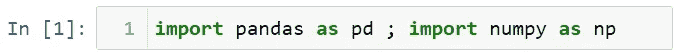

让我们用开始日期和结束日期创建一个名为 date 的变量。

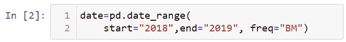

让我们使用日期变量创建一个名为 ts 的时间序列。

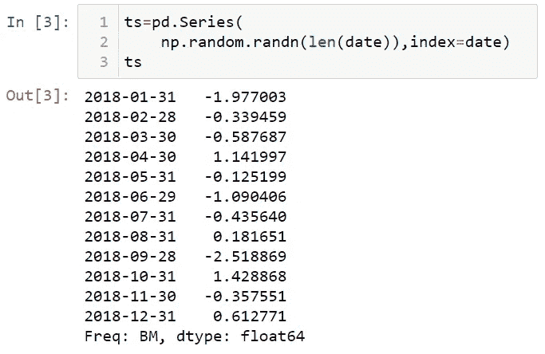

我们来看看这个数据的指数。

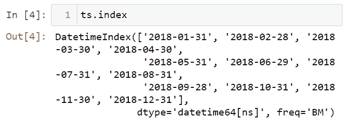

如您所见，ts 的索引结构是 DatetimeIndex。有了这些指标，我们就可以像打球一样打球了。为了分割索引，让我们打印前 5 个索引。

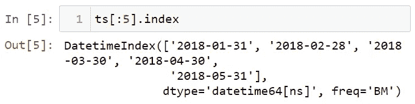

# 读取时间序列数据集

现在，让我们使用一个真实世界的数据集来显示脸书的股票市值。让我用 read_csv 方法读取这个数据集。

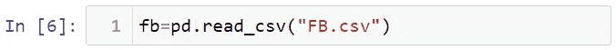

你可以在这里找到这个数据集[。让我们用 head 方法来看看数据集的前 5 行。](https://github.com/TirendazAcademy/pandas-tutorial)

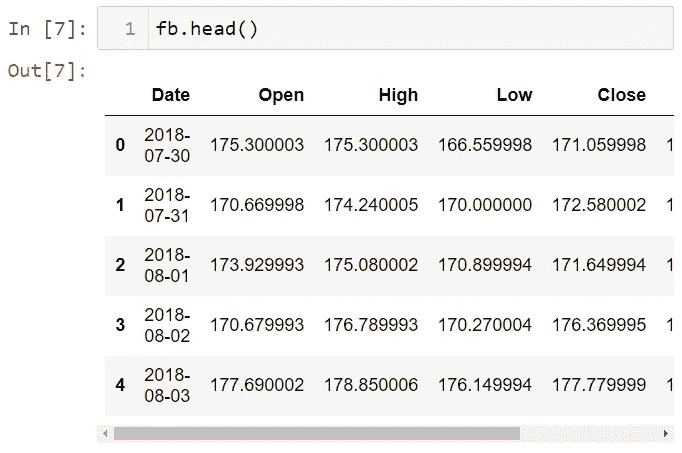

# 将日期转换为索引

让我们来看看列类型。

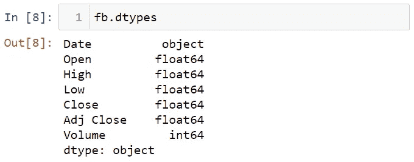

如您所见，日期列的类型是一个对象。让我们将这个日期列转换为 DateTime 类型。为此，我将在读取数据集时使用 parse_dates 参数。

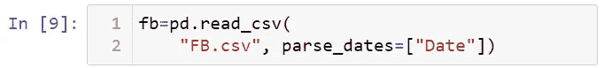

让我们用 index_col 参数将日期列转换成索引。

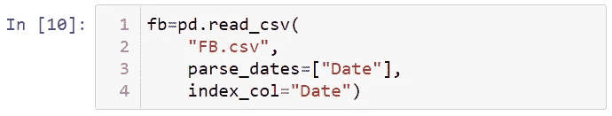

让我们看一下数据集的索引。

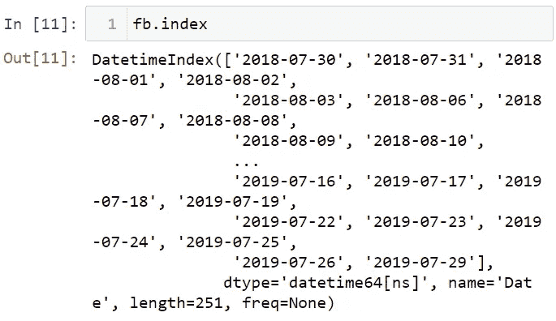

正如您所看到的，索引结构已经发生了变化，变成了 DatetimeIndex 对象。让我们看看数据集的第一行。

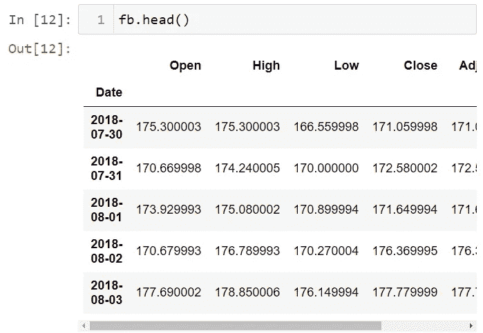

将日期转换成 DatetimeIndex 结构非常有用。例如，您可以轻松选择 2019 年 6 个月的值。

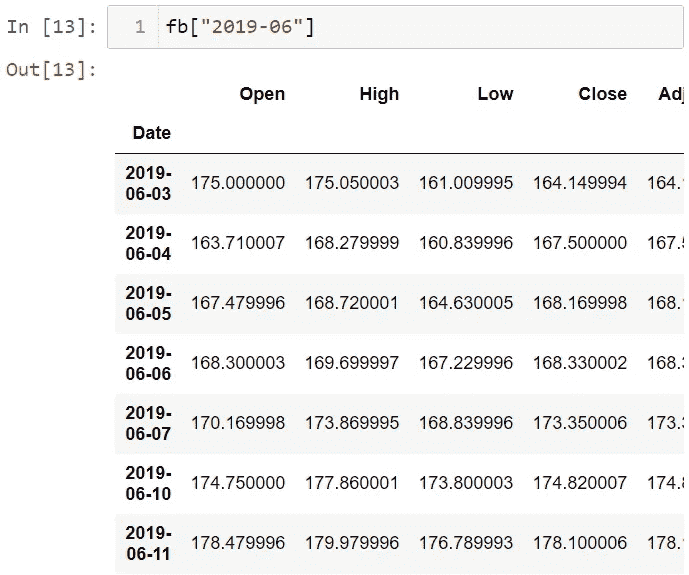

# 使用索引

要查看某一日期收盘价的平均值，首先要编写收盘列，然后使用 mean 函数。

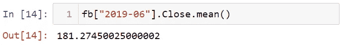

由于日期是索引，您可以按如下方式对其进行切片:

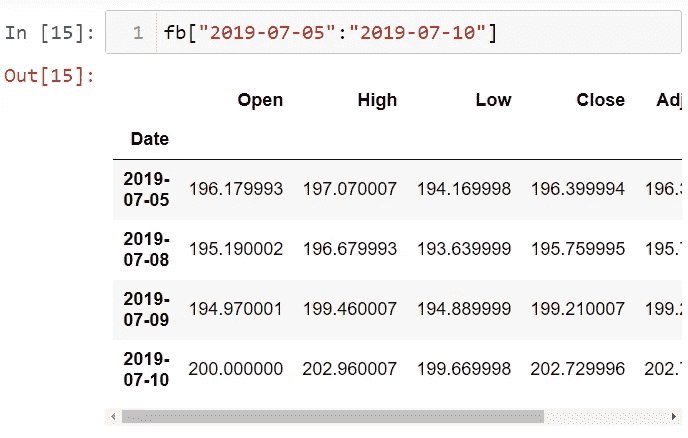

您可以将日期转换成时间戳。

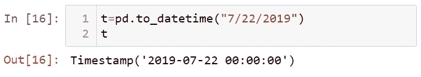

您可以使用 loc 方法将该日期与数据集中的日期进行比较。

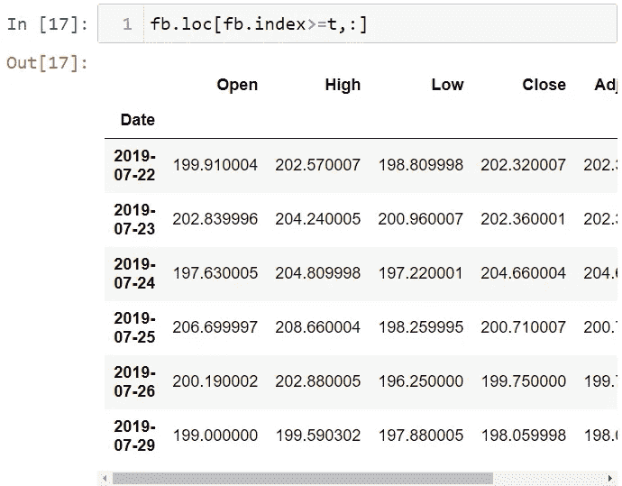

# 确定数据集的日期

要执行时间序列分析，您需要分配日期值。为了展示这一点，我将使用一个没有日期的数据集。让我们来看看这个数据集。

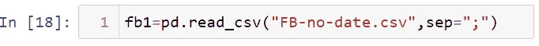

让我们看看数据集的前几行。

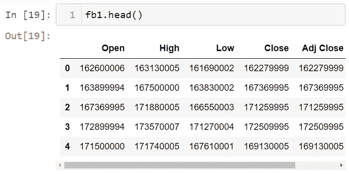

请注意，数据集中没有日期列。让我们向这个数据集添加一个日期列。为此，让我用 date_range 函数生成一个日期。我将使用 start、end 和 freq 参数。这里，B 代表营业日。

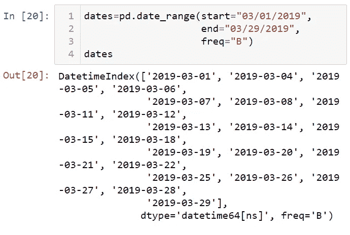

现在，让我们将这个创建的日期变量作为索引分配给数据集。

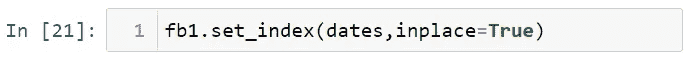

让我们看看数据集的前五行。

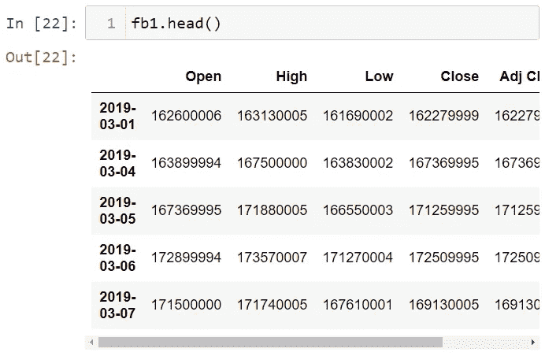

如您所见，工作日已被添加到数据集中。让我们看看数据集的索引。

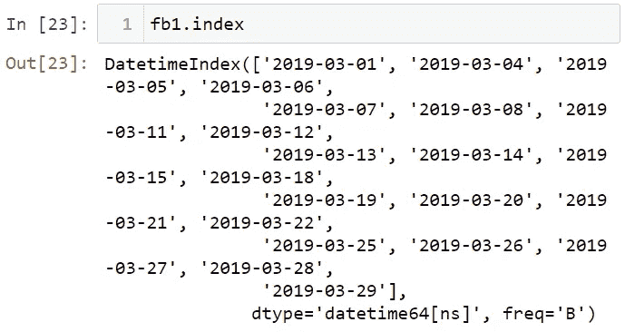

由于数据集是按时间索引的，因此您可以轻松地处理时间序列。

# 数据可视化

让我们画一张显示收盘价的图表。首先，我将使用% matplotlib inline magic 命令来查看行间的图形。

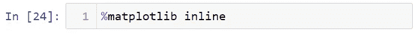

让我们画一个线图。

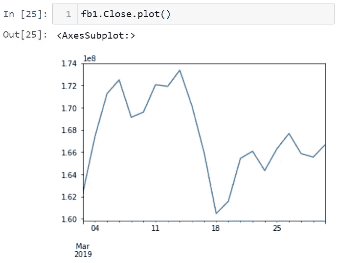

# 如何使用 asfreq 方法？

我们的数据集中没有节假日的股票值，因为股票值在节假日期间是固定的。如果要将这些假日添加到数据集中，可以使用 asfreq 方法。此方法可选地用于填充缺失值。

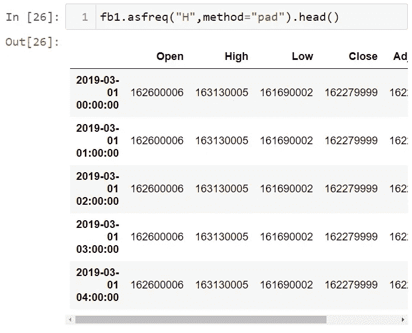

让我们每周填写缺失值。

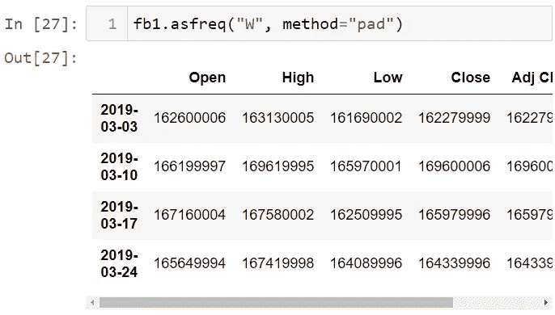

# 创建时间序列日期范围方法

让我们用 start、periods 和 freq 参数生成日期。

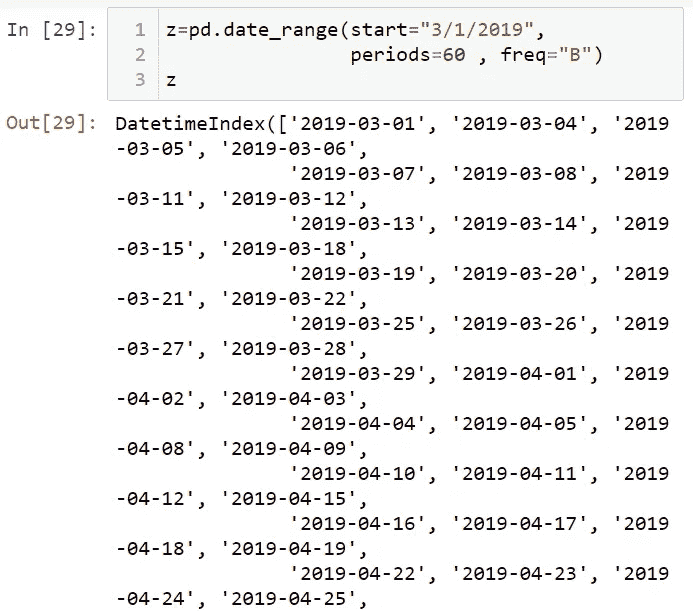

您可以将频率设置为每小时的 H 值。

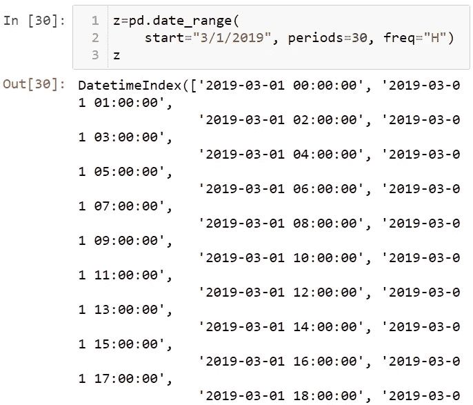

让我们用 z 变量创建一个时间序列。

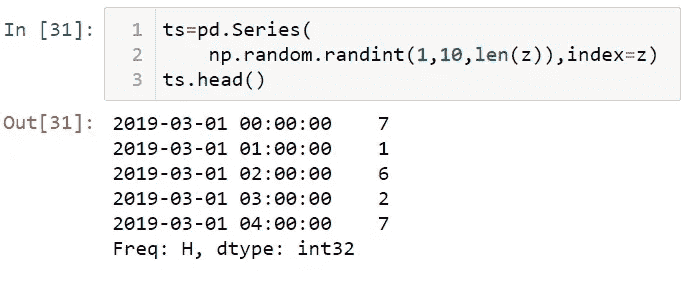

# 结论

时间序列是一系列数据点，其中每个数据点都与一个时间戳相关联。在这篇文章中，我谈到了如何使用时间序列索引。就是这样。我希望你喜欢它。感谢您的阅读。你可以在这里找到这个笔记本[。](https://github.com/TirendazAcademy/PANDAS-TUTORIAL/blob/main/24-Working%20with%20Methods%20in%20Pandas%20-%20Part%201%20.ipynb)

别忘了在[YouTube](https://www.youtube.com/channel/UCFU9Go20p01kC64w-tmFORw)|[GitHub](https://github.com/tirendazacademy)|[Twitter](https://twitter.com/TirendazAcademy)|[ka ggle](https://www.kaggle.com/tirendazacademy)|[LinkedIn](https://www.linkedin.com/in/tirendaz-academy)上关注我们

 [## 熊猫的时间序列基础

### 在我的上一篇文章中，我提到了熊猫图书馆的多重选择和过滤。我将谈论时间序列的基础知识…

levelup.gitconnected.com](/time-series-basics-with-pandas-f74cab9923bb)  [## 8 个最好的 Seaborn 可视化

### 使用企鹅数据集与 Seaborn 一起动手绘制统计图。

medium.com](https://medium.com/geekculture/8-best-seaborn-visualizations-20143a4b3b2f) 

如果这篇文章有帮助，请点击拍手👏按钮几下，以示支持👇