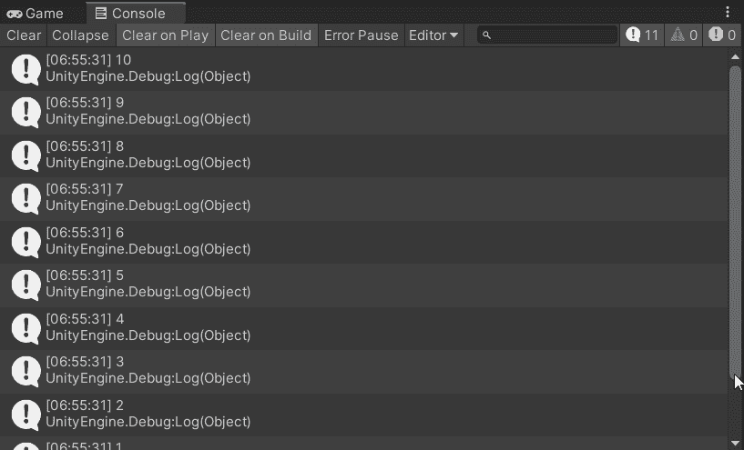
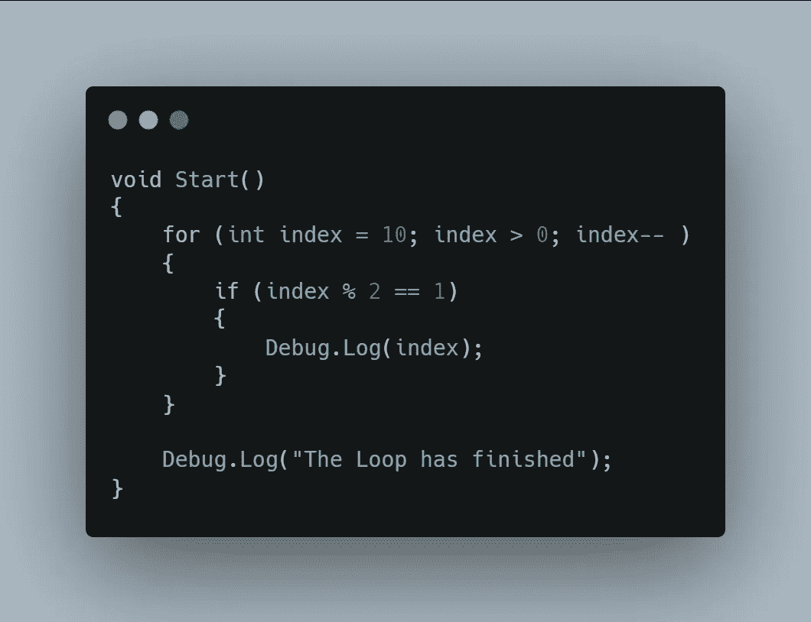
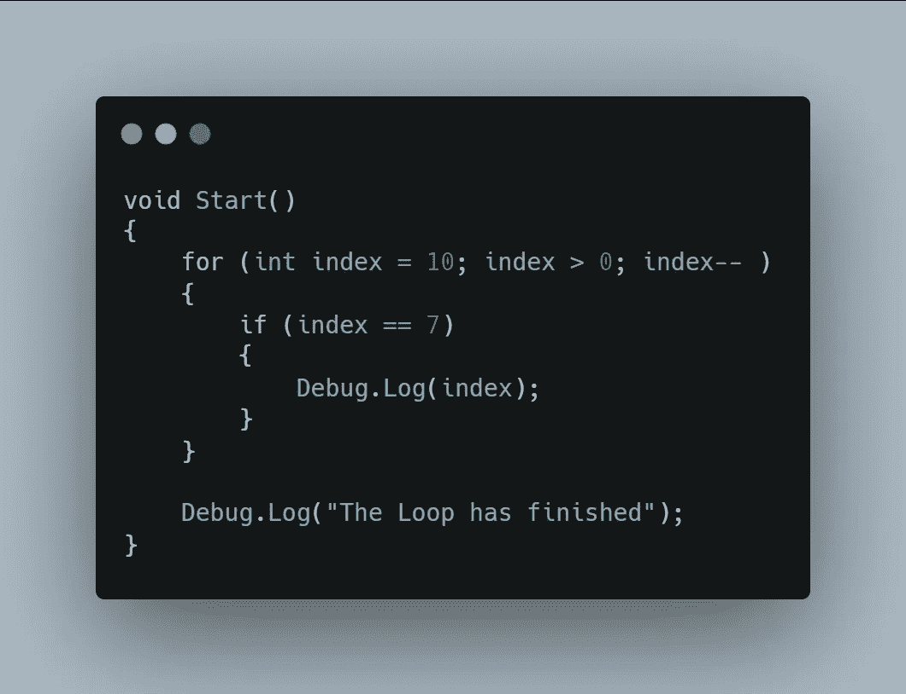
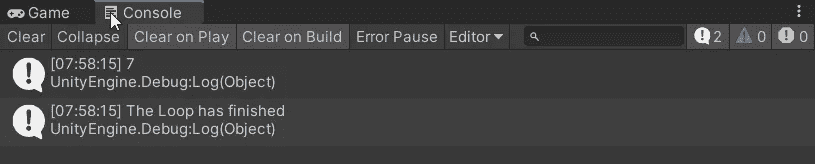
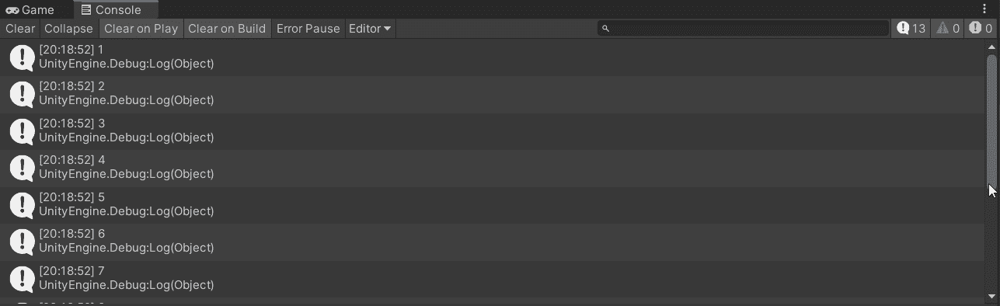

# 使用循环

> 原文：<https://levelup.gitconnected.com/working-with-loops-dcf8b0653f0a>

在本文中，我将向读者介绍使用 C#的各种**循环**。下面是循环的基本**语法。我需要定义一些参数来确定循环应该持续多长时间，否则在没有额外信息的情况下尝试执行这样的 For 循环时，我会得到一个错误。**

对于这个例子，我添加了一个**变量**来存储我的名字。通常，当遇到循环的**时，您会看到变量 **i** 正在被使用。重要的是要记住， **i** 只是一个变量名，用来表示保存有**值**的**索引**号。为了更加清晰，我将变量命名为 index。在 For 循环的开始，变量用值**零**声明。下一个参数需要检查**索引**值，看它是否比十**小**。最后一部分**将索引的当前值加 1**。基本上，**调试完毕。Log** *(myName)* 会打印到控制台一次，然后索引的值增加 1。这个过程将重复进行，直到 index 的值等于 10。**

如下图，控制台把我的名字打印出来十次！

同样的概念也适用，只是在**反转**时。这里的 index 变量从值 10 开始，然后每次将消息打印到控制台时，从它的值中减去 1。循环运行完成后，另一条消息被发送到控制台，让我知道循环已经完成！

以下是发送的控制台消息。

如何才能只将**偶数**打印到控制台？为此，可以使用**模数运算符** *(%)* 来检查除法运算后的余数**。在这种情况下，如果**索引**值除以**二**得到的余数为**零**，则索引值被打印到控制台。奇数会有余数，所以只打印偶数。**

****

**控制台只打印偶数。**

****

**反之，模数运算符也可用于检查**提醒**是否为 **1** ，仅打印奇数的**号。****

****

**奇数打印到控制台。**

****

**通过检查索引变量**的值是否等于**指定的数字，可以打印出一个**特定的**数字。在这个例子中，只有数字 **7** 被打印到控制台。**

********

**有一种方法可以提前跳出循环，那就是使用 **break** 关键字。索引值从十开始倒数，当值等于 **7** 时**退出**循环。**

****

**另一种循环是 **Do While** 循环，它的工作原理和听起来差不多。**做**这个动作，**同时**那个条件正在检查。在本例中，**当前啤酒**值为**零**，但**最大啤酒**值为 **12** 。代码将**执行**，将 **1** 加到**当前啤酒量**上，然后将**当前啤酒量**的值打印到控制台。这将重复发生，直到**当前啤酒**值等于**最大啤酒**值。一旦杯子满了，一个*【干杯】*的信息就被发送到控制台！**

****

**下面是这段代码的一个片段！**

****

**如果不小心的话，使用一个 **While 循环**可能会很棘手。while 循环会产生一个无限的循环，如果没有退出循环的条件，并且没有时间让计算机喘息的话，它会使你的程序崩溃，丢失所有未保存的工作。一个**协程**是一个很好的利用时间的方法，这样计算机就有空间进行处理，而不是在每一帧开始的时候都被锁定。在本例中，**调试。日志**每秒钟都会向控制台发送一条信息，**无限**。**

****

**下面是该脚本的一个片段。**

****

**为了在空**循环开始**时使用**危险**，循环的**状态**中使用的**变量**必须增加**的值**。如果条件不改变，当试图运行游戏时，会发生意外的无限循环并使系统崩溃。在本例中，**从**耐力变量**中删除了一个**，因此 while 循环最终会退出。**

****

**你体力不支了！**

****

**作为一个**挑战**，我的任务是打印**0–10**到控制台，接着是**偶数**到 **20** ，然后是**奇数**到 **30** 。我决定对循环使用一个**和一些嵌套的 **if else** 参数。只要 **i** 小于**30**，循环**的**就会加到 **i** 值上。为了打印**0–10**，我检查 **i** 是否小于**或**等于 10** 以便打印到控制台。下一个 **else if** 参数使用**模数运算符**检查**0**T40 的余数【偶数】打印到控制台，最后一个 **else if** 检查**1**T48【奇数】的**余数**。**

****

**下面是上面代码的结果，按预期打印。挑战失败！**

****

**对于第二个**挑战**，我需要**将**速度**变量的值增加**每隔**秒**增加 **5** ，并且在达到**最大**速度值后**停止增加**。**最大值**需要在 **60** 和 **120** 之间**随机**。虽然这可以使用 **while 循环**或 **do 循环**来完成，但我选择使用**来循环**。我从两个**变量**开始，用于保存**速度值** *(当前和最大)*。在 void **启动**时，我随机使用**。范围**为**最大速度**值分配一个在 **60** 和 **120** 之间的随机数。一旦随机数被确定，我使用一个**调试。记录**消息以将**值**发送到**控制台**。然后启动**加速例程**协同例程。**协程**使用一个**用于循环**和一个 **if else** 自变量来检查 **currentSpeed** 值是否小于 **maxSpeed** 值。如果未达到**最大速度**值，则将 **5** 加到**当前速度**值上，并发送**调试**消息，以将**更新值**打印到控制台。一旦达到**最大速度**值，循环结束，发送一条调试消息，让我知道我已经达到最大速度！协程中的 **yield return new** 关键字确保在条件未满足时，代码每隔**秒***(WaitForSeconds(****1f****)*运行一次。**

****

**结果显示 **82** 是 **maxSpeed** 变量落地的数字，然后速度值每秒递增 5，直到达到最大速度！我的调试消息从未发送，因为我正在检查当前值**是否等于最大值***(= =)。我需要声明**大于**或**等于** *( > =)* ，是从 **80** 跳到 **85** 的值，最大值是 **82** 。感谢阅读，我希望在我的下一篇文章中看到你！***

******