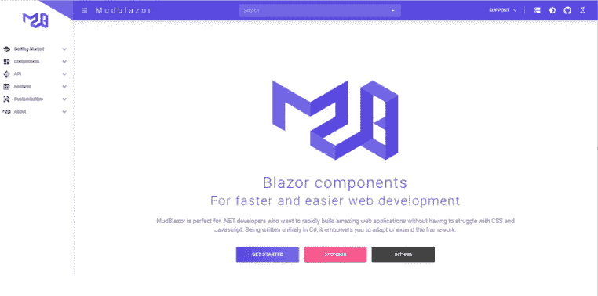
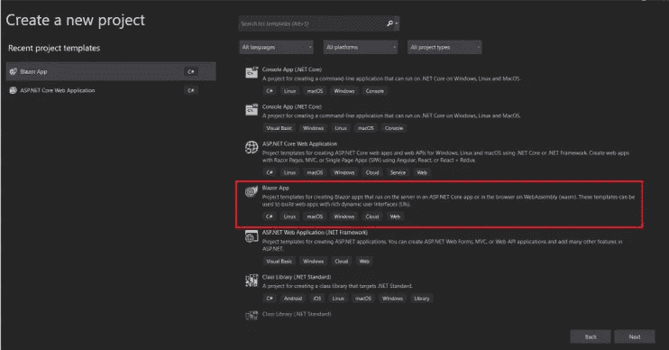
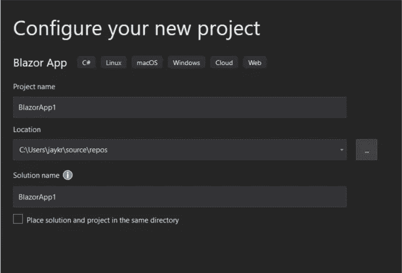
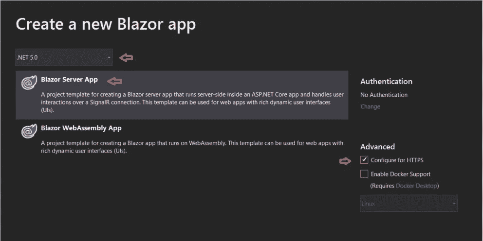
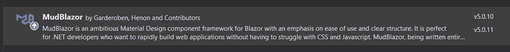
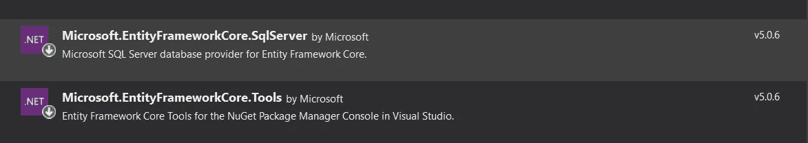
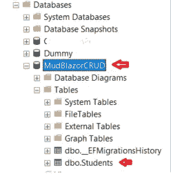
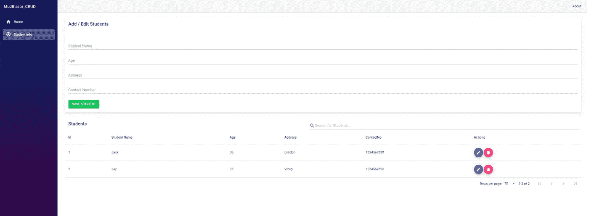

# 使用在 Blazor 中使用 MudBlazor UI 组件。Net 5.0

> 原文：<https://levelup.gitconnected.com/working-with-mudblazor-ui-component-in-blazor-using-net-5-0-604d8a29791e>


CRUD_MudBlazor_Net.5.0

# 介绍

在我的[上一篇文章](https://medium.com/nerd-for-tech/a-detailed-view-at-data-binding-in-blazor-faaa1d1050d9)中，我已经清楚地解释了 Blazor、[数据绑定](https://medium.com/nerd-for-tech/a-detailed-view-at-data-binding-in-blazor-faaa1d1050d9)，以及开始使用 Blazor 所需的先决条件。在本文中，我们将使用 [MudBlazor](https://mudblazor.com/) material 组件来创建丰富的 UI 页面。为了开发 crud 应用程序，我们将使用卡片、表格、图标按钮、分页、搜索和其他组件来完成我们的任务。

如果你想了解更多关于 Blazor 的知识，我强烈建议你访问我们的 [Blazor 文章](https://www.c-sharpcorner.com/technologies/blazor)，在那里你可以读到关于 Blazor 服务器端、Blazor web assembly 开发以及其他主题的内容。

[](https://github.com/JayKrishnareddy/MudBlazor_CRUD) [## GitHub-JayKrishnareddy/MudBlazor _ CRUD:使用 Blazor 服务器端的 MudBlazor 组件库来…

### 在 blazor 服务器端使用 Mudblazor 组件库，通过。Net 5.0…

github.com](https://github.com/JayKrishnareddy/MudBlazor_CRUD) 

**内容**

*   介绍穆德布拉佐。
*   先决条件
*   建立项目--。网络 5
*   安装和配置 MudBlazor
*   使用 EfCore 设置与 SQL Db 的连接
*   使用服务层和存储库模式的 Blazor CRUD 操作
*   用 MudBlazor 组件构建 UI
*   结论

# 介绍 MudBlazor

MudBlazor 是 Blazor 的“一个材料设计组件框架”,用于简化 web 开发框架，而无需与 CSS 和 javascript 斗争。如果你在寻找日期选择器、进度条、评分等等。

MudBlazor 是你的后盾，几乎所有的组件都只使用了 **C#** (没有 Javascript，除非绝对必要)。MudBlazor 的愿景是保持它的干净、简单和高度可定制的现代设计。没有 Javascript，只有 Blazor，和 CSS。这个团队以一种非常容易理解的方式记录了这个库。你可以在这里查看文档。



图一

**先决条件**

*   软件开发工具包。Net 5.0
*   [IDE](https://visualstudio.microsoft.com/downloads/) — Visual Studio 2019

# 建立项目--。Net 5.0

打开 Visual Studio，搜索 Blazor 应用。点击下一步按钮，



图二

定义项目名称、路径和解决方案名称。点击创建按钮，



图三

之后会弹出一个新窗口选择目标框架(**)。Net 5.0** )确保从下拉列表中选择 Blazor 服务器应用程序，并在高级部分“*配置 Https* ”被选中。



图 4

# 安装和配置 MudBlazor

打开包管理器控制台，尝试运行以下命令在我们的项目中安装 MudBlazor。

```
Install-Package MudBlazor
```



图五

安装完软件包后，打开 ***startup.cs*** 文件，尝试在 ConfigureServices()方法中添加服务，这样就添加了 MudBlazor 组件所需的所有公共服务。

现在我们需要在 **Pages /_Host razor** 页面内添加 MudBlazor 的 CSS 和 js 文件的引用，

这里我们需要将 MudBlazor 包导入到 **_Imports.razor** 文件中，

之后，我们需要添加我们从 MudBlazor 包中消费的提供者。打开**Shared/main layout . razor**并在文件末尾添加以下代码，

# 使用 EfCore 设置与 SQL Db 的连接

为了使用 EFcore 连接到 SQL 数据库，我们需要下面的包来使用代码优先的方法建立连接。我们可以通过使用 Nuget 包管理器或使用包管理器控制台来安装所需的包。

***NuGet 包***



图 6

**命令—预防性维护控制台**

```
Install-Package Microsoft.EntityFrameworkCore.SqlServer
Install-Package Microsoft.EntityFrameworkCore.Tools
```

让我们从定义**模型**文件夹中的类开始。在这里，我们正在创建名为 **Models** 的新文件夹，并在其中创建一个具有最少属性的 **Student** 类，以便于实现。

**Student.cs**

**Key —** attribute 充当我们的 Id 属性的主键。

接下来，让我们将 DbContext 类添加到应用程序中。这有助于我们通过应用程序访问由我们的模型生成的数据库表。创建一个单独的名为 **ApplicationDbContext** 的文件夹，并在其中创建一个 **AppDbContext** 类来定义我们的 DbContext。

**AppDbContext.cs**

让我们在 appsettings.json 文件中添加 SQL 数据库的连接字符串，

现在让我们将 DbContext 添加到我们的应用程序服务容器中，通过使用下面的代码来访问各个数据库中的所有表，

最后，让我们添加迁移并更新我们的数据库。在软件包管理器控制台中依次运行以下命令，

```
add-migration 'initial'
update-database
```

这是我们的数据库，学生表是在本地数据库中创建的。



图 7

# 使用服务层和存储库模式的 Blazor Crud 操作

ASP.Net 核心旨在支持依赖注入。现在我们为实体操作创建一个通用的存储库接口，这样我们就可以看到松散耦合的应用程序。创建一个名为 **UnitofWork** 的文件夹，并在其中维护我们的存储库层及其接口。

下面是代码片段，

**Repository.cs**

创建 repository 类来执行继承了 **IRepository** 接口的数据库操作。

**IRepository.cs**

让我们将包含核心业务逻辑的服务定义为项目的一部分，它与 Repositorylayer 连接并执行所有数据库操作。在这里，我创建了 **Services** 文件夹来定义我们的核心服务。

**学生服务. cs**

**IStudentService.cs**

这是我们所有服务的清晰描述，

1.  **GetStudents —** 从数据库中获取所有学生记录。
2.  **InsertStudent —** 在表中插入一个学生记录，如果 UI 有任何修改，以同样的方式更新相同的学生记录。
3.  **删除学生—** 硬从表中删除记录。

现在结束服务层。我们必须在 **Startup.cs** 文件中注册这个接口和类。在 **ConfigureServices()** 方法内添加以下代码，

```
services.AddScoped<IStudentService, StudentService>();
```

此外，我们需要在 Startup 类中的同一个 **ConfigureServices()** 函数中注册存储库层，

```
services.AddScoped(typeof(IRepository<>), typeof(Repository<>));
```

# 用 MudBlazor 组件构建 UI

为了让 UI 就位，我们必须在**Pages/studentinfo . Razor**中创建一个 Razor 页面，其中将包含操作，下面是从服务层调用 Crud 操作的代码片段。

**StudentInfo.razor**

下面是上述代码片段的简要描述，

*   **OnInitializedAsync() —** 页面加载后，默认情况下会调用 OnInitializedAsync 方法。在该方法中，我们调用了 **GetAllStudents()** 方法从数据库中获取结果，并以连续的方式将它们填充到 Mud 表中。
*   **GetAllStudents() —** 通过服务层从数据库中获取数据。
*   **Search() —** 在加载的表格中，如果我们想用任何字段过滤数据，这个搜索功能会有所帮助。
*   **Save() —** 当用户在表单中输入数据并点击 SaveStudent 按钮时，该方法将被触发，并保存或更新数据库中的值
*   **Edit()** —使用 Id 根据从列表中获取的数据填充文本框值。
*   **Delete() —** 该功能有助于通过服务层从数据库中删除记录。

# MudBlazor 形式

我们一直在使用 MudCards 来设计带有文本框和保存按钮的页面，并可变地显示从数据库获取的记录。

下面是代码片段，

**第 1 行** —与学生一起发送页面。

**第 3、4、5 行** —导入文件和服务，并使用 MudBlazor 提供的 **Snackbar** 功能，就像通知烤面包机一样。

**第 8–22 行**:带有标题、必填文本字段和保存值按钮的卡片。

**第 24- 52 行:**我们可以将每个可用的客户属性绑定到相应的列，如上所述，通过提供一个基于搜索功能过滤数据的选项，我们还有名为“编辑”和“删除”的按钮来执行更新或删除。

在**共享/导航菜单** razor 页面中添加页面路由。

**NavMenu.razor**

这就是如何使用 Mudblazor 和 Entity Framework Core 轻松构建 Blazor CRUD。

**最终输出**

在运行应用程序并路由到下面的学生信息页面后，我们可以看到我们的应用程序将获得一个学生列表，添加新的学生详细信息，编辑和删除现有的学生，还可以使用 MudBlazor 提供的一个很酷的材料 UI 进行分页。



图 8

# 结论

我希望这篇文章能帮助你理解使用 MudBlazar 实现 CRUD 操作。净 5。你可以在这里找到源代码[。](https://github.com/JayKrishnareddy/MudBlazor_CRUD)

感谢您的阅读，请在评论区告诉我您的问题、想法或反馈。感谢您的反馈和鼓励。

继续学习…！