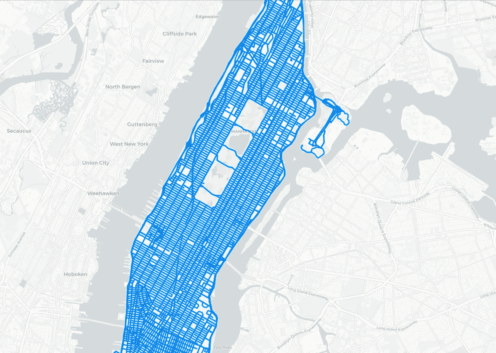

# 在 Python 中使用 OpenStreetMap

> 原文：<https://levelup.gitconnected.com/working-with-openstreetmap-in-python-c49396d98ad4>

## 如何为您的下一个地理空间数据科学项目轻松获取、操作和处理 OpenStreetMap 数据

OpenStreetMap (OSM)是一个开源数据库，几乎允许任何人编辑基础地理空间数据集。它可以是一个可靠的数据来源，特别是因为它被世界各地成千上万的志愿者不断更新和验证。您可以选择自行下载任何 OSM 数据集，但这将非常耗时且困难。更不用说在数据源和开发环境之间来回移动的麻烦了。然而，使用 **OSMnx** Python 库，您可以直接从笔记本上获取和处理 OSM 数据集！


Andrew Stutesman 在 [Unsplash](https://unsplash.com?utm_source=medium&utm_medium=referral) 上拍摄的照片

在本教程中，我们将使用 OSMnx 来执行 OSM 任务，这些任务在我们的 Python 环境之外是无法访问的。

> OSMnx 是一个 Python 包，可让您从 OpenStreetMap 的 API 下载空间几何图形并对街道网络和其他空间数据进行建模、投影、可视化和分析。

```
**Table of Content** 1\. Setup
2\. Point-of-Interests (POIs)
3\. Street
4\. Building
```

事不宜迟，我们开始吧！

# 设置

使用以下命令通过`conda`安装 **OSMnx** :

```
conda install osmnx
```

我们将使用以下约定导入`osmnx`:

```
import osmnx as ox
```

然后我们将定义我们的`place`在纽约市，而不是整个世界，以减少计算和内存成本。

```
place = 'Manhattan, New York, USA'
```


曼哈顿地区(作者图片)

> 请订阅我的 [**电子邮件简讯**](https://tinyurl.com/2npw2fnz) ，在那里我会定期用简单的英语和漂亮的可视化语言总结编程技巧和人工智能研究论文。

# 兴趣点

首先，让我们在纽约市曼哈顿区收购一些**咖啡馆**点。我们可以通过在`geometries_from_place()`函数中指定`tags` dict 对象来轻松做到这一点，如下所示:

```
tags = {'amenity': 'cafe'}
cafe = ox.geometries_from_place(place, tags=tags)cafe.head()
```


曼哈顿的咖啡馆(图片由作者提供)

这里我们看到有些地址不完整。这是 OSM 由社区驱动的缺点，数据可能会丢失。然而，`geometry`仍然是完整的，所以我们仍然可以从数据集中获得一些基于位置的信息。

现在，我们尝试使用`folium`库在地图上标出这些咖啡馆。

```
import folium
```

并对前 100 家咖啡馆进行细分，以加快处理速度:

```
cafe_points = cafe[cafe.geom_type == 'Point'][:100]
```

并通过单独绘制点并将完成的地图保存为一个`html`文件来指定地图对象。

```
m = folium.Map([40.754932, -73.984016], zoom_start=10)
locs = zip(cafe_points.geometry.y, cafe_points.geometry.x)for location in locs:
    folium.CircleMarker(location=location).add_to(m)
    m.save('cafes.html')
```

如果您打开`cafes.html`，您将能够看到下图:


曼哈顿精选咖啡馆(图片由作者提供)

目前看来还不错！现在，我们将处理 OSM 数据集中的街道网络。

# 街道

让我们为曼哈顿的街道网络获取图表数据。我们将`network_type`指定为`drive`类型，以减少我们必须处理的道路数量。

```
graph = ox.graph_from_place(place, network_type='drive')
```

上图是`NetworkX`数据格式，我们需要将其转换成`GeoDataframe`格式以便于操作。这可以通过如下调用`graph_to_gdfs()`函数轻松完成:

```
nodes, streets = ox.graph_to_gdfs(graph)streets.head()
```


曼哈顿的街道(图片由作者提供)

现在我们的街道数据是熟悉的`GeoDataframe`格式。

最后要做的是使用`folium`再次绘制街道网络。幸运的是，`OSMnx`在本地为我们提供了这种能力(到目前为止，这种本地支持只对`NetworkX`类型的图形数据有效)。

```
ox.folium.plot_graph_folium(graph)
```

你可以看到纽约曼哈顿的街道！



曼哈顿的街道(图片由作者提供)

OSM 支持的最后一个几何图形是建筑足迹。

# 建筑物

类似于兴趣点和街道对象，让我们通过将`building`标签设置为`True`来获取曼哈顿的建筑足迹。

```
tags = {'building':True}
building = ox.geometries_from_place(place, tags)
```

我们有太多的列来进行有意义的分析。因此，让我们通过选择关键列来减少列的数量。

```
cols = ['amenity','building', 'name', 'tourism']
building[cols].head()
```

我们得到以下关于曼哈顿建筑的信息。


来自 OSM 的建筑(图片由作者提供)

做得好！让我们再次使用`folium`来想象我们的建筑足迹看起来会是什么样子。为了简单起见，我们将我们的建筑限制为 1000。

```
buildings = building[building.geom_type == 'Polygon'][:1000]
```

并构造地图对象:

```
m = folium.Map([40.754932, -73.984016], zoom_start=10, tiles='CartoDb dark_matter')folium.GeoJson(buildings[:1000]).add_to(m)
```

最后，显示包含我们的建筑足迹的地图。

```
m
```

我们将能够在曼哈顿看到一些美丽的建筑足迹(尽管不是完全的)!


曼哈顿的建筑足迹(作者图片)

# 结论

我们已经成功地在 Python 环境中获取、操作和可视化了 OSM 数据集。我们使用`OSMnx`库作为有效连接 OSM API 层的 API 接口，并使用`folium`来显示从`GeoDataframe`获得的地理空间信息。一如既往，如果您有进一步的反馈，请随时留下回复！