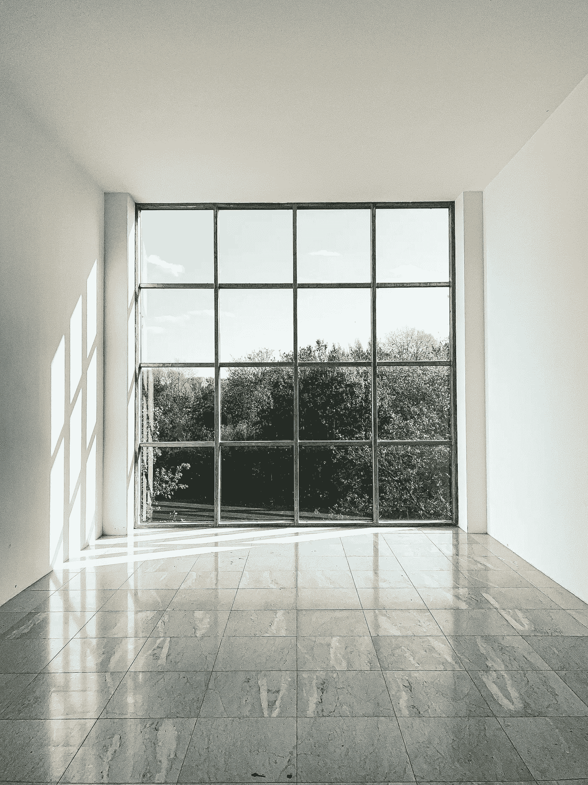

# 使用 SQL 的窗口函数

> 原文：<https://levelup.gitconnected.com/working-with-sqls-window-functions-c70a2c308e9b>

S QL 对于软件工程师来说是一项至关重要的技能，无论是数据科学家、数据工程师还是其他任何人。在这篇博客中，我将讲述如何使用 SQL 的窗口函数。



劳拉·克莱夫曼在 [Unsplash](https://unsplash.com/s/photos/windows?utm_source=unsplash&utm_medium=referral&utm_content=creditCopyText) 上的照片

# 窗口功能:

窗口函数——这个名字可能会吓到你，但你不需要担心。窗口函数是处理一组行而不是单个行的函数。“窗口功能”中的“窗口”是指一组行。

它们可以用于许多不同的事情，其中一个例子就是执行聚合。通常，当我们聚合时，我们需要按非聚合列进行分组，否则，我们会得到一个错误。当使用窗口函数时，我们不需要担心这个。

现在来看语法，我们通过使用 **OVER()** 来定义一个窗口函数。

## 语法:

`function() OVER(...) AS alias`

上述语法可以解释如下:

> 一个函数被应用到一个窗口上。

现在举个例子。假设我们有一个**匹配**表。我们想做的是找出*“每场比赛进了多少球，与 2011/2012 赛季的总体平均水平相比如何”*

该查询如下所示:

```
SELECT date, 
       (home_goals + away_goals) AS goals, 
        AVG(home_goals + away_goals) OVER() AS overall_avg
FROM match
WHERE season = '2011/2012';
```

在上面的查询中， *home_goals* 表示主队进球，而 *away_goals* 表示客队进球，如果您发现我们没有按日期分组，因为我们使用了窗口函数。

# 生成等级:

顾名思义它会生成一个**等级**。但是我们将在 **OVER()** 中添加一个 **ORDER BY** 子句。如果两个值相同，那么它将这些值绑定在一起，并跳过等级中的下一个值(当您看一看这个示例时，您就明白了)。

**例如:**

使用相同的比赛表格，我们将对总进球数进行排名。

```
SELECT date,
       (home_goal + away_goal) AS goals,
       RANK() OVER(ORDER BY home_goal + away_goal) AS goal_rank
FROM match
WHERE season = '2011/2012';
```

上面的结果会是这样的:

```
Goals    goal_rank
 10         1
 10         1
 10         1
 10         1
  9         5
  8         6
  8         6
  7         8
```

如您所见，如果目标是相同的，它们都得到了相同的值，但当涉及到下一个目标时，它会直接跳到下一个计数级别(如 1 重复 4 次，所以下一个是 5)，我们也可以通过在 **ORDER BY 中的列名后提到 **DESC** 来按降序排列。**

如果你想避免跳过等级，那么你可以使用 **DENSE_RANK()** ，它和 RANK 一样，只是不跳过等级。除了 **ORDER BY 之外，在查询的每个部分之后都处理 **RANK()** 函数。**这意味着它使用结果中的信息，而不是表格中的信息。

# 分区:

假设您想要计算每个季节的 AVG()。在这种情况下，可以在 **OVER()中使用 **PARTITION BY** 子句。**

看一下这个例子。"每场比赛进了多少个球，与赛季平均水平相比如何？"

```
SELECT date,
       (home_goal+away_goal) AS goals,
        AVG(home_goals+away_goal) OVER(PARTITION BY season) AS                  season_avg
FROM match;
```

上面的查询返回一个表，其中包含每场比赛的进球以及赛季平均值。

```
date  goals   season_avg
2010   4         4.55
2010   5         4.55
2010   1         4.55
2011   3         6.55
2011   6         6.55
2011   2         6.55
```

结果可能是这样的。现在，如果我们想用多列对 T10 进行分区，我们可以用“，”来分隔列。

# 滑动窗口:

它是一种窗口功能，基本上是基于时间或基于行的窗口。您可以对给定的一组行进行分析。

这也使用了 **OVER()** ，但唯一额外的是它使用了以下内容:

> <start>和<finish>之间的行</finish></start>

我们用一些关键字代替开始和结束。这些关键词是:

*   前一行—当前行之前的行。
*   后续—当前行之后的行。
*   未绑定的前一行—滑动到当前行之前的边缘。
*   无界跟随—滑动到当前行之后的边缘行
*   当前行—指当前行。

现在我将向您展示一个查询，让我知道它在评论部分做什么。

```
SELECT date,
       home_goal,
       away_goal,
       SUM(home_goal) 
            OVER( ORDER BY date ROWS BETWEEN UNBOUNDED  PRECEDING AND CURRENT ROW) AS running_total
FROM match
WHERE hometeam_id = 8456 AND season = '2011/2012';
```

让我知道你的答案。在评论区互相帮助。

# 结论:

在这篇博客中，我们看了看:

*   什么是窗口函数？
*   如何与他们合作？
*   如何排名？
*   如何划分结果？
*   什么是推拉窗？

我希望这篇博客对你有所帮助。在 LinkedIn 上关注我。如果你喜欢我的作品，那就请我喝杯咖啡: ***dataguy6@ybl***

另外，看看我最近的作品:

[](https://medium.datadriveninvestor.com/perfect-roadmap-to-becoming-a-devops-engineer-along-with-resources-d2285dd2bfb3) [## 成为 DevOps 工程师的完美路线图以及资源

### 对 SRE/云工程也很有用

medium.datadriveninvestor.com](https://medium.datadriveninvestor.com/perfect-roadmap-to-becoming-a-devops-engineer-along-with-resources-d2285dd2bfb3) [](https://medium.datadriveninvestor.com/roadmap-to-becoming-a-game-developer-in-2022-128fed2df6c5) [## 2022 年成为游戏开发者的路线图

### 如何成为一名游戏开发者

medium.datadriveninvestor.com](https://medium.datadriveninvestor.com/roadmap-to-becoming-a-game-developer-in-2022-128fed2df6c5) 

# 分级编码

感谢您成为我们社区的一员！更多内容见[级编码出版物](https://levelup.gitconnected.com/)。
跟随: [Twitter](https://twitter.com/gitconnected) ， [LinkedIn](https://www.linkedin.com/company/gitconnected) ，[迅](https://newsletter.levelup.dev/)
升一级就是转型科技招聘👉 [**加入我们的人才集体**](https://jobs.levelup.dev/talent/welcome?referral=true)