# 在 Pandas 中处理文本数据

> 原文：<https://levelup.gitconnected.com/working-with-text-data-in-pandas-f78aa368e1a>

使用真实数据集在 Pandas 中开始使用文本数据的指南。

照片由[菲利普·布特](https://unsplash.com/@flipboo?utm_source=medium&utm_medium=referral)在 [Unsplash](https://unsplash.com?utm_source=medium&utm_medium=referral) 拍摄

真实世界的数据集不仅仅由数字组成。数据集也可以包含文本。使用这些文本进行数据分析是很重要的。我将在这篇文章中谈论以下主题，

*   如何在熊猫中使用字符串方法？
*   熊猫里的正则表达式怎么用？
*   使用 IMDb 数据集练习

在开始之前，请不要忘记订阅[我的 youtube 频道](https://youtube.com/c/tirendazacademy)，在那里我创建了关于人工智能、数据科学、机器学习和深度学习的内容。

让我们开始吧！

# 熊猫里怎么串方法？

Python 是一种流行的数据操作语言，因为它很容易处理文本。它有一组内置的方法，您可以在字符串上使用。你也可以在熊猫身上快速使用这些方法。

例如，让我们将单词 hello 转换为大写。

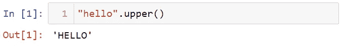

在 Pandas 中，您需要键入 str 代码来使用字符串或正则表达式方法。为了说明这一点，让我进口熊猫和 Numpy。

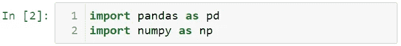

接下来，让我们创建数据。

让我们将数据中数值的第一个字母大写。首先，让我们将这些数据转换成序列。

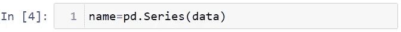

可以使用 str 属性实现 series 和 index 对象的字符串方法。让我们把数据中的第一个字母大写。

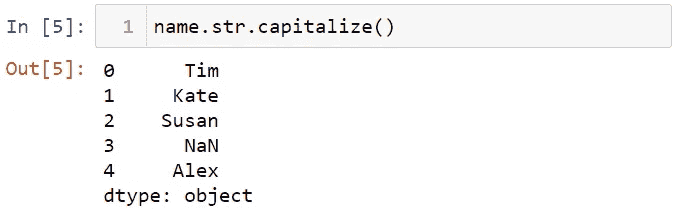

你也可以把所有的字母都变成小写。

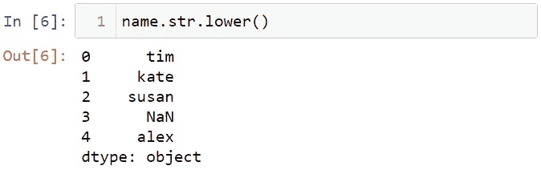

你可以用 len 方法找到文本的长度。

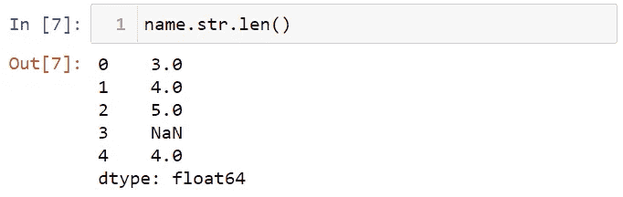

您可以使用 startswith 方法查找以 a 开头的名称。

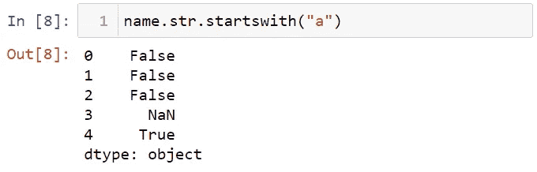

您可以将字符串方法应用于索引对象。为了展示这一点，让我们创建一个数据框。

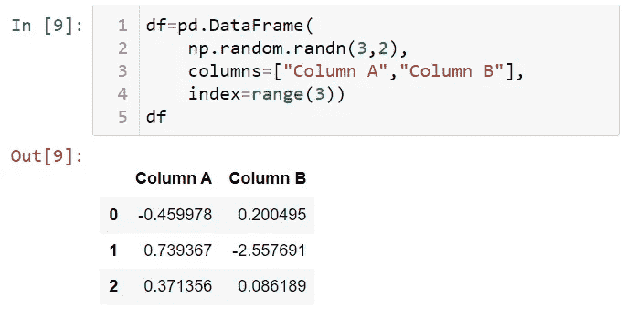

让我们看看数据集的列。

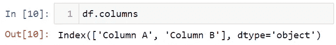

df.columns 是索引对象。您可以对该对象使用 str 属性。例如，让我们将这些列名变成小写，并用 _ 符号替换空格。

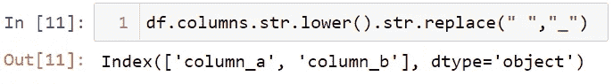

您可以使用拆分等方法对系列进行拆分。为了展示这一点，让我们创建数据。

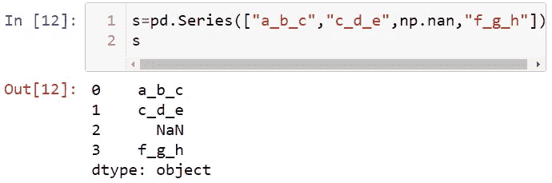

让我们根据这里的下划线来拆分字母。我将使用[]符号选择第一个索引。

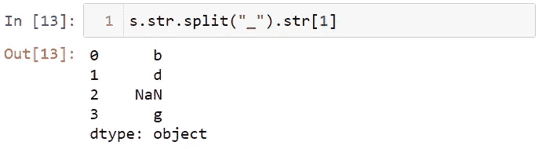

您可以使用 expand=True 参数将分隔值转换为数据框。您还可以使用 n 参数来限制分割过程。让我展示这个。

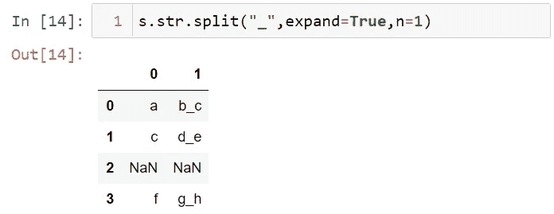

# 熊猫里的正则表达式怎么用？

熊猫里也可以用正则表达式。为了展示这一点，让我们创建财务数据。

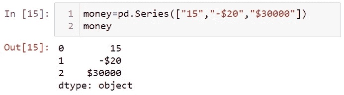

让我们去掉美元符号。

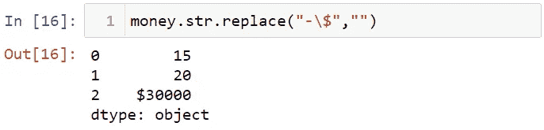

请注意，$符号是一个元字符，它在正则表达式中有特殊的含义。要将这个字符从元字符中删除，需要使用反斜杠转义字符。让我们用“-”代替“-$”。

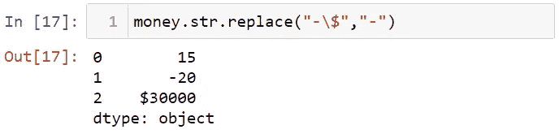

# 使用 IMDb 数据集进行练习

我将使用一个真实的数据集来练习字符串方法。该数据集是关于 IMDb 收视率最高的电影。首先，让我们导入数据集。

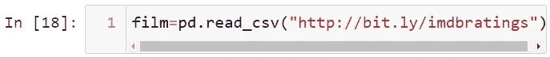

您可以从[这里](https://github.com/TirendazAcademy/pandas-tutorial,)访问该数据集。让我们看看这个数据集的第一行。

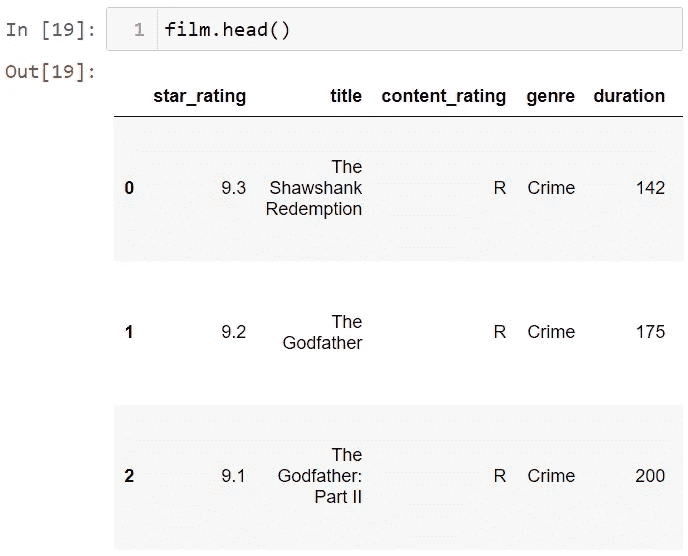

让我们使用 upper 方法将 title 列中的字符串转换成大写。

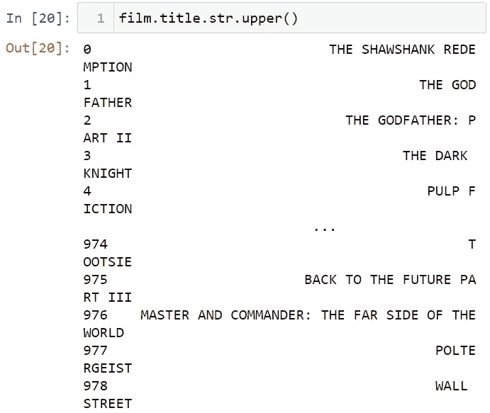

数据集中的列是索引对象。让我们使用大写方法将这些名字的第一个字母大写。

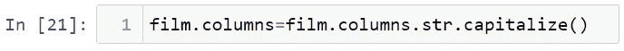

让我们看看使用 head 方法的数据集。

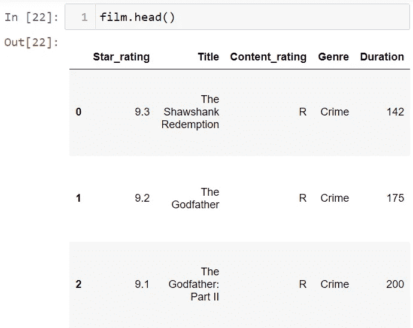

您可以使用 contains 方法来检查数据集中是否有文本。例如，让我们在演员列表中搜索布拉德·皮特的名字。

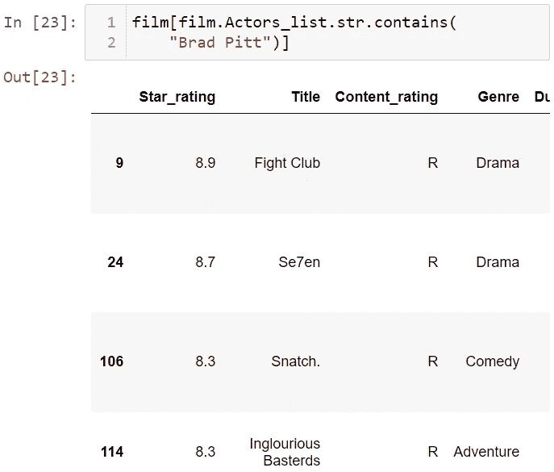

可以使用 replace 方法删除字符。例如，让我们从执行元列表中删除方括号。

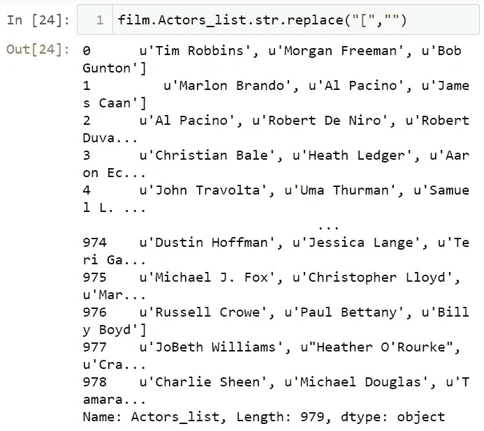

我们来拆下左支架。

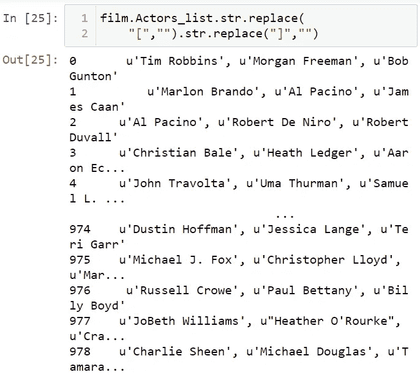

就是这样。在这篇文章中，我介绍了如何在 Pandas 中处理文本数据。我希望你喜欢这篇文章。感谢阅读。你可以在这里找到笔记本[。](https://github.com/TirendazAcademy/PANDAS-TUTORIAL/blob/main/20-Working%20with%20Text%20Data.ipynb)

请不要忘记在[YouTube](http://youtube.com/tirendazacademy)|[Twitter](http://twitter.com/tirendazacademy)|[GitHub](http://github.com/tirendazacademy)|[Linkedin](https://www.linkedin.com/in/tirendaz-academy)|[Kaggle](https://www.kaggle.com/tirendazacademy)上关注我们

 [## 8 个最好的 Seaborn 可视化

### Python Seaborn 使用 penguin 数据集实际绘制统计图。

medium.com](https://medium.com/geekculture/8-best-seaborn-visualizations-20143a4b3b2f)  [## 成为机器学习专家的 6 个步骤

### 机器学习是人工智能的一个子领域，旨在使用数据自动建立模型。在这篇文章中，我将展示…

medium.com](https://medium.com/geekculture/6-steps-to-become-a-machine-learning-expert-5a1f155f7207) 

如果这篇文章有帮助，请点击拍手👏按钮几下，以示支持👇