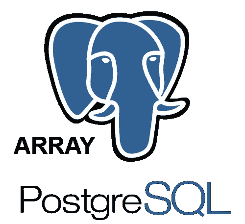
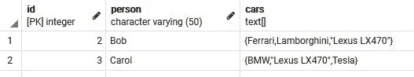

# 在 PostgreSQL 中使用数组数据类型

> 原文：<https://levelup.gitconnected.com/working-with-the-array-data-type-in-postgresql-1e6fecdb51fe>

## 数据库提示

## 创建、获取(作为列表和行)、修改、添加和删除数组中的数据



PostgreSQL 是一个开源的关系数据库，支持一些惊人的数据类型。在以前的文章中，我们看到了[在 jsonb 数据类型](/working-with-a-jsonb-array-of-objects-in-postgresql-d2b7e7f4db87)上执行类似 CRUD 的操作，以及将一个 [jsonb 对象数组转换成一个记录集](/how-to-query-a-json-array-of-objects-as-a-recordset-in-postgresql-a81acec9fbc5)以便于查询。

# 我们将做什么

在本文中，我想关注另一种数据类型，即**数组**数据类型。为什么？因为数组对于至少存储列表来说是很棒的。文本、数字等列表。

> 数组类型
> 
> PostgreSQL 提供了将表中的列定义为可变长度的一维或多维数组的机会。可以创建任何内置或用户定义的基类型、枚举类型或复合类型的数组。

> 我们将特别关注一种数据类型，即文本数组 **text[]** 。

如果您使用 pgAdmin 的表创建工具，您还会看到其他数据类型的数组:text，text[]；integer，integer[]，bit，bit[]，等等。

**具体将探讨如何，**

*   创建一个数组。
*   向数组中输入值。
*   以列表和行的形式从数组中获取数据。
*   通过在数组中添加和删除数据来修改数组。

*类似 CRUD 的操作。*

**重要提示** : *您可能习惯于在 JavaScript 或其他编程语言中使用数组。在这些情况下，数组通常是从 0 开始的。第一项的索引为 0。*

> 在 PostgreSQL 中，数组是从 1 开始的。第一项的索引为 1。

# 假设

我假设你有 [PostgreSQL](https://www.postgresql.org/) 和类似 [pgAdmin](https://www.pgadmin.org/) 的东西。

# 我们开始吧！

# 构建具有数组数据类型的表

我们将创建一个人和他们拥有的汽车的表。汽车列表将是一个文本数组。

1.  打开 **pgAdmin** 并创建一个数据库。根据需要命名。
2.  右击数据库名称，选择**查询工具**。

3.输入下面的代码并执行它来构建我们的 **people_cars** 表。

```
CREATE TABLE people_cars (
 id Serial Primary Key NOT NULL,
 person Varchar(50) NOT NULL,
 **cars text[]**
);
```

注意**文本[]** 数据类型。[]告诉 PostgresSQL 您需要一个数组。

一个 ***备选*** 语法如果你想试试的话会是，

```
DROP TABLE people_cars;CREATE TABLE people_cars (
 id Serial Primary Key NOT NULL,
 person Varchar(50) NOT NULL,
 **cars text ARRAY**
);
```

> 我最初使用 text[]语法是因为如果您要使用 pgAdmin 的表创建工具，这是您会选择的。

*使用 SQL 构建表的一个优点是可以指定一个多维数组，比如* ***text[][]*** *。我们将继续关注一维数组，并在工作中使用 SQL。*

同样值得注意的是，您可以指定数组的大小，text[4]。**但是 PostgreSQL 忽略了大小。**

# 将数据插入数组

现在我们已经有了一个可以接受列表的表，我们将想要向其中插入数据。

使用 SQL 向数组中插入数据有两种不同的语法。

这些是，

1.  { "第 1 项"，"第 2 项"，"第 3 项" } '
2.  数组['项目 1 '，'项目 2 '，'项目 3']

*注意在第二个例子中，我们用括号代替大括号，用单引号代替双引号。*

1.  输入下面的代码并执行它，为 Bob 创建一个汽车列表。

```
INSERT INTO people_cars (person, cars)
VALUES ('Bob', 
'{"Ferrari", "Lamborghini", "Lexus LX470"}'
);
```

并使用 ***的第二个语法*** 来表示卡罗尔的汽车。执行下面的代码。

```
INSERT INTO people_cars (person, cars)
VALUES ('Carol', 
**ARRAY**['BMW', 'Lexus LX470', 'Tesla']
);
```

2.现在，让我们通过执行以下代码来查看数据。

```
SELECT * FROM people_cars;
```

你会得到，



一排排汽车

如果您仔细观察，您会发现，不管语法如何， **PostgreSQL 在包含空格的条目周围加上了双引号**。这不是错误，也不是问题。当我们选择该特定值时，它们会被删除，我们稍后会看到。

# 选择数组数据

一旦阵列中有了数据，我们当然会希望访问全部或部分数据。

*我们已经看到了如何使用 SELECT *(或仅选择汽车)。*

现在让我们专注于选择我们想要的特定数据。

1.  假设我们想要每个人的第一辆汽车。执行下面的代码。

```
SELECT cars[1] FROM people_cars;
```

2.假设我们想要卡罗尔的第二辆车，雷克萨斯 LX470。执行下面的代码。

```
SELECT cars[2] FROM people_cars
WHERE person='Carol';
```

*注意数组条目两边的双引号被移除了。*

## 选择范围

我们也可以通过使用，**起始索引:结束索引来指定数据项的范围。你也可以省略起始或结束索引。**

执行以下每个示例。

拿到卡罗尔的前两辆车，宝马和雷克萨斯 LX470。

```
SELECT cars[1:2] FROM people_cars
WHERE person='Carol';
```

或者相当于，

```
SELECT cars[:2] FROM people_cars
WHERE person='Carol';
```

拿到卡萝尔的最后两辆车，雷克萨斯 LX470 和特斯拉。

```
SELECT cars[2:3] FROM people_cars
WHERE person='Carol';
```

或者相当于，

```
SELECT cars[2:] FROM people_cars
WHERE person='Carol';
```

但是等等！如果我想要行中的数组数据怎么办？

## 不需要救援

要将某人的汽车列表显示为行而不仅仅是列表，使用 **UNNEST** 操作符。

找到卡罗尔所有的车，每辆都列在各自的行上。

```
SELECT **UNNEST**(cars) FROM people_cars
WHERE person='Carol';
```

# 修改数组数据

现在我们有了数据并可以提取它，我们希望能够从数组中更新、添加和删除数据。

执行以下每个步骤。使用 SELECT 在每次执行后检查数据。

## 更新整个数组

在这里我们把 ***全部换成卡罗尔的*** 。

```
UPDATE people_cars
SET cars = ARRAY['Mazda','Honda CRV','Toyota Corolla','Volkswagen']
WHERE person = 'Carol';
```

## 更新单个条目

这里我们替换卡萝尔的**第三辆**车(错别字故意。)

```
UPDATE people_cars
SET cars[3] = 'Toyota Camy'
WHERE person = 'Carol';
```

我们也可以为此使用一个 PostgreSQL 函数， **array_replace()** 如下将 Toyota Camy 改为 Toyota Camry。

```
UPDATE people_cars
SET cars = array_replace(cars, 'Toyota Camy', 'Toyota Camry')
WHERE person = 'Carol';
```

## 更新数组中的连续条目

这里我们要同时为 Carol 更换*第二辆*和*第三辆*汽车。为此，我们需要提供 ARRAY 关键字。

```
UPDATE people_cars
SET cars[2:3] = ARRAY['Tesla','Ford F150']
WHERE person = 'Carol';
```

# 数组函数

要在数组中添加和删除数据，最简单的方法是使用数组函数。

## 向数组中添加数据

*   要将数据追加到数组的末尾，使用 **array_append** ()函数。
*   要将数据添加到数组的开头，使用 **array_prepend** ()函数。

在 Bob 的汽车列表末尾添加一辆汽车。

```
UPDATE people_cars
SET cars = **array_append**(**cars**, 'GTO')
WHERE person = 'Bob';
```

在 Bob 的汽车列表的开头添加一辆汽车。

```
UPDATE people_cars
SET cars = **array_prepend**('Toyota', **cars**)
WHERE person = 'Bob';
```

*注意到数组字段的名称 cars 位于 append 的开头，位于 prepend 的结尾。*

## 从数组中删除数据

```
UPDATE people_cars
SET cars = **array_remove**(cars, 'Honda CRV')
WHERE person = 'Bob';
```

# 结论

在本教程中，我们探索了数组数据类型的基础。如何构造数组类型的列，从数组中获取数据，替换数组中的数据，向数组中添加数据以及从数组中移除数据。基本上执行类似 CRUD 的操作。

我们能做得更多吗？当然可以。下面是 PostgreSQL 数组文档的链接。在那里，您将找到用于操作和搜索数组的附加函数和操作符。

[PostgreSQL 数组函数和运算符](https://www.postgresql.org/docs/current/functions-array.html)

**感谢您的阅读和编码！**

*想看就看，加入 Medium 帮我继续写*

[](https://bobtomlin-70659.medium.com/membership) [## 通过我的推荐链接加入灵媒——重力井(罗伯·汤姆林)

### 作为一个媒体会员，你的会员费的一部分会给你阅读的作家，你可以完全接触到每一个故事…

bobtomlin-70659.medium.com](https://bobtomlin-70659.medium.com/membership) 

你也可以享受，

[](/how-to-query-a-json-array-of-objects-as-a-recordset-in-postgresql-a81acec9fbc5) [## 如何在 PostgreSQL 中将 JSONB 对象数组作为记录集进行查询

### 使用 jsonb_to_recordset()函数将对象数组转换为行

levelup.gitconnected.com](/how-to-query-a-json-array-of-objects-as-a-recordset-in-postgresql-a81acec9fbc5) [](/working-with-a-jsonb-array-of-objects-in-postgresql-d2b7e7f4db87) [## 在 PostgreSQL 中使用 JSONB 对象数组

### 从数组中获取、添加和移除 JSON 对象

levelup.gitconnected.com](/working-with-a-jsonb-array-of-objects-in-postgresql-d2b7e7f4db87)