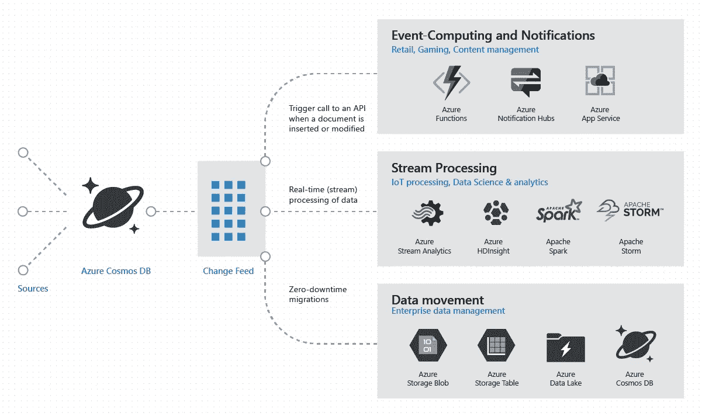

# 在 C#中使用 Azure Cosmos DB 更改提要处理器

> 原文：<https://levelup.gitconnected.com/working-with-the-azure-cosmos-db-change-feed-processor-in-c-a0d1e2b26aed>

## 多亏了变更提要处理器，您可以简化在 Azure Cosmos DB 上读取变更提要的过程

作为 Azure Cosmos DB 的 [v3 的一部分。NET SDK](https://github.com/Azure/azure-cosmos-dotnet-v3) ，Cosmos DB 集成了[变化馈送处理器](https://docs.microsoft.com/en-us/azure/cosmos-db/change-feed-processor)作为库的一部分。以前在 v2 中，它有自己的[库](https://docs.microsoft.com/en-us/azure/cosmos-db/sql-api-sdk-dotnet-changefeed)，你必须单独下载才能使用。

使用 C#，我们可以以各种不同的方式处理变更提要。实现变更提要最简单的方法是通过 Azure 函数。您可以创建一个带有 Cosmos DB 触发器的函数，以这种方式监听容器。您还可以使用 Azure Cosmos DB SQL API SDK，它提供了对变更提要的底层控制。最后，您可以通过使用变更提要处理器库来读取变更提要。

在本文中，我将讨论 Change Feed 处理器，分解代码中使其工作的特定部分，并使用一个演示来将其概念化。这个演示将从我们的 Cosmos DB 帐户的源容器中读取事件，并将这些更改保存在 Cosmos DB 的备份容器中。您也可以使用另一个数据存储(比如 Blob 存储或 Azure SQL)，但是为了简单起见，我将把它放在 Cosmos DB 中。

**等等，我对这个还不熟悉。Cosmos DB 中的更改提要是什么？**

在 Cosmos DB 中，我们使用 Change Feed 来监听我们的 Cosmos 数据库中的容器，以检测该容器中的任何更改。然后，更改提要将返回一个按修改顺序排序的文档列表。

这是一个非常棒的特性，它允许我们根据我们在 Cosmos DB 容器中的活动来触发事件。本文将演示如何使用变更提要将数据从我们的 Cosmos DB 集合转移到另一种类型的数据存储中，但是您也可以将变更提要用于其他用例，比如流处理或者在插入或更新项目时触发通知。

在撰写本文时，您可以使用 SQL API、Cassandra、MongoDB API 和 Gremlin API Cosmos DB account 的更改提要。变更提要当前捕获所有操作。**您不能限制变更提要将监听的操作类型(比如仅更新或仅插入)。**更改提要也不会监听任何删除操作。

您不需要做任何特别的事情来启用您的 Cosmos DB 帐户中的变更提要(它是默认存在的！).

**好的，那么零钱处理器有什么特别之处呢？**

变更馈送处理器简化了变更馈送的读取，并且它将事件的处理分布在多个消费者之间。它的容错行为提供了变更提要中所有事件的“至少一次”交付。

该库遵循观察者模式。如果您的变更提要具有较高的吞吐量，我们可以实例化多个客户端来读取提要，库将在所有客户端之间分配负载，而无需我们做任何事情。如果你真的想或者需要有自己的负载均衡器，你也可以这样做。

**那么处理器是如何工作的呢？**

变更馈送处理器分 4 步工作:

1.  它将读取更改馈送
2.  **如果没有任何变化**，它将进入睡眠状态(这次我们可以自定义)。
3.  **如果有变更**，我们将使用委托来处理这些变更。
4.  处理完这些更改后，将使用最新处理的点更新租赁存储，并返回到步骤 1。

为了实现 Change Feed 处理器，我们需要设置以下组件:

*   我们需要一个容器来监控事件。这些事件生成变更馈送。
*   我们需要一个租赁集装箱。这作为一个状态存储，将有助于协调多个工作人员的变更处理。
*   我们需要一台使用处理器监听变化的主机。如果我们有多个共享相同租约配置的变更馈送处理器实例，那么每个主机实例应该有不同的名称。
*   最后，我们需要一个代表。这是我们处理变更的地方，变更提要将会读取这些变更。

**如果我的代理出错了怎么办？如何处理错误？**

如果您的委托中有未处理的异常，处理这些更改的线程将被停止，并将创建一个新线程。

然后，这个新线程将查看租约存储区中保存的最新时间点，并从那里重新开始。这将一直持续到我们的更改得到处理。这是更改馈送处理器提供的“至少一次”保证。

你能给我看一些代码吗？

让我们写一些代码来看看这是怎么回事。我将创建一个简单的控制台应用程序，并浏览最重要的部分:

在这个方法中，我们定义了入口点，它是我们想要监控的容器。我们使用 GetChangeFeedProcessorBuilder 方法在我们想要监控的容器上构建我们的处理器。在这里，我们定义如何处理我们的变更提要中的变更(定义我们的委托)，定义实例名，然后添加租约容器配置。

现在让我们来看看这位代表:

这里，我们正在传递一个 IReadOnlyCollection 产品项列表。这实质上是已经被挑选出来的变更提要事件。然后，我们遍历这些更改，对于添加到列表中的每个产品，我们都将该项保存在备份集合中。

如果你想看这个的完整实现，请查看这个 GitHub Repo 。

**看起来很简单，但是我该如何衡量呢？**

只要您部署的更改馈送的所有实例对租约容器使用相同的配置，它们都具有相同的工作流名称，并且每个实例都有自己的名称，更改馈送处理器就会将租约容器中的所有租约分布到我们的所有实例中。我们可以增加和减少实例的数量，处理器会调整负载。

**就吞吐量而言，我将如何收费？**

更改提要本质上仍然是一个读操作，因此您将为消耗的 RU 付费。这些将由租赁容器使用。

**结论**

读完本文后，我希望您已经对 Change Feed 处理器的工作原理有了基本的了解。如果您需要在同一个容器上执行多个变更提要操作，那么我强烈建议您使用处理器，而不是在 Cosmos DB 触发器中使用多个 Azure 函数。

如果你有任何问题，请在评论中发表。