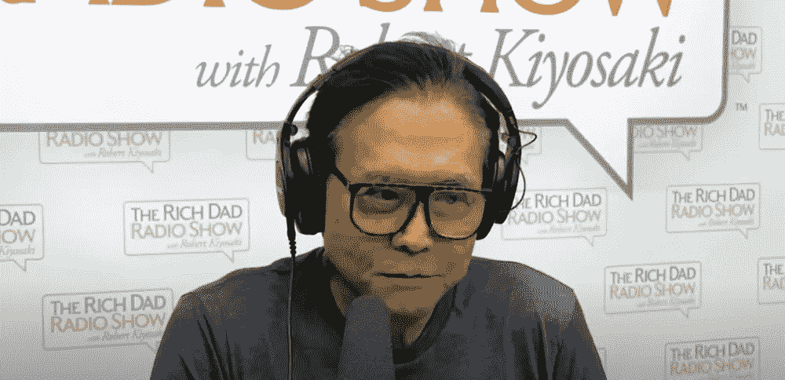
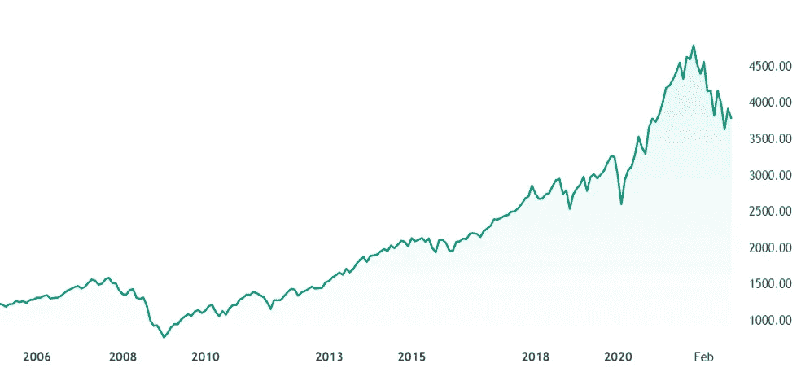

# 世界一流的个人金融作家说你被陷害了——股票市场的地毯正被从你下面拉出来。

> 原文：<https://levelup.gitconnected.com/world-class-personal-finance-author-says-youre-being-set-up-the-stock-market-rug-is-being-8710ae4104fa>

这是你应该投资的地方。

来源— [富爸爸 YouTube 截图](https://www.youtube.com/c/TheRichDadChannel)

我把 Rob Kiyosaki 称为世界级个人理财作家是有原因的。

一个原因是他凭借他的世界著名的书《富爸爸，穷爸爸》获得了成功。第二，经过长时间的研究，很难看到他背后的任何商业成功足以证明他是世界级的商业人士，更不用说出版一本关于商业建议的书了。

然而，在清崎出现在奥普拉脱口秀上之后,《富爸爸穷爸爸》成为了国际畅销书，这个机会几乎没有发生，因为他拒绝在他的书中透露谁是富爸爸。

清崎在这本书发行前获得了强大的支持，他通过有争议的网络营销公司[安利](https://en.wikipedia.org/wiki/Amway)销售这本书。

美国方式的简称。

英国监管机构禁止安利在英国运营，因为他们发现该公司通过销售商业教育获得的利润超过了实际业务运营。

安利的商业风格与 Rob Kiyosaki 的商业生涯有相似的主题，即从只想改善生活的人那里获得最大利润。

我写了一篇关于清崎的长篇博客，当时他评论说比特币是你应该投资的东西，整篇博客都在这里

> [罗伯·清崎给千禧一代的比特币讯息比他的书](https://medium.datadriveninvestor.com/rob-kiyosakis-bitcoin-message-to-millennials-has-a-greater-impact-on-you-than-his-book-ad1465600b6)对你的影响更大

我的一个追随者评论并提出了关于清崎的完美观点:

> “不会做的人，教”。

在这里，我们将研究清崎对股市的看法，以及他的观点是否可信。

我将省去你的心算和费力地阅读句子的段落，并马上给你我的意见。

你不会通过运气获得清崎所拥有的财富，但他是一个精明的营销者，利用了人们对贫穷的恐惧和对致富的渴望。

如果你听他讲话，你会觉得穷人几乎是另一类人。

在他看来，这是世界末日或者贝弗利山豪宅。他说的任何话都没有中间立场或表面上的平衡。

为什么？平衡不能满足人们的愿望，也不能吸引他们获得 YouTube 的浏览量，从而导致图书销售和售罄的研讨会。

清崎不是傻瓜，他用专家的方式解释复杂的话题，这些话题很容易理解，完美地展示了他的书在全球的成功。

系好安全带，系好安全带，我们开始吧。

# **股市。**

清崎说，当他还是个孩子的时候，没有人碰股票。

股票市场是为赌徒准备的，每个人都更喜欢政府债券，因为他们得到固定的利息回报。

政府债券是一个国家政府为支持其支出而发行的债务。它通常包括向购买者支付定期利息的承诺。

加班贷款变得更便宜了，但政府债券的回报也是如此。清崎回忆说，债券会一次性给你 16%的回报。

> [罗布·清崎](https://www.youtube.com/watch?v=hG2qLbL73hs):
> 
> “我小时候，没人碰股票。股市里只有赌徒。其他人都是债券。
> 
> 债券更安全。
> 
> 因此，政府制定了 401K 计划，迫使婴儿潮一代进入股市。
> 
> 谁控制着股票市场、中央银行、财政部和华尔街”。
> 
> 所有这些婴儿潮出生的人都是被“陷害”的，正如你我所知，政府会把地毯从你下面拉出来，他们是罪犯。

Kiyosaki 认为，当政府降低债券价格，借款更便宜时，就会提高股票市场价格。

债券下跌和股票价格上涨之间的关系是因为人们借钱回购股票，从而提高了股票价格。

清崎说，政府现在正在窃取人们的养老金。

> 罗布·清崎:
> 
> “如果政府答应给我爸爸每月 1000 美元的养老金，他们就必须每月给他 1000 美元。然而，1974 年，养恤金从固定金额转变为确定的缴款”。

如果你有固定的养老金缴款，你每月的付款会进入一个投资于股票市场的基金。

该基金通常实现长期增长，但其价值可能会因短期内的繁荣和萧条而大幅波动。

直到 2020 年，市场享受了繁荣期，每个人的养老金储蓄增长比以往任何时候都快。然后冠状病毒危机出现了，市场遭受了有史以来第二大损失，并一直在崩溃。

如果你很快就要退休，这可能会引起关注，这也是清崎强调的。

# **清崎担心最坏的情况。**

他说，如果债券价格上涨，借钱回购股票的大公司将陷入困境。

> 罗布·清崎:
> 
> “这些高管借钱是因为借入和回购他们的股票很便宜。
> 
> 500 家 S&P 公司中有 100 家是僵尸公司，因为它们一直在借钱推高股价。
> 
> 他们的股市价格如此之高，是因为他们不断借钱支撑股市。
> 
> 如果他们提高债券价格，那么占 S&P500 20%的 100 家公司将会崩溃，因为他们没有足够的钱来偿还他们所欠的债务”。

# **清崎说这是你应该投资的地方。**

清崎说他不需要买股票，你也不应该买。

他相信他可以创造自己的资产，投资私营企业。

> 罗布·清崎:
> 
> “我不需要购买股票，因为我可以创造我的资产，我是一名企业家，我可以创建自己的公司。而且我只投资私企，不投资上市公司”。

清崎说，你必须忘记股市，投资于下面。

*   比特币
*   金色的
*   银
*   以太坊

> [罗布·清崎](https://www.youtube.com/watch?v=hG2qLbL73hs):
> 
> “我不停地谈论黄金、白银、比特币和以太坊，因为我不相信货币市场、股票市场和央行。
> 
> 股票市场和比特币之间有着真正的区别。

这里是 [S & P 500](https://www.google.com/finance/quote/.INX:INDEXSP?sa=X&ved=2ahUKEwiRtoj7w5L7AhUxSEEAHSsuBf8Q3ecFegQIIxAg) 目前的表现，它在短期内证明了清崎的论点是正确的。

诚然，其他全球问题也在发挥作用，如创纪录的通货膨胀、欧洲战争和过高的油价，但这种下降使 2008 年的房地产崩盘和随后的股市崩盘看起来像是道路上的一个颠簸。

来源— [交易视图](https://www.tradingview.com/)

# **最终想法。**

清崎对股市的大多数反对情绪一直是一个不变的主题，所以他不只是对最近的事件做出反应，并试图获得一些“我告诉过你”的人气投票。

他关于政府的大部分言论都是正确的。

很难相信一个你无法准确知道会发生什么的金融体系。他对股市是一个边缘犯罪集团的预测和比较充其量也就达到了极限。

如果你赌美国会消失，你可能应该赌股市会下跌。

与世界其他国家一样，美国经历了世界大战和金融体系的巨大变革，比我们今天面临的要糟糕得多，但它仍然在讲述这个故事。

美国 500 家领先的上市公司从 1928 年到 2021 年的平均年回报率为 [**11.82%** 。](https://www.investopedia.com/ask/answers/042415/what-average-annual-return-sp-500.asp)

如果你在 30 年前的 1992 年在标准普尔 500 指数上投资 10，000 美元，并将股息再投资，你现在会有超过 170，000 美元。

抛开最近的波动不谈，该指数已被证明是长期的赢家，这与清崎关于股市的全面声明有些矛盾。

来源— [杂色傻子](https://www.fool.com/investing/how-to-invest/index-funds/average-return/)

> 如果你想在 Web3 上阅读更多我的观点，可以考虑成为会员。你的会员费直接支持你读的作家。如果你用我的链接 [*注册，我会赚一小笔佣金。点击这里*](https://medium.com/@jayden_levitt/membership) *。*

*本文仅供参考；不应将其视为财务、税务或法律建议。在做出任何重大财务决定之前，请咨询财务专家。*