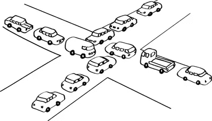

# 并行世界

> 原文：<https://levelup.gitconnected.com/world-of-concurrent-be30b5a269c1>

## 对 Java 并发的基本理解

并发世界

# **什么是并发？**

**并发**是同时执行多个指令序列。当几个进程线程并行运行时，操作系统中就会发生这种情况。正在运行的进程线程总是通过共享内存或消息传递相互通信。并发导致资源共享，导致死锁和资源匮乏等问题。

它有助于协调进程的执行、内存分配和执行调度等技术，以最大化吞吐量。

**现实世界中并发的例子**

*   铁路网络
*   园艺
*   工厂里的机器
*   银行系统
*   旅行预订系统
*   多人游戏

# 我们为什么需要并发？

*并发性*意味着多个计算同时发生。无论我们喜欢与否，并发在现代编程中无处不在:

*   网络中的多台计算机
*   在一台计算机上运行多个应用程序
*   一台计算机中的多个处理器(今天，通常在一个芯片上有多个处理器内核)

事实上，并发在现代编程中是必不可少的:

*   网站必须同时处理多个用户。
*   移动应用程序需要在服务器上做一些处理工作(“云端”)。
*   图形用户界面几乎总是需要不打断用户的后台工作。例如，当您还在编辑 Java 代码时，Eclipse 就会编译它。

在未来，能够进行并发编程仍然很重要。处理器时钟速度不再增加。相反，每一代新的芯片都有更多的内核。因此，在未来，为了让计算运行得更快，我们必须将计算分成并发的部分。

# 并发编程基础

嗯，Java 并发编程有两个主要部分。*进程和线程*

一个**进程**有一个自包含的执行环境。一个进程通常有一套完整的、私有的基本运行时资源；特别是，每个进程都有自己的内存空间。

**线程**存在于一个进程中——每个进程至少有一个线程。线程共享进程的资源，包括内存和打开的文件。这有助于高效但可能有问题的交流。

进程与线程

尽管并发编程解决了许多问题，并且可以提高大多数应用程序的性能，但是在某些情况下，多个执行行(线程或进程)可能会导致重大问题。这些情况包括以下几种:

*   僵局
*   线程饥饿
*   共享资源的并发访问
*   程序生成不正确数据的情况

记住 ***并发不是顺序编程！***

让我们检查一下 Java 线程。

# Java 线程

多线程是指在一个程序中同时执行两个或多个任务。线程是程序中独立的执行路径。许多线程可以在一个程序中并发运行。Java 中的每个线程都是由 *java 创建和控制的。郎。螺纹等级*。一个 Java 程序可以有许多线程，这些线程可以异步或同步地并发运行。

多线程与多处理相比有几个优点，例如:

*   与进程相比，线程是轻量级的
*   线程共享相同的地址空间，因此可以共享数据和代码
*   线程之间的上下文切换通常比进程之间的开销要低
*   线程相互通信成本相对低于进程相互通信的成本
*   线程允许不同的任务同时执行。

在程序中创建线程时，可以使用两种方法，

1.  扩展线程类

2.实现一个可运行的接口

将在[的下一篇](/states-of-thread-in-java-6f7bc1c628b9)博客中讨论 Java 线程的生命周期…

*编码快乐！！！*