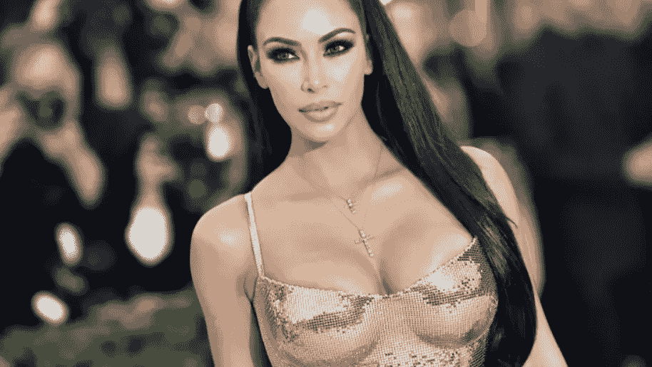
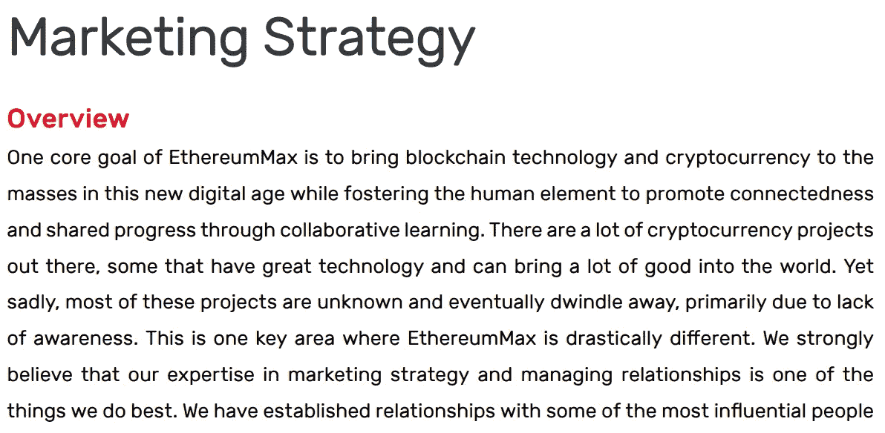
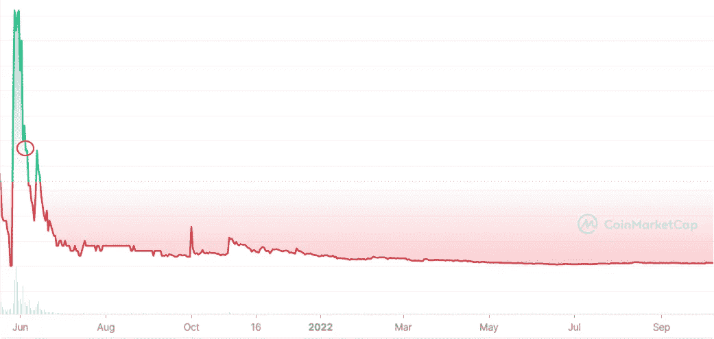

# 世界上最成功的影响者起诉索赔 126 万美元(加密货币骗局)

> 原文：<https://levelup.gitconnected.com/worlds-most-successful-influencer-sued-for-1-26-million-cryptocurrency-scam-982366ea9c9b>

你想知道她是否真的应该受到责备。

照片由 [*安吉拉·维斯|法新社|盖蒂图片社*](https://www.gettyimages.co.uk/)

尽管最近社交媒体影响者大受欢迎，但影响者营销已经存在了几个世纪。

在 2126 年前的[罗马帝国](https://grin.co/blog/the-history-of-influencer-marketing/#:~:text=Although%20influencer%20marketing%20has%20technically,included%20the%20term%20in%202019.)，最成功的角斗士被视为名人，在城镇的广告牌上游行。

他们会利用自己的名人地位推销葡萄酒和油类产品。

社会证明最古老和最成功的例子来自英国波特约书亚·威治伍德和梅克伦堡-施特莱茨的夏洛特皇后的合作。

韦奇伍德是女王最喜欢的波特，也是最好的之一。他说服皇室允许他将自己装扮成“女王陛下的波特”，并发布带有国王和王后头像的物品。

营销天才。

这一举动是如此巨大，以至于[韦奇伍德的名字](https://www.wedgwood.com/en-us)为更多高知名度的客户打开了大门，并且在 250 年后，仍然是现代品牌。

如果这一切都在 Instagram 上发生，你会称之为“病毒式运动”。

今天的剧本是泄露的性录像带和社交媒体讲故事，但概念仍然是一样的。

通过名人代言来利用产品，比如一个朋友会推荐一个在网飞上观看的连续剧。

这是一个重要的安全信号。你们有相同的兴趣，为什么他们的推荐不好呢？

亿万富商金·卡戴珊最初通过与帕丽斯·希尔顿的友谊获得媒体关注，但在她的性爱录像泄露并迅速走红后，她闻名全球。

当 [*跟上卡戴珊*](https://en.wikipedia.org/wiki/Keeping_Up_with_the_Kardashians) 在 2007 年推出的时候，他们最受欢迎的剧集获得了超过 200 万的浏览量，金的名气和影响力是全球性的。

# **以太坊 Max (EMAX)**

在阅读了他们 50 页的白皮书后，很容易看出以太坊 Max 是一个围绕游戏和去中心化金融的雄心勃勃的项目，它与以太坊没有任何关系。

他们的匿名营销头重脚轻的团队自称投机者有积极的促销计划，以传播他们的象征 EMAX 意识。

到目前为止，凭借金·卡戴珊和弗洛伊德·梅威瑟这样的高知名度影响者，他们在短短两个月内获得了 10 万名 EMAX 持有者。

以下是他们的白皮书对其营销的描述。

来源— [EMAX 白皮书](https://ethereummax.org/wp-content/uploads/EthereumMax-Whitepaper-v1-Final.pdf)

EMAX 的价格暴跌，让受金·卡戴珊社交媒体帖子影响的投资者赔钱。

金·卡戴珊(Kim Kardashian)在她的 Instagram 账户上的一篇帖子中获得了 25 万美元来推广 EthereumMax。

这看起来不像是一个好的商业决策。

最近，卡戴珊被判赔偿 140 万美元，因为投资者基于她在 Instagram 推广中的误导性陈述对她提起了集体诉讼。

集体诉讼是指一个或几个人代表一个更大的团体提起诉讼的法律程序。

卡戴珊在她的 Instagram 推广中包括:

> “你们对密码感兴趣吗？？？?"
> 
> “这不是财务建议，而是分享我的朋友刚刚告诉我的关于以太坊 Max 令牌的事情！”

卡戴珊建议通过在信息中加入#ad 标签来宣传 EMAX。

虽然在宣传中没有什么不好的，除了她把 EMAX 的创始人称为她的朋友，而他们很可能不是，卡戴珊遵循了这些准则。

让我们仔细看看这张图表。我用红色圈出了 Instagram 推广的日期。

## 我注意到两件事。

> 1.当卡戴珊宣传 EMAX 时，价格已经在暴跌。
> 
> 2.她的推广和影响力直接冲击了暴跌令牌的短期恢复。

来源— [硬币市值](https://coinmarketcap.com/currencies/ethereummax/)

除了上述数据，boxer Mayweather 在 2021 年 6 月与互联网影响者 Jake Paul 的表演赛筹备和推广期间与以太坊 Max 进行了接触，这很可能也影响了价格。

Emax 代币购买者也起诉了他。

# 最后的想法

我很难相信如果 EhtereumMax 成功了，会有人起诉金·卡戴珊。

事实是她在代币已经处于死亡漩涡，即将坠落的时候提升了代币。

这就引出了一个问题，她的团队在向她的 3.3 亿粉丝进行层层推广之前做了尽职调查吗？

创始人是不是故意把她的晋升作为重振暴跌的象征的最后一搏？

谁知道呢，不过卡戴珊团队和代币购买者只需要花几秒钟就能看到价格图表。

如果他们看到这一点，双方都会跑得远远的。

事实是，如果你遇到一种加密货币，它需要为其可持续性进行营销，而这是这个项目成功的基础，那么这个项目就会失败。

营销在长期可持续的加密货币中不起作用，尽管非加密本地人希望你相信。

它需要一大群人对项目的用例有信心和信念，而不是根据推荐来购买。

卡戴珊的净资产目前在**18 亿美元**。她的估计年薪在 6000 万美元左右。

她应该支付 126 万美元的停车罚款，继续发展她的商业帝国。

> *如果你想在 Web3 上阅读更多我的观点，考虑成为会员吧。你的会员费直接支持你读的作家。如果你用我的链接* [*注册，我会赚一小笔佣金。点击这里*](https://medium.com/@jayden_levitt/membership) *。*

*本文仅供参考；不应将其视为财务、税务或法律建议。在做出任何重大财务决定之前，请咨询财务专家。*