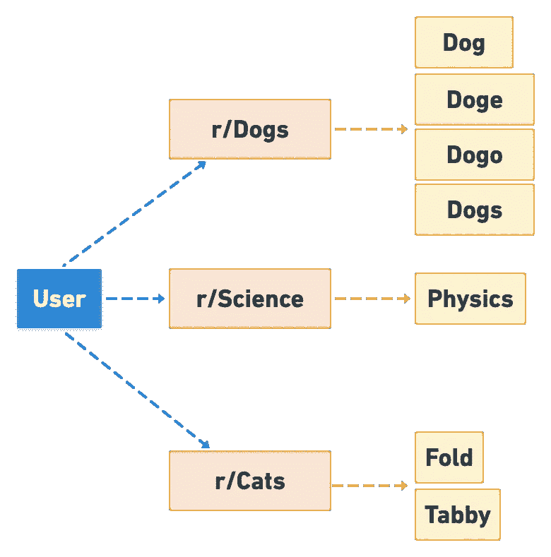
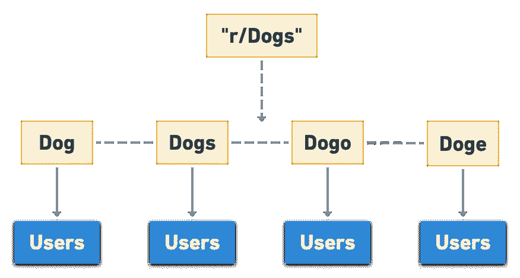
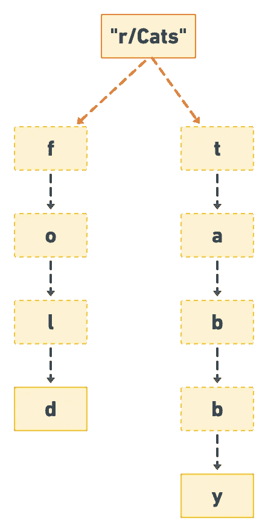
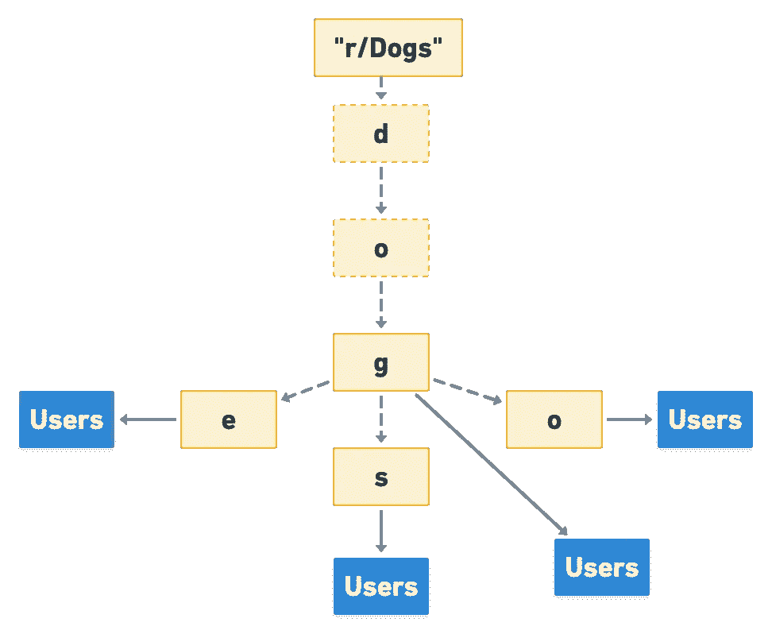

# 你想试试吗？

> 原文：<https://levelup.gitconnected.com/would-you-like-some-tries-with-that-afbc87e56eab>

## trie(前缀)树的使用案例以及与哈希表的比较

## 背景

在过去的几个月里，我一直在努力构建和充实我的一个名为 [Relevant](http://github.com/ablades/relevantreddit) 的激情项目的中间件和后端。然而，后端有一个方面我一直告诉自己明天要做，那就是处理数据库模型。

这并不是说我对我的数据库有不合理的恐惧，事实恰恰相反。犹豫是因为不知道我想如何组织数据库中的数据。我仔细考虑了一会儿各种可能性，觉得总有一些更好或更有效的东西可以实现，只是我还没有想到而已。

## 用户模型

图 1 —用户模型

我最终得到的用户模型类似于图 1 中的图表。每个用户都有一个子编辑图，每个子编辑都有与之相关的单词。当你把它画出来的时候非常简单，这是一个大多数人可能会接受的模型。如果您需要做的只是存储、检索和编辑单个用户的数据，那么这种模型很好，但是随着我的项目范围的扩大，我发现这种模型没有达到我所需要的。

图 1 所示模型的问题在于，它涉及大量效率不高的数据库输入和输出操作。例如，如果我们在 r/Dogs 中搜索关键字，在这种模式下，我们必须提取与 r/Dogs 相关的所有用户关键字。在这种情况下，这是狗，狗，狗和狗。然后，我们将迭代子编辑的内容，为每个子编辑和每个用户清洗和重复。这是很多多余的工作，尤其是如果两个用户共享子目录和/或关键字。

## 哈希表模型

图 2 —哈希表数据库结构

所以我展示了一个我一直在解决的问题的不太好的解决方案。我相信你们中的一些人已经对我大喊，“使用散列表，它有固定的时间操作！”是的，是的..我听到了。哈希表有很多优点，比如分摊常数时间插入和近似常数查找时间。在我的第一个实现中，我甚至使用了哈希表。它看起来类似于图 2。我们简单地对照被迭代的子编辑的哈希表检查每个单词。这里最大的问题是我们在哈希表中添加每个单词作为条目所占用的空间。随着用户不断添加关键字，任何给定哈希表的字符串数量都呈线性增长。

但是我们可以做得更好！如果你看一下图 2，你会注意到很多条目共享字符‘d’‘o’和‘g’。像这样的趋势一定会发生，尤其是随着越来越多的关键字被添加进来。仔细想想，英语字母表只是由 26 个字母组成，对于任何给定的单词组合，都必然会有重叠。因此，让我们使用一种考虑到这种重叠的结构。输入，尝试。

## 尝试模型

图 3 —一个简单的 Trie

尝试是一个树状结构，我们可以将单个字符表示为节点，并将它们链接在一起形成单词。在图 3 中，我们在 Cats 子编辑的 trie 结构中表示了单词 fold 和 tabby。这种结构超级厉害。让我们退一步想想为什么。假设我们正在处理构成前缀“fo”的字符“f”和“o”。将这串字母快速输入我的字典应用程序，我看到大约有 722 个结果。现在假设我们有一个真正专注的用户，他输入所有 722 个单词作为他们感兴趣的东西。在一个哈希表中，存储了 722 个字符串，每个字符串包含一个用户列表的引用，这些用户希望在单词出现时得到通知。在正常的遍历中，很多这样的单词不会出现，所以这是一个很大的空间浪费，最好存档。如果我们用一个 trie 来看这个相同的场景，并且考虑到英语中一个单词的平均长度是 4.5 个字符(trincoll.edu)，为了简单起见，让我们将其向上舍入到 5。所以在树形结构中的任何一点，我们都可以访问 26 个字符，每个字符对应字母表中的一个字母。因此，对于一个平均单词，在最坏的情况下，我们需要在数据库中存储 5 x 26 = 130 个字符。这不仅与散列表所需的 722 个字符有巨大的差异，而且我们只存储字符，节省了大量空间！我知道你可能会想，所有的 722 个单词都不是 5 个字符长，其中一些更长或更短。你是对的，所以让我们来看看最差情况下的尝试。假设我们看到的所有单词都是 28 个字符长，就像单词 Antidisestablishmentarianism(维基百科，lexico.com)。在最坏的情况下，我们使用字母表中的每个字母来存储至少一个长度为 28 的单词，我们将有 28×26 = 728 个字符。这个数字非常接近哈希表的数字，但有几个很大的不同。首先，我们存储的是字符，而不是字符串，这样占用的空间更少。第二，实际上用户很少会输入 28 个字符的单词，尤其是考虑到单词的平均长度是 5 个字符。因此，即使在最坏的情况下，当涉及到空间时，Trie 也远远胜过哈希表。

## 结论

图 4 —带有重叠字符的 Trie

我还没有展示具有重叠字符的 trie 可能是什么样子，所以这里有一个使用 Dog 的 subreddit 的例子。

希望读完这篇文章后，你对尝试和它们的用处有了一点了解。这个项目是我第一次实现一个定制的数据结构，我实际上计划完全集成到我的一个项目中。构建这种结构为我提供了一个难得的机会，让我在现实生活场景中仔细考虑选择一种数据结构的利弊，我对自己做出选择的步骤非常有信心。我很高兴在未来的其他项目和行业中利用更多这样的机会。