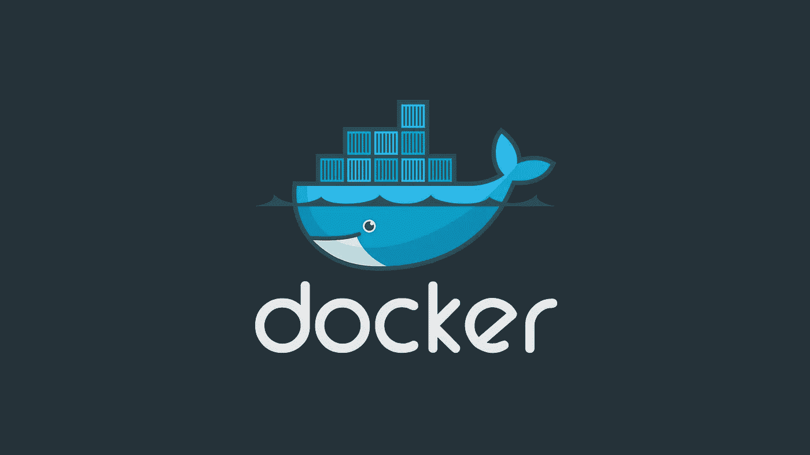
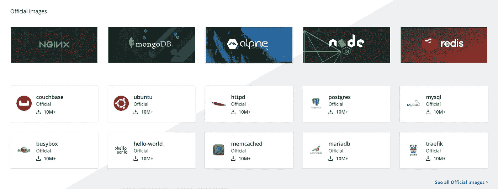
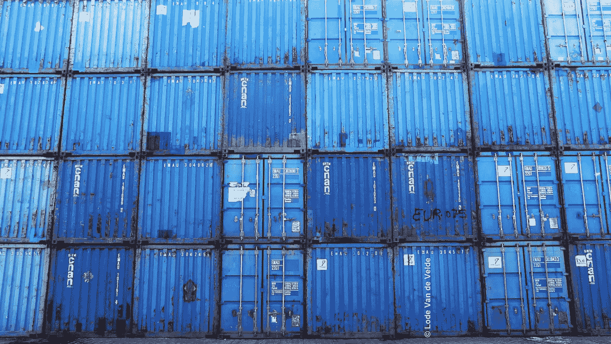

# 把你的头缠在 Docker 身上

> 原文：<https://levelup.gitconnected.com/wrapping-your-head-around-docker-27b94deadfc8>

我经常发现软件工程师(包括我自己)在一项技术的兴奋中有点迷失，而没有给予它实际解决的问题足够的关注。几年前，当我第一次接触 Docker 时，它正处于热潮之中，很难浏览并将其作为解决方案。

我的意图不是把它作为一个银弹呈现给每一个用例，而是试图帮助您理解它所解决的问题，让您对容器技术及其工作原理有一点熟悉。

# 从顶部的 Docker

首先，Docker 通过提供**一致性**来提供帮助。当您将代码部署到产品中时，您不必担心不同的环境。这是一种容器技术，它本质上允许您构建这个环境，并将其打包到一个盒子中，然后运送到某个地方。多棒啊。

这个包装盒中有您成功运行软件所需的一切。它为软件正确运行提供了必要的隔离。这就产生了**一致性**，因为机器拥有运行所需的一切。

此外，Docker 是一个围绕创建和运行容器的平台或生态系统。

你可能听说过一些类似于 *Docker 镜像、Docker 客户端、Docker 服务器、Docker Hub* 和 *Docker 容器*的术语。让我们来探索这些，因为它们是掌握这项技术的基础。

# 什么是 Docker 图像？

它是一个文件，包含运行程序所需的所有依赖项和配置。

例如，通过运行命令`docker run -it redis`,[Docker CLI](https://docs.docker.com/docker-for-windows/install/)到达 [Docker Hub](https://docs.docker.com/docker-hub/) 并下载一个名为映像的文件，该文件包含运行一个特定程序所需的所有依赖项和配置。这个单独的文件(图像)存储在硬盘上，用于创建一个容器。容器是图像的一个实例，可以看作是一个运行的程序。

正如该网站所述， [Docker Hub](https://hub.docker.com/) 是 Docker 提供的一项服务，用于查找和共享容器图像。

码头枢纽

# 什么是 Docker 容器？

它是映像的一个实例，使用自己的一组独立硬件资源运行特定的程序。它有自己的一套内存，自己的一套联网技术，自己的一套硬盘空间。

# 为什么要用 Docker？

Docker 让安装和运行软件变得非常容易，而不用担心安装和依赖。

运行`docker run`命令启动 Docker 客户端或 CLI，它负责从用户那里获取命令并对它们进行处理，然后与 Docker 服务器进行通信。docker 服务器负责繁重的工作。

通过给 Docker 客户端命令`docker run hello-world`，它将被发布到 Docker 服务器，一系列的动作将在后台发生。Docker 服务器将会看到我们正在尝试使用一个名为 *hello-world* 的映像启动一个新容器。Docker 服务器要做的第一件事是检查它是否在你的机器上有一个 *hello-world* 图像的本地副本。docker 服务器向 docker 集线器寻求特定的图像。

如果 Docker Hub 有映像的副本，Docker 服务器会下载该文件，并将其存储在您的个人计算机上的 Docker 映像缓存中，以后可以非常快速地重新运行该文件，而不必从 Docker Hub 重新下载。

Docker 服务器然后使用图像缓存中下载的图像创建一个容器实例，方法是将它加载到计算机的内存中
，并在其中运行一个程序。对于 *hello-world* 程序，它的唯一目的是在终端中打印一条消息。

蓝色容器

# 关于什么是容器的更多细节

大多数操作系统都有内核。内核是一个正在运行的软件进程，它管理计算机上运行的所有程序与计算机的所有物理硬件组件(CPU、内存、硬盘)之间的访问。内核是控制机器上运行的所有程序和机器的物理组件之间的访问的中间层。正在运行的程序通过系统调用与内核交互。这些就像函数调用。

假设您想要运行两个独立的程序，每个程序都有不同的依赖关系，不能作为硬盘上的安装程序共存。我们如何解决这个问题？有一个操作系统特性叫做*命名空间*。使用*命名空间*，我们可以查看连接到我们计算机的所有其他不同的
硬件资源，并且我们可以分割出这些资源的一部分。因此，我们可以将硬盘的一部分分割成一个特定的依赖项，另一部分用来存放另一个依赖项。

每当一个程序需要通过发出一个系统调用从硬盘上读取信息来访问硬盘上的依赖关系
时，内核就会查看这个系统调用，并判断出它来自哪个进程。因此，如果一个特定的程序试图访问硬盘上的一个资源，内核会计算出来，它会将调用指向相关的硬盘段。通过利用这种*命名空间*或分段特性，我们能够确保具有不同依赖关系的程序能够在同一台机器上运行。

根据请求硬件资源的进程分割硬件资源的整个过程被称为*命名空间*。

**命名空间** —隔离每个进程的资源，包括硬件进程、硬盘、网络、用户、主机名和进程间通信。因此，每当一个进程请求一个特定的资源时，它将被定向到给定硬件的一个特定段。
命名空间不仅限于硬件组件，也可用于软件元素。另一个与命名空间相关的概念是控制组。

**控制组(cgroups)** —控制组用于限制进程可以使用的资源量。

简而言之，命名空间用于说明这个特定的资源或硬盘驱动器的一部分是用于这个进程的，控制组用于限制一个进程可以使用的内存量、CPU 使用量、网络带宽量和硬盘驱动器 I/O 量。

这两个特性结合在一起，允许我们隔离单个进程，并限制它可以对话的资源量和它使用的带宽量。

正在运行的进程的整个组件以及它可以与之对话的资源段就是我们所说的**容器**。

它不是一个物理结构。它是一个容器，是一个进程或一组进程，有一组专门分配给它的资源。

*容器*是一个正在运行的进程，它对内核进行系统调用，内核查看传入的系统调用，并将其定向到硬盘、RAM、网络和/或 CPU 的特定部分，或者它可能需要的任何其他部分。
这些资源的一部分可用于该进程。

*映像*是文件系统快照。它是一组非常特定的目录或文件的副本。一个映像还将包含一个非常具体的启动命令。

# 幕后:将图像变成容器

内核隔离硬盘驱动器的一部分，并使其仅可用于容器，映像内的文件系统快照被获取并放置在硬盘驱动器的专用(或隔离)部分。

然后执行启动命令，创建流程的实例，然后将创建的流程隔离到容器内的这组资源。

容器是一个正在运行的进程，以及机器上专门分配给该进程的物理资源的子集。

图像就是这样变成一个运行的容器的。

命名空间和控制组的这些特性是特定于 Linux 操作系统的。那么，如果这些都是 Linux 的特性，那么这种神奇是如何在 Mac 或 Windows 机器上发生的呢？

当您安装 Docker for Windows 或 Mac 时，您会安装一个 Linux 虚拟机。在虚拟机内部，是创建和托管容器的地方。Linux VM 有一个在容器内部运行进程的 Linux 内核。

同一个 Linux 内核负责限制或约束对机器上不同硬件资源的访问。

如果你喜欢这篇文章，请在这里给我买杯咖啡[☕️](https://www.buymeacoffee.com/lukemwila)😃。

docker 还有很多值得学习和探索的地方，[文档](https://docs.docker.com/)非常优秀，所以我强烈建议你尝试创建 Docker 图像和容器。不要害怕犯错误，这是学习的最好方法之一😉。

这里有一些有用的 docker 命令的链接。

参考资料:

 [## 码头文件

### 预计阅读时间:2 分钟尝试我们的多部分演练，包括编写您的第一个应用程序、数据存储…

docs.docker.com](https://docs.docker.com/)  [## 初学者了解 Docker 容器技术

### 了解 Docker 容器 Docker 是一个使用容器来创建、部署和运行…

geekflare.com](https://geekflare.com/understanding-docker-for-beginner/)  [## 码头建筑

### 下图显示了虚拟化的标准和传统架构。服务器是物理的…

www.tutorialspoint.com](https://www.tutorialspoint.com/docker/docker_architecture)  [## Docker 和 Kubernetes:完全指南

### 如果你厌倦了学习如何部署 web 应用程序，那么这就是适合你的课程。CI+CD…

www.udemy.com](https://www.udemy.com/docker-and-kubernetes-the-complete-guide/)