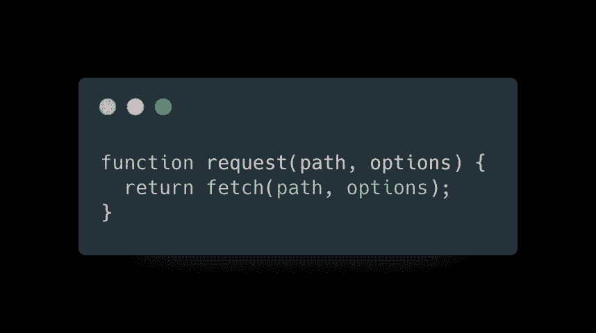
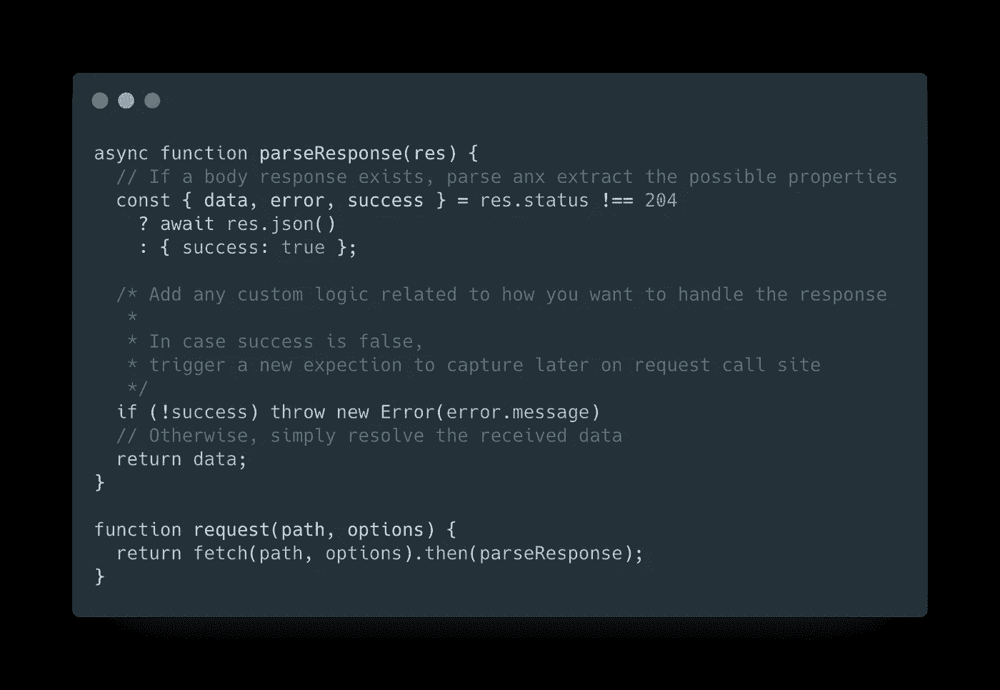
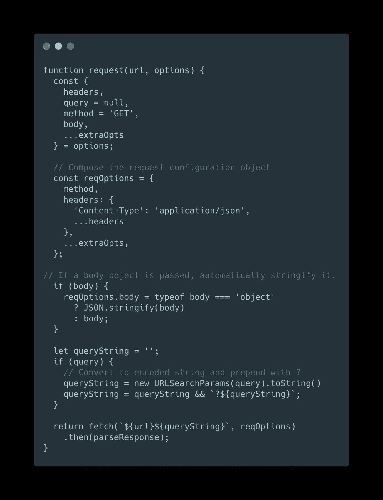
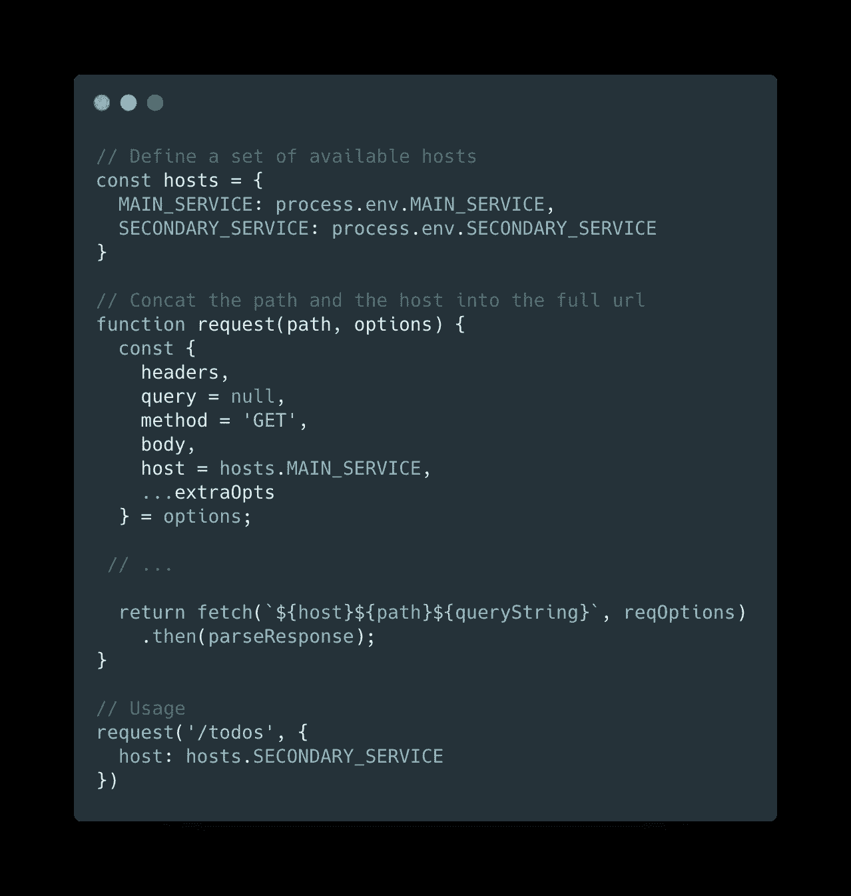
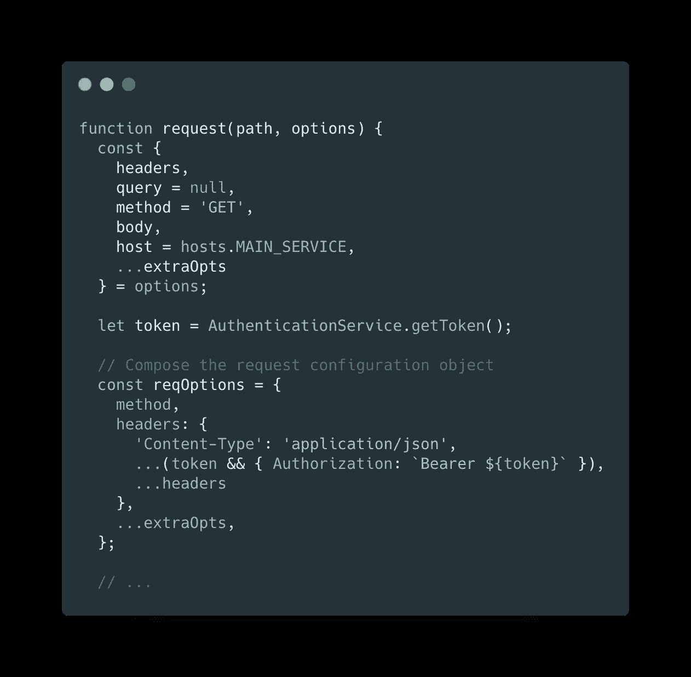
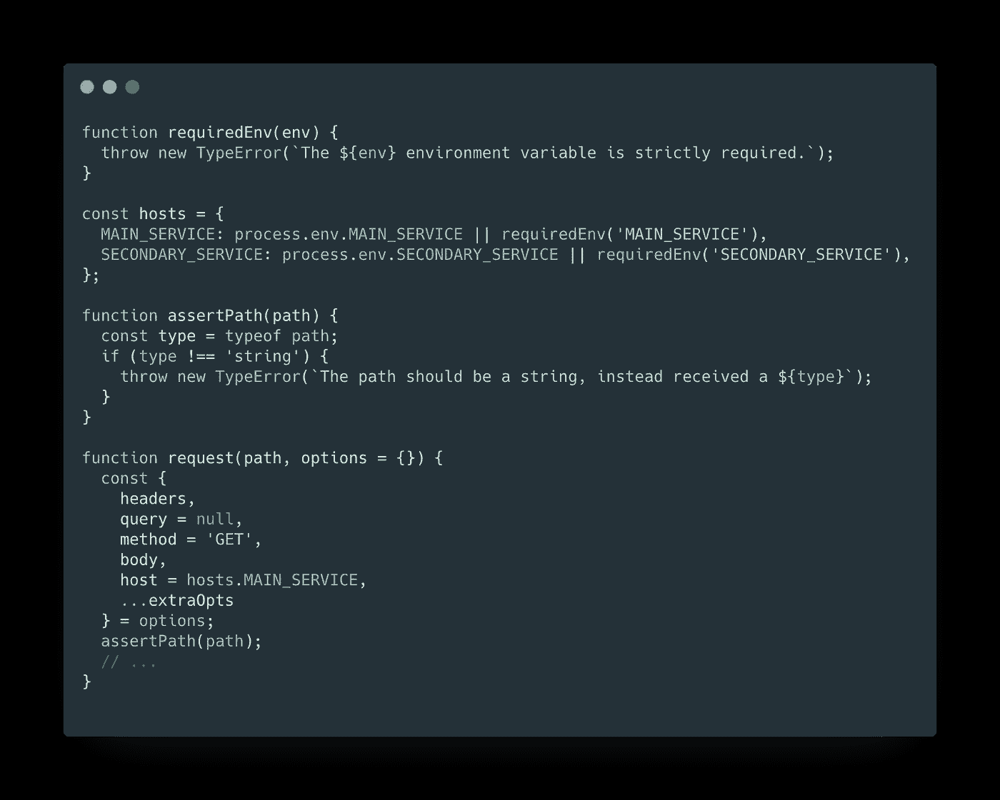

# 用不到 1kb 的空间编写一个 JavaScript 获取包装器

> 原文：<https://levelup.gitconnected.com/write-a-javascript-fetch-wrapper-in-less-than-1kb-99cb45663065>

## 因此避免安装大量的依赖项

安东尼·杜兰在 [Unsplash](https://unsplash.com?utm_source=medium&utm_medium=referral) 上的照片

自从采用 *npm 模块*以来，前端开发发展得非常快:由于开源世界，已经发布了数十万个包，为任何开发人员的需求提供了可用的依赖。

然而，有时我们面临的问题并不需要复杂的逻辑，这意味着我们甚至可以在不安装外部依赖的情况下实现所需的内容。

这有一些优点:

*   您可以完全控制自己的代码。如果您的业务逻辑需要更改代码，您可以直接对其进行操作，而无需等待依赖关系更新或混合逻辑来欺骗您正在使用的包。
*   **你可以实现你所需要的，别无他求。大多数著名的模块都很棒，因为它们提供了大量的特性和灵活性，但是我们真的需要一个 30kb 的包来完成我们只用 10 行代码就能完成的事情吗？**

## API 客户端要求

几乎每个用 JavaScript 编写的 web 应用程序都需要处理一些逻辑来触发 HTTP 请求，并正确地获取所需的数据。这些年来，社区带来了成吨的解决方案，从众所周知的 [*请求*](https://www.npmjs.com/package/request) 模块(现已弃用)，到众所周知的 [*axios*](https://www.npmjs.com/package/axios) *。*

这些当然是很好的抽象，但是我们可以用更少的代码来构建更轻的、具有相似特性的东西。

我们现在将根据需求构建我通常编写的 API 客户端，它包括以下特性:

*   解析响应
*   处理所有请求的方法
*   附加查询参数
*   多域
*   处理经过身份验证的请求

让我们一起一步一步来打造吧！🚀

## 请求包装器实现

首先，让我们编写没有额外功能的包装器函数，这将是我们实现的起点。我们将使用 [*的*](https://developer.mozilla.org/en-US/docs/Web/API/Fetch_API) 内置函数作为基本请求:

基本抽象

因为我们希望使用这个客户机来解析 JSON 响应，所以让我们在收到响应时解析它。在我的需求中，我期望使用一个具有固定结构的 API，它将总是返回一个具有两个属性的对象，即**数据**或**错误**和**T5 一个布尔值**成功**:**

添加响应正文解析器

现在，我们可以开始为我们的请求函数增加灵活性，自动生成一些选项，如标题和查询参数:

公开查询选项以获取查询参数

到目前为止，我们已经有了一个很好的结果！我们现在能够轻松地触发 HTTP 请求并解析响应，而不需要任何重复的操作。

但是，还有改进的余地！如果我们的 app 需要消费多个服务怎么办？如果请求被定向到另一个服务，我们可能希望修改接口，从选择中挑选一个基本 URL。让我们为此修改脚本:

添加主机属性以选择自定义的基本 url

我们快完成了！但是如果一个用户登录了，我们如何使我们的请求得到认证呢？我们应该从身份验证服务中检索会话令牌(如果可用)，并通过授权头将其附加到请求中:

启用已验证的请求

向 headers 对象传递一个有条件的 spread 将允许我们覆盖 Authorization 属性，以防我们想要传递一个定制的头。

为了完成我们的包装，我总是为一个必需的字段添加一些验证器，有时可能会忘记传递一个环境变量！

对参数添加一些验证检查

如您所见，如果缺少环境变量或者路径不是字符串，它将抛出一个错误。

## 包扎

用不到 70 行代码，我们得到了一个完全有效的抽象，足够灵活地满足所有的应用需求。您可以根据应用程序的需要对其进行调整。代码重量约为 1.9Kb，缩小后不到 1Kb🚀

我将为您留下完整实现的要点和一些使用示例:

关于这个话题的评论、分享和讨论总是很受欢迎。我很乐意回答你的任何问题！

> **随时联系我**[**Linkedin**](https://www.linkedin.com/in/marcoantonioghiani/)

 [## 重构一个反应组件

### 使用最佳实践编写高效可读的 React 组件的 5 条规则 React.js 已经成为最流行的观点…

marcoghiani.com](https://marcoghiani.com/blog/refactoring-a-react-component)  [## 如何在 React 中使用组件组合

### 按照组合模式创建坚固而灵活的 react 组件。当我开始使用 React 时，我…

marcoghiani.com](https://marcoghiani.com/blog/how-to-use-component-composition-in-react)  [## 我是如何通过改变习惯快速学习的。

### 9 个有效的习惯可以让你学得更快，提高工作效率。一年多前，在我 25 岁的时候，我离开了我的…

marcoghiani.com](https://marcoghiani.com/blog/how-i-became-a-fast-learner-changing-my-habits)