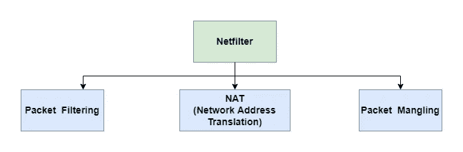
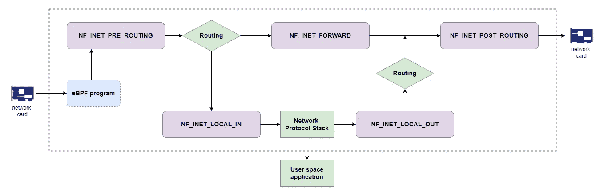
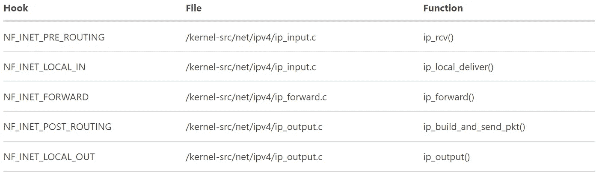

# 基于 Netfilter 从头编写一个 Linux 防火墙

> 原文：<https://levelup.gitconnected.com/write-a-linux-firewall-from-scratch-based-on-netfilter-462013202686>

# 介绍

`Firewalls`是一个重要的工具，可以通过配置来保护您的服务器和基础设施。防火墙的主要功能是过滤数据、重定向流量和防范网络攻击。既有基于硬件的防火墙，也有基于软件的防火墙。这里我就不多讨论背景了，因为你可以在网上找到很多关于 [it](https://en.wikipedia.org/wiki/Firewall_(computing)) 的文档。

你有没有想过从头开始实现一个简单的迷你防火墙？听起来很疯狂？但是借助 Linux 的力量，你可以做到这一点。当你看完这一系列文章后，你会发现，其实，这很简单。

你可能曾经在 Linux 上使用过各种防火墙，如 [iptables](https://en.wikipedia.org/wiki/Iptables) 、 [nftables](https://en.wikipedia.org/wiki/Nftables) 、 [UFW](https://en.wikipedia.org/wiki/Uncomplicated_Firewall) 等。所有这些防火墙工具都是用户空间实用程序，它们都依赖于`[Netfilter](https://en.wikipedia.org/wiki/Netfilter)`。`Netfilter`是 Linux 内核子系统，允许实现各种与网络相关的操作。`Netfilter`允许你使用`Linux Kernel Module`开发你的防火墙。如果您不知道 Linux 内核模块和 Netfilter 之类的技术，不要担心。在本文中，让我们基于 Netfilter 从头开始编写一个 Linux 防火墙。可以了解以下几个有趣的点:

*   Linux 内核模块开发。
*   Linux 内核网络编程。
*   Netfilter 模块开发。

这篇文章会稍微长一点，由五个部分组成:

*   Netfilter 和内核模块的背景:介绍 Netfilter 和内核模块的相关理论。
*   制作第一个内核模块:学习如何编写一个简单的内核模块。
*   Netfilter 架构和 API:回顾 Netfilter 钩子架构和源代码。
*   Impement 迷你防火墙:为我们的迷你防火墙编写代码。

# Netfilter 和内核模块的背景

## Netfilter 的基础

`Netfilter`可以认为是 Linux 上的第三代`firewall`。在 Linux 内核 2.4 引入`Netfilter`之前，Linux 上有以下两个老一代防火墙:

*   第一代是 BSD UNIX 的早期版本`ipfw`到 Linux 1.1 的移植。
*   第二代是 Linux 内核 2.2 系列开发的`ipchains`。

正如我们上面提到的，`Netfilter`被设计为在 Linux 内核中为各种网络操作提供基础设施。所以`firewall`只是`Netfilter`提供的如下多种功能之一:



*   **包过滤**:负责根据规则过滤数据包。也是本文的主题。
*   **NAT(网络地址转换)**:负责转换网络数据包的 IP 地址。`NAT`是一个重要的协议，在`conserving global address space in the face of IPv4 address exhaustion`中已经成为一个流行的必备工具。如果不了解`NAT`协议，可以参考其他[文档](https://en.wikipedia.org/wiki/Network_address_translation)。我将在以后的文章中研究它。
*   **报文篡改**:负责修改报文内容(其实`NAT`也是报文篡改的一种，修改源或目的 IP 地址)。例如，TCP SYN 数据包的`MSS (Maximum Segment Size)`值可以改变，以允许通过网络传输大尺寸的数据包。

注意:本文将着重于基于 Netfilter 构建一个简单的防火墙来过滤数据包。所以`NAT`和`Packet Mangling`部分不在本文讨论范围内。

包过滤只能在 Linux 内核中完成(Netfilter 的代码也在内核中)，如果我们想写一个迷你防火墙，它必须在内核空间中运行。对吗？这是否意味着我们需要将代码添加到内核中并重新编译内核？想象一下，每次您想要添加新的包过滤规则时，您都必须重新编译内核。那是个坏主意。好消息是`Netfilter`允许您使用`[Linux kernel modules](https://wiki.archlinux.org/title/Kernel_module)`添加扩展。

## Linux 内核模块基础

虽然 Linux 是一个`[monolithic kernel](https://en.wikipedia.org/wiki/Monolithic_kernel)`，但是可以使用内核模块进行扩展。模块可以插入内核，也可以按需移除。Linux 隔离了内核，但允许您通过模块动态添加特定的功能。这样，Linux 在稳定性和可用性之间保持了平衡。

我想在这里检查一下关于内核模块的一个令人困惑的地方:在`driver`和`module`之间有什么区别:

*   驱动程序是在内核中运行的一段代码，用来与一些硬件设备对话。它驱动硬件。标准的做法是尽可能将驱动程序构建为内核模块，而不是将它们静态地链接到内核，因为这样可以提供更大的灵活性。
*   内核模块可能根本不是设备驱动程序。

在下一节中，我们将动手实现我们的迷你防火墙。我们将一步一步地介绍整个过程。第一步，让我们用一个简单的`hello world`演示来编写我们的第一个 Linux 内核模块。然后让我们学习如何构建模块(这与在用户空间编译应用程序非常不同)以及如何在内核中加载它。

# 制作第一个内核模块

首先，我必须承认 Linux 内核模块开发是一个庞大而复杂的技术课题。有许多关于它的很棒的网上资源。本系列文章的重点是开发基于 Netfilter 的迷你防火墙，因此我们无法涵盖内核模块本身的所有方面。在以后的文章中，我将更深入地研究内核模块的知识。

## 编写模块

您可以用一个单独的`C`源代码文件`hello.c`编写`hello world`内核模块，如下所示:

我们可以用如此简单的方式编写一个内核模块，因为 Linux 内核为你创造了奇迹。记住 Linux(Unix)的设计哲学: ***为简单而设计；只在必须*** 的地方增加复杂度。

让我们来考察以下几个值得注意的技术要点:

首先，内核模块必须至少有两个函数:一个是“开始”函数，当模块加载到内核中时调用；另一个是“结束”函数，在模块从内核中移除之前调用。在内核 2.3.13 之前，这两个函数的名字被硬编码为`init_module()`和`cleanup_module()`。但是在新版本中，通过使用`module_init`和`module_exit`宏，你可以为一个模块的开始和结束函数取任何你喜欢的名字。宏在`include/linux/module.h`和`include/linux/init.h`中定义。你可以参考那里的详细信息。

通常，`module_init`要么在内核中注册一个处理程序(例如，本文中开发的迷你防火墙)，要么用自己的代码替换一个内核函数(通常是做一些事情然后调用原始函数的代码)。`module_exit`函数应该撤销`module_init`所做的一切，因此模块可以安全卸载。

其次，`printk`函数提供了与`printf`相似的行为，它接受`format string`作为第一个参数。`printk`功能原型如下:

`printk`函数允许调用者指定`log level`来指示发送到内核消息日志的消息的类型和重要性。例如，在上面的代码中，日志级别`KERN_INFO`是通过添加到格式字符串中来指定的。在 C 编程中，这种语法被称为`[string literal concatenation](https://en.wikipedia.org/wiki/String_literal#String_literal_concatenation)`。(在其他高级编程语言中，字符串串联一般用`+`运算符完成)。关于功能`printk`和`log level`，您可以在`include/linux/kern_levels.h`和`include/linux/printk.h`中找到更多信息。

注意:Linux 内核模块开发的头文件路径不同于您在应用程序开发中经常使用的路径。不要试图在 */usr/include/linux* 中找到头文件，而是请使用下面的路径*/lib/modules/` uname-r `/ build/include/Linux*(`uname -r`命令返回您的内核版本)。

接下来，让我们构建这个 hello-world 内核模块。

## 构建模块

构建内核模块的方式与构建用户空间应用程序的方式略有不同。构建内核映像及其模块的高效解决方案是`Kernel Build System(Kbuild)`。

`Kbuild`是一个复杂的话题，我不会在这里解释太多细节。简单来说，`Kbuild`允许你创建高度定制的内核二进制镜像和模块。从技术上讲，每个子目录都包含一个`Makefile`，只编译其目录中的源代码文件。顶层 Makefile 递归地执行每个子目录的 Makefile 来生成二进制对象。并且可以通过定义`config files`来控制包含哪些子目录。详细可以参考其他[文件](https://www.linuxjournal.com/content/kbuild-linux-kernel-build-system)。

以下是`hello world`模块的生成文件:

在读取 makefiles 或做任何其他事情之前,`make -C dir`命令改变到目录 dir。将使用*/lib/modules/$(shell uname-r)/build*中的顶层 Makefile。你可以发现命令`make M=dir modules`是用来使所有模块都在指定的目录下。

并且在模块级 Makefile 中，`obj-m`语法告诉`kbuild`系统从`module_name.c`构建`module_name.o`，链接后会产生内核模块`module_name.ko`。在我们的例子中，模块名是`hello`。

构建过程如下:

```
chrisbao:~$ sudo make
make -C /lib/modules/4.15.0-176-generic/build M=/home/DIR/jbao6/develop/kernel/hello-1  modules
make[1]: Entering directory '/usr/src/linux-headers-4.15.0-176-generic'
  CC [M]  /home/DIR/jbao6/develop/kernel/hello-1/hello.o
  Building modules, stage 2.
  MODPOST 1 modules
  CC      /home/DIR/jbao6/develop/kernel/hello-1/hello.mod.o
  LD [M]  /home/DIR/jbao6/develop/kernel/hello-1/hello.ko
make[1]: Leaving directory '/usr/src/linux-headers-4.15.0-176-generic'
```

构建完成后，您可以在同一个目录中获得几个新文件:

```
chrisbao:~$ ls
hello.c  hello.ko  hello.mod.c  hello.mod.o  hello.o  Makefile  modules.order  Module.symvers
```

以`.ko`结尾的文件是内核模块。你现在可以忽略其他文件，我稍后会写另一篇文章来深入讨论内核模块系统。

## 加载模块

使用`file`命令，您可以注意到内核模块是一个`ELF(Executable and Linkable Format)`格式的文件。ELF 文件通常是编译器或链接器的输出，并且是二进制格式。

```
chrisba:~$ file hello.ko
hello.ko: ELF 64-bit LSB relocatable, x86-64, version 1 (SYSV), BuildID[sha1]=f0da99c757751e7e9f9c4e55f527fb034a0a4253, not stripped
```

下一步，让我们尝试动态安装和移除模块。您需要知道以下三个命令:

*   *lsmod* :显示当前加载的内核模块列表。
*   *insmod* :通过运行`sudo insmod module_name.ko`将模块插入 Linux 内核
*   *rmmod* :通过运行`sudo rmmod module_name`从 Linux 内核中删除一个模块

由于`hello world`模块非常简单，您可以根据自己的意愿轻松安装和移除该模块。我不会在这里显示详细的命令，留给读者。

**注意**:这并不意味着你可以毫无问题地轻松安装和移除任何内核模块。如果你加载的模块有错误，整个系统会崩溃。

## 调试模块

下一步，让我们证明`hello world`模块是按预期安装和移除的。我们将使用`dmesg`命令。`dmesg`(诊断信息)可以打印`kernel ring buffer`中的信息。

首先，`[ring buffer](https://en.wikipedia.org/wiki/Circular_buffer)`是一种数据结构，它使用单个固定大小的缓冲区，就好像它是端到端连接的一样。`kernel ring buffer`是一个环形缓冲区，记录与内核操作相关的消息。正如我们上面提到的，由`printk`函数打印的内核日志将被发送到内核环形缓冲区。

我们可以通过命令`dmesg | grep world`找到模块产生的消息，如下所示:

```
chrisbao:~$ dmesg | grep world

[2147137.177254] Hello, world
[3281962.445169] Goodbye, world
[3282008.037591] Hello, world
[3282054.921824] Goodbye, world
```

现在你可以看到`hello world`被正确地加载到内核中。并且它也可以被动态移除。太好了。

基于对内核模块的理解，让我们继续写一个`Netfilter`模块作为我们的迷你防火墙。

# Netfilter 架构。

## Netfilter 挂钩的基础知识

**`**Netfilter**`**框架提供了一堆 Linux 内核中的** `**hooks**` **。当网络数据包通过内核中的协议栈时，它们也会穿过这些钩子**。Netfilter 允许你用这些钩子写模块和注册回调函数。当钩子被触发时，回调函数将被调用。这是 Netfilter 架构背后的基本思想。不难理解吧？**

****

**目前，Netfilter 为`IPv4`提供了以下 5 个钩子:**

*   ***NF_INET_PRE_ROUTING* :网卡收到数据包后立即触发。该挂钩在`routing decision`制作前触发。然后，内核确定该数据包的目的地是否是当前主机。根据条件，将触发以下两个挂钩。**
*   ***NF_INET_LOCAL_IN* :针对发往当前主机的网络数据包触发。**
*   ***NF_INET_FORWARD* :针对应该转发的网络数据包触发。**
*   ***NF_INET_POST_ROUTING* :针对已经路由的网络数据包，在发送到网卡之前触发。**
*   ***NF_INET_LOCAL_OUT* :由当前主机上的进程产生的网络数据包触发。**

**您在模块中定义的钩子函数可以破坏或过滤数据包，但它最终必须向 Netfilter 返回一个状态代码。代码有几个可能的值，但是现在，您只需要理解其中的两个:**

*   ***NF_ACCEPT* :这意味着钩子函数接受数据包，它可以继续网络堆栈之旅。**
*   ***NF_DROP* :这意味着数据包被丢弃，不再遍历网络堆栈的其他部分。**

**Netfilter 允许你用不同的优先级注册多个回调函数到同一个钩子。如果第一个钩子函数接受了这个包，那么这个包将被传递给下一个低优先级的函数。如果数据包被一个回调函数丢弃，那么下一个函数(如果存在)将不会被遍历。**

**如你所见，`Netfilter`的范围很广，我不可能在文章中涵盖每个细节。所以这里开发的迷你防火墙将在钩子`NF_INET_PRE_ROUTING`上工作，这意味着它通过控制入站网络流量来工作。但是注册钩子和处理包的方式可以应用于所有其他钩子。**

***注*:还有一个值得注意的问题:`Netfilter`和`eBPF`有什么区别？如果你不了解 eBPF，请参考我之前的[文章](https://organicprogrammer.com/2022/03/28/how-to-implement-libpcap-on-linux-with-raw-socket-part2/)。它们都是 Linux 内核中重要的网络特性。重要的是`Netfilter`和`eBPF`钩子位于内核的不同层。正如我在上图中所画的，`eBPF`位于较低的一层。**

## **Netfilter 钩子的内核代码**

**为了清楚地了解`Netfilter`框架是如何在协议栈内部实现的，让我们再深入一点，看看内核源代码(不要担心，只展示了几个简单的函数)。让我们以钩子`NF_INET_PRE_ROUTING`为例；因为迷你防火墙将基于它来编写。**

**当接收到 IPv4 数据包时，其处理函数`ip_rcv`将被调用如下:**

**在这个处理函数中，你可以看到钩子被传递给了函数`NF_HOOK`。根据名字`NF_HOOK`，你可以猜测它是用来触发 Netfilter 钩子的。对吗？让我们继续检查`NF_HOOK`是如何实现的，如下所示:**

**功能`NF_HOOK`包含两个步骤:**

*   **首先，通过调用底层函数`nf_hook`运行钩子的回调函数。**
*   **第二，调用函数`okfn`(作为参数传递给 *NF_HOOK* )，如果数据包通过钩子函数并且没有丢失。**

**对于钩子 *NF_INET_LOCAL_IN* ，函数`ip_rcv_finish`将在钩子函数通过后被调用。它的工作是将数据包传递给协议栈中的下一个协议处理器(TCP 或 UDP)继续它的旅程！**

**其他 4 个钩子都使用相同的函数`NF_HOOK`来触发回调函数。下表显示了钩子嵌入内核的位置，我将它们留给读者。**

****

**接下来，让我们回顾一下创建和注册钩子函数的 Netfilter API。**

# **Netfilter API**

**创建 Netfilter 模块很简单，包括三个步骤:**

*   **定义钩子函数。**
*   **在内核模块初始化过程中注册钩子函数。**
*   **在内核模块清理过程中注销钩子函数。**

**让我们一个一个地快速浏览一下。**

## **定义一个钩子函数**

**钩子函数名可以是您想要的任何名称，但是它必须遵循下面的签名:**

**钩子函数可以破坏或过滤其数据存储在`sk_buff`结构中的包(我们可以忽略另外两个参数；因为我们在迷你防火墙中不使用它们)。正如我们上面提到的，回调函数必须返回一个整数形式的 Netfilter 状态代码。例如，`accepted`和`dropped`状态定义如下:**

## **注册和注销一个钩子函数**

**注册一个钩子函数，我们要把定义好的钩子函数和相关信息，比如你想绑定到哪个钩子，钩子函数的协议族和优先级，包装成一个结构`struct nf_hook_ops`，传递给函数`nf_register_net_hook`。**

**大多数字段都非常容易理解。需要强调的是字段`hooknum`，它就是上面讨论的 Netfilter 钩子。它们被定义为枚举器，如下所示:**

**接下来，让我们来看看注册和注销钩子函数的函数如下:**

**第一个参数`struct net`与网络名称空间相关，我们现在可以忽略它，使用默认值。**

**接下来，让我们基于这些 API 实现我们的迷你防火墙。好吗？**

# **实施小型防火墙**

**首先，我们需要明确迷你防火墙的要求。我们将在迷你防火墙中实施两个网络流量控制规则，如下所示:**

*   ***网络协议规则*:丢弃 [ICMP](https://en.wikipedia.org/wiki/Internet_Control_Message_Protocol) 协议数据包。**
*   ***IP 地址规则*:丢弃来自一个特定 IP 地址的数据包。**

**完整的代码实现在这个 Github [repo](https://github.com/baoqger/linux-mini-firewall-netfilter/blob/main/mini_firewall.c) 中。**

## **丢弃 ICMP 协议数据包**

**`ICMP`是现实世界中广泛使用的网络协议。像`ping`和`traceroute`这样的流行诊断工具运行 ICMP 协议。我们可以使用下面的钩子函数根据 IP 报头中的协议类型过滤出 ICMP 数据包:**

**上面钩子函数中的逻辑很容易理解。首先，我们从网络数据包中检索 IP 报头。然后根据报头中的`protocol`类型字段，我们决定接受 TCP 和 UDP 数据包，但丢弃 ICMP 数据包。我们唯一需要注意的技术是函数`ip_hdr`，它是定义如下的内核函数:**

**函数`ip_hdr`将任务委托给函数`skb_network_header`。它根据以下两个数据获取 IP 报头:**

*   **head:是指向数据包的指针；**
*   **network_header:是指向数据包的指针和指向网络层协议头的指针之间的偏移量。详细可以参考这个[文档](https://linux-kernel-labs.github.io/refs/heads/master/labs/networking.html)。**

**接下来，我们可以注册上面的钩子函数如下:**

**以上逻辑不言自明。我不会在这里花太多时间。**

**接下来，是时候演示我们的迷你防火墙如何工作了。**

## **演示时间**

**在我们加载迷你防火墙模块之前，`ping`命令可以正常工作:**

```
chrisbao@CN0005DOU18129:~$ lsmod | grep mini_firewall
chrisbao@CN0005DOU18129:~$ ping www.google.com
PING www.google.com (142.250.4.103) 56(84) bytes of data.
64 bytes from sm-in-f103.1e100.net (142.250.4.103): icmp_seq=1 ttl=104 time=71.9 ms
64 bytes from sm-in-f103.1e100.net (142.250.4.103): icmp_seq=2 ttl=104 time=71.8 ms
64 bytes from sm-in-f103.1e100.net (142.250.4.103): icmp_seq=3 ttl=104 time=71.9 ms
64 bytes from sm-in-f103.1e100.net (142.250.4.103): icmp_seq=4 ttl=104 time=71.8 ms
^C
--- www.google.com ping statistics ---
4 packets transmitted, 4 received, 0% packet loss, time 3005ms
rtt min/avg/max/mdev = 71.857/71.902/71.961/0.193 ms
```

**相反，在迷你防火墙模块构建和加载之后(基于我们之前讨论的命令):**

```
chrisbao@CN0005DOU18129:~$ lsmod | grep mini_firewall
mini_firewall          16384  0
chrisbao@CN0005DOU18129:~$ ping www.google.com
PING www.google.com (142.250.4.105) 56(84) bytes of data.
^C
--- www.google.com ping statistics ---
6 packets transmitted, 0 received, 100% packet loss, time 5097ms
```

**你可以看到所有的数据包都丢失了；因为它被我们的迷你防火墙丢弃了。我们可以通过运行命令`dmesg`来验证这一点:**

```
chrisbao@CN0005DOU18129:~$ dmesg | tail -n 5
[ 1260.184712] Drop ICMP packet
[ 1261.208637] Drop ICMP packet
[ 1262.232669] Drop ICMP packet
[ 1263.256757] Drop ICMP packet
[ 1264.280733] Drop ICMP packet
```

**但是其他协议数据包仍然可以通过防火墙。例如，命令`wget 142.250.4.103`可以正常返回如下:**

```
chrisbao@CN0005DOU18129:~$ wget 142.250.4.103
--2022-06-25 10:12:39--  http://142.250.4.103/
Connecting to 142.250.4.103:80... connected.
HTTP request sent, awaiting response... 302 Moved Temporarily
Location: http://142.250.4.103:6080/php/urlblock.php?args=AAAAfQAAABAjFEC0HSM7xhfO~a53FMMaAAAAEILI_eaKvZQ2xBfgKEgDtwsAAABNAAAATRPNhqoqFgHJ0ggbKLKcdinR4UvnlhgAR4~YyrY4tAnroOFkE_IsHsOg9~RFPc7nEoj6YdiDgqZImAmb_xw9ZuFLvF91P2HzP5tlu1WX&url=http://142.250.4.103%2f [following]
--2022-06-25 10:12:39--  http://142.250.4.103:6080/php/urlblock.php?args=AAAAfQAAABAjFEC0HSM7xhfO~a53FMMaAAAAEILI_eaKvZQ2xBfgKEgDtwsAAABNAAAATRPNhqoqFgHJ0ggbKLKcdinR4UvnlhgAR4~YyrY4tAnroOFkE_IsHsOg9~RFPc7nEoj6YdiDgqZImAmb_xw9ZuFLvF91P2HzP5tlu1WX&url=http://142.250.4.103%2f
Connecting to 142.250.4.103:6080... connected.
HTTP request sent, awaiting response... 200 OK
Length: 3248 (3.2K) [text/html]
Saving to: ‘index.html’

index.html                                           100%[===================================================================================================================>]   3.17K  --.-KB/s    in 0s

2022-06-25 10:12:39 (332 MB/s) - ‘index.html’ saved [3248/3248]
```

**接下来，让我们尝试禁止来自该 IP 地址的流量。**

## **丢弃来自一个特定 IP 地址的数据包**

**正如我们上面提到的，允许在同一个 Netfilter 钩子上注册多个回调函数。所以我们将用不同的优先级定义第二个钩子函数。这个钩子函数的逻辑是这样的:我们可以从 IP 头中获得源 IP 地址，并根据它做出丢弃或接受的决定。代码如下所示:**

**这个钩子函数使用了两种有趣的技术:**

*   **`ntohl`:内核函数，用于将值从`network byte order`转换为`host byte order`。`Byte order`与`[Endianness](https://en.wikipedia.org/wiki/Endianness)`的计算机科学概念有关。字节序定义了计算机内存中数字数据字的字节顺序。`big-endian`系统将一个字的最高有效字节存储在最小的内存地址中。相反，`little-endian`系统将最低有效字节存储在最小的地址。网络协议采用`big-endian`系统。但是不同操作系统和平台运行不同的字符顺序系统。所以它可能需要基于主机的这种转换。**
*   **`IPADDRESS`:是一个宏，从一个 32 位整数生成标准的 IP 地址格式(4 个 8 位字段，用句点分隔)。它使用了`[the equivalence of arrays and pointers in C](https://www.eskimo.com/~scs/cclass/notes/sx10e.html)`的技术。我将写另一篇文章来研究它是什么以及它是如何工作的。请继续关注我的更新！**

**接下来，我们可以用上面讨论的相同方式注册这个钩子函数。唯一值得注意的一点是这个回调函数应该有不同的优先级，如下所示:**

**让我们通过演示来看看它是如何工作的。**

## **演示时间**

**在重新构建和重新加载模块后，我们可以得到:**

```
chrisbao@CN0005DOU18129:~$ wget 142.250.4.103
--2022-06-25 10:20:07--  http://142.250.4.103/
Connecting to 142.250.4.103:80... failed: Connection timed out.
Retrying.
```

**`wget 142.250.4.103`无法返回响应。因为它被我们的迷你防火墙丢弃了。太好了！**

```
chrisbao@CN0005DOU18129:~$ dmesg | tail -n 5
[ 3162.064284] Drop packet from 142.250.4.103
[ 3166.089466] Drop packet from 142.250.4.103
[ 3166.288603] Drop packet from 142.250.4.103
[ 3174.345463] Drop packet from 142.250.4.103
[ 3174.480123] Drop packet from 142.250.4.103
```

# **更多扩展空间**

**你可以在这里找到完整的代码实现。但是我不得不说，我们的迷你防火墙仅仅触及了 Netfilter 所能提供的表面。您可以继续扩展功能。例如，目前规则是硬编码的，为什么不可以动态地配置规则呢？有很多很酷的想法值得一试。我把它留给读者。**

# **摘要**

**在本文中，我们一步一步地实现了迷你防火墙，并研究了许多详细的技术。不仅仅是代码；但是我们也通过运行真实的演示来验证迷你防火墙的行为。**

# **分级编码**

**感谢您成为我们社区的一员！更多内容见[级编码出版物](https://levelup.gitconnected.com/)。
跟随:[推特](https://twitter.com/gitconnected)，[领英](https://www.linkedin.com/company/gitconnected)，[通迅](https://newsletter.levelup.dev/)
**升一级正在改造理工大招聘➡️** [**加入我们的人才集体**](https://jobs.levelup.dev/talent/welcome?referral=true)**