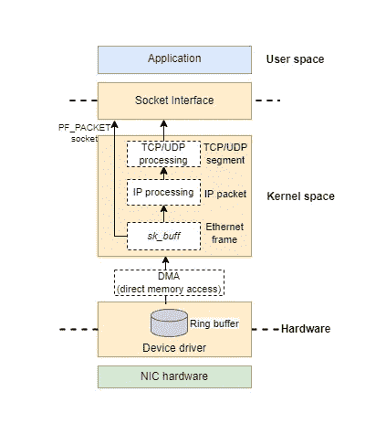
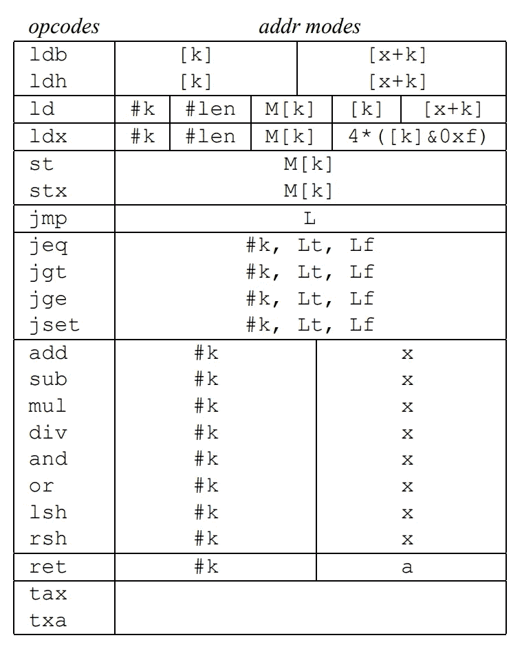
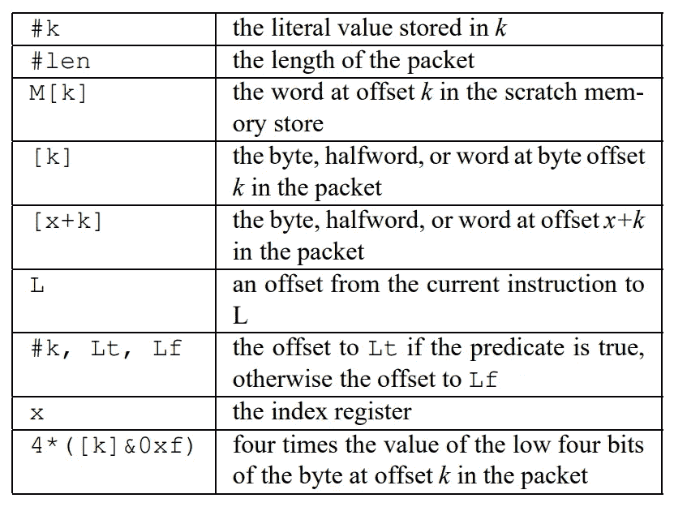
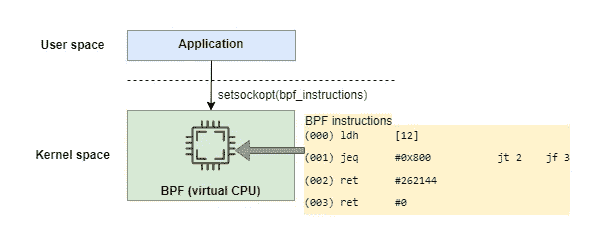

# 用原始套接字和 BPF 从头开始写一个 Linux 包嗅探器

> 原文：<https://levelup.gitconnected.com/write-a-linux-packet-sniffer-from-scratch-with-raw-socket-and-bpf-c53734b51850>

# 背景

当我们提到网络数据包嗅探器时，一些著名和流行的工具会出现在您的脑海中，如`tcpdump`。在我以前的文章中，我已经向您展示了如何用这样的工具捕获网络数据包。但是你有没有想过从头开始编写一个不依赖任何第三方库的包嗅探器？我们需要深入挖掘操作系统，找到构建这个工具所需的武器。听起来很复杂，对吧？在这篇文章中，让我们这样做。看完这篇文章，你会发现其实并没有你想象的那么难。

注意，不同的操作系统内核有不同的内部网络实现。本文将重点介绍`Linux`平台。

注意这篇文章最初发表在我的个人博客[这里](https://organicprogrammer.com/2022/03/28/how-to-implement-libpcap-on-linux-with-raw-socket-part2/)。谢谢

# 介绍

首先，我们需要回顾一下`tcpdump`是如何实现的。根据官方[文件](https://www.tcpdump.org/) , `tcpdump`是在`libpcap`库的基础上建造的，该库是基于 Berkeley 的卓越研究成果开发的，详细内容可以参考[本文](https://www.tcpdump.org/papers/bpf-usenix93.pdf)。

如您所知，不同的操作系统有不同的网络堆栈内部实现。`libpcap`涵盖了所有这些差异，并为用户级数据包捕获提供了独立于系统的接口。但是在这篇文章中，我想重点介绍 Linux 平台，那么`libpcap`在 Linux 系统上是如何工作的呢？根据一些[文档](https://stackoverflow.com/questions/21200009/capturing-performance-with-pcap-vs-raw-socket)，原来`libpcap`在一个网络接口上使用`PF_PACKET` socket 来抓取数据包。

那么接下来的问题就是:`PF_PACKET`插座是什么？

# PF _ 数据包套接字

在我之前的[文章](https://organicprogrammer.com/2021/07/31/how-to-implement-simple-http-server-golang/)中，我们提到了 socket 接口是 TCP/IP 对世界的窗口。在大多数包含 TCP/IP 的现代系统中，套接字接口是应用程序使用 TCP/IP 协议集的唯一方式。



PF _ 插座

这是正确的。这一次，让我们通过检查创建新套接字时执行的系统调用来更深入地了解`socket`:

当您想要使用上面的系统调用创建一个套接字时，您必须指定您想要使用哪个域(或协议族)作为该套接字的第一个参数。最常用的家族是`PF_INET`，用于基于 IPv4 协议的通信(创建 TCP 服务器时，使用这个家族)。此外，您必须为您的套接字指定一个类型作为第二个参数。可能的值取决于您指定的系列。例如，在处理`PF_INET`家族时，type 的值包括`SOCK_STREAM`(TCP)和`SOCK_DGRAM`(UDP)。有关 socket 系统调用的其他详细信息，可以参考 socket(3)手册页。

在手册页中，您可以为`domain`参数找到一个潜在的值，如下所示:

```
AF_PACKET    Low-level packet interface
```

**注** : `AF_PACKET`和`PF_PACKET`相同。历史上叫`PF_PACKET`，后来改名为`AF_PACKET`。`PF`表示协议族，`AF`表示地址族。在本文中，我使用`PF_PACKET`。

不同于`PF_INET` socket，可以给你 TCP 段。通过`PF_PACKET`套接字，您可以获得原始的`Ethernet`帧，它绕过了 TCP/IP 堆栈的通常上层处理。这听起来可能有点疯狂。但是，也就是说，收到的任何数据包都将直接传递给应用程序。

为了更好地理解`PF_PACKET` socket，让我们更深入地粗略检查一下从网络接口到应用层的接收包的路径。

(如上图所示)网卡(NIC)收到数据包时，由驱动程序处理。驱动程序在内部维护一个名为`ring buffer`的结构。并用直接内存访问(DMA)将数据包写入内核内存(内存预分配有环形缓冲区)。数据包被放在一个名为`**sk_buff**`的结构中(与内核网络子系统相关的最重要的结构之一)。

数据包进入内核空间后，逐层进行协议栈处理，如`IP processing`、`TCP/UDP processing`。数据包通过套接字接口进入应用程序。你已经非常了解这条熟悉的道路了。

但是对于`PF_PACKET`套接字，`sk_buff`中的数据包被克隆，然后它跳过协议栈，直接进入应用程序。内核需要克隆操作，因为一个副本由`PF_PACKET`套接字使用，另一个副本通过通常的协议栈。

在以后的文章中，我将演示更多关于 Linux 内核网络内部的内容。

下一步，让我们看看如何在代码级别创建一个`PF_PACKET`套接字。为了简洁，我省略了一些代码，只显示了必要的部分。详细可以参考这个 Github [回购](https://github.com/baoqger/raw-socket-packet-capture-/blob/master/raw_socket.c)。

请确保包含系统头文件:`<sys/socket.h> <sys/types.h>`

# 绑定到一个网络接口

如果没有额外的设置，嗅探器会捕获所有网络设备上收到的所有数据包。下一步，让我们尝试将嗅探器绑定到特定的网络设备。

首先，您可以使用`ifconfig`命令列出您机器上所有可用的`network interfaces`。网络接口是网络硬件的软件接口。

例如，下图显示了网络接口`eth0`的信息:

```
eth0: flags=4163<UP,BROADCAST,RUNNING,MULTICAST>  mtu 1500
        inet 192.168.230.49  netmask 255.255.240.0  broadcast 192.168.239.255
        inet6 fe80::215:5dff:fefb:e31f  prefixlen 64  scopeid 0x20<link>
        ether 00:15:5d:fb:e3:1f  txqueuelen 1000  (Ethernet)
        RX packets 260  bytes 87732 (87.7 KB)
        RX errors 0  dropped 0  overruns 0  frame 0
        TX packets 178  bytes 29393 (29.3 KB)
        TX errors 0  dropped 0 overruns 0  carrier 0  collisions 0
```

让我们将嗅探器绑定到`eth0`，如下所示:

我们通过调用`setsockopt`系统调用来实现。我把它的详细用法留给你。

现在，嗅探器只捕获在指定网卡上接收的网络数据包。

# 非混杂和混杂模式

默认情况下，每个网卡只关心自己的事情，只读取指向它的帧。意味着网卡丢弃所有不包含自己 MAC 地址的数据包，这种方式称为`non-promiscuous`模式。

接下来，让我们使嗅探器可以在`promiscuous`模式下工作。通过这种方式，它检索所有的数据包。即使不是发给它的主机的。

要将一个网络接口设置为混杂模式，我们所要做的就是向该接口上的一个开放套接字发出`ioctl()`系统调用。

`ioctl`代表 **I/O 控制**，它操纵特定文件的底层设备参数。`ioctl`需要三个参数:

*   第一个参数必须是打开的文件描述符。在我们的例子中，我们使用绑定到网络接口的套接字文件描述符。
*   第二个参数是设备相关的请求代码。你可以看到我们叫了两次`ioctl`。第一个调用使用请求代码*SIOC****G****if flags*来获取标志，第二个调用使用请求代码*SIOC****S****if flags*来设置标志。不要被这两个拼写相似的常量值所迷惑。
*   第三个参数用于向请求进程返回信息。

现在，嗅探器可以检索网卡上收到的所有数据包，而不管这些数据包发往哪台主机。

# BPF 包过滤

到目前为止，嗅探器捕获网卡上收到的所有网络数据包。但是像`tcpdump`这样强大的网络嗅探器应该提供包过滤功能。例如，嗅探器只能捕获`TCP`段(并跳过 UPD)，或者它只能捕获来自特定源 ip 地址的数据包。接下来，让我们继续探讨如何做到这一点。

## BPF 的背景

`Berkeley Packet Filter(BPF)`是类 Unix 操作系统中数据包捕获的基本底层技术。在网上以 BPF 为关键词搜索，结果非常混乱。原来`BPF`不断进化，还有`BPF``cBPF``eBPF``LSF`等几个关联概念。因此，让我们沿着时间线检查这些概念:

*   在 **1992** ，`BPF`首次被引入 BSD Unix 系统，用于过滤不需要的网络数据包。BPF 的提议来自劳伦斯柏克莱实验室的研究人员，他们也开发了`libpcap`和`tcpdump`。
*   在 **1997** 中，Linux Socket Filter(LSF)是基于 BPF 开发的，并在 Linux 内核版本 2.1.75 中引入。注意`LSF`和`BPF`有一些明显的不同，但是在 Linux 环境中，当我们谈到 BPF 或 LSF 时，我们指的是 Linux 内核中相同的包过滤机制。我们将在接下来的章节中研究 BPF 的详细理论和设计。
*   最初，BPF 被设计为网络数据包过滤器。但是在 **2013** 中，BPF 得到了广泛的扩展，它可以用于性能分析和故障排除等非联网目的。如今，加长版的 BPF 被称为`eBPF`，而原来已经过时的版本被更名为经典版的 BPF ( `cBPF`)。**注意，我们在本文中研究的是 cBPF，eBPF 不在本文的范围之内**。`eBPF`是当今软件世界最热门的技术，我将在以后谈到它。

# 把 BPF 放在哪里

要回答的第一个问题是我们应该在哪里放置过滤器。

这个问题的最佳解决方案是在路径中尽可能早地放置过滤器。因为将大量数据从内核空间复制到用户空间会产生巨大的开销，这会极大地影响系统性能。所以 BPF 是一个核心特性。当网络接口收到数据包时，应立即触发过滤器。正如最初的 BPF [论文](https://www.tcpdump.org/papers/bpf-usenix93.pdf)所说**为了最小化内存流量，这是大多数现代系统中的主要瓶颈，数据包应该被‘就地’(例如，网络接口 DMA 引擎放置它的地方)过滤，而不是在过滤之前被复制到一些其他内核缓冲区。**
让我们通过检查如下内核源代码来验证这种行为(**注**本文中展示的内核代码基于 2.6 版本，其中包含了`cBPF`实现。):

`packet_create`函数在应用程序调用`socket`系统调用时处理套接字创建。在第 11 行和第 14 行，它将钩子函数附加到套接字上。钩子函数在收到包时执行。

下面的代码块显示了钩子函数`packet_rcv`:

`packet_rcv`函数调用`run_filter`，这只是 BPF 逻辑部分(目前你可以把它看成一个黑盒。在下一节中，我们将研究细节)。基于`run_filter`的返回值，数据包可以被过滤掉或放入队列。

到目前为止，您可以理解 BPF(或包过滤)是在内核空间内工作的。但是数据包嗅探器是一个用户空间应用程序。下一个问题是如何将用户空间的过滤规则链接到内核空间的过滤处理程序。

要回答这个问题，我们必须了解 BPF 本身。现在是了解这部伟大作品的时候了。

# BPF 机器

正如我上面提到的，`BPF`是在伯克利的研究人员写的这篇原创[论文](https://www.tcpdump.org/papers/bpf-usenix93.pdf)中介绍的。我强烈推荐你根据我自己的经验阅读这篇伟大的论文。一开始，我觉得读它很疯狂，所以我读了其他相关的文献，试图了解 BPF。但是大多数文档只覆盖整个系统的一部分，因此很难将所有信息拼凑在一起。最后看了原纸，把各部分连在一起。**俗话说，有时候花时间其实是一条捷径。**

## 虚拟 CPU

包过滤器只是包的一个布尔值函数。如果函数值为真，则内核为应用程序复制数据包；如果为假，则忽略该数据包。

为了尽可能灵活，并且不将应用程序限制在一组预定义的条件下，`BPF`实际上被实现为一个运行用户自定义程序的`register-based virtual machine`(关于基于堆栈和基于寄存器的虚拟机的区别，可以参考[这篇文章](http://troubles.md/wasm-is-not-a-stack-machine/))。

你可以把`BPF`看作是`virtual CPU`。它由一个`accumulator`、一个`index register(x)`、一个暂存存储器和一个隐式`program counter`组成。如果你不熟悉这些概念，我补充一些简单的例子如下:

*   `accumulator`是一种包含在 CPU 中的寄存器。在数学和逻辑计算中，它充当保存中间值的临时存储位置。例如，在“1+2+3”的运算中，累加器将保存值 1，然后是值 3，然后是值 6。累加器的好处是它不需要被显式引用。
*   计算机 CPU 中的`index register`是一个处理器寄存器或分配的内存位置，用于在程序运行期间修改操作数地址。
*   `program counter`是计算机处理器中的 CPU 寄存器，它具有下一条要从存储器中执行的指令的地址。

在 BPF 机器中，累加器用于算术运算，而变址寄存器向包或暂存区提供偏移量。

## 指令集和寻址模式

与物理 CPU 相同，`BPF`提供了一小组算术、逻辑和跳转指令，如下所示，这些指令运行在 BPF 虚拟机(或 CPU)上:



指令组

第一列*操作码*列出了以汇编语言风格编写的 BPF 指令。例如 **ld** 、 **ldh** 和 **ldb** 表示将指示值复制到`accumulator`中。 **ldx** 表示将指示值复制到`index register`中。 **jeq** 表示如果`accumulator`等于指示值，跳转到目标指令。 **ret** 表示返回指示值。你可以在论文中详细检查指令集的功能。

这种类似汇编的风格对人类来说可读性更强。但是当我们开发一个应用程序时(比如本文中写的嗅探器)，我们直接使用二进制代码作为 BPF 指令。这种二进制格式被称为`BPF Bytecode`。稍后我将研究将这种汇编语言转换成字节码的方法。

第二列*地址模式*列出了每条指令允许的寻址模式。下表列出了寻址模式的语义:



地址模式

例如，**【k】**表示数据包中字节偏移量为 k 的数据。 **#k** 表示 k 中存储的文字值，可以详细阅读论文查看其他寻址方式的含义。

## BPF 计划示例

现在让我们根据上面的知识来试着理解下面这个 BPF 小程序:

BPF 程序由一系列 BPF 指令组成。例如，上面的 BPF 程序包含四条指令。

第一条指令 **ldh** 从以太网数据包中的偏移量 12 处将一个半字(16 位)值载入累加器。根据下图所示的以太网帧格式，该值就是`Ethernet type`字段。以太网类型用于指示哪种协议封装在帧的有效载荷中(例如，ARP 的 0x0806、**IP v4 的 0x0800** 和 IPv6 的 0x86DD)。


以太网帧

第二条指令 **jeq** 比较累加器(当前存储`Ethernet type`字段)和`0x800`(代表 IPv4)。如果比较失败，则返回零，数据包被拒绝。如果成功，将返回一个非零值，并接受数据包。**所以小 BPF 程序过滤并接受所有 IP 包**。你可以在原文中找到其他 BPF 计划。去读一读吧，你可以感受到 BPF 的灵活性以及设计之美。

## BPF 的内核实现

接下来，让我们看看内核是如何实现 BPF 的。如上所述，钩子函数`packet_rcv`调用`run_filter`来处理过滤逻辑。`run_filter`定义如下:

你可以发现真正的过滤逻辑在`sk_run_filter`里面:

和我们提到的一样，`sk_run_filter`只是一个包的布尔值函数。它维护累加器、变址寄存器等。作为局部变量。并且在`for`循环中处理 BPF 滤波器指令阵列。每条指令都将更新局部变量的值。这样，它就模拟了一个虚拟 CPU。很有趣，对吧？

## BPF JIT

由于每个网络数据包都必须经过过滤功能，这就成为了整个系统的性能瓶颈。

在 **2011** 内核中引入了一个`just-in-time (JIT)`编译器来加速 BPF 字节码的执行。

*   什么是`JIT`编译器？一个`JIT`编译器在程序启动后运行**，将代码(通常是字节码或某种类型的 VM 指令)动态(或及时)编译成一种通常更快的形式，通常是主机 CPU 的本机指令集。这与在**程序首次运行之前将所有代码编译成机器语言**的`traditional compiler`形成对比。**

在`BPF`案例中，`JIT`编译器将 BPF 字节码直接翻译成主机系统的汇编代码，这可以极大地优化性能。我不会在本文中展示关于 JIT 的细节。可以参考[内核代码](https://elixir.bootlin.com/linux/v3.19.8/source/arch/arm/net/bpf_jit_32.c#L868)。

# 把 BPF 放进嗅探器

接下来，让我们将 BPF 添加到我们的数据包嗅探器。正如我们上面在应用级提到的，BPF 指令应该使用字节码格式，数据结构如下:

我们如何将 BPF 汇编语言转换成字节码？有两种解决方案。首先，有一个叫做`bpf_asm`的小助手工具(随 Linux 内核一起提供)，你可以把它看作是 BPF 汇编语言解释器。但不推荐给应用开发者。

其次，我们可以使用`tcpdump`，它提供了转换功能。您可以从 tcpdump 手册页中找到以下信息:

*   -d:以人类可读的形式将编译后的数据包匹配代码转储到标准输出并停止。
*   -dd:将数据包匹配代码作为 C 程序片段转储。
*   -ddd:将数据包匹配代码作为十进制数转储(前面有一个计数)。

`tcpdump ip`意味着我们要捕获所有的 IP 数据包。使用选项 **-d** 、 **-dd** 和 **-ddd** ，输出如下:

选项 **-d** 用汇编语言打印 BPF 指令(与上面所示的 BPF 程序示例相同)。选项 **-dd** 将字节码打印为 C 程序片段。**所以当你想获得 BPF 字节码**时，tcpdump 是最方便的工具。

BPF 过滤器字节码(包装在结构`sock_fprog`中)可以通过`setsockopt`系统调用传递给内核，如下所示:

`setsockopt`系统调用触发两个内核函数:`sock_setsockopt`和`sk_attach_filter`(这两个函数的细节我就不展示了)，这两个函数的**将过滤器绑定到套接字**。并且在`run_filter`内核函数中(如上所述)，它可以**从 socket** 中获取过滤器，**对数据包**执行过滤器。

到目前为止，每一块都是连在一起的。BPF 之谜被解开了。`BPF`机器允许用户空间应用程序将定制的 BPF 程序直接注入内核。一旦加载和验证，BPF 程序在内核环境中执行。这些 BPF 程序在内核内存空间中运行，可以访问所有可用的内核内部状态。比如使用网络包数据的`cBPF`机。但是这种能力可以扩展为`eBPF`，可以用于许多其他不同的应用。正如有人说的那样，eBPF 对内核的作用就像 Javascript 对网站的作用一样:它允许创建各种各样的新应用程序。将来，我打算深入研究 eBPF。



# 处理数据包

在上一节中，我们检查了内核级的`BPF`过滤理论。但是对于我们小小的嗅探器，我们需要做的最后一步是处理网络数据包。

*   首先，`recvfrom`系统调用从套接字读取包。我们将系统调用放在一个`while`循环中，以继续读取传入的包。
*   然后，我们打印数据包中的源和目的地`MAC`地址(我们得到的数据包是第 2 层的原始以太网帧，对吗？).如果这个以太网帧包含的是一个`IP4`包，那么我们打印出源地址和目的地`IP`地址。要了解更多，可以研究一下各种网络协议的头格式。这里我就不赘述了。

# 摘要

本文研究了什么是`PF_PACKET` socket，它是如何工作的，以及为什么应用程序可以获得原始的以太网数据包。此外，我们讨论了如何将嗅探器绑定到一个特定的网络接口，以及如何使嗅探器工作在混杂模式下。此外，我们检查如何添加过滤器到我们的嗅探器。首先，我们分析为什么过滤器应该运行在内核空间而不是应用程序空间。然后，在论文的基础上详细讨论了`BPF`机的设计与实现。我们回顾了内核源代码，以理解如何实现`BPF`虚拟机。我上面提到过，原来的`BPF` ( `cBPF`)扩展到现在的`eBPF`。但是对 BPF 虚拟机的了解对`eBPF`也很有帮助。