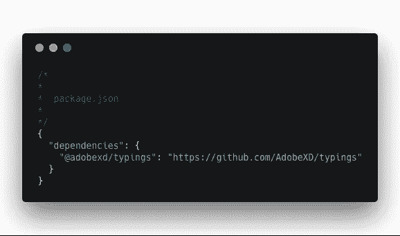
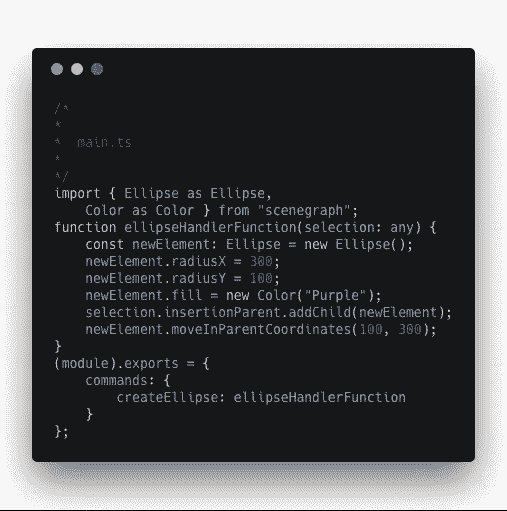
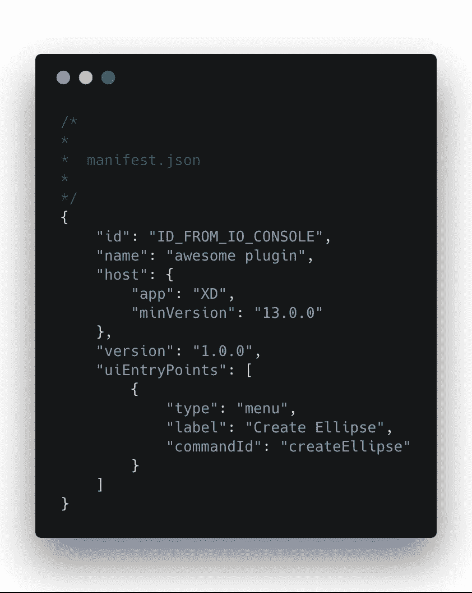
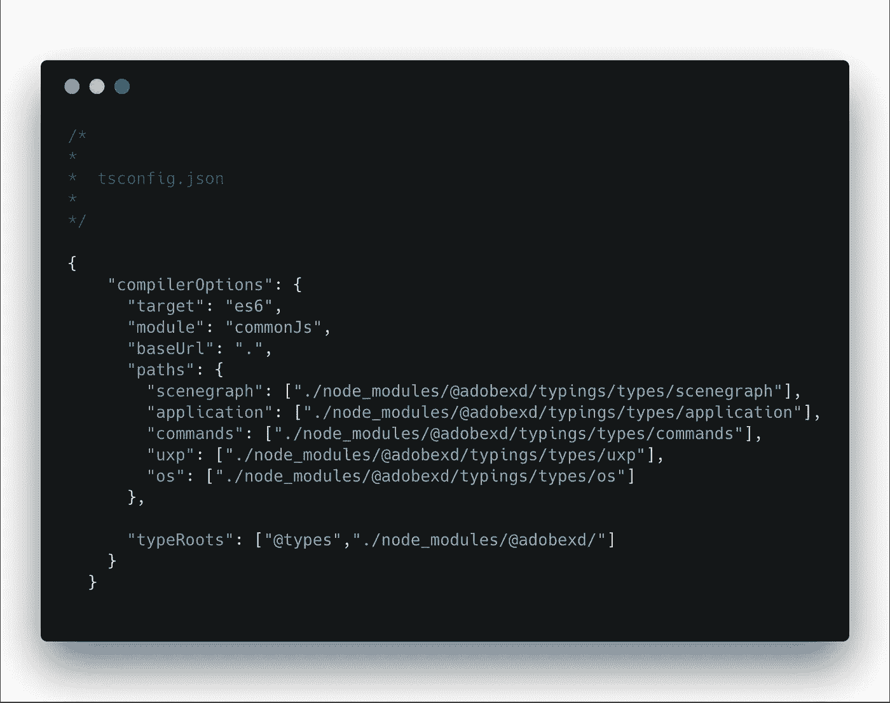
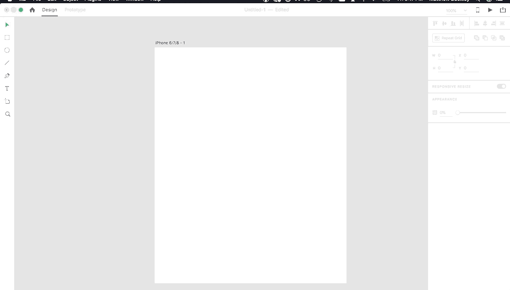

# 使用 TypeScript 编写 Adobe XD 插件

> 原文：<https://levelup.gitconnected.com/write-adobe-xd-plugins-using-typescript-40457b16cbc0>

*喜欢这个帖子？你可能会喜欢*[***BentoBlox***](http://www.bentoblox.com/)**太——在*[***App Store***](https://itunes.apple.com/us/app/bentoblox/id1361865513?ls=1&mt=8)*上查看这里的游戏。**

*[Adobe XD](https://www.adobe.com/products/xd.html) 是一个桌面应用程序，移动/web 设计人员使用它来构建应用程序和网站的线框和原型(如果你熟悉 [Sketch](https://www.sketchapp.com/) ，它提供了一个类似的用例)。*

*作为开发人员，你可以编写第三方插件在`XD`中使用，但是有一个警告:你将使用 JavaScript。如果你和我一样，并且多年来一直享受着健壮类型系统的好处，那么在没有健壮类型系统的情况下编写软件的前景将会是一个障碍。*

*谢天谢地，还有`TypeScript`。*

*`TypeScript`听起来就是:键入的 Javascript。它支持 JavaScript 的标准类型(`string`、`number`等)，以及您可能决定编写的任何自定义类型。*

*开发人员可以用自己的类型扩展基本类型系统，这一点至关重要。有了它，类型系统可以扩展到包含`Adobe XD` API 特有的类型(`Point`、`Matrix`、`Rectangle`等)。*

* [## 学习 TypeScript -最佳 TypeScript 教程(2018) | gitconnected

### 前 18 名打字稿教程。课程由开发者提交并投票，使您能够找到最好的…

gitconnected.com](https://gitconnected.com/learn/typescript) 

在这篇文章中，我将介绍使用`TypeScript`构建一个超级简单的`XD`插件的过程。

> *在继续之前，浏览一下* [*Adobe 的快速入门教程*](https://adobexdplatform.com/plugin-docs/tutorials/quick-start/) *，这样你就有了一个可以开始工作的 javascript 项目。最后，您应该有一个类似于* [*这个*](https://gitlab.com/mattthousand/adobexdstarter) *的项目(*还要确保将* `*manifest.json*` *中的* `*id*` *值替换为来自* `*Adobe I/O Console*` *的唯一插件 ID)。*

浏览完快速入门教程后，你应该有一个包含两个文件的项目:`main.js`和`manifest.json`。在同一个目录下，创建一个`main.ts`文件。这是你放置`TypeScript`代码的地方。

但是在你开始写代码之前，你需要定义`Adobe XD`的类型，这样你才能使用它们。幸运的是， [Pablo](https://github.com/pklaschka) 已经为`XD`编写了类型，您可以通过在您的根目录下创建一个`package.json`文件并添加他的 repo 作为依赖项来下拉它们:

只需从命令行运行`npm install`来下拉类型。

现在你可以开始写插件了。下面是一个简单的`TypeScript`程序，它导入了几个`Adobe`类型并绘制了一个紫色椭圆:

指定类型(`const newElement: Ellipse = new Ellipse()`)允许您充分利用编译器，并在编译时发现与类型相关的错误。例如，指定`const newElement: Ellipse = New Color()`将导致您的代码无法编译——并让您免于在运行时发现错误的噩梦。

你需要的下一件事是让`Adobe XD`访问你的代码。

转到根目录中的`manifest.json`文件。这个文件包含关于你的插件的基本元数据，包括应该在`XD`中向用户公开的任何命令的名称。将您的`createEllipse`命令添加到`uiEntryPoints`集合:

在编译`TypeScript`程序和运行插件之前，你需要做的最后一步是创建一个`tsconfig.json`文件。该文件指定包含您的类型定义和您可能选择的任何编译器选项的源代码:

现在你可以编译你的`TypeScript`代码了。从命令行，导航到插件的根目录，用`tsc`调用编译器。完成后，您的`main.js`文件现在将包含从您在`main.ts`中编写的代码编译而来的 javascript。

现在你终于可以运行你的插件了。打开`Adobe XD`，导航到`Plugins`，点击`Create Ellipse`。

维奥拉。这是所有的乡亲。点击查看已完成的插件[，并对`AdobeXD`的`TypeScript`进行评论。](https://gitlab.com/mattthousand/adobexdstarter)

*喜欢这个帖子？你可能也喜欢*[***BentoBlox***](http://www.bentoblox.com/)**——在*[***App Store***](https://itunes.apple.com/us/app/bentoblox/id1361865513?ls=1&mt=8)*上查看这里的游戏。*** ****