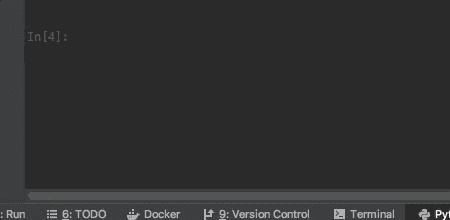
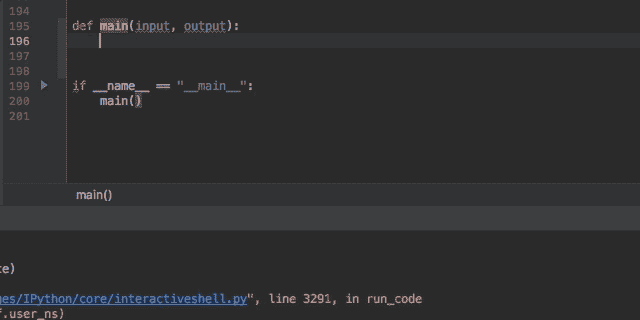

# 现在就编写更好的 Python 代码

> 原文：<https://levelup.gitconnected.com/write-better-python-code-today-3c7566a695e2>


Artem Sapegin 在 [Unsplash](https://unsplash.com?utm_source=medium&utm_medium=referral) 上拍摄的照片

Python 最大的属性之一是可读性。所以，当你打开另一个程序员的代码，却不知道她想完成什么时，通常是很痛苦的。

作为开发人员，我们经常用蛮力正面解决一个新问题，操纵我们的代码直到它工作为止。我们欣喜地看着我们的终端、浏览器或应用程序，因为它们正在做我们为它们设定的事情。

然后，我们看看我们制造的代码混乱——是时候重构了。

在进行过程中处理代码的结构和可读性不是更好吗？这里有几个简单的步骤，让你今天就开始清理你的 Python 代码。只在您的一个脚本上尝试一下，您会在可读性、可维护性和可测试性方面看到立竿见影的效果。下一次你接受新任务时，试着执行这些策略。这将使编码变得更加有趣。

# 设置文本编辑器，将代码格式化为 PEP8

在 Python 中清理代码的第一步是根据 **PEP8** 格式化你的代码。虽然值得一读 [PEP8 规范](https://www.python.org/dev/peps/pep-0008/)，但你肯定不会编辑现有代码的每一行来格式化成 PEP8。那会花去你永远的时间，也许会让你哭泣。

幸运的是，有**工具可以帮助 PEP8 格式化**。一些常用的用于自动套用格式到 PEP8 的 Python 包有 [autopep8](https://github.com/hhatto/autopep8) 、 [black](https://github.com/psf/black) 和 [yapf](https://github.com/google/yapf) 。

您甚至可以使用这些包来设置在您选择的文本编辑器中保存 Python 文件时的自动套用格式。这里列出了一些常见的文本编辑器，以及如何设置自动套用格式的链接。

*   [PyCharm](https://black.readthedocs.io/en/stable/editor_integration.html) (使用黑色，但是您可以对任何代码格式化工具这样做)
*   [VS 代码](https://code.visualstudio.com/docs/python/editing#_formatting)
*   [Spyder](https://github.com/spyder-ide/spyder-autopep8)
*   [原子](http://shanky.org/2017/01/11/atom-editor-for-python/)
*   [Jupyter 笔记本](https://medium.com/openplanetary/code-formatting-in-jupyter-cells-8fee4eda072f)
*   [崇高的文字](https://github.com/MichaelMartinez/Sublime/tree/master/Packages/Python%20PEP8%20Autoformat)

我使用 PyCharm，它默认为 Python 的 PEP8 编码风格，并将在您的编辑器中突出显示违规情况，并提供如何修复它们的工具提示。这个方法是学习 PEP8 的好方法。您也可以运行“代码”>“重新格式化代码”工具来为您重新格式化。在 PyCharm 中，您可以使用文件监视器特性在保存时自动运行格式化。

如果您使用终端和 vim 之类的文本编辑器，您可以在命令行上运行上述任何 python 包，并为它们提供需要格式化的 Python 代码的文件路径。

# 使用 f 字符串来格式化您的字符串

Python 3.6 给[语言带来了许多令人兴奋的新特性](https://docs.python.org/3/whatsnew/3.6.html)，但我最喜欢的是 f 字符串。F-strings 提供了一种简洁、易读的方式来格式化字符串,它允许将变量内嵌在括号内的字符串中。

下面是一个使用%s 格式化字符串的老方法的例子，当使用这种方法时，随着变量数量的增加，代码变得可读性更差。

```
>>> first = "Sam"
>>> last = "Miller"
>>> middle "Douglas">>> "You are a fantastic programmer, %s %s %s." % (first, middle, last)
'You are a fantastic programmer, Sam Douglas Miller.'
```

过去实现这一点的另一种方法是使用 String 类的 str.format()方法。str.format()会产生相同的结果，但是具有相同的可读性问题。

```
>>> "You are a fantastic programmer, {} {} {}.".format(first, middle, last)
'You are a fantastic programmer, Sam Douglas Miller.'
```

现在尝试使用 **f 弦**:

```
>>> f"You are a fantastic programmer, {first} {middle} {last}"
You are a fantastic programmer, Sam Douglas Miller.
```

在字符串前加上“f ”, Python 会将大括号中的任何术语识别为变量。确保在创建 f 字符串之前定义了变量，否则 Python 会抛出错误。使用 f 字符串可以让你的代码可读性更好。

# 你的函数应该做一件事

我们都见过那些长达数百行代码的函数。像这样写代码的程序员(我一直为此感到内疚)试图通过给每一节添加注释来使他们的代码更具可读性，并计划以后进行重构。他们现在可以通过为每个任务创建一个函数或类方法来使他们的代码更易于管理。

将你的代码分解成单独的任务，让**做一件事情**，并为每个任务编写一个单独的函数。使每个函数名成为一个**可读的字**(见下一节)。这样，你和未来的程序员可以像读书一样通读你的代码。

更不用说，有了更多的函数，您可以使用文本编辑器*导航到*功能来优雅地在代码中移动。创建只做一件事的函数也使你的代码更易测试。尝试为你的 400 行函数编写一个单元测试，我向你保证，你最终会把你的代码分解成多个函数。不用担心创建更多函数的开销；可以忽略不计。

改变这一点:

```
def print_page(banner_text, banner_images, content, footer_text):
    # Print banner
    print("")
    print("Title:")
    print(banner_text)
    print("")

    # Do some image processing
    for images in banner_images:
        compress(banner_images)
        height, width = banner_images["size"]
        new_image = size(height, width)

    # Print banner image
    render(new_image)# Print content
print("")
print("")
print(content)

# Print footer
footer_length = len(footer_text)
for i in range(0, footer_length):
    print("---------")
print(footer_text)

and so on.....
```

对此:

```
def print_page(banner_text, banner_images, content, footer_text):
    print_banner(banner_text)
    render_images(banner_images)
    print_content(content)
    print_footer(footer_text)
```

[大多数](https://www.jetbrains.com/help/pycharm/extract-method.html) [现代](https://code.visualstudio.com/docs/editor/refactoring#_extract-method) [正文](https://sublimerope.readthedocs.io/en/latest/refactoring.html) [编者](https://github.com/python-rope/rope)有一个重构>提取>方法的功能，让你不费吹灰之力就能把一段代码重构成一个函数或方法。

# 停止缩写你的变量名

这个规则适用于任何编程语言，每种语言都让我抓狂。在变量名中缩写单词，虽然它的意思对你来说很明显，但对下一个试图破译你的代码的程序员来说并不总是显而易见的。让我们去掉解密这一步。空间便宜，屏幕空间也便宜。用完整的单词和短语写出你的变量和类名。

改变这一点:

```
cdte = datetime.date.today()
```

对此:

```
current_date = datetime.date.today()
```

改变这一点:

```
class maapic:
  ...
```

对此:

```
class MyAwesomeApiClient:
  ...
```

改这个(？):

```
my_d_anal = (x + y + z) * t
```

对此:

```
my_data_analysis = (some + meaningful + names) * time
```

通读你现在正在写的东西，用完整的单词代替缩写的名字。说真的，输入整个单词。你的同事(和你未来的自己)会感谢你的。

# 使用列表理解

在大多数编程语言中，当我们需要对列表中的每个元素运行一些代码时，我们使用 for 循环。如果语言支持并行编程，我们使用 map、reduce 和 filter 函数。

如果您需要按顺序处理一系列项目，For 循环非常有用。如果你没有，并且你有不止一个 CPU，你应该使用 Python 的列表理解。

如果您需要对列表中的每一项应用一些代码(就像您对 map 函数所做的那样)，那么列表理解是非常有用的。

更改此代码:

```
new_list = []
for item in items:
   new_list.extend(item * 2)
```

对此:

```
new_list = [item * 2 for item in items]
```

要分解这个，从最后开始。短语“for item in items”是这行代码中的“循环”。向后移动，“item * 2”应用于列表中的每个项目。最后，[]告诉 Python 返回一个包含计算项目的列表。

如果列表中的每一项都有一组更复杂的指令，可以创建一个函数。

```
def process(item):
   item = item * 2
   item = item / 5
   item = item + 12
   return item# Done with the map function
new_list = map(process, items)# With a list comprehension, better readability!
new_list = [process(item) for item in items]
```

您还可以使用列表理解来过滤项目列表。这里，我们在末尾添加了一个 if 子句，说明只有大于 5 的项目才从列表中选择。

```
filtered = [item for item in items if item > 5]
```

你也可以结合这两种技术。不过，小心点。如果你在理解中加入太多的从句，它可能很快变得不可读。如果发生这种情况，创建一个助手函数(见下一节)。

```
final_list = [process(item) for item in items if item > 5]
```

# 创建助手功能

这条规则也可以被命名为“不要自作聪明”当你的理解列表或任何一段代码变得过于复杂和不可读时(即使是你自己)，不管你认为它有多聪明，它对下一个阅读它的程序员来说是没有意义的。在这种情况下，立即使它成为一个新的具有可读名称的 helper 函数或类方法。

更改此代码:

```
final_items = [process(item) for subitems in items 
                            for subitems2 in subitems
                            for item in subitems2
                            if item == "correct"]
```

对此(在这种情况下，当列表理解过于复杂时，循环是有意义的):

```
def select_correct_items(items):
    correct = []
    for subitems in items:
        for subitems2 in subitems:
            correct = [item in subitems2 if item == "correct"]
    return correct# this is readable
final_items = select_correct_items(items)
```

倾向于为常用和复杂的代码创建助手函数。

# 添加文档字符串

当所有其他方法都失败，并且您的代码可能太复杂而无法简化时，请确保您的文档字符串是最新的。用于函数的格式良好的 Python docstring 如下所示。

```
**def** some_func(myParam1, myParam2):
    """
    This is where you add what your function does
    **@param myParam1: (int) An integer for input
    @param myParam2: (int) An integer for input
    @return: (str) A string meesage
    """**
```

文档字符串允许代码的用户使用内置的 Python 帮助工具来发现您的函数文档。



在 PyCharm 中，您可以通过键入三个引号并按 enter 键，轻松地将文档字符串添加到所有模块、类、函数和类方法中。这个简单的步骤会自动创建 docstring 模板，供您在 Pycharm 中填写。其他文本编辑器有插件，用于从函数和方法签名中添加 docstring 模板。



仅此而已！今天就在您的代码中尝试这些技术。用 Python 代码编写干净代码的其他方法有哪些？