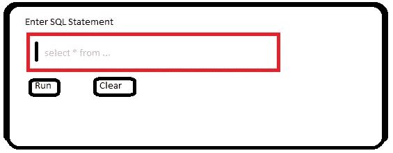
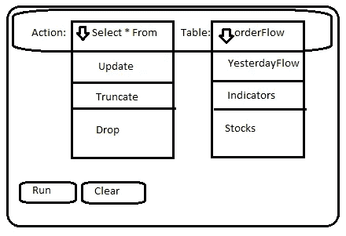
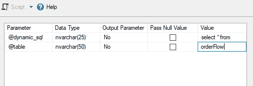
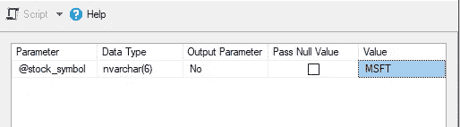
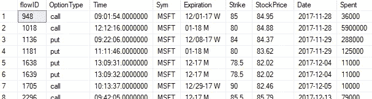

# 在 5 分钟内编写更好的 SQL—动态 SQL 简介

> 原文：<https://levelup.gitconnected.com/write-better-sql-in-5-minutes-introduction-to-dynamic-sql-3320d1eeaff6>

## 通过 3 个简单的步骤学习动态 SQL


在 [Unsplash](https://unsplash.com?utm_source=medium&utm_medium=referral) 上由[S O C I A L C U T](https://unsplash.com/@socialcut?utm_source=medium&utm_medium=referral)拍摄

# 动态什么？

当我在 2014 年左右开始接触[结构化查询语言(SQL)](https://www.w3schools.com/sql/default.asp) 的时候，我记得我在互联网上搜寻例子。我会看到有人说“这使用了动态 SQL”或者“这个脚本是动态的”虽然我看到了例子，但我并不真正理解使它“动态”的组件，因为我是新的。随着我在这个领域获得更多的经验，我不仅学会了构成动态 SQL 的三个组件，还学会了如何将它应用到各种用例中。这个简短的介绍旨在帮助 SQL 初学者或任何人更好地理解动态 SQL 的组件。

# 示例数据

如果感兴趣的话，我正在使用 Kaggle 上的期权市场交易数据。

[](https://www.kaggle.com/bendgame/options-market-trades) [## 期权市场交易

### 2017-2019 年 60k+期权交易样本

www.kaggle.com](https://www.kaggle.com/bendgame/options-market-trades) 

# 什么是动态 SQL？

尽管它的应用可能会变得复杂，但动态 SQL 的定义实际上很简单:

**动态 SQL** 是运行时构建的 SQL 语句。

这允许您构建一个通用查询，并通过使用变量构建您需要动态执行的语句。我将在下面解构这个超级基本动态 SQL 的例子:

```
DECLARE @dynamic_sql NVARCHAR(max)select @dynamic_sql = 'select * from orderFlow'EXEC(@dynamic_sql)
```

与**动态 SQL** 相对的是 ***静态 SQL*** ，它是一条在运行时不会改变的 SQL 语句。例如:

```
SELECT * FROM orderFlow
```

注意到区别了吗？静态 SQL 既不使用 execute 命令运行，也不使用变量构建。

# 编写动态 SQL 的三个步骤

如果您想编写动态 SQL，请记住三个组件:

1.  **声明变量**
    考虑使用变量作为 SQL 语句的构建块。在示例中，我声明了一个名为 **dynamic_sql** 的变量，并将其数据类型设为*。我用 ***max*** 给我最大的空间来输入一条 SQL 语句。*

```
*DECLARE @dynamic_sql NVARCHAR(max)*
```

*2.**构造 sql 字符串**
事实上，您可以向变量 **dynamic_sql** 中输入任何您想要的 SQL，这是使这个示例成为动态 SQL 的部分原因！因为我想返回表 *orderFlow* 中的所有结果，所以我将变量设置为一个简单的 select 语句，该语句可以正确执行。*

```
*select @dynamic_sql = 'select * from orderFlow '*
```

*3.**执行 SQL 语句** 需要执行第二步构建的语句。 **EXEC** 命令通常用于运行存储过程，但也可以运行任何存储为字符串的合法 SQL 语句，比如存储在变量 **dynamic_sql 中的语句。***

```
*EXEC(@dynamic_sql)*
```

*想象一下，使用一个用户界面，该界面有一个文本字段，允许用户输入原始 SQL 语句，然后当用户单击 run 时执行该语句。我在商业智能产品中使用过类似的功能！现在您已经了解了一些动态 SQL，很容易想象它在幕后是如何工作的。*

**

*想象的用户界面*

> *恭喜你！现在，您已经了解了动态 SQL 的 3 个组成部分！*

# *用例*

*很容易想到一个用例来帮助探索更多的例子:*

*假设您正在创建一个允许用户与数据交互的用户界面，但是您没有让他们编写纯 SQL，而是让他们使用两个下拉列表构造一个语句:*

**

*虚拟用户界面 2*

*在后台，使用存储过程和动态 SQL 来执行在 UI 中构造的 SQL 语句:*

```
*--Creating a Stored Procedure
**CREATE PROCEDURE** sp_example  --a variable for each drop list
@drop_list_1 NVARCHAR(25) = Null,
@drop_list_2 NVARCHAR(50) = Null**AS**--since the user selects the values, no select statement is needed
--just combine the variables!**EXEC**(@drop_list_1 + ' ' + @drop_list_2)*
```

*注意，存储过程使用用户输入来填充这两个变量。由于在用户界面模型中已经定义了变量，所以存储过程只需要构造字符串并执行语句。我添加了一个空格，这样用户在执行过程时就不需要记住输入一个空格。例如:*

**

*在 Microsoft SQL Server Management studio 中运行存储过程*

## *用例 2:*

*假设您想使用一个存储过程来查询特定股票代码的 *orderFlow* 表:*

```
*CREATE PROCEDURE sp_example2 

@stock_symbol NVARCHAR(6) = NullAS
SELECT * FROM orderFlow where sym = @stock_symbol*
```

*请注意，在用例 2 的 **WHERE** 子句中使用了该变量。这样，我可以输入股票代码并获得结果，而不必一遍又一遍地使用静态查询。*

**

*在 Microsoft SQL Server Management studio 中运行存储过程*

**

*sp_example2 的结果*

# *动态的缺点*

*使用动态 SQL 会有一些缺点。它很容易受到 SQL 注入的攻击，成为潜在的安全隐患。当您要求用户输入时，通常会发生 SQL 注入，用户输入的不是用户名之类的预期输入，而是将在数据库上运行的 SQL 语句，从而导致意外情况发生。SQL 注入会导致严重的问题，是一种常见的黑客技术。*

*性能可能是另一个潜在的问题，因为执行计划不能被缓存。解决这个问题的一个方法是使用存储过程和 **sp_executesql** 命令(至少在 Microsoft sql server 中是*)。动态 SQL 语句会很快变得复杂，并且很难调试，这让新手望而生畏。**

# *最后的想法*

*尽管一开始看起来有些棘手或乏味，但动态 SQL 是一种强大的技术，因为它允许您在运行时构造和执行 SQL 语句。动态 SQL 由三个组件组成:*

1.  ***声明变量***
2.  ***构造 SQL 字符串***
3.  ***执行 SQL***

*可能会有一些负面影响，如使代码更难调试，但它给用户带来的灵活性可以超过顾虑，特别是在适当实现时。*

*如果你有兴趣学习更多关于 SQL 或数据科学的知识，请查看我的其他教程:*

*[](https://towardsdatascience.com/create-a-free-linux-virtual-machine-on-your-computer-for-data-science-projects-using-virtualbox-c862ffa7eec) [## 使用 VirtualBox 在您的计算机上为数据科学项目创建一个免费的 Linux 虚拟机…

### 跳过云，使用自己的硬件。使用 Ubuntu 和 Oracle VirtualBox 轻松免费地设置虚拟机

towardsdatascience.com](https://towardsdatascience.com/create-a-free-linux-virtual-machine-on-your-computer-for-data-science-projects-using-virtualbox-c862ffa7eec) 

# 谢谢大家！

*   *如果你喜欢这个，* [*关注我的 Medium*](https://medium.com/@erickleppen) *了解更多*
*   [*通过订阅*](https://erickleppen.medium.com/membership) 获得完全访问权限并帮助支持我的内容
*   *我们连线上*[*LinkedIn*](https://www.linkedin.com/in/erickleppen01/)
*   *用 Python 分析数据？查看我的* [*网站*](https://pythondashboards.com/)

[**—埃里克·克莱本**](http://pythondashboards.com/)*