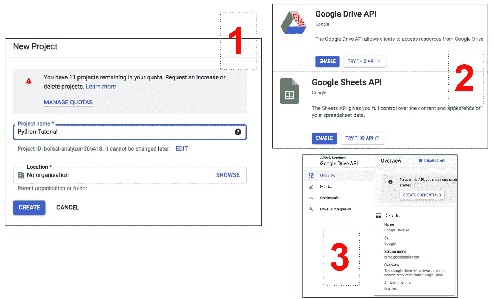
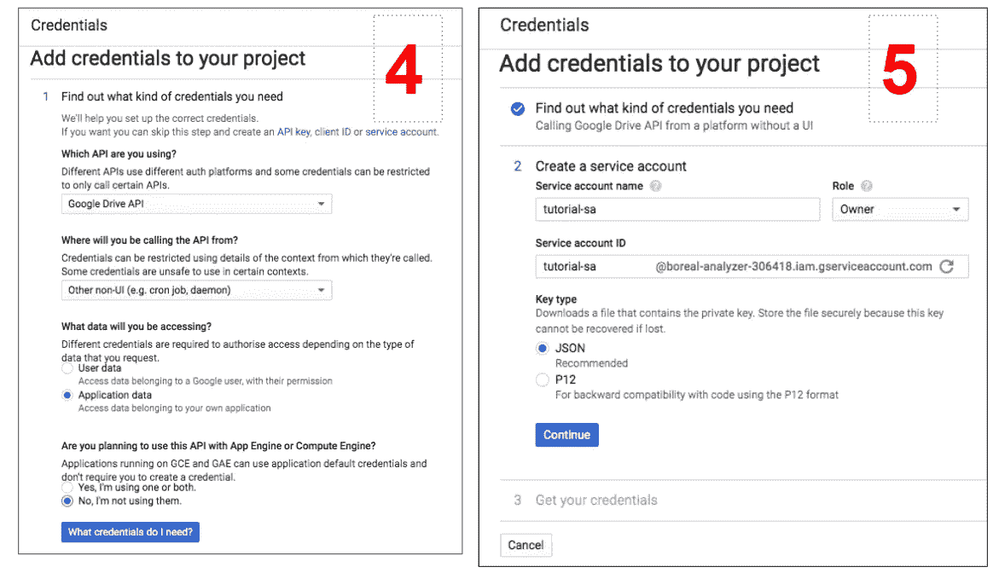
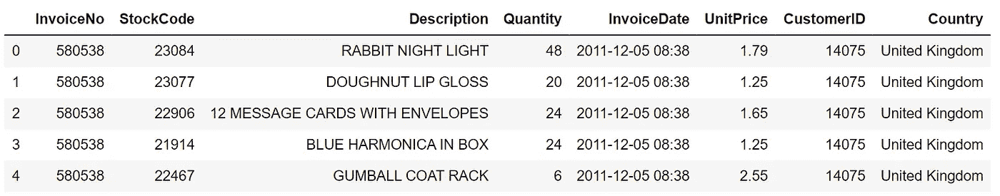

# 如何使用 Python 将 GSheets 中的数据写入数据库

> 原文：<https://levelup.gitconnected.com/write-datasets-from-g-sheet-to-your-database-with-python-bd2c2643f958>

## 在本教程中，学习如何用几行代码构建一个简单的 ETL 来跨系统移动 Google 电子表格数据。


格伦·卡斯滕斯-彼得斯在 [Unsplash](https://unsplash.com?utm_source=medium&utm_medium=referral) 拍摄的照片

*想象一下:*您正在收集数据源以构建新的报告，并意识到一些数据集仍然由您的利益相关者手动更新并存储在 Google 电子表格中…听起来很熟悉吧？

在这种情况下，您有两个选择:要么开办一个速成班来教您的技术水平较低的同事使用 SQL 和数据仓库，要么您自己用 Python 来自动化这个过程。

在本教程中，您将学习如何通过连接到 **Google Drive API** 使用 Python 从 Google 电子表格中提取数据集，然后使用`SQLAlchemy`包将它们存储到数据库表中。

> 通过一步一步地遵循教程，您将能够用很少的代码在很短的时间内自动完成另一个乏味的任务。我们开始吧！

[](https://towardsdatascience.com/10-csvkit-commands-data-engineers-must-know-a91b34e182e8) [## 数据工程师必须知道的 10 个 Csvkit 命令

### 在本教程中，学习如何使用 csvkit 和 psql 来分析、转换和移动数据跨系统的命令…

towardsdatascience.com](https://towardsdatascience.com/10-csvkit-commands-data-engineers-must-know-a91b34e182e8) 

# 与 Google Drive API 交互

为了在不使用 UI 的情况下从 Google 电子表格中提取数据，您需要通过 Python 调用 Google Drive API。

有许多方法可以实现这一点，但下面描述的步骤很可能需要较少的时间和代码:

1.  导航到[**Google API 控制台**](https://console.developers.google.com/) 并创建一个新项目。从现在开始，您将启用的所有 API 都将是这个项目的一部分。如果需要，您当然可以创建多个项目或编辑当前的项目。
2.  现在，在顶部栏中，选择“**启用 API 和服务**”，然后搜索 Google Drive API 和 Google Sheets API。这两者都需要启用。
3.  如果您最后启用了 Google Drive API，请停留在其专用部分并选择“**创建凭证**”。或者，您可以在主项目仪表板的底部找到已启用 API 的列表。
4.  在“**将凭证添加到您的项目**”屏幕中，只需选择与截图中完全相同的选项。例如，小心选择“其他非 UI ”,因为您将通过 Python 与 API 进行交互。
5.  在最后一步中，创建一个**服务帐户**，使与 API 的交互成为可能，并选择“**所有者**作为角色。然后，您将被允许下载 JSON 格式的服务帐户凭证。



6.打开你下载的文件，复制**客户端邮箱**地址。然后导航到您希望使用 Python 阅读的电子表格，单击*文件>共享*并粘贴电子邮件以授予服务用户访问权限。

7.****可选*** *:* 将带有凭证的文件移动到将托管您的 Python 笔记本/脚本的同一文件夹中。这一步不是必需的，但会使您在检索凭证时更加轻松。

就是这样的无聊步骤！还有一个好消息是*你只需要经历这些步骤一次，然后你就可以继续使用同一个客户端电子邮件来访问你想要的电子表格* **。**现在让我们写一些代码。

# **从 G-Sheets 中读取数据**

您需要下载和导入的包如下:

然后，您可以简单地使用下面的*用户定义函数*从电子表格中检索数据:

这个函数的作用是:

1.  在前两行中，它定义了调用的范围，在本例中是与 Google Drive 交互，并指定了之前下载的凭证文件的路径。在这种情况下，假设文件被移动到与 Python 笔记本相同的文件夹中。
2.  在接下来的两行中，它从指定的路径中检索凭证，并使用它们授权通过 Python 访问 Google 电子表格。
3.  在最后两行中，授权的客户机用于打开电子表格，选择一个特定的表，并将所有记录作为字典提取出来。最终，字典被转换成数据帧。

该函数有两个参数(`spreadsheet_name`和`sheet_num`)。下面是在一个名为`Retail_Transactions`的电子表格上进行的测试，该表格只包含一张工作表:

```
gsheet2df(‘Retail_Transactions’, 0)
```

请记住，在 Python 中，索引是从零开始的，因此要选择电子表格中的第一张工作表，您需要设置`sheet_num = 0`。通过运行该函数，将获得以下输出:



使用 gsheet2df 函数创建的 df 的头

现在，在将这个 df 写到它的目标表之前，您可以在这个 df 上应用您希望的所有转换。

[https://towards data science . com/write-datasets-from-g-sheet-to-your-database-with-python-bd2c 2643 f 958](https://towardsdatascience.com/write-datasets-from-g-sheet-to-your-database-with-python-bd2c2643f958)

# 将数据写入数据库表

让我们假设在应用了一些操作之后，您最终能够将这些数据写入数据仓库表中，以将其用作您的报告解决方案的一部分。本教程展示了如何使用`SQLAlchemy`包连接到红移数据库，但是同样的代码也适用于其他数据库(*你只需要稍微修改一下连接字符串*)。

特别是，您应该使用下面的代码片段创建一个连接字符串，并建立到 Redshift 的连接:

一旦连接就绪，您就可以使用 pandas `.to_sql`方法在首选模式中创建一个表:

还要记住将对表的访问权授予您的 DB 用户，以便您能够使用 SQL 查询数据。

整个脚本现在可以通过 Airflow 进行调度，或者通过一个替代的调度工具定期运行，以完全自动化该过程！

# 结论

在本教程中，您已经学习了如何自动化从 pandas 数据框架中的 Google 电子表格中提取数据，并最终将数据写入您首选的数据仓库中的表中的过程。所涉及的代码量非常有限，这使得这些步骤适用于不同的用例。

> 你知道一种更快捷的方法来连接到谷歌电子表格并从中获取数据吗？如果有，请在评论中分享！