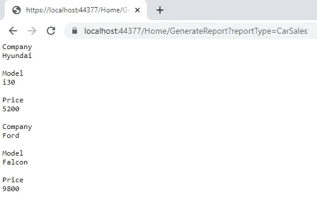

# 使用反射编写枯燥的代码

> 原文：<https://levelup.gitconnected.com/write-dry-code-using-reflection-e4b9bd8581ea>

## 使用。NET 反射来提高代码的可读性、可维护性和可扩展性

Elena Mozhvilo 在 [Unsplash](https://unsplash.com/s/photos/reflection) 上拍摄的照片

在本文中，我将向您展示一个场景，其中使用反射可以帮助提高代码的可读性、可维护性、可扩展性和干度。

## 场景

您已经为一家汽车经销商编写了一个 web 应用程序，该应用程序打印关于库存汽车以及已售出汽车的报告。

## 代码的当前状态

这是目前代码的样子。这是一个简单的 ASP.NET 核心 MVC 应用程序，有一个名为 Home 的控制器和两个生成报告的类。

`CarInfo`类为库存汽车生成一份报告:

`CarSales`类为已售出的汽车生成一份报告:

## 运行应用程序

报告类型作为 URL 中的查询字符串发送。

如果你运行应用并导航到[https://localhost:<yourPortNumberHere>/Home/generate report？reportType=CarSales](https://localhost:44377/Home/GenerateReport?reportType=CarSales) 您将看到以下输出:

如果您在 URL 中将`CarSales`替换为`CarInfo`，您将得到类似的报告。

## 这个代码有什么问题？

代码有效。但是，如果您的老板要求您为代理商购买的二手车添加另一份报告，该怎么办呢？

你需要在`GenerateReport()`方法中添加另一个`else if`块。

如果您需要向`CarInfo`或`CarSale`类添加更多的属性，比如`TransmissionType`，该怎么办？您需要在`DisplayReport()`方法中添加另一组 3 个`AppendLine()`方法调用。

想象一下，如果老板一直要求更多的属性和更多的报告，代码会变得更大，这将成为维护的噩梦。

这段代码是不可扩展的，并且不符合 T21 干原则，因为你会重复类似的代码行。

## 用反思来改善它

我将在两个方面使用反射:

1.  确定使用什么报告类
2.  显示`CarSale`和`CarInfo`对象的属性

## 家庭控制器

在`HomeController`中，包含报告逻辑的类完全基于`reportType`字符串中的值被实例化。不需要任何`if`的声明。

**这使得代码行数减半！**

## CarInfo

这里我们使用反射来遍历`Car`类的所有属性。这意味着我们不再需要担心每次向类中添加新属性时会添加更多的`AppendLine()`调用。

我们现在只有三个对`AppendLine()`的呼叫，而不是九个。

## CarSales

对`CarSales`的代码更改几乎与`CarInfo`相同，好处也完全相同:

# 摘要

人们往往害怕反思，因为它可能很昂贵。大多数时候，性能损失是不明显的，除非您的应用程序是性能关键的，否则您从可读性、可维护性和可扩展性中获得的好处远远超过使用反射带来的性能损失。

# 资源

本文中使用的要点可以在这里找到[。](https://gist.github.com/DavidKlempfner)