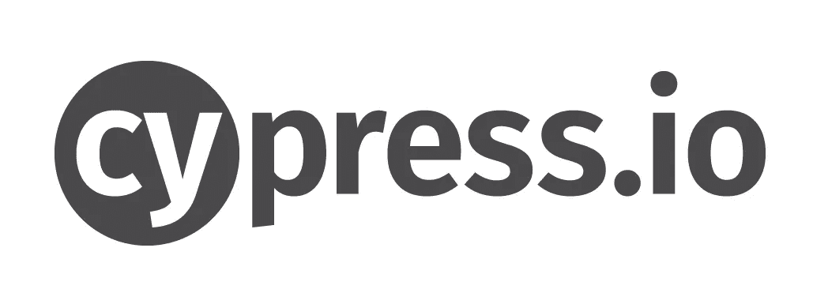
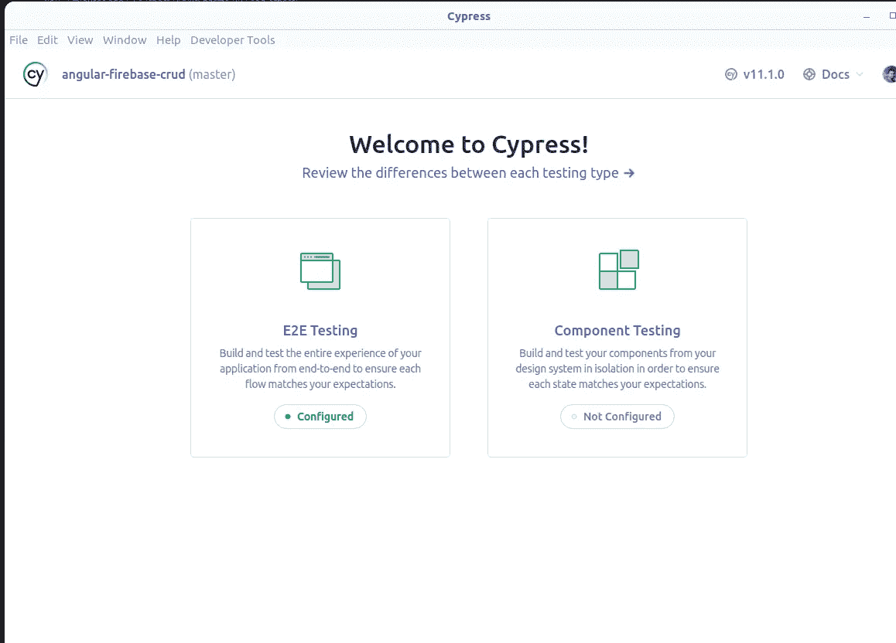
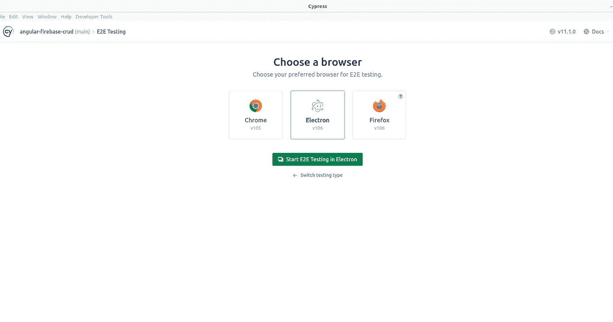
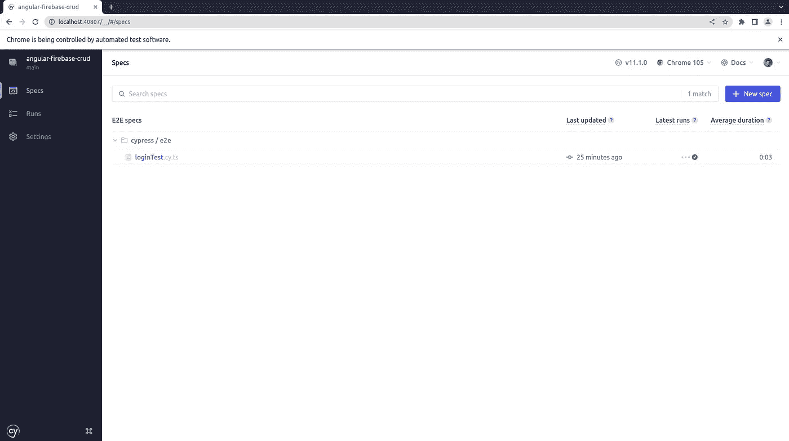
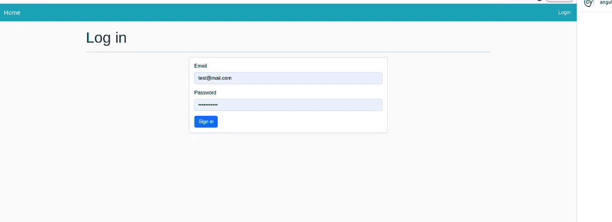
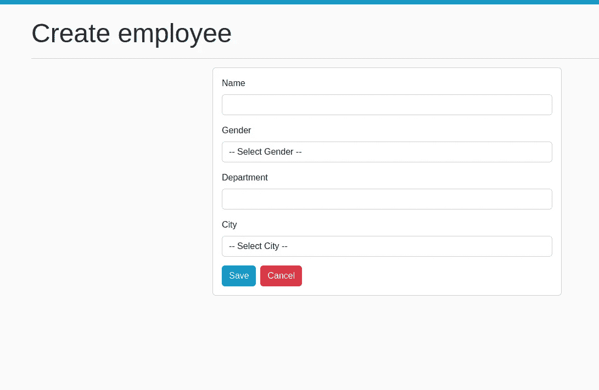

# 用 Angular 和 Cypress 编写 CRUD E2E 测试

> 原文：<https://levelup.gitconnected.com/write-e2e-tests-with-angular-and-cypress-1f011f673a5e>



来源:[https://arm no . in . th/images/cypress-angular-integration-testing/cypress-logo . png](https://armno.in.th/images/cypress-angular-integration-testing/cypress-logo.png)

## 简介:

保证可靠性最有效最可靠的就是人工测试！但是我们不能相信人体测试，这就是为什么我们引入了 e2e 测试

## 什么是 e2e 测试？

> 端到端测试模拟用户如何与应用程序交互。通常，测试引擎启动一个普通的浏览器并远程控制它。

## 柏树是什么？

> [Cypress framework 是一个基于 JavaScript 的端到端测试框架，构建在 Mocha 之上——一个运行在浏览器上和浏览器中的功能丰富的 JavaScript 测试框架，使异步测试变得简单方便。它还使用 BDD/TDD 断言库和浏览器来与任何 JavaScript 测试框架配对](https://www.browserstack.com/guide/cypress-framework-tutorial)

# Cypress 设置:

使用创建角度项目

```
ng new e2e-test-angular
```

访问您的项目:

```
cd  e2e-test-angular
```

我将使用现有的 [angular 开源项目](https://github.com/AnkitSharma-007/angular-firebase-crud)来编写测试

你可以查看现场演示来了解这个应用

所以你需要做:

```
git clone https://github.com/AnkitSharma-007/angular-firebase-crud.git
cd angular-firebase-crud
npm i
ng serve 
```

并且您需要更改 [Firebase 凭证:](https://developers.google.com/codelabs/building-a-web-app-with-angular-and-firebase)

```
 firebaseConfig: {
    apiKey: "your_api_key",
    authDomain: "authDomain",
    databaseURL: "databaseURL",
    projectId: "projectId",
    storageBucket: "storageBucket",
    messagingSenderId: "627200279654",
    appId: "your_app_id"
  }
```

## 将 Cypress 加入我们的 Angular 应用程序:

我们需要通过 npm 安装 cypress 包

```
npm install cypress --save-dev
```

## 开放柏树:

```
npx cypress open
```

您将打开此窗口:



柏树测试

你应该点击 E2E 测试



Cypress 浏览器选择



Cypress 仪表板，其中包含您的测试

# 编写 E2E 测试:

在这一节中，我将向您展示我将编写的测试套件，其中包含对应该完成的手动场景的解释，以及对代码进行解释的测试脚本代码

## 第一个测试用例:登录📝

在这一节中，我将向您展示如何编写我们的第一个 cypress 测试来检查登录场景



登录截图

**Cypress-test-workflow:**

*   导航到应用程序 URL
*   单击登录按钮，并被重定向到登录表单
*   键入电子邮件和密码
*   点击按钮登录
*   将用户重定向到主页
*   用户应该会在导航栏中看到注销

## 代码🖥:

我们需要添加选择器([**data-cy**](https://docs.cypress.io/guides/references/best-practices#Selecting-Elements)**)**作为从 DOM 中查询元素的推荐做法

我们将把它添加到:

*   data-cy= "登录按钮" ⇾to 选择按钮
*   data-cy= "登录-电子邮件-输入"⇾选择电子邮件输入
*   data-cy= "登录-密码-输入"⇾选择密码输入
*   data-cy="login-button" ⇾选择登录按钮

现在，在定义了我们的选择器之后，我们能够编写我们的测试脚本了

## Cypress 视频记录:


登录 cypress 记录

## 代码解释✔️:

```
 cy.visit(Cypress.env('appURL')) => to open the web application

cy.get('[data-cy=login-button]').click() => Click A button

cy.get('[data-cy=login-email-input]').type(Cypress.env('userEmail'))==> Write text in inut

cy.get('[data-cy=logout-link]').should('exist') => Assert an element exist in the dom 
```

## 第二个用例:添加一个雇员📝

现在，在完成登录场景之后，我们应该继续编写我们的 e2e 测试，现在的情况是**“添加一个雇员”**



员工表单用户界面

## cypress-测试-工作流程:

*   导航到应用程序 URL
*   点击添加员工按钮
*   键入员工姓名
*   选择性别
*   添加员工部门
*   选择性别
*   单击保存并被重定向到主页

## 代码🖥:

正如我们对 loginTest 所做的那样，我们还需要定义我们的 HTML 选择器

我将只解释使用的一个选择器:

data-cy="employee-gender" ->雇员性别选择元素的选择器

这是我们的测试脚本:

## 代码解释:

我将只解释新增的 cypress 命令

```
cy.get('select').first().should('be.visible').select('Male', {force: true}) 
=> Because we have 2 select elements, I will use first() to select the first
element and choose the value 'Male'

cy.get('select').last().should('be.visible').select('Tunis', {force: true})
=> the last() to select the last select element 
```

## 来源📚：

*   【https://testing-angular.com/end-to-end-testing/ 号
*   [https://www . think tecture . com/angular/e2e-tests-with-cypress-and-angular/](https://www.thinktecture.com/angular/e2e-tests-with-cypress-and-angular/)
*   [https://www . bitovi . com/blog/testing-angular-applications-end-to-end-with-cypress](https://www.bitovi.com/blog/testing-angular-applications-end-to-end-e2e-with-cypress)
*   [https://www . bacancytechnology . com/blog/angular-cypress-example-part-1](https://www.bacancytechnology.com/blog/angular-cypress-example-part-1)
*   [https://learn . openwaterfoundation . org/owf-learn-angular/cypress-e2e-testing/](https://learn.openwaterfoundation.org/owf-learn-angular/cypress-e2e-testing/)
*   [https://indepth . dev/posts/1349/write-better-automated-tests-with-cypress-in-angular](https://indepth.dev/posts/1349/write-better-automated-tests-with-cypress-in-angular)
*   [https://github.com/AnkitSharma-007/angular-firebase-crud](https://github.com/AnkitSharma-007/angular-firebase-crud)
*   [https://www . browser stack . com/guide/cypress-framework-tutorial](https://www.browserstack.com/guide/cypress-framework-tutorial)

## 额外资源📗：

如果你对阅读更高级的角度话题感兴趣，可以看看这些博客

*   [优化角度单元测试以加快执行速度](/optimizing-angular-unit-tests-for-faster-execution-70c7adda6b21)
*   [通过以下步骤优化角度束尺寸](/lets-optimize-angular-bundle-size-with-these-steps-6d6b753ac256)
*   [你应该避免使用棱角分明的坏习惯](/bad-practices-you-should-avoid-with-angular-development-58098e5542d5)
*   【Ngrx 和 Angular 状态管理简介
*   用 Angular 和 Cypress 编写 CRUD E2E 测试

## 结论:

这篇博客的源代码可以在 [GitHub](https://github.com/Rebaiahmed/angular-cypress-testing) 上找到。

如果你喜欢这篇文章，请留下你的👏，并在 [Twitter](https://twitter.com/RebaiAhmed_) 和 [GitHub](https://github.com/Rebaiahmed) 上关注我

感谢阅读