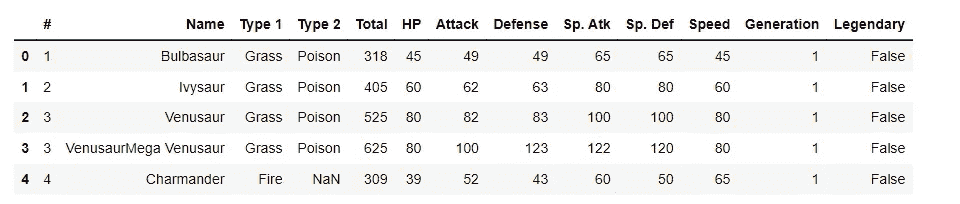
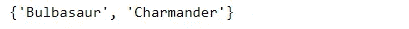
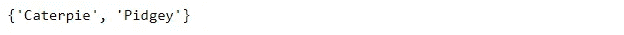

# 为数据科学家编写高效的 Python 代码:优化您的代码

> 原文：<https://levelup.gitconnected.com/write-efficient-python-code-for-data-scientists-optimizing-your-code-2dbb717f610e>

## 作为一名数据科学家，了解如何优化您的 python 代码并提高其效率

作为一名数据科学家，你应该把大部分时间花在从数据中获得洞察力上，而不是等待你的代码完成运行。编写高效的 Python 代码有助于减少运行时间和节省计算资源，最终让您腾出时间去做更有影响力的事情。

在本系列的前一篇文章“[编写高效的 python 代码:定义&测量代码效率](https://medium.com/geekculture/write-efficient-python-code-defining-measuring-code-efficiency-e33a5bd9f7ca?source=your_stories_page-------------------------------------)中，我讨论了什么是 Python 高效代码，以及如何使用不同的 Python 内置数据结构、函数和模块来编写更干净、更快、更高效的代码。我还探索了如何对代码进行计时和分析，以便找到瓶颈。

 [## 编写高效的 Python 代码:定义和衡量代码效率

### 了解如何衡量 Python 代码的效率

medium.com](https://medium.com/geekculture/write-efficient-python-code-defining-measuring-code-efficiency-e33a5bd9f7ca) 

在本文中，我们将使用数据科学家最常用的 Python 库来练习消除这些瓶颈和其他不好的设计模式: **NumPy** 和 **pandas** 。

Alessandro Bianchi 在 [Unsplash](https://unsplash.com?utm_source=medium&utm_medium=referral) 上拍摄的照片

## 目录:

1.  提高代码效率
    1.1。有效地组合、计数和迭代
    1.2。集合论简介
    1.3。消除循环
    1.4。编写更好的循环
2.  熊猫优化简介
    2.1。熊猫数据帧迭代
    2.2。熊猫替代打圈
    2.3。最优熊猫迭代
3.  参考

**本文中使用的所有代码和数据集都可以在这个 GitHub 资源库中找到:**

 [## GitHub-youssefHosni/高级-Python-编程-教程-

### 此时您不能执行该操作。您已使用另一个标签页或窗口登录。您已在另一个选项卡中注销，或者…

github.com](https://github.com/youssefHosni/Advanced-Python-Programming-Tutorials-) 

**如果你想免费学习数据科学和机器学习，看看这些资源:**

*   免费互动路线图，自学数据科学和机器学习。从这里开始:[https://aigents.co/learn/roadmaps/intro](https://aigents.co/learn/roadmaps/intro)
*   数据科学学习资源搜索引擎(免费)。将你最喜欢的资源加入书签，将文章标记为完整，并添加学习笔记。[https://aigents.co/learn](https://aigents.co/learn)
*   想要在导师和学习社区的支持下从头开始学习数据科学吗？免费加入这个学习圈:【https://community.aigents.co/spaces/9010170/】T2

**如果你想在数据科学& AI 领域开始职业生涯，但你不知道如何开始。我提供数据科学指导课程和长期职业指导:**

*   长期师徒:[https://lnkd.in/dtdUYBrM](https://lnkd.in/dtdUYBrM)
*   辅导课程:[https://lnkd.in/dXeg3KPW](https://lnkd.in/dXeg3KPW)

***加入*** [***中等会员***](https://youssefraafat57.medium.com/membership) ***计划，只需 5 美元，继续无限制学习。如果你使用下面的链接，我会收到一小部分会员费，不需要你额外付费。***

# 1.使您的代码高效

在这一部分，我们将介绍更多的效率技巧和诀窍。您将学习一些有用的内置模块来编写高效的代码，并练习使用集合论。然后，您将了解 Python 中的循环模式，以及如何使它们更有效。

## 1.1.有效地组合、计数和迭代

***组合对象***

在这一小节中，我们将讨论在 python 中有效地组合、计数和迭代对象。假设我们有两个列表:一个是名字，另一个是每个人的年龄。我们想合并这些列表，这样每个名字都存储在它的年龄旁边。我们可以使用 enumerate 遍历姓名列表，并使用 index 变量获取每个姓名对应的年龄。

但是 Python 的内置函数 **zip** 提供了一个更优雅的解决方案。“zip”这个名字描述了这个函数是如何将像夹克上的拉链这样的对象组合在一起的(将两个独立的东西变成一个)。zip 返回一个 zip 对象，它必须被解压到一个列表中并打印出来才能看到内容。每个条目都是原始列表中的一组元素。

Python 还附带了许多高效的内置模块。collections 模块包含专门的数据类型，可用作标准字典、列表、集合和元组的替代。几个值得注意的专门化数据类型是:

*   **命名元组**:具有命名字段的元组子类
*   **deque** :列表式容器，可快速追加和弹出
*   **计数器**:计数易碎物品的字典
*   **OrderedDict** :保留条目顺序的字典
*   **defaultdict** :调用工厂函数来提供缺失值的 dict

***清点物件***

让我们更深入地研究一下**计数器**对象。首先，我们将上传口袋妖怪数据集**并打印它的前五行，然后我们将使用 for 循环计算每种类型口袋妖怪的数量，然后使用 Counter 函数。**

*   **让我们加载 pokemon 数据集并打印前五行:**

****

*   **现在，我们将使用循环来计算每种类型的口袋妖怪数量，并计算执行时间:**

****

*   **最后，我们将使用**计数器**功能计算每种类型的口袋妖怪数量，并比较时间:**

****

**我们可以看到，使用**集合**模块中的**计数器**函数是一种更有效的方法。只需导入**计数器**并提供要计数的对象。不需要循环！Counter 返回键值对的计数器字典。打印时，它是按最高计数到最低计数排序的。如果比较运行时间，我们会发现使用计数器比使用标准字典方法花费的时间更少！**

*****itertools*****

**另一个内置模块 **itertools** ，包含使用迭代器的功能工具。这些工具的一个子集是:**

*   ****无限迭代器:**计数、循环、重复**
*   ****有限迭代器:** accumulate，chain，zip_longest 等。**
*   ****组合生成器:**乘积、排列、组合**

**我们将关注**组合生成器。**这些生成器有效地产生对象的笛卡尔乘积、排列和组合。我们来探讨一个例子。**

*****组合*****

**假设我们想收集所有可能的神奇宝贝组合。我们可以使用嵌套的 for 循环来实现这一点，该循环在 poke_types 列表上迭代两次。请注意，条件语句用于跳过两次具有相同类型的对。比如 x 是‘Bug’，y 是‘Bug’，我们要跳过这一对。因为我们对组合感兴趣(顺序不重要)，所以在追加之前，使用另一个语句来确保组合列表中不存在该对的顺序。例如，对(' Bug '，' Fire ')与对(' Fire '，' Bug ')相同。我们要这双鞋中的一双，不要两双。**

****

**itertools 的组合生成器提供了更有效的解决方案。首先，我们导入组合，然后通过提供 **poke_types** 列表和我们想要的组合长度来创建一个组合对象。组合返回一个组合对象，我们将其解包到一个列表中并打印出来以查看结果。如果比较运行时，我们会发现使用组合要比嵌套循环快得多。**

## **1.2.集合论导论**

**通常，我们想要比较两个对象，以观察它们内容之间的相似性和差异。当进行这种类型的比较时，最好利用一个叫做集合论的数学分支。众所周知，Python 自带了一个内置的 **set** 数据类型。集合提供了一些我们可以用来比较的简便方法，例如:**

*   ****intersection()** :两个集合中的所有元素**
*   ****difference():** 一个集合中的所有元素，而不是另一个集合中的所有元素**
*   ****symmetric _ difference():**所有元素正好在一个集合中**
*   ****union():** 任一集合中的所有元素**

**当我们想要多次以不同的方式比较对象时，我们应该考虑将数据存储在集合中，以使用这些有效的方法。Python 集合的另一个很好的特性是能够快速检查成员中是否存在值。我们称之为使用操作符中的**的成员测试。我们将介绍如何将**操作符中的**用于集合比用于列表或元组要快得多。****

**假设我们有两个神奇宝贝名字的列表:list_a 和 list_b，我们想比较这两个列表，看看哪个神奇宝贝同时出现在两个列表中。我们可以首先使用一个嵌套的 for 循环来比较 list_a 中的每一项和 list_b 中的每一项，并只收集那些同时出现在两个列表中的项。但是，遍历两个列表中的每一项是非常低效的。**

****

**但是，更好的方法是使用 Python 的 **set** 数据类型来比较这些列表。通过将每个列表转换为一个集合，我们可以使用点交方法来收集两个集合之间共享的神奇宝贝。一行简单的代码，不需要循环！**

****

**我们用少得多的代码行得到了相同的答案，我们还可以比较运行时，看看使用集合比使用循环快多少。**

********

**我们可以看到，使用集合比使用 for 循环要快得多。我们还可以使用 set 方法来查看存在于一个集合中而不存在于另一个集合中的神奇宝贝。要收集存在于 set_a 中但不存在于 set_b 中的神奇宝贝，请使用 set_a.difference(set_b)。**

****

**如果我们希望神奇宝贝在 set_b 中，而不是在 set_a 中，我们使用 set_b.difference(set_a)。**

****

**要收集恰好存在于其中一个集合中的神奇宝贝(而不是两个集合)，我们可以使用一种叫做对称差的方法。**

****

**最后，我们可以使用**来组合这些集合。联合**法。这将收集出现在其中一个或两个集合中的所有独特神奇宝贝。**

**使用集合的另一个很好的效率提升是能够快速检查一个特定的项目是否是集合元素的成员。考虑一下我们的 720 个神奇宝贝名称的集合，它们被存储为一个列表、元组和集合。**

**我们要检查超音蝠这个字符是否在每个数据结构中，并打印每个数据类型的执行时间:**

****

**在比较运行时时，很明显，使用集合进行成员测试要比使用列表或元组快得多。**

**使用集合的最后一个效率提升来自集合本身的定义。集合被定义为不同元素的集合。因此，我们可以使用集合从现有对象中收集唯一的项目。让我们定义一个 **primary_types** 列表，它包含每个神奇宝贝的主要类型。如果我们想收集这个列表中唯一的神奇宝贝类型，我们可以编写一个 for 循环来迭代这个列表，并且只追加那些还没有被添加到 **unique_types** 列表中的神奇宝贝类型。**

****

**使用一套使这变得容易得多。我们所要做的就是将 primary_types 列表转换成一个集合，这样我们就有了解决方案:一组不同的神奇宝贝类型。**

****

## **1.3.消除循环**

**尽管在编写 Python 代码时使用循环并不一定是一种糟糕的设计模式，但是使用额外的循环可能效率低下且成本高昂。让我们探索一些工具，它们可以帮助我们消除在代码中使用循环的需要。Python 提供了一些循环模式，当我们想要迭代一个对象的内容时，可以使用这些模式:**

*   **For 循环逐段迭代序列中的元素。**
*   **只要满足某个布尔条件，While 循环就会重复执行一个循环。**
*   **嵌套循环在彼此内部使用多个循环。**

**尽管 Python 支持所有这些循环模式，但我们在使用它们时应该小心。因为大多数循环都是以一段一段的方式进行评估的，所以它们通常是低效的解决方案。**

**在编写高效的代码时，我们应该尽量避免循环。消除循环通常会减少更容易解释的代码行。pythonic 代码的一个习惯用法是“**扁平比嵌套**好。”努力消除代码中的循环将有助于我们遵循这个习语。**

**假设我们有一个名为 poke_stats 的列表列表，其中包含每个神奇宝贝的统计值。每行对应一个神奇宝贝，每列对应一个神奇宝贝的具体统计值。在这里，列代表一个神奇宝贝的生命点，攻击，防御和速度。我们希望对这些行进行简单的求和，以便收集每个神奇宝贝的总统计数据。如果我们要使用一个循环来计算行总和，我们就必须遍历每一行，并将该行的总和追加到总计列表中。我们可以用更少的代码，通过列表理解来完成同样的任务。或者，我们可以使用我们在之前的 [**文章**](https://medium.com/geekculture/write-efficient-python-code-defining-measuring-code-efficiency-e33a5bd9f7ca) 中讨论过的内置地图功能。**

************

**这些方法都将返回相同的列表，但是使用列表理解或 map 函数只需要一行代码，运行时间更快。**

**在前一篇文章中，我们还介绍了一些内置模块，它们可以帮助我们消除循环。除了使用嵌套的 for 循环，我们可以使用 itertools 模块中的组合来获得更简洁、更高效的解决方案。**

**另一个消除循环的强大技术是使用 NumPy 包。假设我们有与上一个例子相同的统计数据集合，但是存储在一个 NumPy 数组中，而不是一个 list 列表。**

**我们希望收集数组中每个神奇宝贝(或行)的平均统计值。我们可以使用一个循环来迭代数组并收集行平均值。**

****

*****用 NumPy*** 消除循环**

**但是，NumPy 数组允许我们一次对整个数组进行计算。这里，我们使用点平均法，并指定一个等于 1 的轴来计算每行的平均值(这意味着我们计算列值的平均值)。这消除了对循环的需要，并且效率更高。**

****

**在比较运行时时，我们看到在整个数组上使用点平均法并指定一个轴比使用循环要快得多。**

## **1.4.编写更好的循环**

**我们已经讨论了循环是如何变得昂贵和低效的。但是，有时你不能消除一个循环。在这一节中，我们将探讨当循环不可避免时，如何使循环更有效。在深入讨论之前，我们将讨论的一些循环可以使用前面课程中介绍的技术来消除。出于演示的目的，我们假设这里显示的用例是循环不可避免的情况。**

**提高循环效率的最好方法是分析循环中正在做的事情。我们希望确保我们在每次迭代中不做不必要的工作。如果对循环的每次迭代都执行计算，但是它的值不随每次迭代而改变，那么最好将这个计算移到循环之外(或之上)。如果一个循环在每次迭代中转换数据类型，那么这种转换可以在循环之外(或之下)使用 map 函数来完成。任何可以一次完成的事情都应该移到循环之外。让我们探讨几个例子。**

*****移动计算上面一个循环*****

**我们有一个神奇宝贝名字的列表和一个每个神奇宝贝对应攻击值的数组。我们希望打印出每个攻击值大于所有攻击值平均值的神奇宝贝的名字。为此，我们将使用一个循环来迭代每个神奇宝贝及其攻击值。对于每次迭代，通过找到所有攻击的平均值来计算总攻击平均值。然后，评估每个神奇宝贝的攻击值，看是否超过总平均值。**

****

**这个循环的低效之处在于，每次循环迭代都会创建 total_attack_avg 变量。但是，这个计算在迭代之间不会改变，因为它是一个整体平均值。我们只需要计算这个值一次。通过将这种计算移到循环之外(或之上),我们只计算一次总攻击平均值。我们得到相同的输出，但这是一个更有效的方法。**

**让我们比较一下这两种方法的运行时间:**

********

**我们看到，将 total_attack_avg 计算保持在循环中需要 120 多微秒。**

*****整体转换*****

**另一种提高循环效率的方法是在循环之外(或之下)使用**整体转换**。在下面的例子中，我们有来自 720 个神奇宝贝数据集的三个列表:每个神奇宝贝的名字列表，一个与神奇宝贝是否具有传奇地位相对应的列表，以及每个神奇宝贝的世代列表。我们希望组合这些对象，以便每个名称、状态和层代都存储在一个单独的列表中。为此，我们将使用一个循环来迭代 zip 函数的输出。记住，zip 返回元组的集合，所以我们需要将每个元组转换成一个列表，因为我们想要创建一个列表的列表作为我们的输出。然后，我们将每个单独的 poke_list 附加到 poke_data 输出变量中。通过打印结果，我们可以看到我们想要的列表。**

****

**然而，在循环内将每个元组转换成一个列表并不是非常高效。相反，我们应该收集所有的 poke _ tuples，并使用 map 函数将每个 tuple 转换成一个列表。循环不再在每次迭代中将元组转换为列表。相反，我们将这个元组移动到循环之外(或之下)的列表转换。这样，我们一次转换所有的数据类型(或整体地)，而不是在每次迭代中转换。**

****

**运行时显示，在循环之外将每个元组转换为一个列表更有效。**

# **2.熊猫优化简介**

## **2.1.熊猫数据框架迭代**

**Pandas 是一个用于数据分析的库。pandas 的主要构造是 DataFrame，这是一种带有标记行和列的表格数据结构。我们将关注迭代数据帧的最佳方法。让我们从分析一个 [**美国职业棒球大联盟数据集**](https://github.com/youssefHosni/Advanced-Python-Programming-Tutorials-/blob/main/Datasets/baseball_stats.csv) 开始。它包含了从 1962 年到 2012 年每个美国职业棒球大联盟球队的统计数据，这些数据存储在一个名为 **baseball_df** 的熊猫数据帧中。**

****

**我们将关注 W 列，它指定了一支球队在一个赛季中的获胜次数，而 G 列包含了一支球队在一个赛季中的比赛次数。**

*****计算&相加胜率*****

**一个用来评估球队在某个赛季表现的流行统计数据是球队的胜率。该指标的计算方法是将球队的总胜率除以比赛次数。这里有一个简单的函数来执行这个计算。**

**现在，我们想在我们的 **baseball_df** 数据框架中创建一个新列，存储每个球队在一个赛季中的胜率。为此，我们需要迭代 DataFrame 的行，并应用我们的 **calc_win_perc** 函数。首先，我们创建一个空的 win_perc_list 来存储我们将计算的所有成功率。然后，我们编写一个循环，遍历数据帧的每一行。请注意，我们使用的索引变量(I)的范围是从零到数据帧内存在的行数。然后我们使用**。iloc** 方法，使用索引变量查找数据帧中的每一行。**

**然后，我们通过引用 W 和 G 列来获取每个团队的胜利和比赛。接下来，我们将团队的胜利和比赛传递给 calc_win_perc，以计算胜利百分比。最后，我们将 win_perc 追加到 win_perc_list 并继续循环。我们通过将列值设置为等于 win_perc_list，在 DataFrame 中创建我们想要的列，称为 WP。**

********

**用**在数据帧上循环。iloc** 给了我们想要的输出，但是效率低吗？估计运行时时。iloc 方法需要 660 毫秒，效率相当低。**

*****不断重复着。ITER rows()*****

**熊猫有一些有效的方法来循环数据帧。我们要介绍的第一个方法是**。iterrows** 方法。这个类似于**。iloc** 方法，但**。iterrows** 将每个 DataFrame 行作为(index，pandas Series)对的元组返回。这意味着从**返回的每个对象。iterrows** 包含每一行的索引作为第一个元素，每一行中的数据作为熊猫系列作为第二个元素。**

**注意，我们仍然创建空的 **win_perc_list** ，但是现在我们不必创建索引变量来查找数据帧中的每一行。**。iterrows** 为我们处理索引！for 循环的其余部分保持不变，在 baseball_df 数据帧中创建新的 win percentage 列。**

****

**使用。iterrows 大约需要一半的时间。iloc 需要迭代我们的数据帧。**

*****迭代着。itertuples()*****

**熊猫还带来了另一种叫做**的迭代方法。itertuples** 通常比**更有效。iterrows** 。让我们继续使用我们的棒球数据集来比较这两种方法。假设我们有一个名为 team_wins_df 的熊猫数据帧，其中包含每个队在一个赛季中的总胜场数。**

**如果我们用**。iterrows** 循环遍历我们的 **team_wins_df** DataFrame 并打印每一行的元组，我们看到每一行的值都存储为一个 pandas 系列。记住，**。iterrows** 将每个 DataFrame 行作为(index，pandas Series)对的元组返回，因此我们必须使用方括号索引来访问行的值。**

**但是，我们可以使用**。itertuples** 来循环我们的 DataFrame 行。**。itertuples** 方法将每个 DataFrame 行作为一种称为 namedtuple 的特殊数据类型返回。namedtuple 是我们之前讨论过的集合模块中存在的一种专用数据类型。这些数据类型的行为就像 Python 元组一样，但是具有可使用属性查找访问的字段。**

****

**请注意，在输出中，每个打印的 row_namedtuple 都有一个索引属性，team_wins_df 中的每一列都有一个属性。这意味着我们可以使用点方法通过查找来访问这些属性。这里，我们可以使用 **row_namedtuple 打印最后一个 row_namedtuple 的索引。索引**。我们可以用 **row_namedtuple 打印这个 row_namedtuple 的团队。团队**，年与**排名双位数。年份**以此类推。**

********

**当我们对比**的时候。项目编号**至**。itertuples** ，我们看到有相当多的改进！**

********

**原因**。itertuples** 比**更高效。iterrows** 是由于每个方法存储其输出的方式。自**起。iterrows** 以熊猫系列的形式返回每一行的值，这有一点额外的开销。**

## **2.2.熊猫替代打圈**

**为了编写高效的代码，我们希望尽可能避免循环。因此，现在我们将探索使用**的替代方案。ITER row**和**。itertuples** 在数据帧上执行计算。**

**我们将继续使用棒球数据集。我们将首先创建 **calc_run_diff** 函数。该函数通过从一个赛季的总得分中减去球队允许的总得分来计算球队在给定年份的得分差异。**

**我们希望在 baseball_df 数据帧中创建一个名为 RD 的新列，用于存储每支球队多年来的跑步差异。以前我们用 for 循环使用**来做这个。ITER row**或**。itertuples** 。在这里，我们将使用**。iterrows** 为例。注意，我们使用 for 循环迭代 baseball_df，将每一行的 RS 和 RA 列传递给 calc_run_diff 函数，然后将每一行的结果追加到 run_diffs_iterrows 列表中。这给了我们想要的输出，但不是我们最有效的选择。**

****

*****Pandas.apply()方法*****

**使用循环迭代数据帧的一种替代方法是使用 **pandas.apply** 方法。该函数的作用类似于 map 函数。它接受一个函数作为输入，并将这个函数应用于整个数据帧。因为我们使用的是表格数据，所以我们必须指定一个我们希望函数作用的轴。使用 0 作为轴参数将对列应用我们的函数，而使用 1 作为轴参数将对所有行应用我们的函数。就像 map 函数一样， **pandas.apply** 方法可以与匿名函数或 lambdas 一起使用。**

**让我们来看看如何使用**。应用**方法计算我们的运行差异。首先，我们称之为**。在 baseball_df 数据帧上应用**。然后，我们使用 lambda 函数迭代数据帧的行。注意，我们的 lambda 参数是 row(因为我们应用于 DataFrame 的每一行)。对于每一行，我们获取 RS 和 RA 列，并将它们传递给 calc_run_diff 函数。最后，我们指定我们的轴来告诉 dot-apply 我们想要迭代行而不是列。**

****

**当我们使用**时。应用**方法来计算我们的运行微分，我们不需要使用一个 for 循环。我们可以将我们的运行差异直接收集到一个名为 **run_diffs_apply 的对象中。****

**我们可以看到**。iterrows** 方法花了大约 321 毫秒完成。但是，使用点应用方法只需要 45.2 毫秒。绝对的进步！**

## **2.3.最优熊猫迭代**

**从我们的第一部**开始，我们已经走过了漫长的道路。iloc** 迭代数据帧的方法。我们讨论的每种方法都真正提高了性能。但是，这些方法侧重于对数据帧的每一行单独进行计算。现在，我们将探索一些 panda 的内部机制，使我们能够更有效地执行计算。**

**因为熊猫是一个建立在 NumPy 上的图书馆。这意味着我们使用的每个 pandas 数据帧都可以利用前面的 [**文章**](https://medium.com/geekculture/write-efficient-python-code-defining-measuring-code-efficiency-e33a5bd9f7ca) 中讨论的 NumPy 数组的高效特性。我们讨论了广播，以及它是如何允许 NumPy 数组向量化操作的，所以它们是一次在一个对象的所有元素上执行的。这使我们能够高效地对整个数组执行计算。就像 NumPy 一样，pandas 旨在对计算进行矢量化，以便它们可以一次对整个数据集进行操作(而不仅仅是逐行操作)。让我们用一些例子来探讨这个概念。**

**我们将继续使用我们在本章中一直使用的 baseball_df 数据帧。因为 pandas 构建在 NumPy 之上，所以我们可以使用点值方法将这些 DataFrame 列的任何值作为 NumPy 数组。这里，我们将 W 列的值收集到一个名为 wins_np 的 NumPy 数组中。当我们打印 wins_np 的类型时，我们看到它实际上是一个 NumPy 数组。**

****

**我们可以通过打印数组并验证它是否与数据帧中的 W 列相同来查看数组的内容。**

****

**当利用 NumPy 阵列的广播能力时，可以看到知道熊猫是建立在 NumPy 上的好处。请记住，这意味着我们可以向量化我们的计算，并立即在整个数组上执行它们！而不是循环遍历一个数据帧，并单独处理每一行，就像我们对**所做的那样。iterrows** ，**。itertuples** 和**。应用**，我们可以在 baseball_df 数据帧的底层 NumPy 数组上执行计算。在这里，我们将数据帧中的 RS 和 RA 列收集为 NumPy 数组，并使用广播一次性计算游程差分！**

****

**当我们使用 NumPy 数组来执行游程差分计算时，我们可以看到我们的代码变得更具可读性。在这里，我们可以清楚地看到我们的运行差异是如何计算的。此外，当我们对 NumPy 数组方法计时时，我们看到我们的运行差分计算需要几微秒！所有其他方法都以毫秒为单位进行报告。我们的阵列方法比所有以前的方法快几个数量级！很明显，使用 DataFrame 的底层 NumPy 数组来执行计算可以帮助我们获得巨大的效率。**

# **3.参考**

1.  **[编写高效的 Python 代码](https://app.datacamp.com/learn/courses/writing-efficient-python-code)**
2.  **代码和数据集可以在这个 GitHub 资源库中找到**

** [## GitHub-youssefHosni/高级-Python-编程-教程-

### 此时您不能执行该操作。您已使用另一个标签页或窗口登录。您已在另一个选项卡中注销，或者…

github.com](https://github.com/youssefHosni/Advanced-Python-Programming-Tutorials-)** ** [## 加入我的介绍链接媒体-优素福胡斯尼

### 阅读 Youssef Hosni(以及媒体上成千上万的其他作家)的每一个故事。您的会员费直接支持…

youssefraafat57.medium.com](https://youssefraafat57.medium.com/membership) 

*感谢阅读！如果你喜欢这篇文章，一定要鼓掌(高达 50！)并在*[*LinkedIn*](https://www.linkedin.com/in/youssef-hosni-b2960b135/)*上与我联系，并在*[*Medium*](https://youssefraafat57.medium.com/)*上关注我以了解我的新文章***