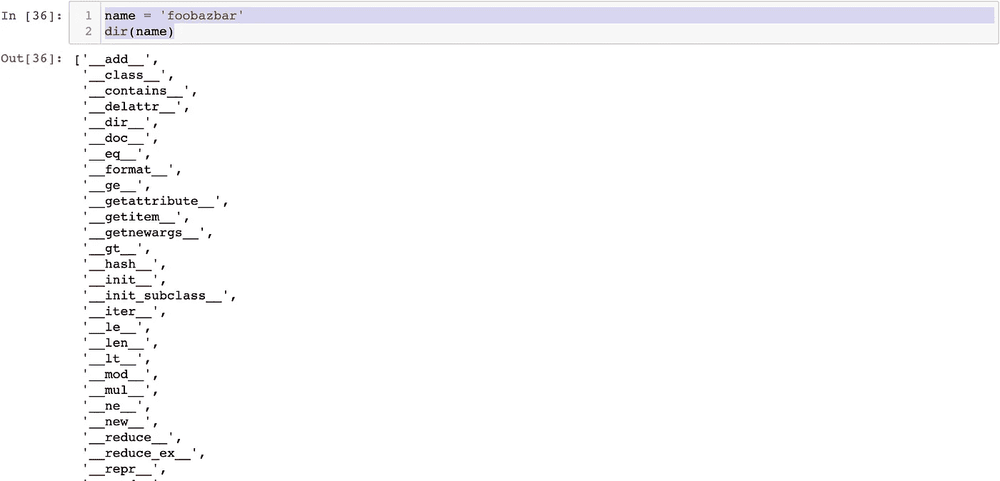

# 用这 10 个技巧编写优雅的 Python 代码

> 原文：<https://levelup.gitconnected.com/write-elegant-python-code-with-these-10-tricks-43ae7b1aa481>

## 开始编写优雅的代码吧！


戴维·兰格尔在 [Unsplash](https://unsplash.com?utm_source=medium&utm_medium=referral) 上的照片

Python 现在处于编程食物链的顶端。由于它的可读性、通用性和易学性，程序员对它越来越感兴趣。为了让您的 Python 之旅更容易，我列出了 10 个技巧，您可以用它们来编写更漂亮的代码。

## 交换变量

交换两个变量最常用的方法之一是使用一个“*温度*”变量。

```
a = 10
b = 20
print("Before Swapping:", a, b)temp = b
b = a
a = temp
print("After Swapping:", a, b)
```

这将会回来

```
Before Swapping: 10 20
After Swapping: 20 10
```

但是，同样的操作可以用更简洁的方式来完成。

```
a = 10
b = 20
print("Before Swapping:", a, b)a,b = b,a
print("After Swapping:", a, b)
```

这也将返回相同的输出。

```
Before Swapping: 10 20
After Swapping: 20 10
```

## 合并两本词典

两个 Python 字典可以很容易地合并，不需要使用任何函数或方法。您可以使用下面的代码构建一个合并的字典。

```
dict1 = {'foo': 1, "baz": 2}
dict2= {'bar' : 3}merged_dict = {**dict1, **dict2}
print(merged_dict)
```

这段代码将产生一个合并的字典。

```
{'foo': 1, 'baz': 2, 'bar': 3}
```

## 将列表转换为字符串

当你分割一个字符串，然后连接元素时，这个部分非常方便。使用 *join()* 方法，您可以创建一个字符串，其中序列的元素通过一个 *str* 分隔符连接起来。

举个例子，

```
phone_no = ['453', '678', '8909']
print( "-".join(phone_no) )
```

这将把列表转换成带“-”分隔符的字符串。

```
'453-678-8909'
```

## 列表理解

列表理解是一种基于现有列表创建列表的简洁方法。人们还认为，这是一种更紧凑、更快速的创建列表的方式。

这里有两个使用迭代和列表理解方法创建列表的例子。

```
table_of_two = []
for i in range(1,11):
    temp = 2 * i
    table_of_two.append(temp)print(table_of_two)
```

创建 2 的乘法表是一种传统的迭代方法。它会回来的

```
[2, 4, 6, 8, 10, 12, 14, 16, 18, 20]
```

现在有了列表理解，一两行代码就能实现。

```
table_of_two = [ 2 * i for i in range(1,11)]
print(table_of_two)
```

这段代码将输出 2 的乘法表。

```
[2, 4, 6, 8, 10, 12, 14, 16, 18, 20]
```

## 同时处理两个列表

内置函数 zip()接受 iterables 作为参数并返回一个迭代器。使用这个函数可以更容易地遍历多个 iterable。

```
table_of_two = [ 2 * i for i in range(1,11)]for x,y in zip(range(1,11), table_of_two):
    print('2 * {} = {}'.format(x,y))
```

这将输出 2 的乘法表。

```
2 * 1 = 2
2 * 2 = 4
2 * 3 = 6
2 * 4 = 8
2 * 5 = 10
2 * 6 = 12
2 * 7 = 14
2 * 8 = 16
2 * 9 = 18
2 * 10 = 20
```

## 从多个列表中获取公共值

很多时候，需要从两个或多个列表或元组中找到公共值。我们可以用一行代码简单地完成它

```
a = [1,2,3]  
b = [2,3,4]c = set(a) & set(b)
```

这将输出这两个列表中的公共值。

```
{2, 3}
```

## 字符串反转

与其他语言不同，Python 中的字符串反转非常简单和容易。无需编写循环并从反面打印。你可以简单地这样做。

```
name = 'foobazbar'
name[ : :-1]
```

这将简单地返回反转的字符串。

```
'rabzaboof'
```

## 分配变量乘法

语言是关于语法的！在大多数语言中，我们可以一次给一个变量赋值。但是，Python 允许你给多个变量赋值。

```
name, job = 'foobazbar', 'Analyst'print(name)
print(job)
```

上面的代码将输出

```
foobazbar
Analyst
```

## dir()函数

内置的 dir()方法允许你知道一个对象的属性和方法列表。对象可以是任何函数、模块、列表、字典等。当你没有关于模块的先验知识时，它变得非常有用。

```
name = 'foobazbar'
dir(name)
```

这将返回字符串对象的所有方法和属性。



## 乘法字符串

Python 允许你将字符串相乘。不仅仅是数字，它还允许你乘以字符串。

```
name = 'foo' * 3
print(name)
```

这将乘以字符串并返回以下输出。

```
foofoofoo
```

## 总结

我希望这些 Python 技巧能帮助你创建更好更紧凑的代码。

**感谢阅读！**

**和平！**