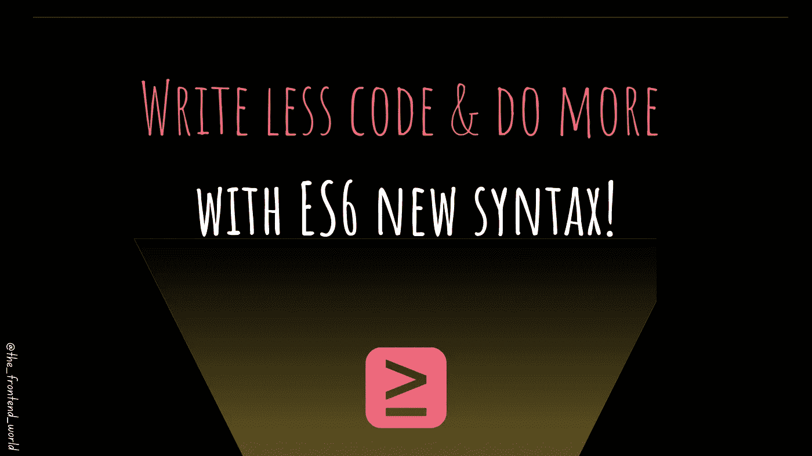
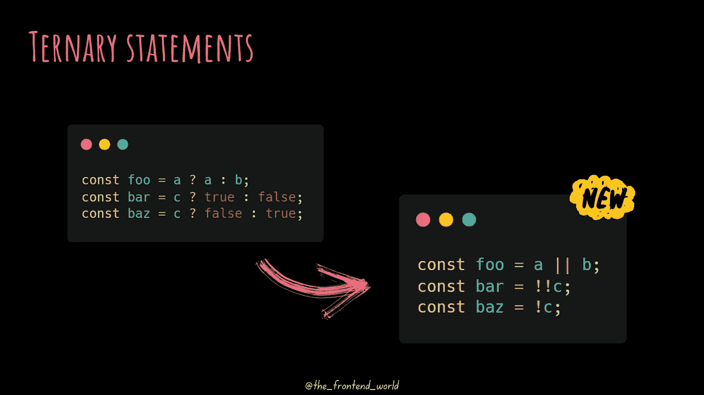
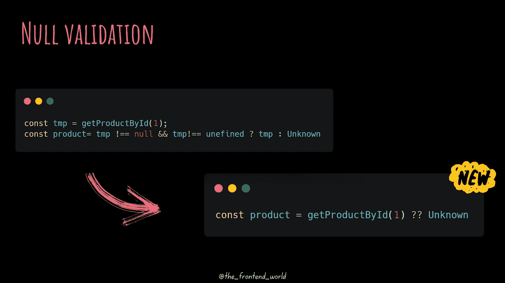
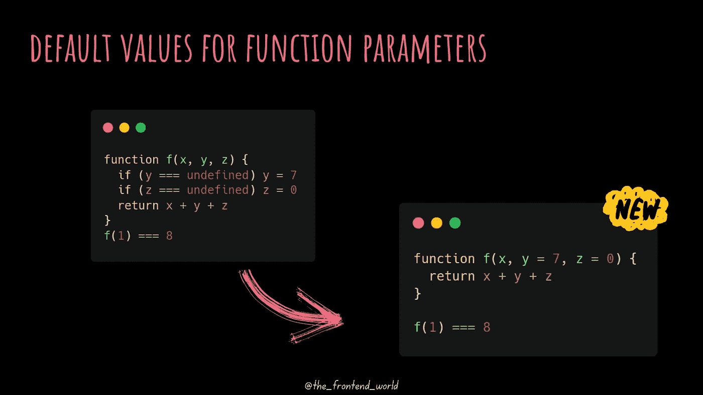
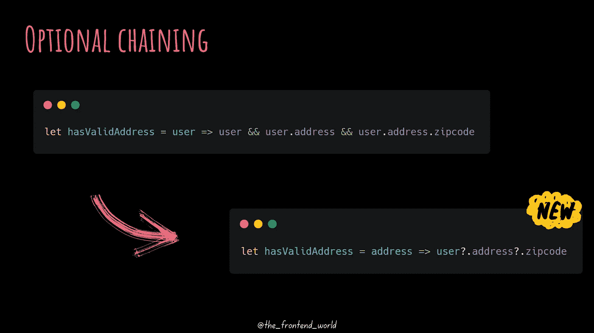
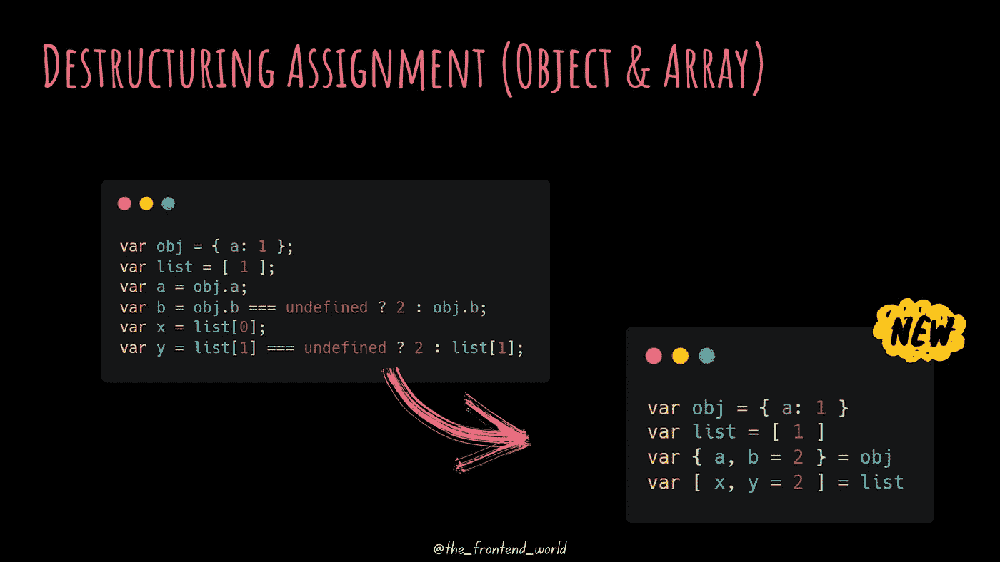
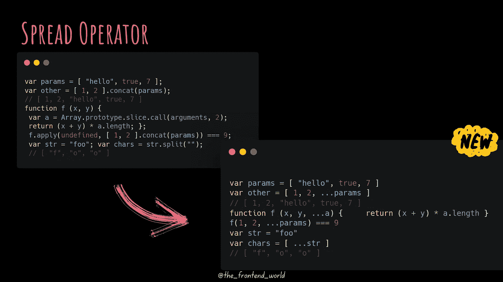
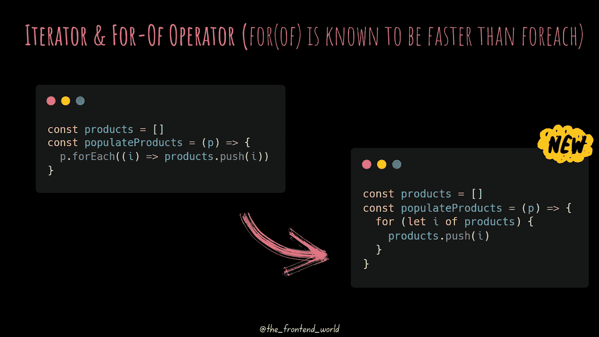

# 使用 ES6 新语法，写得更少，做得更多！

> 原文：<https://levelup.gitconnected.com/write-less-and-do-more-with-es6-new-syntax-6ed7b5243c45>

## 使用 ES6 编写更少的代码

作者:FAM

在本文中，我收集了我喜欢的 ES6 带来的顶级新语法，并在我的代码中使用。您可能会看到下面的建议太短，以至于代码不可读。我认为这是实践的问题，浏览器处理和显示的代码越少越好。

这个列表是从 [ES6 文档](http://es6-features.org/#ValueExportImport)中得到启发和收集的。

让故事开始！

# 三元语句

作者:FAM

# 无效和未定义的验证

当左侧操作数为`null`或`undefined`时，返回右侧。在开发人员的日常任务中非常实用:

作者:FAM

# 默认参数

函数参数的直观和简单的默认值

作者:FAM

# 可选链接

读取深度嵌套的属性，无需每次都检查其有效性:

作者:FAM

# **析构赋值(对象&数组)**

在赋值过程中直观灵活地将数组和对象析构为单个变量。代码少！

作者:FAM

# 传播算子

将一个可迭代集合的元素(比如一个数组，甚至一个字符串)分成文字元素和单个函数参数。

作者:FAM

# **迭代器**

**运算符**的迭代器&

支持“iterable”协议，允许对象定制他们的迭代行为。此外，支持“迭代器”协议来产生一个值序列(有限或无限)。最后，提供方便的`of`操作符来迭代一个可迭代对象的所有值。

作者:FAM

> 我今天的故事到此结束，我希望你喜欢它，并从中吸取教训，❤

如果我的作品 ***打动了你，*** 如果你 ***喜欢它*** 如果你觉得它 ***值得*** ，请你 [**成为付费会员来支持我，你的一部分费用会寄给我。**](https://famzil.medium.com/membership)

> 对我来说这意味着整个世界，我的触摸创造了这个世界上有价值的小东西…谢谢你，❤

对我来说这意味着整个世界，我的触摸创造了这个世界上有价值的小东西…谢谢你，❤

如果你喜欢看我的文章……并且想收到我的文章(我不是每天都发表，这样就不会给你发垃圾邮件。你可以随时退订，没有问题)♥️

 [## 如果你喜欢看我的文章… ♥️

### 如果你喜欢读我的文章… ♥️，当我的文章发表时，欢迎你第一个得到通知…

famzil.medium.com](https://famzil.medium.com/subscribe) 

亲爱的读者，感谢你在我生命中的存在。让我们在 [**上**取得联系****](https://medium.com/@famzil/)**[**Linkedin**](https://www.linkedin.com/in/fatima-amzil-9031ba95/)**[**脸书**](https://www.facebook.com/The-Front-End-World)**[**insta gram**](https://www.instagram.com/the_frontend_world/)**[**YouTube**](https://www.youtube.com/channel/UCaxr-f9r6P1u7Y7SKFHi12g)**或**********

******参见我的关于网络要素和一般文化的电子书。******