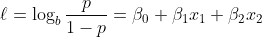
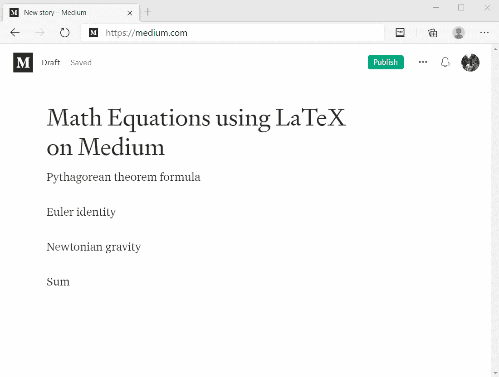
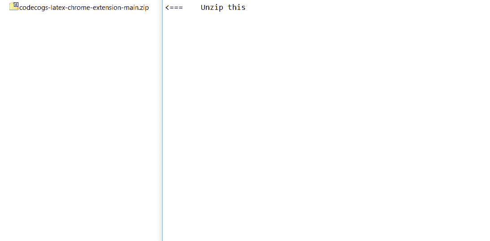

# 使用 LaTeX 扩展在介质上写数学公式

> 原文：<https://levelup.gitconnected.com/write-math-formula-on-medium-using-latex-extension-30271eb8d33b>

如你所知，Medium 没有写数学方程式或公式的功能。我知道很多媒体作者非常想要这个特性，尤其是那些分享涉及大量数学的技术文章的作者。谁不想看一堆漂亮的乳胶数学公式的技术文章呢，对吧？你知道我的意思。

在搜索了很多网上的 LaTeX 公式编辑器后，我认为 [CodeCogs](https://www.codecogs.com/latex/eqneditor.php) 是生成数学公式的最佳工具，幸运的是生成的图像(即使是默认设置)在 Medium 上也很好看。因此，与其用单独的选项卡来编写和复制粘贴公式，我想如果我们有一个在浏览器上有一个小弹出窗口的扩展来完成这项工作会很好，然后我基于 CodeCogs 创建了这个 Chrome 扩展。

这是来自 CodeCogs 的示例公式(作为图像生成)。我只是从维基百科中随机选取了这个等式，并用代码重写了它。在这里。

这是运行中的扩展，请看一下。

Chrome 扩展，用于在介质上编写数学公式(使用 CodeCogs)

这个扩展还没有发布到 Chrome 网上商店，但如果你想从源代码安装它，这很容易，你也可以更新你喜欢的代码。

1.  首先，你需要从我的 GitHub 库[这里](https://github.com/corvasto/codecogs-latex-chrome-extension/archive/main.zip)下载 ZIP 文件形式的源代码，然后解压。解压后，你可以删除或忽略 *doc* 文件夹和 *README.md* 文件，它们是不需要的。
2.  打开 Chrome，转到地址栏，键入***Chrome://extensions***然后回车。
3.  激活“开发者模式”并点击“加载解压”按钮。
4.  选择步骤 1 中解压缩的文件夹，就完成了。

下面我们来看看如何安装。

从源头手动安装

就是这样。哦，顺便说一下，这个扩展也适用于 Microsoft Edge。希望这能有用。

源代码:[https://github.com/corvasto/codecogs-latex-chrome-extension](https://github.com/corvasto/codecogs-latex-chrome-extension)