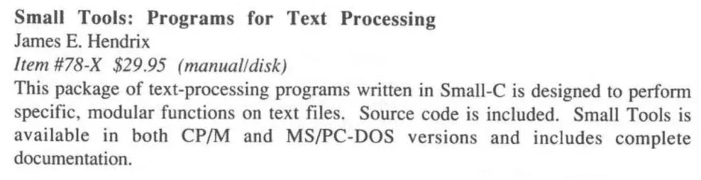
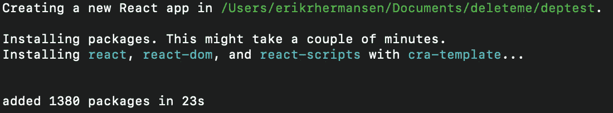
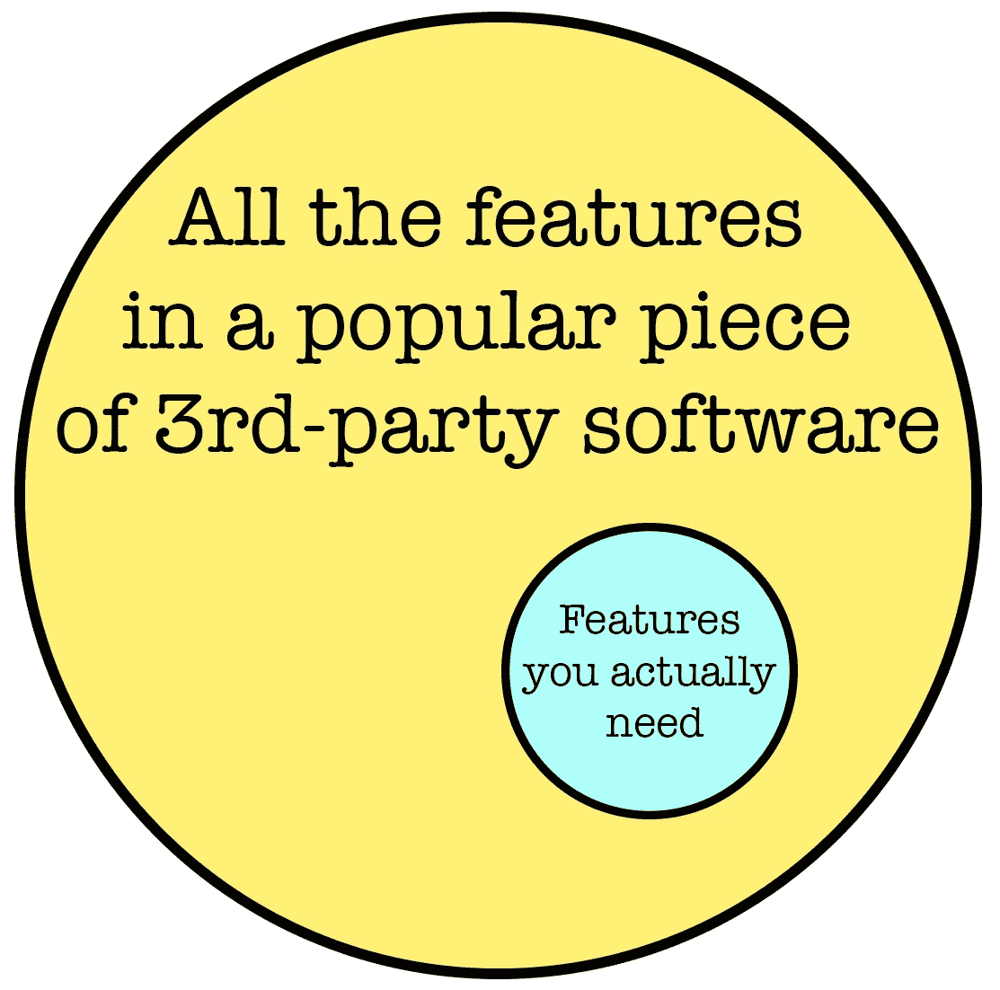
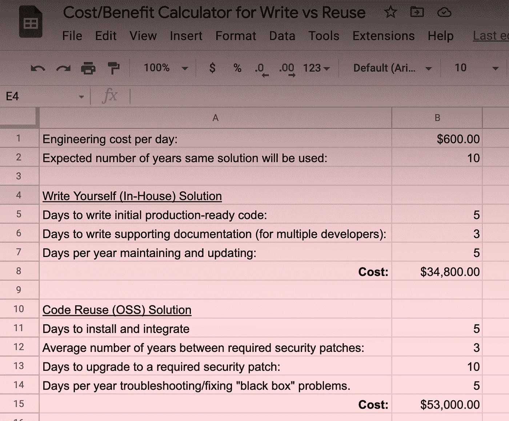

# 多写，少用

> 原文：<https://levelup.gitconnected.com/write-more-reuse-less-fbf8a010c5f4>


这篇文章是关于在隐喻的岛屿上写代码的。

我在 90 年代写过代码。互联网还没有被阿尔·戈尔发明，因此我们也错过了开源、NPM 和 Github。等待使用的自由软件少了很多。

结果，我们古代的程序员为我们的项目写了很多低级的东西，比如不可变的字符串类、双向链表和排序函数。

一个诱人的想法是，任何东西都可以在一个周末内被编码。硬盘碎片整理程序？关系数据库引擎？核电站调节器？当然可以！一个周末的咖啡因辉煌可以完成任何事情！

我认为工程师仍然对他们能编码的东西感到骄傲。但在早期，更容易成为它的牺牲品。因为没有那么多可用的自由软件。你可以浏览纸质杂志的广告栏，寻找能解决你问题的商业图书馆。



德高望重的多布博士杂志上的一则广告。是的，人们居然把 ***卖给了*** 库来换取真金白银。

或者，您可以在工作场所询问现有的代码或已知的库来解决您的问题。如果你问一些太简单的事情，比如说…写一个 FTP 客户端，你可能会被一个真正的程序员责骂。“老兄！打开一个套接字，读，写。没那么难。”

在这种文化中呆了大约五年后，我们大多数人会发现快速、出色的黑客并不那么有价值。经验告诉我们，好的代码比我们最初的猜测要花更长的时间来编写。周末只有两天——这不是一个可以实现任何编程壮举的神奇时间。

对我来说，一个转折点是 C++标准模板库(STL)。我用了好几年了。我意识到，我很难写出比亚历山大·斯捷潘诺夫更好的散列表或队列类。这个可靠且优化的库的每一行都受到了如此多的关注，以至于重新发明是愚蠢的。

对于最近十年出现的编码人员来说，重用代码的价值听起来一定是显而易见的。但那时候不太明显。我们有更少的自由的、可重用的代码。所以 Gilfoylesque“真正的程序员写他们自己的代码”的概念在我们脑海中占据了很大的位置。


在 90 年代就像这样，但有着肥胖的 CRT 显示器、剃刀滑板车和 Jolt 可乐。

# 但是我们变好了

有一棵技术树从 90 年代解锁到现在，互联网的普及是最有影响力的变化。

在技术方面，版本控制、构建管理和软件包管理的软件得到了改进和更广泛的使用。如果你现在正在编写一个基于节点的 web 应用程序，你只需输入“npm install some-great-thing”。几秒钟后，你会得到一些很棒的东西。

在文化方面，我们的技术商店有更多不同的人来编写代码或影响软件的创建方式。在今天的世界里，一个来自 UX 团队的设计师，他不写任何代码，可以成功地游说在一个项目中使用材料设计库。

如今，编码人员花在编码上的时间更少了。在 90 年代，我有一些工作，98%的时间除了编码什么都不做。不去开会。不是阅读要求。不更新 JIRA 门票。不测试我的代码。而不是摆弄木偶的配置。如果今天还有人在寻找那种“只是编码”的工作，祝你好运！事情已经变了。

现代工程师是一头灵活的野兽。公司不同的需求将他们拉向不同的方向。在某一天写三个小时的代码是一种难得的享受。随着工程师们成功地妥协，以多种方式提供价值，“我为乐趣而工作”的感觉已经减弱。只是“写自己的代码”就不那么自反了。

一个 90 年代的开发团队会对你花五天时间从头开始编写一个奇特的缓存算法的决定表示敬意。

今天一个开发团队会叫你出来，因为你放纵的奇思妙想破坏了 sprint。"你为什么不直接使用阿波罗客户端的缓存？"

对许多人来说，写代码是一种原始的快乐——他们会在荒岛上免费做这件事，没有人要求他们这么做。事情已经发展到压制这种原始的快乐，让工程师更像对待工作一样对待他们的工作。

我认为经济力量最终必须驯服在个人电脑上编程的野蛮现象。只是花了点时间。我怀疑这些变化是随着前工程师变成工程师的经理而出现的。与他们的前任不同，这些经理明白他们的报告要做什么。“不，不要浪费时间编写自定义缓存，”经理给出了一个线索。“我们需要实现我们的冲刺目标。”

# 然而……

我想我们在另一个方向走得太远了。我们获取库、包、插件和框架的速度有点太快了。

我们抓取的每一个第三方软件都是由其作者用相似的“贪婪”习惯制作的。所以我们最终会产生疯狂的传递依赖。如果你使用 *create-react-app* ，这是脸书用来创建样板 web 应用项目的工具，它将安装超过 1300 个由超过 1300 个不同的人编写的包(库)。



安装完 1380 个软件包后，您就可以编写您的“Hello，World”程序了。

让我们考虑一下重用第三方软件与从头开始编写相同功能的利弊。我会尽可能公正地对待这件事。

**重用的利弊:**

*   重用别人的代码通常比自己写代码花费的时间要少。
*   重用代码的作者花了一些时间来发现错误，并对代码质量、安全性和性能进行改进。
*   您可能会从重用代码的未来更新中受益。
*   您可能会受益于以后想要使用的附加功能，如果不是最初使用的话。
*   将提供使用代码的文档。
*   除了你之外的其他工程师将更容易学会如何使用重用的代码。

**重用的弊端:**

*   学习重用的代码需要时间，特别是如果它是一个要求你按照自己的方式而不是你喜欢的方式来构建代码的框架。
*   修复重用代码中的错误和其他问题需要更多的时间。这是因为代码库可能比仅仅为项目需求而从头编写的代码更大更复杂。而且理解别人的代码比理解自己的代码更难。
*   重用的代码很可能提供超出您需要的功能的超集，因此导致软件膨胀(超出最小从头开始解决方案所需的额外内存、磁盘或 CPU)。
*   您的安全漏洞风险会增加。而相应的，你花在更新软件避免安全漏洞上的时间也就上去了。

# 安全问题


黑客！你会发现他们在空荡荡的办公楼里戴着面具。他们很坏。

你可能会注意到上面“赞成”和“反对”的矛盾。我似乎认为重用代码既提高了安全性，也恶化了安全性。实际上，是的，这就是我想说的。我认为有两种独立的“好”和“坏”的力量同时向两个方向推动。

我一直说“重用代码”是最通用的术语。但是现在我们从哪里得到重用的代码呢？*开源项目。*让我们看一个具体的例子，它说明了重用一个流行的开源项目的代码的后果…

# Log4Shell 灾难

Apache Log4j 是一个用于记录来自基于 Java 的软件的消息的库。它如此受欢迎，以至于它基本上是在 Java 中处理该功能的默认选择。您可以像这样编写代码:

```
logger.info( "The app has launched." );
```

Log4j 会将消息附加到日志文件中。Log4j 被设计成高性能的。它是可配置和可扩展的，可以满足企业中出现的各种需求。例如，您可以将其配置为将消息写入 PostgresSQL 数据库。


很多人都看过 Log4j。

莱纳斯·托沃兹有一句名言:“人多眼杂。”

Log4j 的 [Github repo](https://github.com/apache/logging-log4j1) 展示了十年的 Git 提交，有八个贡献者，超过 50 万用户。Log4j 绝对拥有 Linus 推荐的“许多眼睛”。对我来说，毫无疑问，由于所有这些关注，Log4j 变得更加可靠和无 bug。

但在 2021 年 12 月，几乎世界上所有拥有基于 Java 的软件的公司都不得不急着升级 Log4j，以避免遭到黑客攻击。而一些不幸的人没有足够快地做到这一点，让黑客利用[“log 4 shell”安全漏洞](https://en.wikipedia.org/wiki/Log4Shell)在服务器和其他软件上运行任意代码。

请记住，Log4Shell 是一个[零日漏洞](https://en.wikipedia.org/wiki/Zero-day_(computing))。因此，在任何安全补丁可用之前，有一段时间黑客一直在攻击。如果你不幸成为零日窗口的目标，那么在你的项目中再多谨慎的库更新都不足以防御。零日攻击是所有公共第三方软件的致命弱点。

更新部署和其他软件中的库似乎是一项小任务。但是当你在所有需要修复的软件上加倍努力时，这可能是巨大的。当一个漏洞补丁是一个迫切需要的更新时，你不能用其他的改变优雅地执行更新。没有 CI/CD 基础设施的公司将花费额外的时间进行手动测试和修复损坏的构建。

在我工作的一家大型金融科技公司，可能有 24 个工程团队负责更新 Log4j 的 100 多个部署。背面的计算向我暗示，该公司在处理升级方面损失了大约 4 万美元。请注意，这只是“快乐之路”的场景，一家公司修补他们的软件，并设法避免被黑客攻击。如果你*真的*被黑客攻击，那么风险会以数量级上升。

许多使用 Log4j 的公司确实被黑了。美国网络安全和基础设施安全局局长 jen Easterly[将 Log4Shell 描述为](https://www.cnn.com/2021/12/13/politics/us-warning-software-vulnerability/index.html)“我整个职业生涯中见过的最严重的事件之一，如果不是最严重的话”。数亿台设备受到影响。

# 思想实验:编写自己的日志库

不用 Log4j，自己写日志库有多难？

如果你想和 Log4j 拥有同等的特性，那需要几个月的工作。但是流行软件涵盖的用例比任何个人或公司需要的都要多。因此，一个实际的替代品可以是 Log4j 功能的子集。



不要贪图你永远不会用到的功能。

工程师可以在大约一周内创建一个可靠的、生产质量的日志库。这个库不会拥有 Log4j 所有令人印象深刻的特性。但是它可能具有某个特定公司所需的基本功能——与日志写活动分离的队列、可配置的日志记录级别、日志文件轮换等。我已经多次编写代码来实现这一点。只是没那么难。

如果您编写自己的内部日志库，它比 Log4j 这样的“许多眼睛”项目更有可能包含安全漏洞。这一点必须得到承认。


他懒得去黑你的冷门软件。

但是全世界的黑客都没有动力去寻找内部软件的漏洞。从他们的角度来说，发现 Log4Shell 这样的漏洞需要做大量的工作。黑客通常不想攻击某个公司使用的不知名的专有库。他们更喜欢启动机器人来探测流行软件中的已知漏洞，例如对数十万家公司使用的 Log4j。

当然，事后看来，很容易认为编写自己的日志库是一个有吸引力的替代方案。但是我们无法提前知道哪些第三方软件会有安全漏洞。它可能只是 Nginx、Angular 或 PostgresSQL 具有同等的漏洞。很明显，我们不想为每一个软件都编写一个内部版本，以获得“通过晦涩来实现安全性”的好处。

但是考虑到所有的风险和成本，在您应该选择以第三方软件的形式重用代码之前，有一个特定的价值阈值要达到。我认为流行的惯例把这个门槛定得太低了。我们太容易认为最好下载、导入和安装代码，而不是自己编写代码。

# 门槛应该在哪里？

你可以通过基本的成本/收益分析来做出这个决定。我甚至为你做了一个电子表格。请随意保存工作表的副本，并在其中编辑您自己的值。



我怀疑，在 IT 行业中，围绕安全漏洞及其所需升级的成本经常被低估。你不会在第三方软件中使用的功能的价值被高估了。基于“数量安全”的偏见，我们会考虑很多人使用第三方软件。但是从安全的角度来看，这无疑是一个负号。

我没有数据支持这一点。我只是根据自己和他人的经验有一些预感。2022 年是我的想法向写更多代码和更少重用转变的一年。我给大家分享几个趣闻。

# 靴带咬伤和其他悲惨的故事

三年前，在我工作的一家公司，他们的内部 pen-test 在 Bootstrap(一个用于 web 应用的 CSS 框架)中发现了一个漏洞。pen-testers 修复该漏洞的建议是将 Bootstrap 更新到较新的版本。

不幸的是，推荐版本的 Bootstrap 充满了突破性的变化。要使用这个新版本，我们需要重写大量的网络应用程序。这个库给我们的特殊用例提供了很少的价值。我们内部的 UX 团队指定了他们自己的设计系统。多年来，我们有效地替换了 Bootstrap 的默认外观。

在 pen-test 发现的时候，Bootstrap 除了要求我们更新它之外，几乎没有为我们做任何事情。这已经成为一种负担。

因此，我们没有升级 Bootstrap，而是花了几个人月的时间从我们内部的小部件库中删除 Bootstrap。这是极其昂贵的，但可能是最好的选择给我们的选择。

我希望早期创建小部件库的工程师没有决定将 Bootstrap 引入其中。他们不需要知道未来来做决定。他们可以简单地考虑向项目中添加任何新库的固有风险和成本。考虑到该库在满足我们特殊需求时带来的微小价值，不难想象拒绝它。

我也看到工程师导入库来处理琐碎的任务。无意冒犯杰德·沃森，但是他的 [classnames NPM 包](https://www.npmjs.com/package/classnames)可以用一些基本的字符串连接替换。有人将 *classnames* 引入到一个项目中，就像一个青少年要求他们的妈妈从冰箱里给他们拿一杯可乐。自己做就好了。

为一些普通的功能编写无数冗余的实现可能会让人本能地感到浪费。但是从我所描述的风险和问题的整体情况来看，您会选择更频繁地编写自己的代码。

而且，你可能会恢复一点我刚才说的那种原始的快乐。毕竟，写代码很有趣。


该编码了。


* * * [媒体学分](https://medium.com/@ErikH2000/where-my-media-comes-from-59761dc4be7) * * * [想要一份工作？](https://medium.com/@ErikH2000/yes-i-can-help-you-get-an-it-job-b0b51fee4c95) * * * [LinkedIn 个人资料](https://www.linkedin.com/in/erikhermansen) * * *