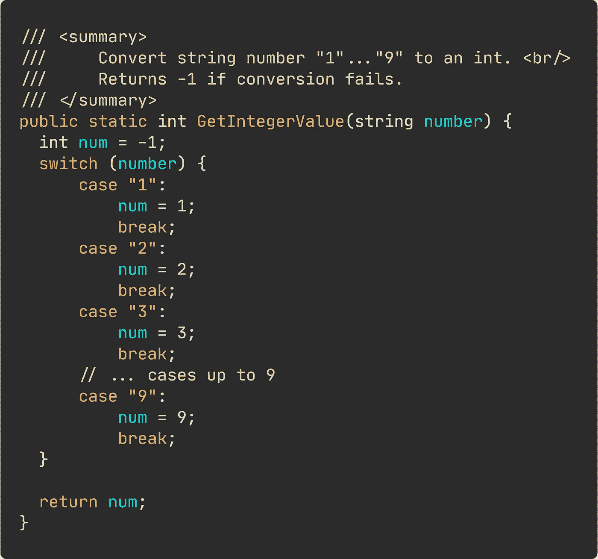

# 写无耻的垃圾代码

> 原文：<https://levelup.gitconnected.com/write-shameless-garbage-code-ba6f79d46ed9>

## 实用编程技巧

## 并非所有代码都是平等的。有时，垃圾代码就足够了。


作者图片

谁是法官，对吧？

我是设计模式的倡导者。我喜欢写整洁、干净的代码，在我认为合适的地方深思熟虑地应用设计模式。当你正确而毫不费力地实现一个设计模式时，这是一种令人难以置信的满足感。当强行尝试应用不合适的模式时，情况正好相反。

然而，有时候我只是需要将一个用户故事从进行中转移到测试中。很快。

根据您正在解决的问题，编写垃圾代码可能完全没问题。所谓垃圾代码，我指的是过于臃肿和简单的代码，然而，功能正常。

不要把垃圾代码误认为是不符合要求或者失败的代码。这是不够的，错误的代码，本质上完全不同。

## 定义明确的需求的垃圾代码。

您可能会嘲笑下面代码片段中的代码有多垃圾。当我告诉您这样的代码确实存在于产品代码中时，您可能会感到困惑。



将字符串值转换为整数的次优方式。

当然，你可以用一百万种不同的方式来编写这段代码，也就是说，用更好的方式。快速返回而不是中断，使用`int.TryParse()`等。等。

但是，假设需求是，“接收一个字符串值，并将其转换为整数。您可以放心地假设该字符串将始终是一个字符，并且在 1–9”的范围内。

代码成功了。提交。用力。向前看。

一旦你获得了更多的知识，有了更多的时间，你可以随时回来重构这个方法。

最终，最终用户真的不在乎你的代码结构有多好，或者你是否使用了`if-else`而不是`switch`。

## 实验通常需要无用的代码。

当你处于试验阶段时，创造复杂的设计什么的就没有意义了。无论如何，在确定一种方法之前，你将会对代码进行一千次处理。

你必须意识到你写坏代码的决定，并意识到为什么它是坏的。

[通常，在进行实验时，唯一的关注点是“让事情运转起来”。然后，您可以使您的代码更好更快。](https://medium.com/better-programming/the-principles-of-software-development-7415e7c5a156)

## 遵守紧迫的截止日期。

你可能听过其他程序员告诉你，截止日期不能成为垃圾代码的借口。

理想情况下，不应该。但是，在极少数情况下，确实如此。

有一次，我被分配到一个项目，这个项目迫切需要弄清楚在处理刑事案件的数据时出了什么问题——追溯到九年前。影响是巨大的，已经成为新闻媒体报道的公共丑闻。人们可能被错误地监禁，囚犯们作为我的团队从监狱中被释放出来，我解决了这些问题。

根据合同，我们必须在规定的最后期限前完成。延长最后期限不是一个选项。

不用说，在那段时间里，我并不是最自豪的代码。

有时，速度比易于维护更重要。

## “用正确的方法去做”的冲动会让人麻痹。

如果你觉得每一行都必须完美无缺，你可能会陷入分析的困境。通常，简单地解决手头的问题会好得多。

然后重复重构。

[重构你的代码，增强七种内部代码质量中的一种或多种。](https://medium.com/better-programming/refactoring-rules-of-thumb-for-beginners-to-become-experts-70161c3c4f20)

## 小心你写垃圾代码的时间和地点。

当您处理不明确的需求、职责扩散、对任何好的开发实践失去尊重时，垃圾代码的问题开始增多。

你经常会在干净整洁的代码中看到垃圾代码。当需要额外的处理步骤时，无用代码往往会被注入到现有代码中。

避免将垃圾与结构良好的代码放在一起。尝试隔离垃圾代码，例如将其包装在方法中。这会让你以后的生活更轻松。

# 糟糕代码的一些共同特征。

显然，没有人应该努力编写糟糕的或无用的代码。读完这篇文章后，你不应该感到被鼓励去用最差的方式实现任何特性。

我们给一些代码贴上“不好”的标签是有原因的。

通常，它归结为以下一个或多个特征:

*   执行时间慢。
*   很难理解。
*   调试困难且耗时。
*   脆弱——小的、无关紧要的变化可能会搞乱你的应用程序。
*   硬编码的值和变化。任何更改都需要重新编译。
*   臃肿或者过于简单。

```
**Resources for the curious**
-------------------------[When To Write Bad Code](https://www.brandonsavage.net/when-to-write-bad-code/) by Brandon Savage
```


**Nicklas Millard** 是一名软件开发工程师，供职于一家发展最快的银行，负责构建任务关键型金融服务基础设施。

此前，他是 Big4 的高级技术顾问，为商业客户和政府机构开发软件。

> [新的 YouTube 频道(@Nicklas Millard)](https://www.youtube.com/channel/UCaUy83EAkVdXsZjF3xGSvMw)
> 
> *连接上* [*LinkedIn*](https://www.linkedin.com/in/nicklasmillard/)