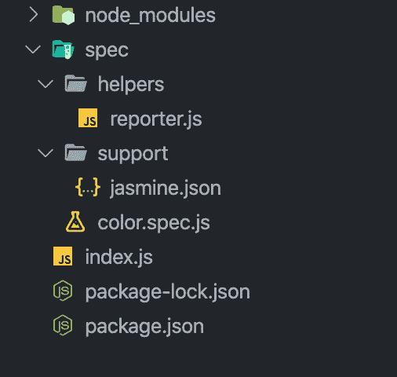
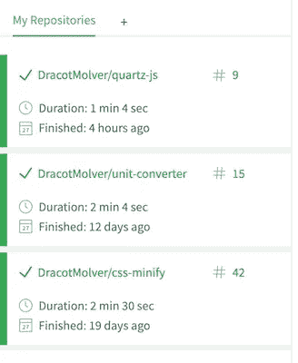
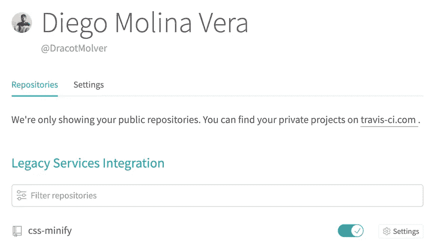
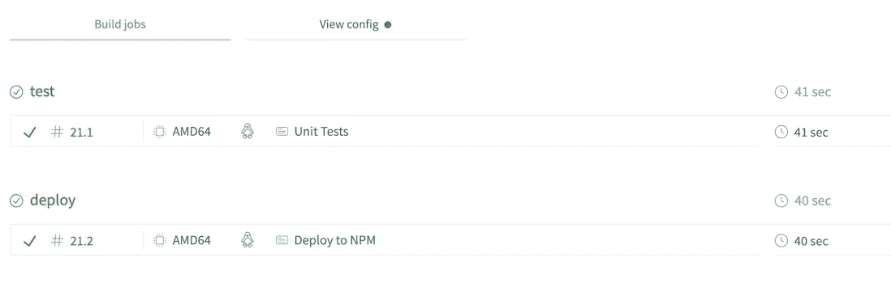
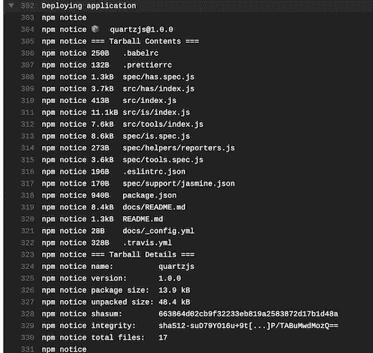

# 使用 Travis-CI 编写、测试和部署您的第一个 NPM 包

> 原文：<https://levelup.gitconnected.com/write-test-and-deploy-your-first-npm-package-using-travis-ci-74b5ab94379c>

## 我将使用 Jasmine 做一个简单的测试，并逐步指导您使用 Travis 上传您的第一个 npm 包。

在给你一个关于如何使用 Travis 部署你的 npm 包的简单小指南之前，我想鼓励你写任何东西！甚至重新发明轮子*(我会写一篇关于这个的文章，因为我认为这是一个有趣的主题)。写代码是从自己的错误中实践和学习的唯一途径。这里解释的是我使用这些工具的学习过程。这意味着我不是专家，但学习过程绝对是美好和成功的。所以我想和你分享。*

我将尝试解释以下内容:

*   编写一个简单的包，使用一个非常简单的函数将任何单词转换成十六进制的颜色格式。这只是出于教育目的。
*   测试将返回十六进制值的函数。
*   添加 Travis 配置文件。
*   将我们的项目上传到 Github，并将 Travis 与我们的 Github 帐户连接起来。
*   让特拉维斯做所有的工作。测试和部署应用程序，然后将您的包上传到 npm。

> **重要提示:**启动前需要创建一个 Github 账号和 npm 账号。

# Package.json 文件和我们的 Index.js 文件

不要害怕。编写一个 npm 包并不困难，而且你可能还没有做过。让我们从你需要的基本东西开始，一个`package.json`文件。

如果您还没有 package.json 文件作为样板文件，最好的方法是从您喜欢的终端运行`npm init`命令。运行该命令后，终端会提示询问您:

*   `package name`:明智地选择名字。知道这个名字是非常重要的，它将被用于安装和导入你的包到你的项目或者其他项目中。选择一些既容易写又有想象力的东西💅。对于这个例子，我将选择 **colorword。**
*   `version: (1.0.0)`如果你不知道这里写什么，就留空白。
*   `description:`写一首好听的。例如- *微小却有趣的将单词转换成十六进制颜色的库。*
*   `entry point: (index.j)`这是索引文件表单**，您的函数将在此导入。如果你出于某种原因正在使用 babel，并且你的最终代码在`lib`处，那么入口点将是那条路线。**
*   现在，让它保持空白。你以后会改的。
*   `git repository:`在将要托管代码的地方添加 git repo。
*   对于这个例子，不需要关键字。但是如果你想找到合适的人，你会想用它们的。例如`words to colors`或`javascript`。
*   `author:`你的名字。你可以成为摇滚明星！🙌。
*   `license: (ISC)`这取决于你。我大多用麻省理工的执照。

就是这样！现在创建一个索引文件，并将其留空，因为现在您将进行第一次测试！

我做了这个无聊的图像:P

# 测试您的功能

为了测试，我将使用 Jasmine。没有什么反对其他人的；实际上你可以使用任何其他测试框架，比如 Mocha ( *我喜欢在后台运行 Mocha*)，但是我只是想使用 Jasmine，因为它简单且易于安装。现在，你需要安装`jasmine`和`jasmine-spect-reporter`。安装之后，你必须配置 Jasmine。所有这些都非常简单，只需运行:

`npx jasmine init`

> npx 是一个包运行程序，它运行 npm 存储库中的任何包。这非常有帮助，我们可以运行任何 CLI 工具，而无需在全局或本地安装它。

这将创建一个带有一些默认配置的`support`文件夹。您不需要从这里修改任何东西，但是您需要创建第二个名为`helpers`的文件夹，在这里您将添加一个`reporter.js`文件并添加下面几行代码:

jasmine 记者配置

这是为了在运行测试时在终端上获得一个好的报告。现在修改您的 package.json 并替换您的`test`脚本:

`"scripts": {"test": "jasmine"}`

这就是 Jasmine 的安装和配置。最后，您需要编写名为`color.spec.js`的第一个测试。将下面几行代码添加到该文件中:

基本茉莉试验

> **注**:测试文件的术语很多。可以使用:`_color_test.js`，或者`color.test.js`，或者`Spec.color.js`，等等。我推荐你阅读哪一个与你正在使用的框架一起被广泛使用。这里我用的是 Jasmin。茉莉中使用`spec`字是一个标准。

完成所有设置后，您的项目结构应该如下所示:

项目结构

如果你运行你的测试，它将会失败。这是因为你还没有写任何代码。这种做测试的方式叫做 **TDD** 。我不打算深究此事。但是[维基百科](https://en.wikipedia.org/wiki/Test-driven_development)对此有很好的解释。

`colorWord`函数背后的想法是选择一个单词，在本例中是`hello`，只使用它的前 3 个字母，并从中获得十六进制颜色。

现在，把密码给我！将这段代码添加到函数中，然后再次运行测试。现在应该成功了。

现在您已经完成了第一个测试，并且工作正常— *记住，这只是一个基本的例子，在现实生活中，您将会有大量的测试*😅—现在是时候配置 Travis 在每次添加或修改代码时运行您的测试了，然后再部署您的包并与世界共享它！。这被称为持续集成(CI ),测试只是其中的一部分。

# 配置 Travis 并将其与您的 Github 帐户连接

如果您没有 Github 帐户，请创建一个😬。当你访问 Travis 网站时，你将使用你的 Github 帐户注册，使一切变得简单。一旦您进入，您必须添加存储库，从中您将获得您想要测试和制作 CI 的上传项目。转到左侧面板，然后按加号。

我的特拉维斯的左面板

正如您在图片上看到的，这是我的 Travis 面板，我添加了 3 个存储库。它们中的每一个都有测试，其中一个有不同的配置，也就是您现在要使用的配置。此配置包含“步骤”,例如:测试和部署(如果测试成功)。

当您添加一个存储库时，您可以配置 Travis 将如何运行*。*一些配置是:在推送到主分支后运行，或者仅当有拉请求时运行，等等。目前只切换按钮，不做任何额外配置*。*

Travis 从我的 Github 帐户显示我的存储库列表的例子。

在这之后，你应该回到你的项目，把下一段代码添加到你的`.travis.yml`文件中。

travis 配置文件的示例。我用这个做我的一个项目

您可以用许多不同的方式配置作业。对我来说，这是最适合我的项目的，我认为这个例子也是如此。

> 重要的:在这个例子中，我有`node_js`版本 12.13。您应该将其更改为您安装的 NodeJS 的版本。

让我描述一下文件中的一些标签:

*   `jobs`:这些是 Travis 将一个接一个运行的被称为`stage`的“任务”。
*   `stage`:这允许并行运行几个任务。在这种情况下，我有两份工作，一份在被称为`test`的`stage`，另一份在被称为`deploy`的`stage`。

> 构建阶段是一种将作业分组并在每个阶段并行运行作业的方法，但是是按顺序一个接一个地运行。
> 
> 在最简单也是最常见的用例中，如果其他几个并行作业已经成功完成，您现在可以让一个作业只运行*。—摘自 Travis 文档*

*   `name`:它将为作业指定一个名称。当它们在主页或仪表板上运行时，您可以找到它。
*   `email`和`api_key`:这些很重要，你得去你的 npm 账户。如果你没有，那就创建一个。创建您的帐户后，只需登录并转到您的个人资料，然后从这里创建令牌就非常简单了。复制该令牌并转到 Travis 网站，单击显示**更多选项**的按钮并单击**设置**，然后转到**环境变量**并添加环境密钥。这些键与文件中的常量相同，`NPM_EMAIL_ADDRESS`和`NPM_AUTH_TOKEN`。任何名字都可以作为环境变量使用一些有意义的东西，比如你正在做的项目和环境变量的用途。

Travis 默认运行测试。在你得到的配置文件中，它将运行测试，然后运行下一阶段。你会在 Travis 身上看到类似的东西:

运行作业

如果你点击`deploy`，你会看到类似这样的东西:
*(这是我的一个项目的图片。这只是一个终端会提示你什么的例子)*

就是这个！现在，您可以着手一个您心目中的真实项目，并开始向全世界部署经过测试的版本。

在整个过程中，我遇到的一个问题是 Travis 配置文件。有一个选项允许你从 Github 使用你的`stag`。这在文档中并不清楚——至少对我来说是这样。如果您在`travis.yml`文件上使用参数`tags:true`，您必须小心，因为如果您这样做，您还需要添加`all_branches:true`来使其工作，但是您不能一起使用`branch: <name_of_your_branch>`和`tags:true`，否则它将无法给您下一条消息: ***跳过使用 npm 提供者的部署，因为这不是标记提交。***

此外，拥有一个`.npmingore`文件是一个好主意，这样可以避免将任何不必要的文件和您的包一起推送到您的 npm 存储库中。

就是这个！我希望你喜欢这篇文章，这对你有用。我还在学习一些关于 npm 包的东西。

感谢我的丈夫 J. Drake 帮我审阅这篇文章。❤️

干杯！