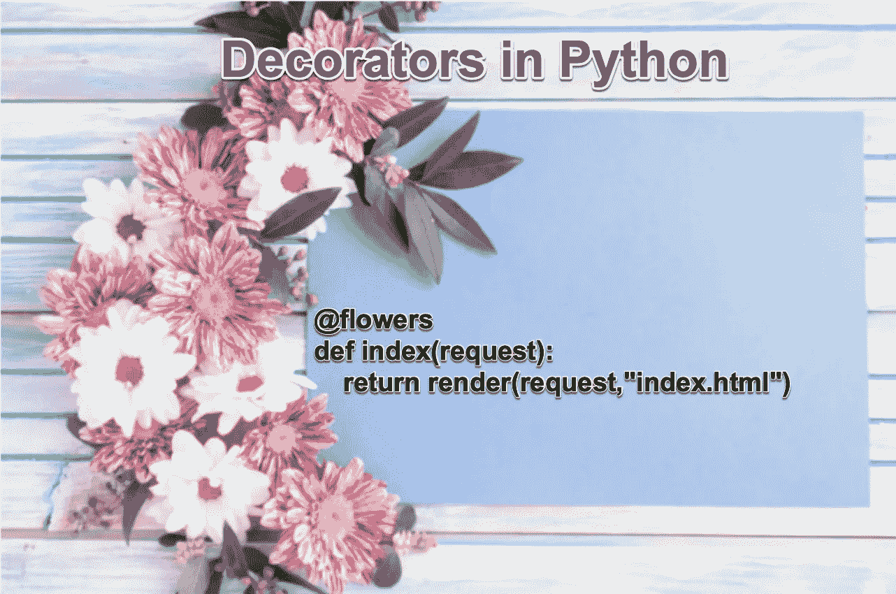

# 用 Python 在 5 分钟内编写你自己的装饰者

> 原文：<https://levelup.gitconnected.com/write-your-own-decorators-in-python-in-5-minutes-f32171c50241>

Python 中装饰者的快速介绍



你见过和用过很多次装修工。但它对你来说一直很神奇。

是时候最终理解 Python 中的 decorators 了。

## 为什么要用装修工？

通常，这是一种修改大量函数的简单方法。

例如，您希望确保只有授权用户才能访问该功能。

或者您希望避免将某些内容打印到控制台。但只针对某些功能。并且您希望快速打开和关闭该功能。

或者你想先对你的参数做一些预处理。

好的一点是开关起来总是很方便。

## 简单的例子

Alice 为 Bob 编写了一个 web 服务。她只希望鲍勃能够阅读信息。

她是这样做的:

当调用函数 show_info 时，Python 看到一个装饰器，不调用 **show_info(user)** ，而是调用:**only _ bob(show _ info)(user)**

“ **only_bob** 函数返回另一个函数，即**包装器**。这是【T8 only _ bob 函数的最后一行:

```
return wrapper
```

于是， **only_bob(show_info)(用户)**变成了 **wrapper(用户)。**然后包装器运行 **show_info** 函数。但并不总是如此。

在包装器内部，您可能想要运行函数 **show_info** 。也可能不会。这取决于你。您也可以更改如下参数:

> 请注意，您传递给 **show_info** 的参数是传递给**包装器**，而不是直接传递给 **show_info** ！

## 多个装饰者

这一切都很好。

那么多装修工呢？

这里有一个例子:

这里，一个脱衣舞娘调用了 only_bob 函数:)

所以，我们运行的是:

```
stripper(**only_bob(show_info)**)(user)
```

然后 only_bob(show_info)返回给我们一个函数包装器。它变成了:

```
stripper(**wrapper**)(user)
```

剥离器尚未运行包装功能！它可能运行它，也可能不运行它！

接下来，剥离器(**包装器**)返回另一个函数，即 stripped。我们得到了:

```
stripped(user)
```

这还是功能！我们不经营它！我们把这个函数传递给唯一的 bob。并且只有 _bob 根据参数决定是否运行 show_info 函数。但是，**剥离的**函数通过删除前导和尾随空格改变了参数。嗯。

总而言之，我们运行的内容如下:

```
wrapper(stripped(user))
```

你现在迷路了吗？我个人是。

改变装饰者的顺序，它将不会像你期望的那样运行。因为参数将被修整得太晚。

```
@only_bob
@stripper
def show_info(user):
  print(f"Hi {user}, here is my secret, don't tell anyone")
```

这将只输出一次秘密。

如果你喜欢它，看看我的其他文章。

祝您愉快！