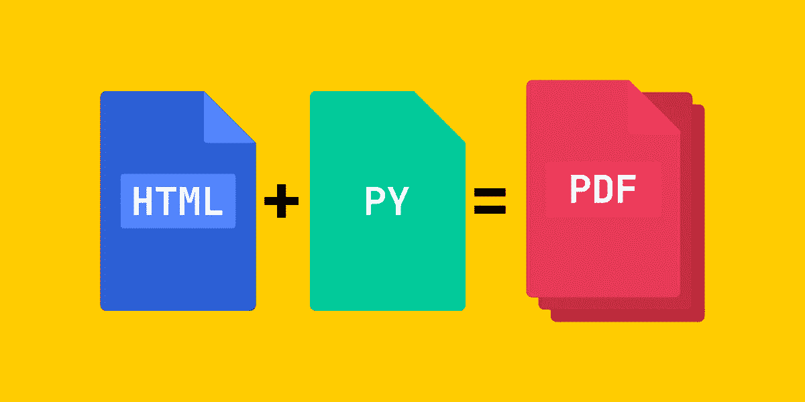
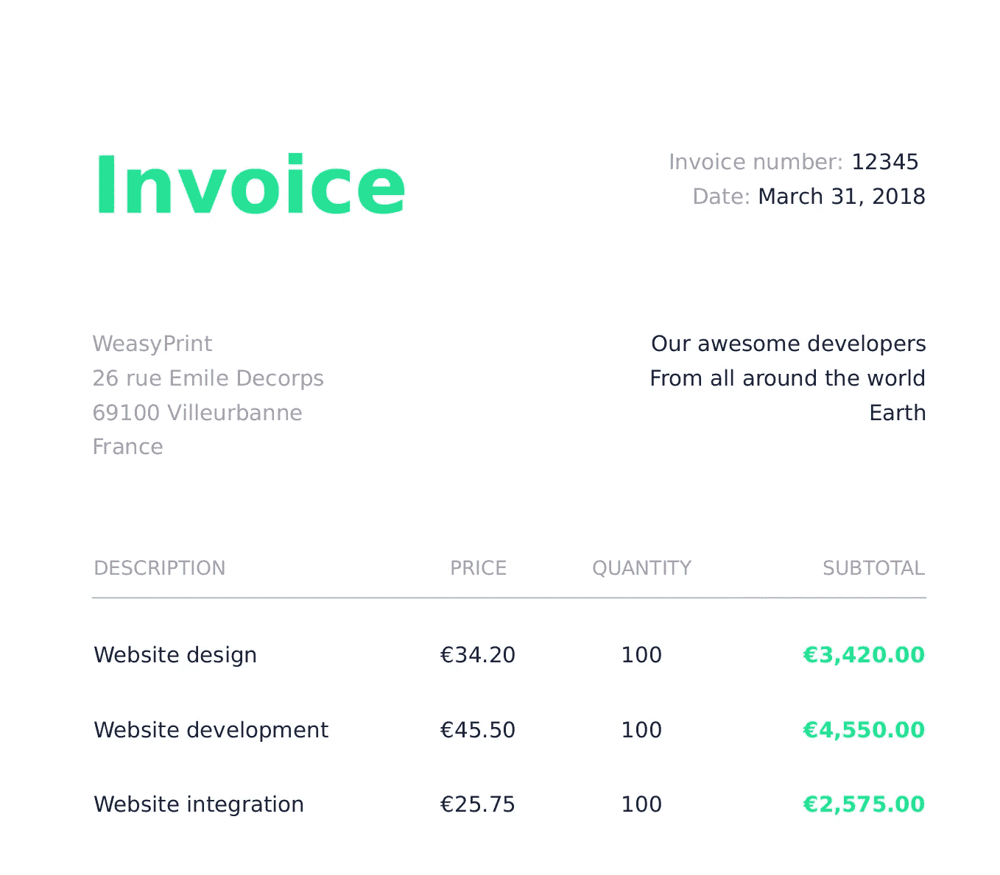
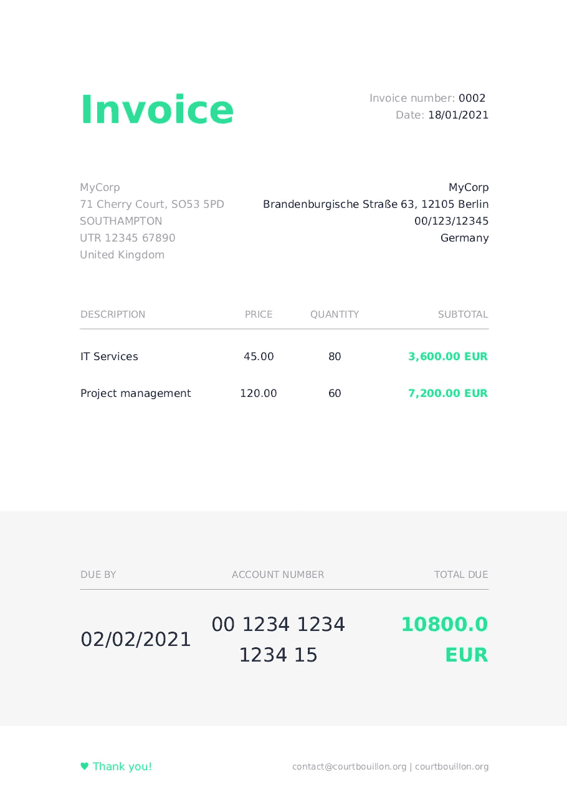

# 编写您的工具:使用 python 自动化 PDF 工作流

> 原文：<https://levelup.gitconnected.com/write-your-tools-automate-pdf-workflow-with-python-408bec38cade>



自动化 PDF 文件创建流程|按作者排序的图像

# 先决条件

**问题描述**

在这个故事中，我们将解决以下问题:**生成大量结构相同的 PDF 文件，但每个文件的数据不同**。当然，我们将使用 python 来实现这一点。

**Python 包**

*   [jinja2](https://pypi.org/project/Jinja2/)
*   [weasyprint](https://pypi.org/project/weasyprint/)
*   [PyYAML](https://pypi.org/project/PyYAML/)

您应该将上面提到的库安装到 python 环境中。

您将需要以下文件结构:

```
.
├── data.yml
├── output
├── pdfprocess.py
└── template.html
```

*   *data.yml* 文件将存储将要注入 PDF 文件的数据
*   *输出*是 python 脚本存储结果的目录
*   *pdfprocess.py* 是整个操作的大脑——这里我们将实现逻辑来将数据和 HTML 模板文件处理成 PDF 文件
*   *template.html*是 PDF 文件的 HTML 模板

# 履行

一如既往，让我们慢慢开始。作为第一个练习，让我们创建一个非常愚蠢的 PDF 文件，看看事情是否工作。

将以下代码放入 *pdfprocess.py* 文件中:

*template.html*文件为 *:*

```
<html lang="en">

<body>
  <p>TEST ME!</p>
</body>

</html>
```

现在，如果您运行这个脚本，您应该会得到一个新的 PDF 文件，它存储在*输出*目录中，其中有一个字符串:`TEST ME!`

现在让我们做一点小小的修改，这样我们就可以将一些数据注入到 PDF 文件中。

修改，HTML 文件:

```
<html lang="en">

<body>
  <p>TEST ME!</p>
  <p>Hello, {{ name }}</p>
</body>

</html>
```

这里的`{{ name }}`是一个 jinja2 表达式，由于 jinja2 知道一些数据应该放在这里，上下文变量应该命名为`name`。python 代码的修改应该只在一行中完成——准确地说是第 12 行:

```
rendered = template.render(**{"name": "John"})
```

你已经明白这是怎么回事了吗？所以，现在 HTML 模板已经注入了一个`name`等于`John`的数据。现在，如果您再次运行脚本，输出的 PDF 文件将包含两行:`TEST ME!`和`Hello, John`。

# 变得严肃

让我们试着从上面的例子中得到一些有用的东西。如果我在考虑大量的文档处理，我脑海中会立即浮现出发票。我是一个懒惰的家伙，所以让我们试着找到发票 HTML 模板——你可以去 *weasyprint* 的[样本页面](https://weasyprint.org/#samples)下载。我们感兴趣的文件是这里的。注意，我们还需要 [CSS](https://github.com/CourtBouillon/weasyprint-samples/blob/master/invoice/invoice.css) 文件。下载并保存在您的工作目录中。您的工作目录应该处于这样的状态:

```
.
├── data.yml
├── output
│   └── test.pdf
├── pdfprocess.py
├── template.css
└── template.html
```

其中*template.html*和 *template.css* 有从以上链接下载的内容。

要使用 CSS 文件，我们需要修改渲染方法:

现在，如果您运行该脚本，您将获得一张漂亮的发票:



weasy 根据他们的样品打印发票。

现在的问题是，数据硬编码在 HTML 文件里，没有太大意义。让我们改变它！

现在， *data.yml:*

正如您在这里看到的，invoice 实例通过键的名称保存了对正确的客户和发行者的引用。你也可以在这里使用 YAML 锚。这是因为我们不想一次又一次地输入这些数据。我们将在 *python* 方法中处理这个问题:

这个方法将把我们的 YAML 数据文件转换成适当的上下文，以便使用 *jinja2* 呈现 HTML 模板。

整个 python 脚本现在有 38 行，如下所示:

如果您现在运行脚本，您将在输出目录中创建两个新发票:

```
.
├── data.yml
├── output
│   ├── 0001-CoolCompany.pdf
│   ├── 0002-MyCorp.pdf
│   └── test.pdf
├── pdfprocess.py
├── template.css
└── template.html
```

发票`0002-MyCorp.pdf`看起来是这样的:



最终发票。

# 总结和练习

**练习**

*   在 HTML 文件中修改发票的页脚——把你自己的信息放在那里。
*   修复 CSS 样式——正如您在帐号字段中看到的，只有非常短的字符串看起来很漂亮。
*   想一想如何自动从某个数据源获取数据，如果愿意的话，可以实现它。
*   想想怎么能自动发这样的发票，喜欢就实现。
*   赞成:为你的国家实施增值税计算。

**总结**

有趣的是，我就是这样管理我自己的独资发票的——当然，只有很少的改进，但是过程基本上是一样的。我认为这个工作流非常强大，你可以使用上面提到的 *python* 包来实现很多功能。**和我的同事一起，我们常说 *jinja2* 能够解决 80%的程序员问题；)**

感谢阅读。