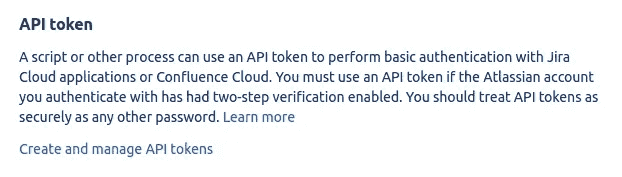
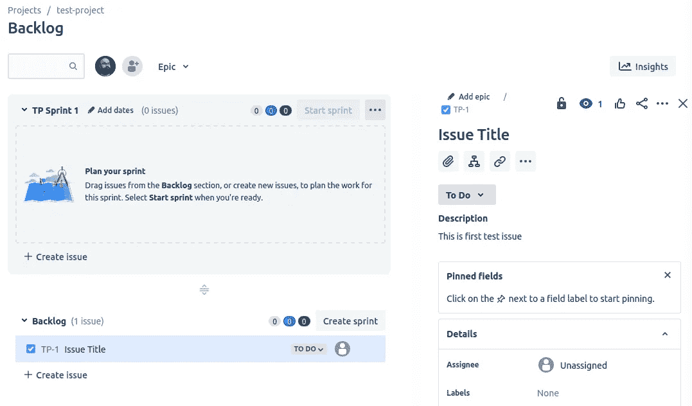
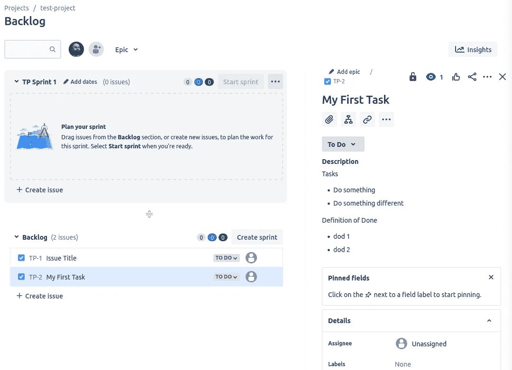

# 编写您的工具:简单的 JIRA 自动化

> 原文：<https://levelup.gitconnected.com/write-your-tools-simple-jira-automation-c0421aaf6ec>


你应该对工具自动化的新思想持开放态度

我最近有一个想法，自己编写工具是一种令人耳目一新的体验，它可以让你走出日常工作，同时，它还可以帮助你学习新的东西。这个学习过程真的很刺激，有时接近沮丧感，有时接近兴奋感，有时接近 T2。这不仅仅是你的事。你也可以帮助你组织中的其他人。

**你正在使用的大多数基于网络的服务都有一个 API** (或者至少是伪装成 API 的东西)。这是因为大多数类似 SaaS 的企业都有一个面向最终用户的 SPA(单页应用程序)应用程序，在这个架构中，API 需要在某个地方。这些 API 的问题在于，它们通常不是设计用于“原始”模式的。基于 API 的产品是一个不同的故事，因为那里的 API 设计和易用性是惊人的。

请记住，直接使用 API 是具有挑战性的，这些 API 最初是为了支持内部开发团队而设计的。你会遇到像糟糕的文档、过时的文档、根本没有文档、没有文档的 API 怪癖、乍一看很难理解的奇怪的解决方案等等问题——这是学习过程中令人着迷的部分。

在这个故事中，**我将向您展示如何开始构建您的 *Python* 脚本来管理 JIRA** 。首先，我应该解释我为什么这样做。我认为至少有两个原因:

*   JIRA 接口激怒了我。这并不是说我不喜欢它的外观，我不喜欢它的工作方式，作为一个专注于 web 开发的开发人员，我不断地问自己如何才能提供一个界面，这简直是笨拙的。页面和模态加载 *ages，*HTML 元素的加载移动了其他元素——我就像是在我点击了错误的地方的情况下结束；这里提到的所有事情都是可以原谅的，最后，JIRA 是一个非常令人印象深刻的工具，有很多功能，让它*平滑*是一种挑战，下一个原因在这里更重要。
*   我讨厌会议团队浪费时间，最令人沮丧的时刻是在一些讨论之后，我们都在看 PO 屏幕上的共享视频，看问题是如何产生的。在这个时间点上，它不再是一个团队活动，它变成了一个人的表演。我们可以找到的最快的界面之一是文本界面 IDE 或简单的文本编辑器反应时间很长，不需要点击，所以我已经实现了这种方法，并在 *YAML* 结构中准备任务，稍后(会议结束后)我简单地使用 *Python* 脚本将其放入 JIRA。

**说够了！让我们做一些编码。**

要完成这个练习，我们需要:

*   JIRA 帐户—最多 10 个用户免费使用
*   JIRA 项目已创建
*   访问 API 的一个键

前两个——只需去 https://www.atlassian.com 的[并按照步骤操作，首先设置账户，然后去新创建的 JIRA 实例并创建一些 Scrum 项目。](https://www.atlassian.com)

最后一个不是超级明显。

*   转到:[https://id.atlassian.com](https://id.atlassian.com)
*   在右上角点击您的个人资料，然后点击*账户设置*
*   转到*安全*选项卡，在这里您会看到一个部分，在这里您可以管理您的 API 密钥，单击链接*创建和管理 API 令牌*:



*   在下一个屏幕上，单击*创建 API 令牌*按钮，为您的新 API 密钥添加一个有意义的标签，如 *myfirsttesttoken*
*   仔细阅读消息:"*确保您复制了新的 API 令牌。你将无法再看到此令牌。*“并将新创建的 API 令牌复制到某个地方，我们将来会需要它。

> 请注意，您将能够在与您的用户相同的权限级别上对 API 执行操作，例如，如果您没有在 JIRA 创建新项目的权限，您也将无法使用 API 令牌执行此操作。这意味着，在某些情况下，您需要请求某人为您提供更多的 API 令牌访问权限——这取决于集成。

此时，我们已经准备好编写一些 *Python* 脚本。我会尽量保持这个脚本简单——主要关注集成和使事情工作，自己组织代码——作为练习:)

首先，让我们确保一切正常，执行以下脚本:

为你的情况设置合适的变量。在响应中，您应该得到(假设您的 JIRA 项目已创建)，类似于:

```
[
    {
        "expand": "description,lead,issueTypes,url,projectKeys,permissions,insight",
        "self": "[https://your-jira.atlassian.net/rest/api/3/project/10000](https://your-jira.atlassian.net/rest/api/3/project/10000)",
        "id": "10000",
        "key": "your-project-key",
        "name": "your-project-name",
        "avatarUrls": {
            "48x48": "[https://your-jira.atlassian.net/secure/projectavatar?pid=10000&avatarId=10407](https://your-jira.atlassian.net/secure/projectavatar?pid=10000&avatarId=10407)",
            "24x24": "[https://your-jira.atlassian.net/secure/projectavatar?size=small&s=small&pid=10000&avatarId=10407](https://your-jira.atlassian.net/secure/projectavatar?size=small&s=small&pid=10000&avatarId=10407)",
            "16x16": "[https://your-jira.atlassian.net/secure/projectavatar?size=xsmall&s=xsmall&pid=10000&avatarId=10407](https://your-jira.atlassian.net/secure/projectavatar?size=xsmall&s=xsmall&pid=10000&avatarId=10407)",
            "32x32": "[https://your-jira.atlassian.net/secure/projectavatar?size=medium&s=medium&pid=10000&avatarId=10407](https://your-jira.atlassian.net/secure/projectavatar?size=medium&s=medium&pid=10000&avatarId=10407)"
        },
        "projectTypeKey": "software",
        "simplified": true,
        "style": "next-gen",
        "isPrivate": false,
        "properties": {},
        "entityId": "uuid-like-key",
        "uuid": "uuid-like-key"
    }
]
```

如您所见，这是 API 返回的一个简单的项目列表。JIRA API 提供的所有端点的文档都可以在这里找到。你可以回顾它，并找到如何使用它们的想法。在这个故事中，我将专注于在给定的项目中创建新任务。要创建新问题，我们需要在端点`/rest/api/3/issue`上使用 POST 方法。API 使用示例可以在文档中找到。

要使用 JIRA API 创建新问题，我们在发出创建 API 请求之前需要两件事情:

*   项目 id
*   问题类型 id(任务/用户案例/Epic)

获取项目 id 很容易:

```
response = requests.get(
    f"{BASE_URL}/rest/api/3/project/{PROJECT_KEY}",
    headers=HEADERS,
    auth=auth,
)project_id = response.json()["id"]
```

注意 URL 中的`{PROJECT_KEY}`,这里我们打电话询问项目细节，如果你在 JIRA 只有一个项目，你可以使用上面的项目列表示例。

获取问题类型并不那么明显，因为请求是不言自明的，我们需要理解它背后的一些逻辑。

```
response = requests.get(
    f"{BASE_URL}/rest/api/3/issuetype",
    headers=HEADERS,
    auth=auth,
)issues_types = response.json()
```

`issues_types`变量将存储:

```
[
    {
        "self": "[https://your-jira.atlassian.net/rest/api/3/issuetype/10005](https://your-jira.atlassian.net/rest/api/3/issuetype/10005)",
        "id": "10005",
        "description": "Subtasks track small pieces of work that are part of a larger task.",
        "iconUrl": "[https://your-jira.atlassian.net/secure/viewavatar?size=medium&avatarId=10316&avatarType=issuetype](https://your-jira.atlassian.net/secure/viewavatar?size=medium&avatarId=10316&avatarType=issuetype)",
        "name": "Subtask",
        "untranslatedName": "Subtask",
        "subtask": true,
        "avatarId": 10316,
        "hierarchyLevel": -1,
        "scope": {
            "type": "PROJECT",
            "project": {
                "id": "10000"
            }
        }
    },
    {
        "self": "[https://your-jira.atlassian.net/rest/api/3/issuetype/10001](https://your-jira.atlassian.net/rest/api/3/issuetype/10001)",
        "id": "10001",
        "description": "Stories track functionality or features expressed as user goals.",
        "iconUrl": "[https://your-jira.atlassian.net/secure/viewavatar?size=medium&avatarId=10315&avatarType=issuetype](https://your-jira.atlassian.net/secure/viewavatar?size=medium&avatarId=10315&avatarType=issuetype)",
        "name": "Story",
        "untranslatedName": "Story",
        "subtask": false,
        "avatarId": 10315,
        "hierarchyLevel": 0,
        "scope": {
            "type": "PROJECT",
            "project": {
                "id": "10000"
            }
        }
    },
    {
        "self": "[https://your-jira.atlassian.net/rest/api/3/issuetype/10002](https://your-jira.atlassian.net/rest/api/3/issuetype/10002)",
        "id": "10002",
        "description": "Tasks track small, distinct pieces of work.",
        "iconUrl": "[https://your-jira.atlassian.net/secure/viewavatar?size=medium&avatarId=10318&avatarType=issuetype](https://your-jira.atlassian.net/secure/viewavatar?size=medium&avatarId=10318&avatarType=issuetype)",
        "name": "Task",
        "untranslatedName": "Task",
        "subtask": false,
        "avatarId": 10318,
        "hierarchyLevel": 0,
        "scope": {
            "type": "PROJECT",
            "project": {
                "id": "10000"
            }
        }
    },
    {
        "self": "[https://your-jira.atlassian.net/rest/api/3/issuetype/10003](https://your-jira.atlassian.net/rest/api/3/issuetype/10003)",
        "id": "10003",
        "description": "Bugs track problems or errors.",
        "iconUrl": "[https://your-jira.atlassian.net/secure/viewavatar?size=medium&avatarId=10303&avatarType=issuetype](https://your-jira.atlassian.net/secure/viewavatar?size=medium&avatarId=10303&avatarType=issuetype)",
        "name": "Bug",
        "untranslatedName": "Bug",
        "subtask": false,
        "avatarId": 10303,
        "hierarchyLevel": 0,
        "scope": {
            "type": "PROJECT",
            "project": {
                "id": "10000"
            }
        }
    },
    {
        "self": "[https://your-jira.atlassian.net/rest/api/3/issuetype/10000](https://your-jira.atlassian.net/rest/api/3/issuetype/10000)",
        "id": "10000",
        "description": "A big user story that needs to be broken down. Created by Jira Software - do not edit or delete.",
        "iconUrl": "[https://your-jira.atlassian.net/images/icons/issuetypes/epic.svg](https://your-jira.atlassian.net/images/icons/issuetypes/epic.svg)",
        "name": "Epic",
        "untranslatedName": "Epic",
        "subtask": false,
        "hierarchyLevel": 1
    },
    {
        "self": "[https://your-jira.atlassian.net/rest/api/3/issuetype/10004](https://your-jira.atlassian.net/rest/api/3/issuetype/10004)",
        "id": "10004",
        "description": "Epics track collections of related bugs, stories, and tasks.",
        "iconUrl": "[https://your-jira.atlassian.net/secure/viewavatar?size=medium&avatarId=10307&avatarType=issuetype](https://your-jira.atlassian.net/secure/viewavatar?size=medium&avatarId=10307&avatarType=issuetype)",
        "name": "Epic",
        "untranslatedName": "Epic",
        "subtask": false,
        "avatarId": 10307,
        "hierarchyLevel": 1,
        "scope": {
            "type": "PROJECT",
            "project": {
                "id": "10000"
            }
        }
    }
]
```

如您所见，这是您的项目中允许的问题类型的列表，这不是简单的硬编码任务，Epic，Bug 是问题类型在 JIRA 是高度可定制的，它们可以根据项目而变化。您可以在响应中看到 scope 字段，它告诉我们这些问题类型适用于 ID 等于 10000 的项目。如果您知道项目 ID，您可以简单地过滤类似人类的名称并将其映射到适当的问题类型 ID。我们现在已经具备了使用 Python 脚本创建 JIRA 项目第一期的所有条件:

如果你现在去 JIRA，你应该能看到积压的新问题:



我们的第一期通过 python 脚本创建。

使用这个 API 的最大问题之一是内容字段。可能你已经注意到了，但是它是一种结构化的数据格式，乍一看用起来并不明显，即使经过一些挖掘，它仍然不明显。Atlassian 在这里所做的是他们创建了自己的文档格式，称为 [Atlassian 文档格式](https://developer.atlassian.com/cloud/jira/platform/apis/document/structure/)。遗憾的是，除了学习之外，没有其他方法可以解决这个问题。

最简单的任务结构之一是:

```
Task
  - Do this
  - Do that
Definition of Done
  - DoD 1
  - DoD 2
```

让我们试着让我们的生活更简单，并提高执行。首先，让我们用一个简单的 YAML 结构来定义我们的任务:

```
task_yaml = """
title: My First Task
tasks:
  - Do something 
  - Do something different
dod:
  - dod 1
  - dod 2
"""
# to load this:
import yaml
task_data = yaml.load(StringIO(task_yaml), Loader=yaml.FullLoader)
```

我们的任务数据将如下所示:

```
{
    'title': 'My First Task', 
    'tasks': ['Do something', 'Do something different'], 
    'dod': ['dod 1', 'dod 2']
}
```

现在让我们创建将上述结构转换为 ADF 格式的方法:

```
def create_task_content(task):
    content = [{
        "type": "paragraph",
        "content": [
            {
                "text": "Tasks",
                "type": "text"
            }
        ]
    }]
    tasks = [
        {'type': 'listItem',
         'content': [{'type': 'paragraph', 'content': [{'type': 'text', 'text': item}]}]}
        for item in task["tasks"]
    ]
    content.append({'type': 'bulletList', 'content': tasks})
    content.append({
        "type": "paragraph",
        "content": [
            {
                "text": "Definition of Done",
                "type": "text"
            }
        ]
    })
    dod = [
        {'type': 'listItem',
         'content': [{'type': 'paragraph', 'content': [{'type': 'text', 'text': item}]}]}
        for item in task["dod"]
    ]
    content.append({'type': 'bulletList', 'content': dod})
    return content
```

并对我们创建问题的 issue_data on POST 方法做了细微的修改:

```
issue_data = {
    "update": {},
    "fields": {
        "summary": task_data["title"],
        "issuetype": {
            "id": issue_type_task["id"]
        },
        "project": {
            "id": project_id
        },
        "description": {
            'version': 1,
            'type': 'doc',
            'content': create_task_content(task_data)
        },
    }
}
```

请注意标题和内容字段，这个有效负载将在 JIRA 产生以下问题，这看起来已经有点令人满意了:



JIRA 问题与尼斯项目清单的任务和定义完成。

扩展的想法:

*   扩展 *YAML* 结构以支持多任务
*   将 *YAML* 文件加载添加到脚本中，这将允许您在 IDE/文本编辑器中以 *YAML* 格式简单地做笔记，然后使用团队提供的最终数据运行脚本
*   多项目支持
*   简单的命令行实用程序
*   也自动化不同的 JIRA 流程(例如关闭/打开 sprints)

脚本的最终版本:

感谢阅读和快乐编码:)