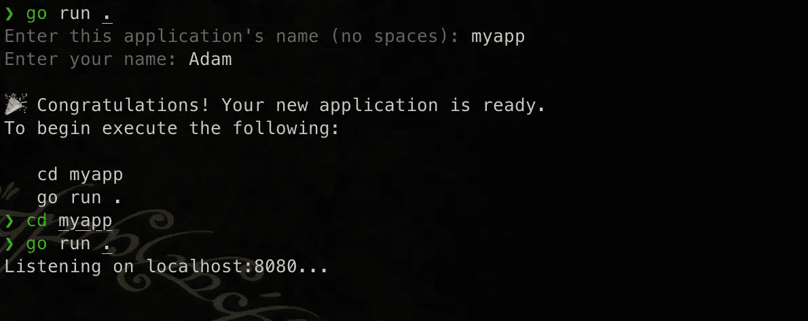
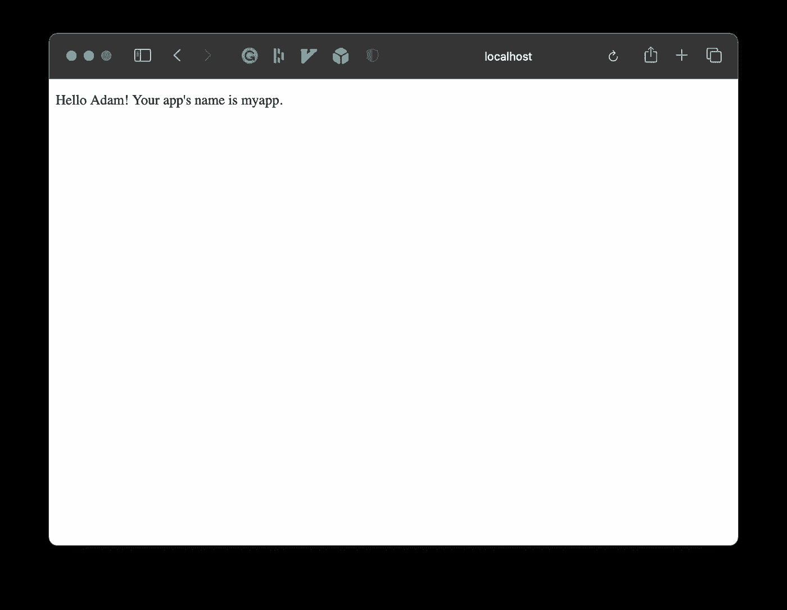

# 在 Go 中编写代码生成器

> 原文：<https://levelup.gitconnected.com/writing-a-code-generator-in-go-420e69151ab1>

马库斯·斯皮斯克在 [Unsplash](https://unsplash.com?utm_source=medium&utm_medium=referral) 上的照片

在这篇文章中，我将描述我是如何在 Go 中制作代码生成器的。为什么我想要一个代码生成器？可能有无数的理由需要代码生成器。对我来说，这归结为不得不一次又一次地为 web 应用项目构建相同的代码，所以我认为是时候自动化我的一些工作了。

在这里，我们将创建一个简化的生成器，它创建一个小型 Go 应用程序和一个 HTML 文件，Go 应用程序将在端口 8080 上提供该文件。对于这篇文章，你需要安装 Go 1.16+和你选择的代码编辑器。

首先，你需要初始化一个项目。对于这个示例，创建一个名为 **generator-blog-entry** 的目录，并在该目录中运行以下命令。

正如你所看到的，我们将有主要的应用程序代码，在子目录中有几个模板。这些模板将用于生成最终代码。现在让我们从编辑 **main.go** 开始。

首先，我们需要一种提示用户输入的方式。有许多方法可以实现这一点，但是对于我们的项目，我们将使用一个名为 *promptui* 的小型库。这可以通过运行`go get github.com/manifoldco/promptui`来安装。利用这一点，我们可以构建一个方法来提示用户输入一个字符串，我们可以根据需要多次重用该字符串。

现在让我们跳到我们的 HTML 模板，*templates/index . HTML . tmpl*。这个模板保存了我们将在最终生成的应用程序中呈现为*index.html*的内容。在本演示中，让我们输出用户在生成过程中输入的名称和应用程序名称。请注意 **{{。您的姓名}}** 和 **{{。AppName}}** ？这些是 Go 模板变量。这些将在渲染过程中被填充。

在我们制作模板的时候，让我们继续为我们的 *templates/main.go.tmpl* 文件填充模板。这是用来生成主 Go 文件的。对于这个例子，我们不需要任何变量，因为它只是一个简单的 Go 应用程序，为我们的 HTML 文件提供服务。

现在，回到**主页面**。我们需要一个结构体来保存用户输入的值。在用户输入他们的输入之后，这个结构被用来为我们的模板提供填充到任何变量中的值。

接下来，我们需要一个变量来保存模板。我们希望使用 Go 1.16 的最新嵌入功能将模板嵌入到我们的应用程序中。这看起来像下面的代码。

本质上，我们告诉 Go 将我们创建的两个模板文件嵌入到*模板*文件夹中。很酷吧？下一项是提示用户输入我们的值来填充我们的结构。我们将使用上面写的 **stringPrompt** 方法来完成这个任务。

下一部分是我们想要创建一个目录来存放我们生成的代码。目录名将是用户输入的 **appname** 。我们还将创建模板文件的映射，描述将这些模板文件写入哪个目录。

现在有趣的部分来了。生成代码！在这里，我们将首先解析上面嵌入的模板。然后，我们将遍历映射，创建输出文件，然后将模板渲染到其中。

我的朋友们，这就是它的要点！让我们看看完整的源代码。

templates/main.go.tmpl

templates/index.html.tmpl

main.go

所以现在当我运行这个应用程序时:

运行生成器应用程序

如果我们浏览到 [http://localhost:8080，](http://localhost:8080,)我们会得到…

在浏览器中运行的生成代码

瞧啊。你有什么有趣的代码生成用例吗？如果有，请在评论中告诉我。编码快乐！