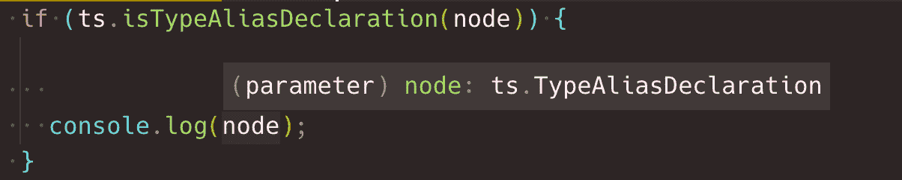

# 编写自定义类型脚本 AST 转换器

> 原文：<https://levelup.gitconnected.com/writing-a-custom-typescript-ast-transformer-731e2b0b66e6>

# 介绍

在我的第一篇博文中，我想介绍一下我最近使用 TypeScript 的[编译器 API](https://github.com/Microsoft/TypeScript/wiki/Using-the-Compiler-API) 解决的一个问题。我敢肯定，如果没有各种博客和 StackOverflow 答案的帮助，我将无法获得一些东西，因此，不写下我对一套强大但记录不多的工具的学习是非常自私的。

# 涉及的主题

TypeScript 编译器 API 基础(解析器术语、转换器 API、分层架构)、ASTs、访问者模式、代码生成。

# 先决条件

@ [Vaidehi Joshi](https://medium.com/@vaidehijoshi) 有一篇[关于 ASTs 的很棒的文章](https://medium.com/basecs/leveling-up-ones-parsing-game-with-asts-d7a6fc2400ff)，如果你不熟悉这个概念，我建议你读一下。她的 basecs 系列很精彩，你应该去看看。

# 我正在解决的问题

我们在 Avero 使用 GraphQL，并且一直想在解析器周围添加一些类型安全。我遇到了 graphqlgen，它解决了我在模型概念上遇到的很多问题。在这篇博文中，我不想深入探讨这个话题，但我希望将来能写一些深入 GQL 的东西。 *tldr* 是模型代表了你的查询解析器的返回值(可能与你的 GQL 模式不同)，在 graphqlgen 中，你使用某种配置(YAML 或带有类型声明的 TypeScript 文件)将这些模型与接口相关联。

在工作中，我们运行 [gRPC](https://grpc.io/) 微服务，GQL 主要为我们的 UI 消费者提供一个良好的扇出层。我们已经发布了与我们的 [proto](https://developers.google.com/protocol-buffers/) 契约相匹配的 TypeScript 接口，我想在 graphqlgen 中使用这些类型作为我们的*模型*，但是由于[类型导出支持](https://github.com/prisma/graphqlgen/issues/282)以及我们的 TypeScript 接口发布方式(大量命名空间，大量引用)而遇到了一些问题。

像任何优秀的开源公民一样，我的第一个方法是利用 graphqlgen repo 中已经完成的工作，并尝试添加一个有意义的贡献。为了进行类型自省，graphqlgen 使用 [@babel/parser](https://github.com/babel/babel/tree/master/packages/babel-parser) 来读取 TypeScript(在我的例子中)文件，并收集关于接口名称和声明(接口的字段)的信息。

任何时候我想用 ASTs 做任何事情，我都会立即拉起 astexplorer.net 的[开始玩。这个工具允许我们探索由许多不同的解析器生成的 ast，包括@babel/parser 和 TypeScript 编译器解析器。它为我们提供了一个很好的方式来可视化我们将要使用的数据结构，并让您熟悉给定解析器的 AST 节点的*类型*。](https://astexplorer.net/)

让我们来看一个使用 babel-parser 的示例输入文件和相应的 AST:

我们 AST 的根(节点类型为**的程序**)在它的主体中有两个语句，一个 **ImportDeclaration** 和一个 **ExportNamedDeclaration** 。

首先查看我们的 **ImportDeclaration** ，我们对两个属性感兴趣: **source** 和**说明符**。这些节点只包含关于源文本的信息。比如源值是 *my_company_protos* 。这没有给我任何关于这是一个相对文件路径还是引用一个外部模块的信息，所以这是我必须使用解析器方法解决的一个问题。

同样，在我们的 **ExportNamedDeclaration** 中，我们得到了关于源文本的基本信息。名称空间使这种结构变得复杂，它可以任意嵌套，这增加了越来越多的**qualified type identifier**。如果我们继续走这条路，这将是我们需要解决的另一个尴尬局面。

我甚至还没有从导入中解析类型呢！假设解析器和 AST(根据设计)受限于其源文本中的信息，我们需要解析任何导入的文件，以便在最终的 AST 中获得这些信息。但是那些进口货可能有他们自己的进口货！

在没有大量代码的情况下，解析器在解决我们的问题时似乎非常有限，所以让我们后退一步，再次思考这个问题。

我们不想处理导入，我们不想关心文件结构。我们希望能够解析 *protos.user.User* 的所有属性，并内联它们，而不是依赖于导入。我们如何获得这种类型的信息来开始构建这个文件呢？

# TypeScript 的类型检查器简介

既然我们已经决定一个解析器不足以收集导入接口的类型信息，那么让我们回顾一下 TypeScript [编译过程](https://github.com/Microsoft/TypeScript/wiki/Architectural-Overview#overview-of-the-compilation-process)是如何工作的，看看我们是否可以推断出下一步应该在哪里查找。

这里有一个部分非常突出:

> 从程序实例中可以创建类型检查器。TypeChecker 是 TypeScript 类型系统的核心。它负责计算不同文件中符号之间的关系，为符号指定类型，并生成任何语义诊断(即错误)。
> 
> 类型检查器要做的第一件事是将来自不同源文件的所有符号合并到单个视图中，并通过“合并”任何公共符号(例如，跨多个文件的命名空间)来构建单个符号表。
> 
> 初始化初始状态后，类型检查器就可以回答任何关于程序的问题了。此类“问题”可能是:
> 
> 这个节点的符号是什么？
> 
> 这个符号是什么类型的？
> 
> AST 的这一部分有哪些可见符号？
> 
> 函数声明有哪些可用的签名？
> 
> 文件应该报告哪些错误？

**类型检查器**听起来正是我们需要的！我们希望访问底层的符号表和 API，这样我们就可以回答前两个问题:*这个节点的符号是什么？而这个符号*是什么类型的？它甚至提到了处理合并公共符号，因此它解决了我们前面谈到的名称空间问题！

那么，我们如何得到这个 API 呢？

这个是我能在网上找到的少数例子之一，但它足以让我们开始。我们可以看到，checker 可以从我们的**程序**实例的方法中访问。查看该示例中的用法，我们可以看到诸如*checker . getsymbolatlocation*和*checker . gettypeofsymbolatlocation*之类的方法，这似乎至少是我们所需要的一些变体。

让我们开始写程序吧。

```
ts-node ./src/ts-alias.tsprints
ImportDeclaration
TypeAliasDeclaration
EndOfFileToken
```

我们关心的是这里的类型别名声明，所以让我们更新我们的代码来关注它。

TypeScript 为每个对应的节点类型提供了一个类型保护，因此我们可以通过利用这里的类型保护将节点缩小到适当的类型。



现在我们有了节点，我们想回到前面提到的两个问题:*这个节点的符号是什么？这个符号是什么类型的？*

因此，我们通过与**类型检查器**的符号表交互，获得了类型别名接口声明的名称。我们还有一段路要走，但这是*内省*方面事情的一个很好的起点。

让我们想想*一代*。

# 转换 API

我们在前面展示了我们的目标…给定一个类型脚本文件，解析、自省并创建一个新的类型脚本文件。 *AST - > AST* 的函数签名在编程中非常常见，以至于 TypeScript 团队发布了一个[自定义转换 API](https://github.com/Microsoft/TypeScript/pull/13940) 来创建自己的 API！

在我们深入研究最初的问题之前，让我们编写一个极其简单的定制转换器。感谢[詹姆斯·加巴特](https://43081j.com/)给我[样板](https://43081j.com/2018/08/creating-a-typescript-transform)开始。

我们的第一个基本转换器将把数字文字转换成字符串文字。

这里要担心的最重要的接口是 **Visitor** 和 VisitorResult:

```
type Visitor = (node: Node) => VisitResult<Node>;
type VisitResult<T extends Node> = T | T[] | undefined;
```

作为定制转换器的作者，我们的目标是编写这个 **Visitor** 。我们递归地访问 AST 中的每个节点，并返回 VisitResult，它可能是一个、多个或零个 AST 节点。我们可以针对特定的节点进行修改，而不去管其他的节点。

[这里的](https://astexplorer.net/#/gist/8ebf7b4e7cfb4fdc9b8e8d6a739b4042/2590ce4e50e7e0198a108d454e1c4b9622b05509)是一个带标签的 AST，显示了我们将要使用的节点。

我们的访问者需要处理两种主要情况:

1.  用**接口声明**替换**类型类声明**
2.  将**类型引用**解析为**类型文字**

# 解决办法

下面是使用最小 CLI 的访问者代码的样子:

我对我的解决方案的结果非常满意。它展示了良好的抽象、智能编译器设计、优秀的开发人员工具(VSCode autocomplete、AST explorer 等)以及从其他聪明人的经验中获得一些外包的力量。完全更新的源代码可以在这里找到[。我不确定这对我的狭窄用例之外的任何人有多大用处，但我主要是想展示 TypeScript 编译器工具链的强大功能，以及记录我对一个我以前没有真正解决的独特问题的思考过程。](https://github.com/ksaldana1/ts-alias-transformer)

希望这对任何试图做类似事情的人有所帮助。如果您被诸如 AST、编译器和转换这样的主题吓住了，我希望我给了您足够的样板文件和其他资源的链接。这里的代码是我坐下来长时间学习后的最终输出。用 Github private repos 我的第一次尝试，包括所有 45 个*//@ ts——忽略*和*！*断言在一份 150 行的文件中，可以隐藏耻辱的阴影。

# 帮助我的资源

[](https://github.com/Microsoft/TypeScript/wiki/Using-the-Compiler-API) [## Microsoft/TypeScript

### TypeScript 是 JavaScript 的超集，它通过编译来清理 JavaScript 输出。-微软/TypeScript

github.com](https://github.com/Microsoft/TypeScript/wiki/Using-the-Compiler-API)  [## 创建 TypeScript 转换器

### 去年，TypeScript 合并了一个非常酷的 Pull 请求，它基本上公开了编译器 API 需要的部分…

43081j.com](https://43081j.com/2018/08/creating-a-typescript-transform) [](https://blog.scottlogic.com/2017/05/02/typescript-compiler-api-revisited.html) [## 重新审视类型脚本编译器 API

### 两年前，我写过关于 TypeScript 编译器 API 的文章。那项调查，以及围绕那篇博文的讨论…

blog.scottlogic.com](https://blog.scottlogic.com/2017/05/02/typescript-compiler-api-revisited.html)  [## AST 浏览器

### 在线 AST 浏览器。

astexplorer.net](https://astexplorer.net) [](https://levelup.gitconnected.com)