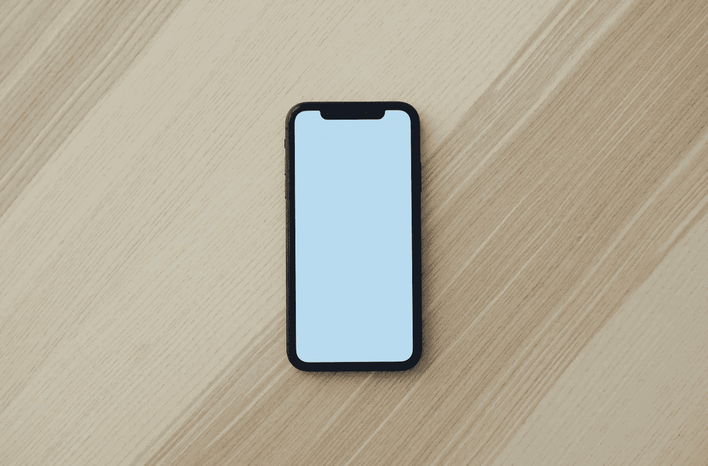
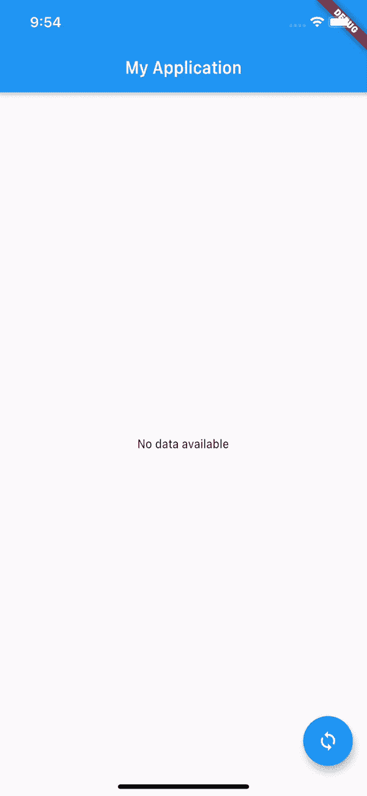

# 为初学者编写一个 Flutter 入门应用程序

> 原文：<https://levelup.gitconnected.com/writing-a-flutter-starter-application-for-beginners-f3e2ce591e3e>

## 在 UI 中加载远程数据、解析和呈现。



Vojtech Bruzek 在 [Unsplash](https://unsplash.com/s/photos/mobile?utm_source=unsplash&utm_medium=referral&utm_content=creditCopyText) 上拍摄的照片

我们将编写一个应用程序来加载待办事项列表，并在一个表格中显示它们，如果已经完成，则在待办事项标题文本上划线。

以下是我们的远程数据 URL:

```
[https://jsonplaceholder.typicode.com/todos](https://jsonplaceholder.typicode.com/todos)
```

它返回如下内容

```
[
  {
    "userId": 1,
    "id": 1,
    "title": "delectus aut autem",
    "completed": false
  },
  {
    "userId": 1,
    "id": 2,
    "title": "quis ut nam facilis et officia qui",
    "completed": false
  },
  {....}
]
```

下面是我们激动人心的应用程序的样机设计。



我们疯狂的小程序

> 注意:为了简单起见，我们将尝试 main.dart 文件中的所有代码，这显然是不推荐的！

# 基本设置

我们将使用基于*脚手架*的设计，其中我们将有一个 *appBar* 、*主体、*和一个*浮动动作按钮*。

没有花哨的国家管理图书馆。只是香草飘动*设置状态*。

```
void main() {runApp(MaterialApp(
 home: Home(),
));}
```

```
class Home extends StatefulWidget{ @override
 State<StatefulWidget> createState() {
   return _HomeState();
 }
}
```

# 加载数据

将 *http* 依赖项添加到您的 *pubspec.yaml*

```
http: ^0.12.2
```

注意:VSCode 插件 [Pubspec Assist](https://marketplace.visualstudio.com/items?itemName=jeroen-meijer.pubspec-assist) 有助于轻松添加和更新 Dart 和 Flutter 项目的依赖关系。

```
import 'package:http/http.dart' as http;var data = await     http.get("https://jsonplaceholder.typicode.com/todos");
```

# 解析数据并将数据映射到对象

```
class ToDo {final int userId;
final int id;
final String title;
final bool completed;ToDo(this.userId,this.id, this.title,this.completed);ToDo.fromJson(Map<String, dynamic> json)
  : userId = json['userId'],
    id = json['id'],
    completed = json['completed'],
    title = json['title'];
}// Our toDo class
```

现在从 json 响应映射 todo 的数组

```
var data = await  http.get("https://jsonplaceholder.typicode.com/todos");Iterable arr = json.decode(data.body);
final todos = List<ToDo>.from(arr.map((e) => ToDo.fromJson(e)));// todos contain the array of todos
```

现在是渲染数据的时候了。

# 渲染数据

这是我们的有状态的 *_HomeState* 类

```
class _HomeState extends State<Home>{List<ToDo> _toDos =  [];
bool _loading = false;
void _onCliked() async{this.setState(() {
 _loading= true;
});var data = await http.get("https://jsonplaceholder.typicode.com/todos");
Iterable arr = json.decode(data.body);
final todos = List<ToDo>.from(arr.map((e) => ToDo.fromJson(e)));this.setState(() {
 _toDos = todos;
 _loading = false;
});
}@override
Widget build(BuildContext context) {
return Scaffold(
appBar: AppBar(
 title: Text("My Application"),
),
body: Center(
child: _loading ? CircularProgressIndicator(backgroundColor: Colors.blue) : ToDoList(todos: _toDos,)
),
floatingActionButton: FloatingActionButton(
child: Icon(Icons.sync),
onPressed: _onCliked,
),
);
}}
```

```
class ToDoList extends StatelessWidget{final List<ToDo> todos;
ToDoList({@required this.todos});@override
Widget build(BuildContext context) {
 return todos.length == 0 ? Text("No data available"):
 ListView.separated(
 itemBuilder: (context,index){
final item = todos[index];
return ListViewCell(todo: item);
},
separatorBuilder: (context,index){
 return SizedBox(
  height: 0.1,
  child: Container(color: Colors.blue,),
);
},
itemCount: todos.length);
}
}
```

以及*细胞*细胞*类*

```
class ListViewCell extends StatelessWidget{final ToDo todo;
ListViewCell({@required this.todo});@override
Widget build(BuildContext context) {
 return SizedBox(
  height: 40,
  child: Text(todo.title,textAlign: TextAlign.center,style:  TextStyle(fontWeight: FontWeight.bold,decoration: this.todo.completed? TextDecoration.lineThrough : TextDecoration.none),),
);
}
}
```

这是完整的代码

完整的代码在这里！

## 感谢阅读，我希望你发现这是有用的！