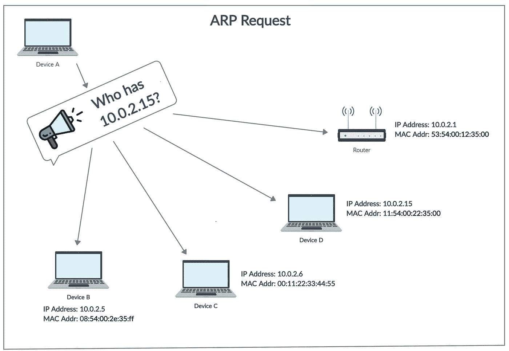
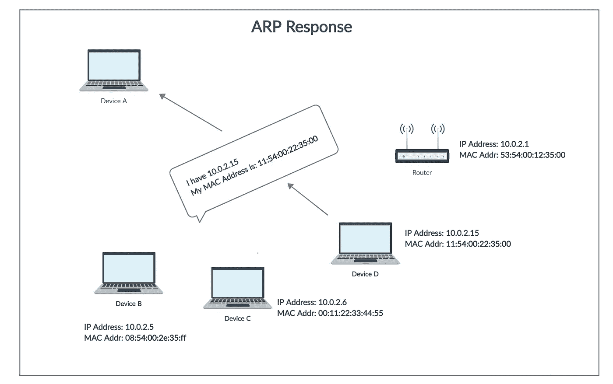
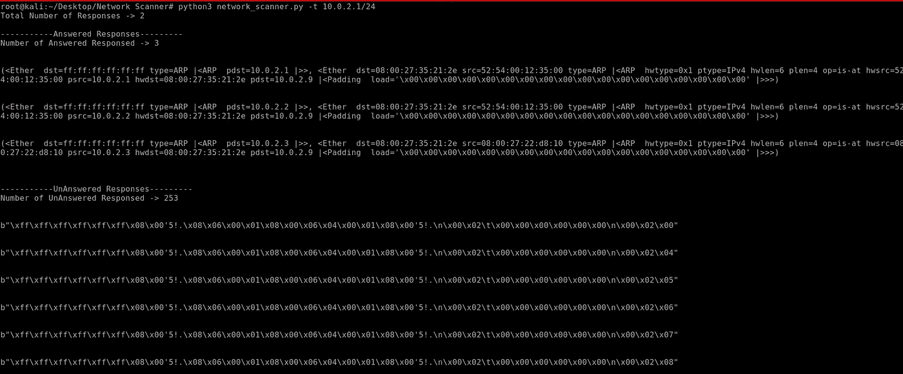
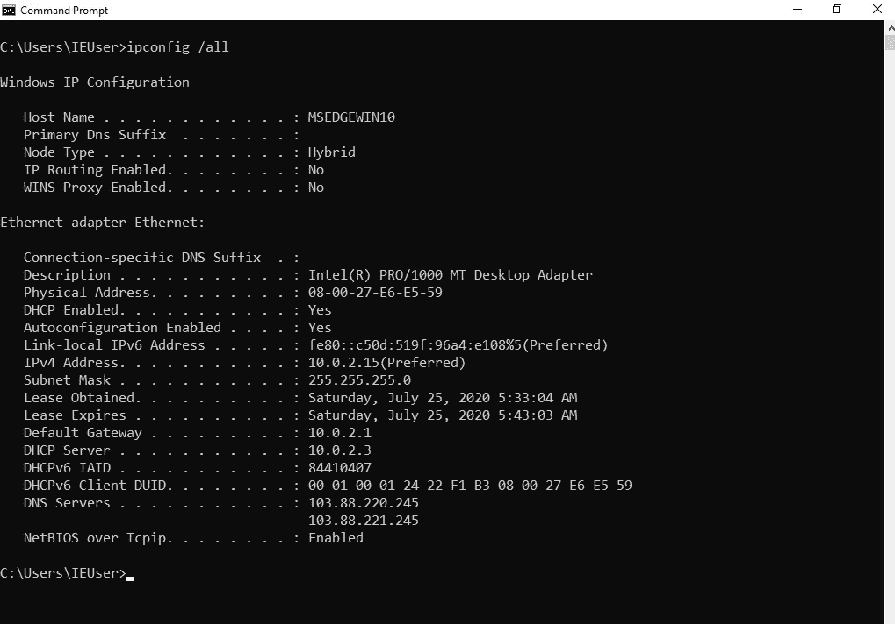
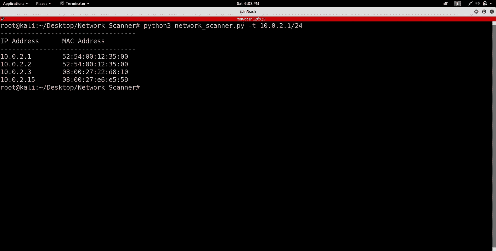

# 使用 Python 编写网络扫描仪

> 原文：<https://levelup.gitconnected.com/writing-a-network-scanner-using-python-a41273baf1e2>


> **注意:**下面的教程适用于任何 Linux 发行版，只要你有 root 权限，也就是说，你必须使用 root 用户执行这个脚本。

# 什么是网络扫描仪？

网络扫描仪是一种软件工具，用于扫描网络中连接的设备。它还用于诊断和调查目的，以查找和分类网络上运行的设备。该工具将一个 IP 地址或一系列 IP 地址作为输入，然后依次扫描每个 IP 地址，并确定该特定 IP 地址上是否存在设备。它扫描网络并返回 IP 地址及其相应的 MAC 地址(如果设备存在)。网络安全专业人士常用的一个流行工具是 [**nmap**](https://nmap.org/) 。

# 它是如何工作的？

为了理解网络扫描器如何扫描整个网络，我们需要先了解什么是 **ARP(地址解析协议)**。

在网络中，大多数计算机使用 **IP 地址**与其他设备通信，然而，实际上，通信是通过 **MAC 地址进行的。ARP 用于找出 IP 地址已知的特定设备的 MAC 地址。**例如，一台设备想要与网络上的另一台设备通信，然后发送设备使用 ARP 来查找它想要与之通信的设备的 MAC 地址。ARP 包含两个步骤来查找 MAC 地址:

1.  发送设备发送一个 **ARP 请求**，其中包含它想要与之通信的设备的 IP 地址。该请求被广播，这意味着网络中的每个设备都将接收到该请求，但是只有具有预期 IP 地址的设备才会响应。
2.  接收到广播消息后，IP 地址等于消息中 IP 地址的设备将向发送方发送一个包含其 MAC 地址的 **ARP 响应**。

网络扫描器使用 ARP 请求和响应来扫描整个网络，以查找网络上的活动设备以及它们的 MAC 地址。

如果仍然不清楚什么是 ARP 以及它是如何工作的，那么参考下面的图片。



**图一。ARP 请求**



**图二。ARP 响应**

现在我们知道了网络扫描器内部是如何工作的，让我们开始用 Python 编写它。

# 使用的模块:

1.  [argparse](https://docs.python.org/3.4/library/subprocess.html) :要了解这是什么，请阅读我的第一篇文章[这里](https://medium.com/@dharmilch18/changing-mac-address-using-python-8a16fc4a3563#f878)。
2.  [Scapy](https://scapy.readthedocs.io/en/latest/extending.html) :使用户能够发送、嗅探、解析和伪造网络数据包。这种能力允许开发能够探测、扫描或攻击网络的工具。它可以伪造或解码大量协议的数据包，通过网络发送它们，捕获它们，匹配请求和回复，等等。它可以轻松处理大多数任务，如扫描、跟踪路由、探测、单元测试、攻击或网络发现。

> 好了，在开始用 Python 写代码之前，我要告诉你我的设置:我目前在 Windows 10 上，我有 [Virtualbox](https://www.virtualbox.org/) 在两个虚拟机上运行(1。Kali Linux 和 2。Windows 10)。我将在我的 Kali Linux 机器上执行 python 脚本，并尝试扫描整个网络。注意:虚拟机在 Virtualbox 中被配置为使用 **NatNetwork** 。要了解更多关于 NatNetwork 以及如何配置 VM 来使用它，请阅读 [this](https://www.techrepublic.com/article/how-to-create-multiple-nat-networks-in-virtualbox/) 。

# 编写网络扫描仪

因为我们知道需要什么模块，所以让我们开始编写脚本。

## **步骤 1:导入上面讨论的模块。**

导入模块

## **步骤 2:** **实现允许用户传递命令行参数的功能。**

要将这个特性添加到我们的脚本中，我们需要利用我们在步骤 1 中导入的 **argparse** 模块。

添加命令行参数功能

要了解更多关于 argparse 如何工作，脚本的上述部分做什么以及它给脚本增加了什么功能，请阅读我以前的文章如何[更改设备的 MAC 地址](https://medium.com/@dharmilch18/changing-mac-address-using-python-8a16fc4a3563#03c5)中的整个**步骤 2** 。

以上代码允许用户为**界面**值提供如下输入:

```
root@kali:~# python3 network_scanner.py -t IP_Address/IP_Addresses
```

**或**

```
root@kali:~# python3 network_scanner.py --target IP_Address/IP_Addresses
```

**IP_Address** =您要扫描的特定 IP 地址，以检查是否有设备正在使用该 IP 地址。

**IP 地址** =要扫描的 IP 地址范围。

## **步骤 3:编写扫描网络的函数**

在此功能中，我们必须执行以下操作才能扫描网络:

*   创建一个 ARP 请求。
*   创建一个以太网帧。
*   将 ARP 请求放入以太网帧中。
*   发送组合帧并接收响应。
*   解析响应并打印结果。

扫描功能

注意函数 **scan** 将 IP 地址作为参数。现在，让我们逐行分解上面的代码。

```
def scan(ip):
    .....
    .....scan('10.0.2.15')
```

现在，我们要做的第一件事是创建一个 ARP 请求(见图 1。)架用**舟皿**。

```
arp_req_frame = scapy.ARP(pdst = ip)
```

上面的代码行使用 scapy 的 ARP 类创建了一个 ARP 请求帧，目的 IP 地址 **(pdst)** 作为函数的参数提供。目的 IP 地址被设置为传递给函数的 IP 地址，因为我们希望将 ARP 请求帧定向到我们想要的 IP 地址。例如，如果 **ip = '10.0.2.15'** ,那么 ARP 请求只针对该 ip 地址。

现在，问题是我怎么知道目的 IP 地址在 ARP 类中表示为 **pdst** ？为此，scapy 有一个内置函数，我们可以用它来查找一个类有哪些成员变量(变量)或字段。

```
arp_req_frame = scapy.ARP(pdst = ip)
print(scapy.ls(scapy.ARP()))**OUTPUT** root@kali:~/Desktop/Network Scanner# python3 network_scanner.py -t 10.0.2.1/24hwtype : XShortField        = 1               (1)
ptype  : XShortEnumField    = 2048            (2048)
hwlen  : FieldLenField      = None            (None)
plen   : FieldLenField      = None            (None)
op     : ShortEnumField     = 1               (1)
hwsrc  : MultipleTypeField  = **'08:00:27:35:21:2e'** (None)
psrc   : MultipleTypeField  = **'10.0.2.9'**      (None)
hwdst  : MultipleTypeField  = '00:00:00:00:00:00' (None)
pdst   : MultipleTypeField  = '0.0.0.0'       (None)
```

> **注:10.0.2.1/24 表示从 10.0.2.1 到 10.0.2.254 的 IP 地址**

**scapy.ls()** 函数返回特定类拥有的字段。它适用于 scapy 提供的每个类。我们只需将类名作为 **scapy.class_name()** 传递给它。在上面的例子中，我们想知道 ARP 类拥有的字段或成员变量，所以我们使用了 scapy.ls(scapy。ARP())。然后，这个函数给出了上面输出中所示的响应。该函数提供了字段的名称、该字段的简短描述以及每个字段的默认值。

需要了解的主要领域有:

*   **hwsrc** =源 MAC 地址。
*   **psrc** =源 IP 地址。
*   hwdst =目的 MAC 地址。
*   **pdst** =目的 IP 地址。

注: **hwsrc** 和 **psrc** 将始终使用创建 ARP 请求包的机器的默认值。在我们的例子中，我的 Kali 机器的 IP 地址是**‘10 . 0 . 2 . 9’**，MAC 地址是**‘08:00:27:35:21:2e’**，因此字段 **psrc** 和 **hwsrc** 中有这些值。另外， **hwdst** 和 **pdst** 的默认值分别为**' 00:00:00:00:00 '**和 **'0.0.0.0'** 。

因此，这就是我们在创建类的实例时，如何根据需要更改任何字段的值。此外，我们还可以通过 scapy 提供的另一个函数来查看 ARP 请求本身。

```
arp_req_frame = scapy.ARP(pdst = ip)
print(arp_req_frame.summary())
```

执行上述代码后，我们得到以下输出。您可以看到它显示“**谁拥有 10.0.2.3 表示 10.0.2.9”，**这意味着该数据包是一个请求数据包，它在询问每个人谁拥有 IP 地址为 **10.0.2.3** 的数据包。第二部分，即**说 10.0.2.9** 向所有接收设备提供关于 ARP 请求的源或发送者的信息，因此具有 IP 地址 **10.0.2.3** 的接收设备将知道向谁发送 ARP 响应。您可以看到下面生成的输出与图 1 所示的相同。

```
root@kali:~/Desktop/Network Scanner# python3 network_scanner.py -t 10.0.2.3**OUTPUT** root@kali:~/Desktop/Network Scanner# python3 network_scanner.py -t 10.0.2.3**ARP who has 10.0.2.3 says 10.0.2.9**
```

scapy 提供的另一个有用的功能是 **show()。**

```
arp_req_frame = scapy.ARP(pdst = ip)
print(arp_req_frame.show())
```

执行之后，它生成以下输出。

```
root@kali:~/Desktop/Network Scanner# python3 network_scanner.py -t 10.0.2.3**OUTPUT**
###[ ARP ]###
hwtype    = 0x1
ptype     = IPv4
hwlen     = None
plen      = None
op        = who-has
hwsrc     = 08:00:27:35:21:2e
psrc      = 10.0.2.9
hwdst     = 00:00:00:00:00:00
pdst      = 10.0.2.3
```

上面的输出显示了 ARP 请求数据包的各个字段及其相应的值。请注意， **pdst(目的 IP 地址)**的值为 **10.0.2.3** ，因为在执行代码时，我们提供了一个命令行参数来确定要扫描哪个 IP 地址，然后将该 IP 地址设置为 pdst。这是因为在创建 ARP 类的实例时，我们使用 **scapy 提供了目的设备的 IP 地址。ARP(pdst = ip)** 其中 **ip** 是一个变量名，其值取自执行时传递的命令行参数。我们已经介绍了如何添加命令行参数功能，该功能在**步骤 2** 中接受输入。

在创建了 ARP 请求包之后，我们现在需要创建一个[以太网](https://en.wikipedia.org/wiki/Ethernet_frame)帧。以太网帧包含诸如源和目的地硬件(MAC)等字段。现在，由于网络内部的通信是使用 MAC 地址进行的，我们可以将目的硬件地址字段的值设置为我们想要通信的 MAC 地址。点击了解更多关于[以太网帧的信息。](https://www.geeksforgeeks.org/ethernet-frame-format/)

ARP 请求应该被广播(发送到网络中的每个 IP 地址)。因此，为了广播 ARP 请求，我们将以太网字段的**目的地址**字段设置为**‘ff:ff:ff:ff:ff:ff’**，因为这是一个广播 MAC 地址。我们现在使用 scapy 来做这件事。

```
broadcast_ether_frame = scapy.Ether(dst = "ff:ff:ff:ff:ff:ff")
```

上面的代码行创建了一个以太网帧，其中 **dst(目的地址)**被设置为**‘ff:ff:ff:ff:ff:ff:ff’。**注意，我们可以在以太网类上使用 scapy.ls()和 show()函数。可以使用 scapy.ls()函数查看以太网帧的字段，类似于我们在 ARP 类中的操作。show()函数也可以像我们在 ARP 类中一样使用。这两个函数的输出如下所示。

```
print(scapy.ls(scapy.Ether()))**OUTPUT** dst  : DestMACField     = 'ff:ff:ff:ff:ff:ff' (None)
src  : SourceMACField   = '08:00:27:35:21:2e' (None)
type : XShortEnumField  = 36864           (36864)--------------------------------------------------------------------print(broadcast_ether_frame.show())**OUTPUT** ###[ Ethernet ]###
dst       = ff:ff:ff:ff:ff:ff
src       = 08:00:27:35:21:2e
type      = 0x9000
```

下一步是合并 ARP 请求和以太网帧。我们使用 scapy 来实现这一点，因为它提供了一种非常方便的方式来组合框架。我们通过下面的代码行来实现。

```
broadcast_ether_arp_req_frame = broadcast_ether_frame/arp_req_frame
```

上面的代码通过使用 **'/'** 符号组合 ARP 请求和以太网帧来创建一个新帧。这是因为 scapy 允许我们使用它来组合帧。

现在，如果我们调用 **show()** 函数，我们可以看到最终的组合帧由以太网和 ARP 请求组成。

```
root@kali:~/Desktop/Network Scanner# python3 network_scanner.py -t 10.0.2.3**OUTPUT** ###[ Ethernet ]###
dst       = ff:ff:ff:ff:ff:ff
src       = 08:00:27:35:21:2e
type      = ARP###[ ARP ]###
hwtype    = 0x1
ptype     = IPv4
hwlen     = None
plen      = None
op        = who-has
hwsrc     = 08:00:27:35:21:2e
psrc      = 10.0.2.9
hwdst     = 00:00:00:00:00:00
pdst      = 10.0.2.3
```

我们可以看到，以太网帧的类型字段现在将 ARP 作为其类型。此外，帧的 ARP 部分通过 **op** 字段的值被识别为 **ARP 请求**。如果 **op = who-has** 则意味着它是一个 **ARP 请求**，如果 **op = is-at** 则它是 **ARP 响应**。

现在剩下的唯一事情就是发送组合帧并接收响应。为了发送请求和接收响应，我们将使用 scapy 提供的函数，该函数不仅发送请求，还返回响应。

该函数将捕获的响应作为 python 元组返回，其中元组的第一个元素包含设备响应的**已回答的**响应，第二个元素包含**未回答的**响应。未回答列表中的响应意味着没有使用这些 IP 地址的设备。

scapy 提供的完成上述任务的函数称为 **scapy.srp()。**该函数将实际要传输的帧作为参数。你可以看到我们已经通过**broadcast _ ether _ ARP _ req _ frame(我们最终的组合帧)**传递到下面的函数。它还需要一个**超时**输入，告知 scapy 在进一步移动之前应该等待多长时间来接收响应。从下面的例子来看，这意味着 **timeout = 1** 意味着 scapy 将等待 1 秒钟的响应，如果没有收到响应，它将进一步将数据包发送到下一个 IP 地址。参数 **verbose = False** 并不重要，它只是阻止 scapy 在屏幕上打印自己的消息。

```
answered_list= scapy.srp(broadcast_ether_arp_req_frame, timeout = 1, verbose = False)
    print('Total Number of Responses ->', len(answered_list))
    print('\n-----------Answered Responses---------')
    print('Number of Answered Responsed ->', len(answered_list[0]))
    print('\n')
    for i in range(0,len(answered_list[0])):
        print(answered_list[0][i])
        print('\n')
    print('\n-----------UnAnswered Responses---------')
    print('Number of UnAnswered Responsed ->', len(answered_list[1]))
    print('\n')
    for i in range(0,len(answered_list[1])):
        print(answered_list[1][i])
        print('\n')
```

上面的代码显示了应答(响应)响应的总数和实际响应本身。它还显示未回答(未回应)的回应总数和实际回应数。

注意:这段代码不会在最终的脚本中使用，只是为了理解 **scapy.srp()** 函数返回的输出。上述代码生成以下输出。



scapy.srp()函数输出

从上图中，我们可以看到收到的回复总数是**两个。**这是因为元组由两个元素组成**已回答**和**未回答**。此外，我们可以看到，应答的总响应数为**三个**，这意味着只有**三个**设备响应了 ARP 响应。在这下面，我们还可以看到实际的反应本身。在此之后，我们看到未响应的响应总数为 **253** ，这意味着 **253** 设备没有响应。我们还可以看到 scapy 为未回答的响应记录的一些响应。

显示上述输出的主要目的是让您了解我们只需要已回答的响应，而不是未回答的。因此，我们可以使用下面的代码行只访问已回答的响应。

```
answered_list = scapy.srp(broadcast_ether_arp_req_frame, timeout = 1, verbose = False)[0]
```

由于 **answered_list** 是一个元组，我们可以通过在方括号中提供索引来提取单个元素。上面的代码将只存储已回答的响应。

现在，剩下的就是从每个应答的响应中提取 IP 地址和 MAC 地址。为此，我们将在列表中使用 Python 字典。

```
result = []
    for i in range(0,len(answered_list)):
        client_dict = {"ip" : answered_list[i][1].psrc, "mac" : answered_list[i][1].hwsrc}
        result.append(client_dict)print(result)
```

上面的代码创建一个名为 **result** 的空列表，然后为每个响应创建一个名为 **client_dict** 的字典，然后将其附加到 **result** 列表中。 **client_dict** 有两个键**‘ip’**和**‘mac’**，分别存储 IP 地址和 MAC 地址。对于我们的情况，上述代码的输出将是:

```
root@kali:~/Desktop/Network Scanner# python3 network_scanner.py -t 10.0.2.1/24[{'ip': '10.0.2.1', 'mac': '52:54:00:12:35:00'}, {'ip': '10.0.2.2', 'mac': '52:54:00:12:35:00'}, {'ip': '10.0.2.3', 'mac': '08:00:27:22:d8:10'}]
```

**scan()** 函数的下一步是返回**结果**列表。我们将在另一个函数中使用结果列表，以某种格式打印结果。

## 第四步:编写函数以某种格式打印结果。

以某种格式打印的显示功能

上面的 display()函数将结果列表作为输入，并以某种格式显示结果。它产生如下所示的输出。

```
root@kali:~/Desktop/Network Scanner# python3 network_scanner.py -t 10.0.2.1/24
-----------------------------------
IP Address     MAC Address
-----------------------------------
10.0.2.1       52:54:00:12:35:00
10.0.2.2       52:54:00:12:35:00
10.0.2.3       08:00:27:22:d8:10
```

这是脚本完成的地方，我们已经成功地使用 Python 创建了一个网络扫描器。

## 工作示例

我使用的是带有两个虚拟机(Kali Linux 和 Windows 10)的 Virtualbox 设置。我将向你展示我们创造的扫描仪工作得非常好。我将在 Kali Linux 中执行脚本，还将启动 Windows 10 VM。期望输出还应该包含 Windows 10 虚拟机的 IP 地址和 MAC 地址。



Windows 10 虚拟机

从上图中，我们可以注意到 Windows 10 虚拟机的两点:

1.  IP 地址= 10.0.2.15
2.  MAC 地址= 08-00-27-e6-e5-59(在描述字段下方的图像中表示为物理地址)

现在，Kali Linux 机器上的脚本生成的输出。



Kali Linux 虚拟机上的脚本输出

从上图中，我们可以看到我们创建的网络扫描器脚本扫描了整个网络，包括同一个网络中的 Windows 10 虚拟机。

感谢您的阅读。完整的代码可以在我的 [Github 库](https://github.com/dharmil18/Network-Scanner)中找到。