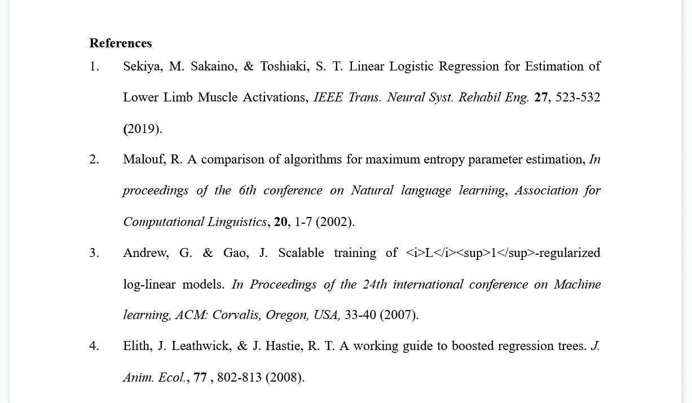

# 用 RapidAPI 编写学术论文的 Python web scraper

> 原文：<https://levelup.gitconnected.com/writing-a-python-reference-web-scraper-with-rapidapi-5e810e0e1d88>


在学术界工作时，一个常见的问题是有一个很大的参考文献列表，你需要收集一些元数据(作者、期刊、出版日期、DOI、*等*)。).我最近在为我的研究创建数据库时遇到了这个问题，我需要获得大约 300 个独立参考文献的 URL 链接。我有一个包含大部分信息的 Word 文档，包括第一作者和文章标题，但是没有简单的方法来获得它们的链接。我决定创建一个简单的 Python 脚本来完成这项工作，而不是浏览每一篇参考文献，复制标题，在 Google 搜索中输入标题，单击适当的链接，然后保存 URL。

这个工具使用 Pandas 和 [RapidAPI](https://rapidapi.com/apigeek/api/google-search3) 创建一个 CSV 文件，其中包含所有输入到脚本的引用的链接。

故事是这样的——代码的 Github 库的链接包含在结尾！

# 环境设置

与所有编码项目一样，在虚拟环境中工作是一个很好的实践。对于我的特定用例，我一直在使用用于 Linux 2 的 [Windows 子系统](https://docs.microsoft.com/en-us/windows/wsl/install-win10)(运行 Ubuntu 20.04)、 [Visual Studio 代码](https://code.visualstudio.com/)和 [Pipenv](https://pipenv.pypa.io/en/latest/) (用于 Python 包和环境管理)。你可以在这里阅读关于这个设置[的更多信息。](https://medium.com/swlh/setting-up-a-secure-django-project-repository-with-docker-and-django-environ-4af72ce037f0)

我使用 Jupyter 笔记本完成了大部分原型制作，但是代码非常简单，可以包含在一个简单的 python 文件中。

## 创建虚拟环境

在终端窗口中(我使用的是 [Windows 终端](https://www.microsoft.com/en-us/p/windows-terminal/9n0dx20hk701?activetab=pivot:overviewtab)，在我看来，它比 cmd.exe 或 Powershell 漂亮得多)，运行以下命令来创建并激活一个新的工作环境:

```
$ mkdir refscraper && cd refscraper
$ pipenv --python 3.9.1
```

我在这个项目中使用的是相对较新的 Python 版本，但是这个项目也可以使用旧版本，只是要注意 Python 2 *和*的语法差异。3.

接下来，我们将安装我们需要的唯一的第三方包， [Pandas](https://pandas.pydata.org/) 。

```
(refscraper) $ pipenv install pandas
```

现在，我们可以创建我们将需要的其他文件:

```
(refscraper) $ touch ref_scraper.py refs.txt
```

这将创建空文件，我们稍后将填充这些文件。我们的目录现在应该是这样的:

```
/refscraper
  |--Pipfile
  |--Pipfile.lock
  |--ref_scraper.py
  |--refs.txt
```

## `refs.txt`文件

数据文件的格式(我们将其命名为`refs.txt`)对于我们如何编写 python 代码非常重要。对于这个项目，我得到了一个 Word 文档，其中列出了参考资料，如图 1 所示。



图一。参考文件格式示例

我们可以编写一个脚本直接从文档中读取这些数据，因为 Word 文档本质上只是臃肿的 XML 文件。然而，将引用直接复制到一个纯文本文件是很容易的，使用 Python 可以更容易地解析该文件。复制到`refs.txt`后，文件如下所示:

```
1 Sekiya, M. Sakaino, & Toshiaki, S. T. Linear Logistic Regression
  for Estimation of Lower Limb Muscle Activations, IEEE Trans.
  Neural Syst. Rehabil Eng. 27, 523-532 (2019).
2 Malouf, R. A comparison of algorithms for maximum entropy
  parameter estimation, In proceedings of the 6th conference on
  Natural language learning, Association for Computational
  Linguistics, 20, 1-7 (2002).
3 Andrew, G. & Gao, J. Scalable training of <i>L</i><sup>1</sup>
  regularized log-linear models. In Proceedings of the 24th
  international conference on Machine learning, ACM: Corvalis,
  Oregon, USA, 33-40 (2007).
4 Elith, J. Leathwick, & J. Hastie, R. T. A working guide to boosted
  regression trees. J. Anim. Ecol., 77 , 802-813 (2008).
```

其中每个引用前面的数字只是行号。现在，我们可以开始用 Python 解析一些链接了！

# Python 脚本

我们需要做的第一件事是读入我们的`refs.txt`文件，这样我们就可以处理数据。为此，我们将使用熊猫数据帧。在文本编辑器中打开`ref_scraper.py`文件。要使用 VS 代码，你可以在文件所在的目录中键入`code .`,它应该会打开一个新的编辑器窗口。

```
# ref_scraper.py
import pandas as pd# declare a variable that points to the refs.txt file
REF_TEXT = "./refs.txt"# read the data into a DataFrame
df = pd.read_csv(
        REF_TEXT, 
        delimiter='\n',
        header=None,
        names=['ref_full']
    )
df.index += 1
```

这段代码做了两件事:创建一个带有一列`ref_full`的 DataFrame，其中包含每个引用的完整文本；将索引从 1 而不是 0 开始移动(这是为了更容易将链接映射到论文中的实际参考编号)。接下来，我们需要从参考文献的全文中解析标题，这样我们就可以在以后使用它来形成我们的搜索查询。让我们看一个来自我们的`refs.txt` 文件的例子来决定如何实现这一点。

```
Sekiya, M. Sakaino, & Toshiaki, S. T. Linear Logistic Regression for Estimation of Lower Limb Muscle Activations, IEEE Trans. Neural Syst. Rehabil Eng. 27, 523-532 (2019).
```

看起来我们可以在`.`字符上拆分完整的字符串，这将给我们一个列表。这不会是完美的，但它将服务于我们的目的。让我们在 Python shell 中摆弄一下(在终端中，运行`$ python`)。

```
>>> import pandas as pd
>>> df = pd.read_csv(
...    './refs.txt',
...    delimiter='\n',
...    header=None,
...    names=['ref_full'])
>>> df.index += 1
>>> ref1 = df['ref_full'][1]
>>> print(ref1)
'Sekiya, M. Sakaino, & Toshiaki, S. T. Linear Logistic Reg...'
>>> ref1.split('.')
['Sekiya, M', ' Sakaino, & Toshiaki, S', ..., ]
```

我已经截断了字符串和列表，使它们适合一行，但是需要注意的重要一点是，通过在完整的字符串上调用`.split('.')`，返回的列表元素之一包含了标题(可能还有一些其他文本，比如介绍该作品的会议)。如果我们假设包含标题的列表元素将是整个列表中最长的一个，我们可以很容易地获取它并返回它。我们还会做更多的清洁工作。回到 Python 控制台！

```
>>> # removing quote characters
>>> ref_1.replace('"', '').replace("'", '')
>>> split_ref = ref1.split('.')
>>> print(max(split_ref, key=len))
Linear Logistic Regression for Estimation of Lower Limb...
```

太好了！现在让我们将我们的临时工作合并到一个好的助手函数中，我们可以将它应用到数据帧的每一行。

```
# ref_scraper.pydef get_title_from_ref(ref):
    return(
        max(
            ref.split('.'), key=len)
            .strip().replace('"', '').replace("'", '')
    )# create a new column and apply our new function
df['title'] = df['ref_full'].apply(lambda x: get_title_from_ref(x))
```

现在我们有了一个 DataFrame 列，希望它只包含参考文献的标题(同样，根据格式还有一些额外的内容，但这对我们的搜索查询来说应该不成问题)。说到…

## 构建搜索查询

在我们可以使用我们的数据从互联网上获取东西之前，我们需要对我们将使用的工具做出一些选择。对于这个项目，我发现 Python 的内置`requests`库和 RapidAPI 的一个 Google 搜索 API 很符合我的需求(如果看到这篇文章的人有更好的选择，请告诉我！).

为了开始使用这个 API，我们需要[用 RapidAPI](https://rapidapi.com/signup) 创建一个免费帐户。一旦你创建了你的账户，从 APIGeek 导航到[谷歌搜索 API。为了使用这个 API，您需要通过点击“Subscribe to Test”按钮来订阅它。这将把你带到一个页面，在这里你可以选择你想要的层。我选择了免费层，它每月提供 600 个免费 API 调用。选择订阅后，您应该被重定向回 API 页面，在这里您应该会在右侧看到一个“代码片段”窗口。单击下拉选择器(目前可能显示为“(Node.js) Unirest”)，并选择 Python > Requests。这将给我们一些提示，告诉我们如何构建自己的代码来使用 API。](https://rapidapi.com/apigeek/api/google-search3)

```
# Code snippet from RapidAPI.com
import requestsurl="https://google-search3.p.rapidapi.com/api/v1/search/q=elon+musk&num=100"headers={
  'x-rapid-api-key': "your-key-will-be-here",
  'x-rapidapi-host': "google-search3.p.rapidapi.com"
}response=requests.request("GET", url, headers=headers)print(response.text)
```

这里有一些重要的事情需要注意:

1.  `url`结构，它表明我们的查询字符串必须有`+`符号，而不是空格。
2.  这个`headers`，其中必须包括你个人的`x-rapid-api-key`。
3.  向端点发出`GET`请求时将返回给我们的响应对象。

让我们回到我们的代码，创建一个函数，将我们的`title`转换成一个合适的查询字符串，并将该字符串放入适当的 url。

```
# ref_scraper.pydef create_request_url(title):
    q_string = title.replace(' ', '+')
    return f"https://google-search3.p.rapidapi.com/api/v1/search/q={q_string}num=2"
```

这个函数将用`+`符号替换`title`中的所有空格，然后将那个字符串插入到我们需要进行 API 调用的`url`中。我还任意用`2`替换了`num`值，因为我们不需要每个引用都有`100`链接。

在这里，我们还应该设置一个包含 API 键字符串的变量:

```
# ref_scraper.pyRAPID_API_KEY = "your-key-will-be-here"
```

现在让我们创建一个函数，它将从我们的数据帧中获取一个`title`,并获取从 API 端点返回的第一个链接:

```
# ref_scraper.py# import requests and json libraries
import requests
import jsondef get_ref_link(i, title):

    # build the headers dictionary
    headers = {
        'x-rapid-api-key': RAPID_API_KEY,
        'x-rapid-api-host': "google-search3.p.rapidapi.com"
    } # get the query url for the given title
    query_url = create_request_url(title) # create an empty string for the link
    link = "" # optional print statement to track progress
    print(f"Getting link for ref[{i}]...") # get the response from the API
    try:
        r = requests.request("GET", query_url, headers=headers)
    except ConnectionError:
        pass # get the link from the response.text
    if r.status_code == 200:
        j = json.loads(r.text)
        try:
            link += j['results'][0]['link']
        except:
            link += "no link found"
    else:
        link += "request failed"

    # another optional print to track progress
    print(f"Done. Link: [{link}]") return link
```

该函数将返回在 API 响应中找到的第一个链接的 url。它还有一些基本的错误处理来处理可能的超时或找不到链接的情况。我们还为函数包含了一个参数`i` ;这样做的原因将在下一步中更加清楚。现在的最后一步是为我们的数据帧中的每个`title`使用这个函数！让我们在脚本中添加一些功能代码:

```
# ref_scraper.py# import the time library so we can time the script
import timestart = time.time()# create an empty list for all the links
links = []# `iterrows()` returns the index `i` and the content `j` for each
# row of the DataFrame
for i, j in df.iterrows():
    link = get_ref_link(i, j['title'])
    links.append(link)delta = time.time() - start
```

如果我们现在运行这个脚本，我们将得到一个列表`links`,其中包含使用 API 找到的所有 URL。最后，*最后的*步骤是将这个列表添加到我们的数据帧中，然后将数据保存到一个新文件中。我们还将打印脚本运行的时间，只是为了好玩。

```
# ref_scraper.pydf['link'] = links# set a variable for the output path of our new file
OUTPUT_FILE_PATH = './refs-links.csv'df.to_csv(OUTPUT_FILE_PATH)print(f"Finished in {delta:.2f seconds}")
```

我们完事了。如果我们在终端中使用`$ python ref_scraper.py`运行脚本，我们现在在目录中有一个. csv 文件，它有 3 列:`ref_full`、`title`和`link`。现在，在电子表格应用程序中打开这个文件并把`link`列复制到你需要的任何地方都非常容易。

以下是完整的脚本:

# 包扎

这个项目的 Github 库可以在[这里](https://github.com/bluginbuhl/ref-scraper)找到。请随意投稿！

## 未来特征

显然这个脚本有一些限制。以下是我将来想添加到这个项目中的一些东西:

1.  更好地处理参考列表中的标题解析
2.  返回其他元数据，包括 doi
3.  添加对 Word 文档、Google 文档和 pdf 的解析
4.  使用一个更快、更自由的 API
5.  或者，使用`Selenium`和`BeautifulSoup`代替 API 来抓取网页