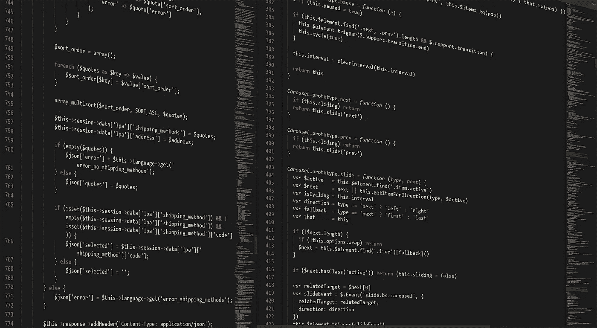
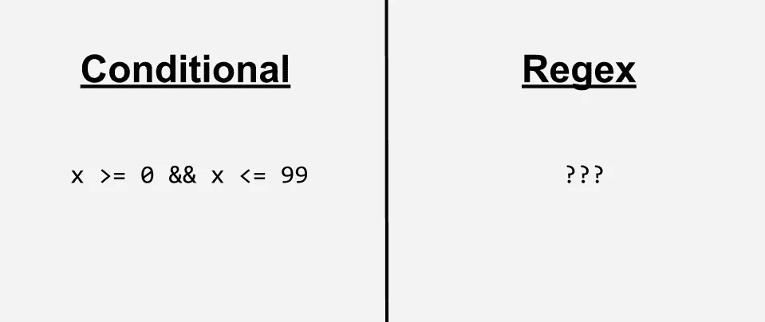
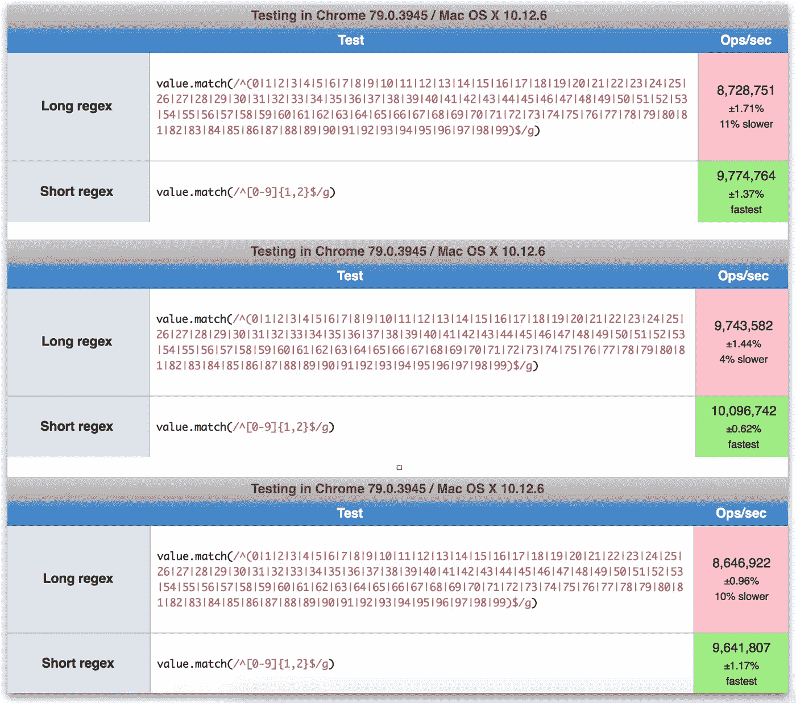
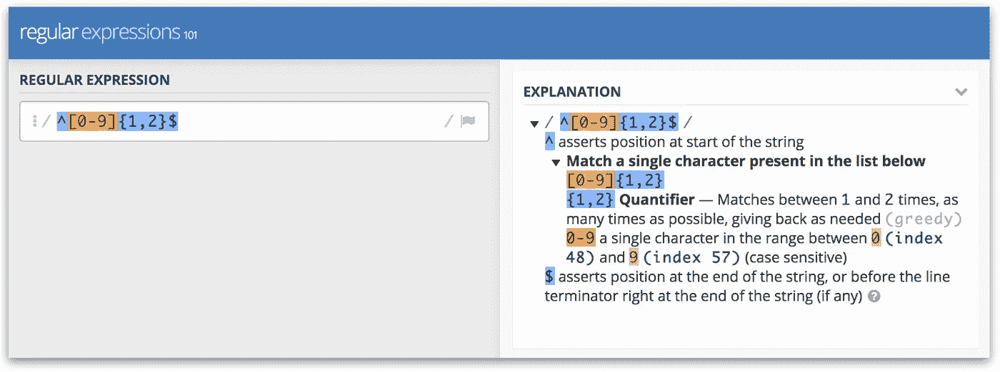
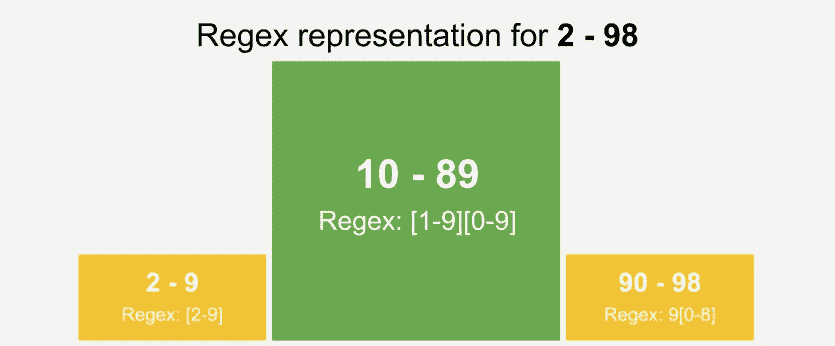
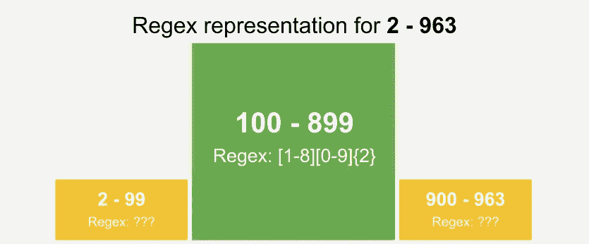
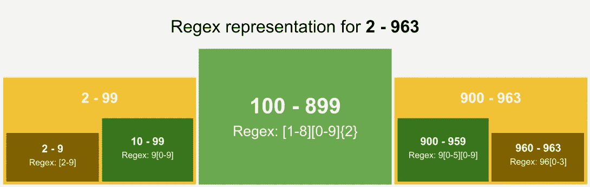
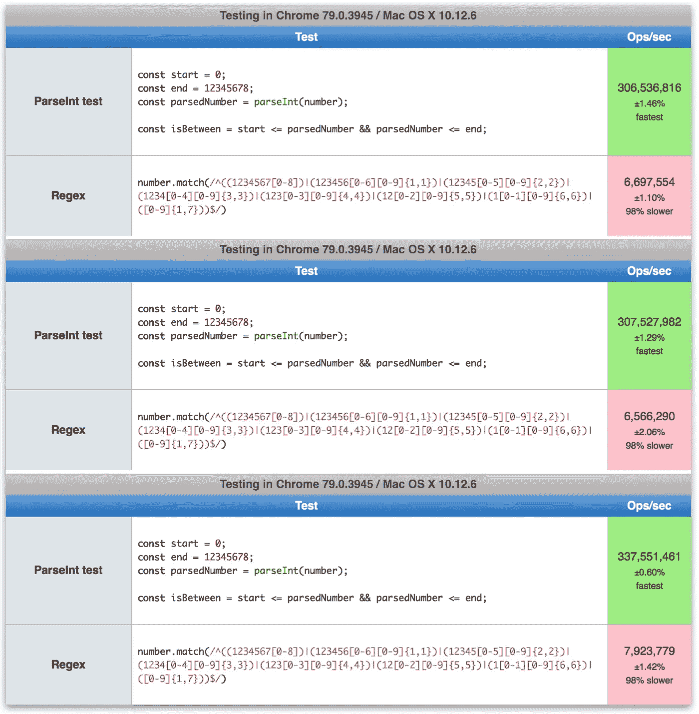
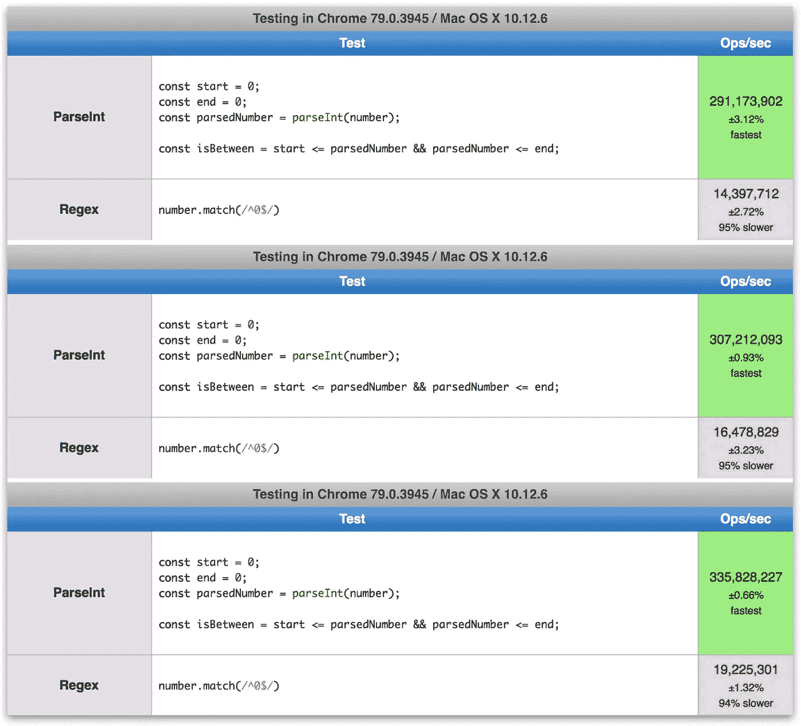

# 编写一个正则表达式来检测一系列数字？为什么不直接把字符串解析成整数呢

> 原文：<https://levelup.gitconnected.com/writing-a-regex-to-detect-a-range-of-numbers-why-not-just-parse-the-string-to-integers-instead-8a24089eab0b>

将字符串解析为整数和正则表达式匹配数值，哪一个是“更好”的选择？



## 我思考了这个问题，因为我正在探索一个基于 bucket 的方法，用 Nginx 做 ab 测试。

这个想法的前提是这样的。假设群组 A 包含 10%的受众，而其余 90%的受众被自动分配到群组 b。如果我们要将群组 A 增加到 20%，我们如何在生产中做到这一点，而不必重新分配群组 A 中的用户，同时确保持久性。

部分想法是使用带有数值的“桶”。每个群组将被分配一个数值范围(例如群组 A 的用户被分配 0 到 19 之间的值，而群组 B 的用户被分配 20 到 99 之间的值)。在 Nginx 中，作为 ab 测试的一部分，我们将测试这个赋值和正确群组的代理。但是，由于我们无法在 Nginx 中执行数值比较(这里的[见](https://nginx.org/en/docs/http/ngx_http_rewrite_module.html#if)，不允许使用`<`和`>`等运算符)，使用正则表达式(regex)似乎是一个合适的解决方案。我还想构建一个范围正则表达式生成器来简化正则表达式的工作流程。

在讨论评估正则表达式与将字符串解析为整数以进行条件检查的性能比较之前，让我们看看如何将一个数值范围分解为它的正则表达式。

## 正则表达式难题



解决这个问题最简单的方法是将数值范围转换为 regex 值，其中每个数字都出现在该范围内。0-99 的简单范围将被转换为以下正则表达式。

```
/^(0|1|2|3|4|5|6|7|8|9|10|11|12|13|14|15|16|17|18|19|20|21|22|23|24|25|26|27|28|29|30|31|32|33|34|35|36|37|38|39|40|41|42|43|44|45|46|47|48|49|50|51|52|53|54|55|56|57|58|59|60|61|62|63|64|65|66|67|68|69|70|71|72|73|74|75|76|77|78|79|80|81|82|83|84|85|86|87|88|89|90|91|92|93|94|95|96|97|98|99)$/
```

然而，上面没有利用 regex 的基本特性，比如检测一系列字符和分组。

一个例子是 10、11、12 这样的范围...19.由于每个数字的第一个字符在这个范围内是相同的，我们可以对第一个字符的正则表达式进行分组。另一个观察结果是，对于第二个字符，找到了 0-9 之间的所有数值，我们可以用 regex 中更简单的术语来验证这一点。产生的正则表达式如下:

```
/^1[0-9]$/
```

将逻辑扩展到前面的查询 0-99，我们得到一个更简单的 regex 值:

```
/^[0-9]{1,2}$/
```

长短正则表达式的性能如何匹配？在 JavaScript 中测试性能时，我得到了以下结果:



性能指标评测，由 jsperf.com 提供— [点击此处自行测试](https://jsperf.com/regex-length-perf)

如上所示，我运行了 3 次 long 和 short 正则表达式的性能基准，以确保得到一致的结果。结论是，虽然较短的正则表达式性能更好，但差别很小。然而，随着正则表达式在更长的范围内变得更长，我们可以预期这种差异也会变大。此外，较短的正则表达式更容易阅读，没有必要用较长的正则表达式淹没您的代码，尤其是如果涉及的数量和范围很大的话。

侧注: regex101 有一个非常酷的规则分解和对所有 regex 事物的解释。请参阅下面对上述正则表达式值的解释:



regex101 — [链接](https://regex101.com/)

## 但是解决方法有那么简单吗？

通过上面的优化，我们发现我们遇到了另一个问题，那就是它仅仅是最终解决方案的一个子集。以 2-99 的范围为例。我们发现，我们不能简单地使用与 0-99 相同的解决方案，因为它也会将 0 和 1 测试为阳性。

但是，如果我们从范围中删除 2-9，并测试 10-99，我们可以稍微修改之前的解决方案，以获得此子范围的可接受解决方案:

```
/^[1-9][0-9]$/
```

另一方面，检测 2-9 使人想起相同的问题，并且很容易解决:

```
/^[2-9]$/
```

将两种解决方案放在一起，我们就能得到该系列的解决方案:

```
/^([2-9]|[1-9][0-9])$/
```

# 完整的解决方案

基于以上所述，我开始制定规则，作为生成正则表达式的完整解决方案，来检测一个范围内的数字。

1.  获取可以表示为正则表达式的最大子范围，它通常位于整个范围的中间。该子范围通常从一个数字开始，该数字在该范围内具有最大数量的“0 ”,从右侧开始计数。该范围末端的数字通常具有与该子范围中的第一个数字相同的字符数量，并且具有与作为第一个数字的“0”数量相同的“9”数量。
2.  使用全范围左侧剩余的子范围，生成一个正则表达式。
3.  使用全范围右侧剩余的子范围，生成一个正则表达式。

让我们来看一个例子，将上述规则应用于 2 - 98 的范围:



呜！好像成功了！

更复杂的怎么样，比如 2 - 963？



啊哦。将整个范围分成 3 个子范围似乎并不能解决问题。但是如果你足够细心，你会看到在左边，我们已经解决了范围 2 - 99 的问题。我们能在两边迭代地应用解决方案，直到我们得到最终的解决方案吗？事实证明我们可以！

调整规则以匹配上述内容，我们得到了这些修改后的规则:

1.  ….(和以前一样)
2.  使用全范围左侧剩余的子范围，生成一个正则表达式。**如果我们不能立即将这个子范围解析为一个正则表达式，那么将从 1 开始的所有步骤应用到这个子范围。**
3.  使用全范围右侧剩余的子范围，生成一个正则表达式。**如果我们不能立即将这个子范围解析为一个正则表达式，则将从 1 开始的所有步骤应用到这个子范围。**



👍👍👍👍👍👍

# 构建正则表达式生成器

有了固定的规则，构建正则表达式生成器就是实现规则的关键。我决定用 TypeScript 构建一个简单的前端应用程序，这是我在工作中还没有探索过的东西。无论如何，这是发电机最辉煌的时刻:

# 关键时刻到了

有了正则表达式生成器，我决定带着这个比较基准“进城”。这里的测试是检查值(1234567)是否在 0 - 12345678 的范围内。



不，正则表达式解决方案的表现一直更差，大约差了 98%。嗯，如果我简化匹配的值呢？



遗憾的是，不管正则表达式有多复杂，与用 JavaScript 将字符串解析成数字相比，正则表达式解决方案的性能还是不够好。

如果您对在自己的机器上运行上述测试感到好奇，请查看以下链接:

*   复杂正则表达式 vs parse int—【https://jsperf.com/regex-vs-parseint-comp 
*   简单正则表达式 vs parse int—【https://jsperf.com/simple-regex-vs-parseint-compe 

无论如何，这就是我对这个非常有趣的问题的全部看法。如果你有任何想法，请在评论中告诉我！

再见。

## TL；速度三角形定位法(dead reckoning)

经过 JavaScript 测试，解析字符串并进行比较比使用 regex 要快得多。