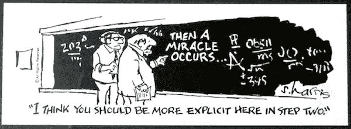
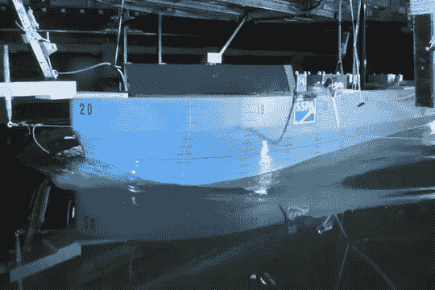

# 撰写可重复的研究论文

> 原文：<https://levelup.gitconnected.com/writing-a-reproducible-research-paper-8ac561c105fd>

这是我和朱庇特一起做的。

今天我提交了我作为博士生的第三篇会议论文。我对可重复研究的努力给了我一个工具链，现在我想分享一下。在我们进入技术细节之前，我想先讨论一下我自己对于可重复研究的动机。

# 可重复的研究

[再现性](https://coderefinery.github.io/reproducible-research/01-motivation/)是科学中必不可少的东西。对于任何研究项目，独立的研究人员应该能够复制实验。在大多数严肃的研究项目中，这可能是真的，但在现实中往往相当困难，因为:

*   数据不可用
*   使用的代码不可用
*   代码是可用的，但是非常混乱(编写代码的人是唯一可以运行它的人)。

对于这些情况，结果很难再现，这实际上使它变得非常无用。结果很不靠谱。没有人可以在这项工作的基础上，扩展它，或帮助它。

如果你强迫自己变得透明，你就不会受到欺骗的诱惑，不管它可能是多么无害。另一方面，如果没有人能看到你的代码，调整它以获得奇妙的结果，将是非常诱人的。透明意味着忠于你的研究，无论成功与否，对自己和他人都要非常诚实。

# 我第三篇论文使用的工具

在本文中，我们的想法是将物理比例模型试验、CFD 计算和一种半经验方法的数据结合起来，预测模型船的横摇阻尼，如下图所示。

用本文的验证试验案例进行缩尺模型试验。

## 开源代码库

本文开发的代码和数据放在 GitHub 上:

 [## martinlarsalbert/用完全非线性势流和 Ikedas 法预测滚转运动

### 对 martinlarsalbert/用完全非线性势流和 Ikedas 方法预测滚转运动作出贡献…

github.com](https://github.com/martinlarsalbert/Prediction-of-roll-motion-using-fully-nonlinear-potential-flow-and-Ikedas-method/blob/main/reports/ISOPE_outline/01.1.outline.ipynb) 

我使用了 [Cookiecutter 数据科学](https://drivendata.github.io/cookiecutter-data-science/)来得到这个项目的一个很好的结构。

论文最终提交时使用的代码被加上了标签，以防提交后继续开发。

## 乳液

写论文是一个反复的过程。表格和图表中的结果需要多次更新。拥有一个自动化的工作流程来实现这一点至关重要。由于大多数结果是用 Python 生成的，而不是在 MS Office 中生成的，因此为 LaTeX 创建这个工作流要容易得多。对基于文本的 LaTeX 文件使用版本控制也非常方便。

我使用背面的作为 LaTeX 编辑器，这简化了与论文合著者的合作。[论文](https://github.com/martinlarsalbert/inviscid_CFD_-roll_decay)被保存为[主存储库](https://github.com/martinlarsalbert/Prediction-of-roll-motion-using-fully-nonlinear-potential-flow-and-Ikedas-method)的 GIT 子模块，该主存储库连接到背面的项目。

## Jupyter 笔记本

撰写一篇科学论文包括一个研究部分:实验/分析和论文写作部分，你可以写下你的发现。在研究部分，我探索了各种想法，为论文找到一些有趣的结果。然而，这一阶段收集的大部分材料并没有最终形成论文。Jupyter Notbooks 非常适合这项工作:将代码、文本和情节并排放在一起。笔记本放在[笔记本](https://github.com/martinlarsalbert/Prediction-of-roll-motion-using-fully-nonlinear-potential-flow-and-Ikedas-method/tree/main/notebooks)文件夹中，按照 [Cookiecutter 数据科学](https://drivendata.github.io/cookiecutter-data-science/)进行编号和命名。除此之外，我还有一个日志[记录我的研究进展，参考其他笔记本。](https://github.com/martinlarsalbert/Prediction-of-roll-motion-using-fully-nonlinear-potential-flow-and-Ikedas-method/blob/main/notebooks/logbook.ipynb)

在某个阶段，我得到了足够多的结果，是时候写真正的论文了。之前的意思是:创建一个 Word 或 LaTeX 文档，并用研究笔记本中的内容填充它。

对于第三篇论文，我尝试了一种稍微不同的方法。我试着在笔记本上写论文。我意识到这将是一个非常长的笔记本，但是[目录](https://jupyter-contrib-nbextensions.readthedocs.io/en/latest/nbextensions/toc2/README.html#)扩展使它易于管理。如果你愿意，你可以看一看作为 Jupyter 笔记本的[纸](https://nbviewer.jupyter.org/github/martinlarsalbert/Prediction-of-roll-motion-using-fully-nonlinear-potential-flow-and-Ikedas-method/blob/main/reports/ISOPE_outline/01.1.outline.ipynb)。

我使用模块来隐藏大量代码，这样笔记本看起来就像期末论文，而不是杂乱的代码。

## nbconvert

从一开始，这个想法就是在朱庇特的笔记本上做一个提纲，作为真正写作的良好起点。当我在 Jupyter 笔记本纸上写满内容时，是时候换成 LaTeX 了。nbconvert 似乎是实现这种转变的最佳方式。我从 [Julius Schulz 的博客](http://blog.juliusschulz.de/blog/ultimate-ipython-notebook)中获得了很多灵感来编写一个模块: [notebook_to_latex.py](https://github.com/martinlarsalbert/Prediction-of-roll-motion-using-fully-nonlinear-potential-flow-and-Ikedas-method/blob/main/src/notebook_to_latex.py) 来处理从 [create_latex_report.py](https://github.com/martinlarsalbert/Prediction-of-roll-motion-using-fully-nonlinear-potential-flow-and-Ikedas-method/blob/main/reports/ISOPE_outline/create_latex_report.py) 运行的转换。我使用细胞标记来选择应该从论文中排除的细胞。图说明文字等。在单元元数据中指定了。我创建了 Jupyters 容器类的子类，例如将 [Math](https://ipython.readthedocs.io/en/stable/api/generated/IPython.display.html#IPython.display.Math) 类子类化到我的 [Equation](https://github.com/martinlarsalbert/Prediction-of-roll-motion-using-fully-nonlinear-potential-flow-and-Ikedas-method/blob/cf28036d0a493ad75446c90f621a4403910af6c6/src/notebook_to_latex.py#L420) 类中，该类也可以处理 LaTeX 标签和标题。

## cite2c

对于参考文献，我使用了 [cite2c](https://github.com/takluyver/cite2c) ，这使得在 Jupyter 笔记本中参考其他论文(取自我的 [zotero](https://www.zotero.org/) )成为可能。这些参考用于为乳胶纸创建 bibtex 文件。

## 粘合剂

为了提高再现性，我将纸张再生的整个过程制作在活页夹上:

[https://my binder . org/v2/GH/martinlarsalbert/Prediction-of-roll-motion-using-fully-nonlinear-potential-flow-and-Ikedas-method/submission 1？file path = reports % 2f scope _ outline % 2f 01.1 . outline . ipynb](https://mybinder.org/v2/gh/martinlarsalbert/Prediction-of-roll-motion-using-fully-nonlinear-potential-flow-and-Ikedas-method/submission1?filepath=reports%2FISOPE_outline%2F01.1.outline.ipynb)

# 结论

我选择了在我的研究中非常透明。这迫使我在任何阶段都要诚实面对结果。对于这第三篇论文，我比以前更进一步地考虑了再现性。我很惊讶可以将论文连接到活页夹，这样任何有网络连接的人都可以在几分钟内复制它。不需要在本地机器上复制我的环境，安装软件包和下载数据。现在一切都在那里了，正是写这篇论文时的样子。

我遇到的一个复杂情况是，nbconvert 单向转换为 LaTeX。当我的合著者对背页的 LaTeX 进行修改时，我需要手工更新笔记本。

不知道第四篇论文会怎么创作？我能否说服我的合著者也使用 Jupyter，这样就可以避免不可逆转化的问题？