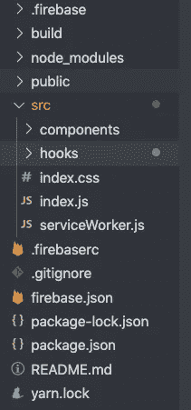
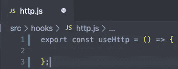
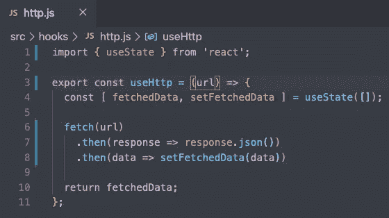
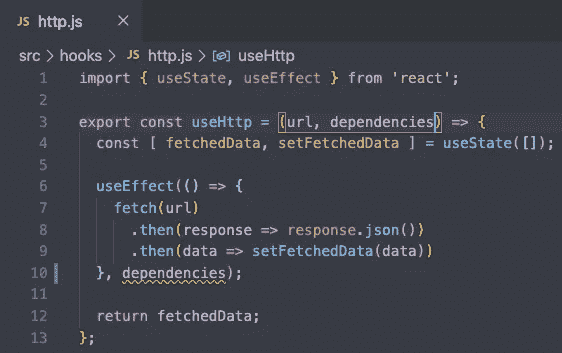
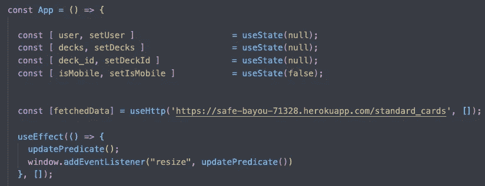

# 编写一个可重用的自定义 React 钩子

> 原文：<https://levelup.gitconnected.com/writing-a-reusable-custom-react-hook-edc58986775b>

重构系列的第 3 部分使用钩子。


让我们开始吧！

欢迎来到我的重构之旅的第 3 部分！[上次](https://medium.com/@damongself/managing-state-in-a-react-application-9a490bd44319)我看了一些关于状态管理的概念，以及状态应该存储在哪些组件中。这次我将编写一个可重用的 fetch 请求钩子，这样我就可以删除许多手工编写的 fetch 请求。

首先，为了便于组织，我想将我的定制钩子存储在它们自己的目录中。这应该可以让我的组件和钩子保持分离，让任何看我源代码的人都容易识别。



我将 hooks 目录保存在我的 src 中

现在我有地方存放我的定制钩子了，我可以开始写我自己的了！在 hooks 目录中，我将创建一个名为`http.js`的文件，因为主要目的是发送 http 请求。



我现在有一个自定义挂钩！

关于上面我写的代码，需要注意的是我要导出的函数的名称。与所有其他挂钩一样，它以“使用”开头，后面跟着一个词来表达它的目的。这是一个 React 钩子惯例，你不需要使用，但绝对应该使用。在开头用“use”命名钩子向其他 React 开发者传达了你所写的是一个定制钩子。此外，它允许 es-lint React hook 插件检测您何时违反了钩子规则。如果钩子不是以“use”开头，它就不会被检测为钩子。

因为我正在编写一个可重用的 http 请求钩子，所以我需要访问被获取的 url。因此，每当我调用我的`useHttp`钩子时，我都会期待一个`url`的参数。有了一个`url`参数，我可以像这样把它传递给我的获取请求:

```
fetch(url)
  .then(do something)
```

因为我所有的获取请求都期望得到某种被解析为 json 的响应，所以我可以像这样写出完整的获取请求:

```
fetch(url)
  .then(response => response.json())
  .then(data => do something)
```

正如你在上面看到的，我还没有写任何关于我们从获取请求中收到的数据的东西。目前，我只是用这段代码发送 GET 请求，但额外的可重用性将在以后出现。我目前面临的一个问题是如何处理我收到的数据。我手动写出的 fetch 请求使用了某些方法来更新数据的状态，但是，由于我使用了可重用的钩子，如果不将它们作为道具接收，我就无法访问这些方法。以下是我的解决方案:

在我的钩子内部，我可以利用一个`useState`钩子来存储和返回我获取的任何数据。看一看:



将我获取的任何数据返回给调用它的顶层函数

酷！我有一个钩子，它接收一个 url，并使用该 URL 发送一个可定制的获取请求，将接收到的任何数据作为响应存储在 state 中，然后返回该状态的值。然而，我还有更多工作要做，我将从我最直接的问题开始:我们大多数手工编写的获取请求都在`useEffect`钩子内。为什么这是一个问题？嗯，钩子，包括你自己定制的钩子，不能比最顶层的函数调用的更低。这是什么意思？这意味着我不能这么做。

```
const someFunction = () => {
  useEffect(() => {
    useHttp(url)
  }, [dependency]); // OR THIS if(some conditional) {
    useHttp(url)
  };
};
```

所以，我写了一个自定义的`useHttp`钩子，但是不能使用它，因为它现在已经实现了。幸运的是，我已经证明了我可以在我的自定义钩子中使用其他钩子！我正是要这样做来解决我们的`useEffect`问题。

为了在我的定制钩子中使用`useEffect`钩子，我需要像过去一样导入并调用它。然而，新的东西是我如何接受依赖。谢天谢地，我的解决方案很简单。与我将 url 作为参数传递给我们的`useHttp`钩子一样，我也可以传递任何我想要监控的依赖项。添加新内容后，代码现在看起来像这样:



黄色警告表示它无法静态检查“dependencies”是否为数组。通过将它放在数组括号中来解决这个问题！

我想实现这个新的获取挂钩的第一个地方是在我的应用程序组件中，在那里我为我的应用程序获取所有的卡。因为我将实际的数据作为一个数组从钩子中返回，所以我可以用一个简单的`setAllCards(fetchedData)`代替 fetch，使用数组析构，如下所示:


希望你在这里看到一些冗余。我基本上做的是进行一个 fetch 调用，并将数据存储在钩子内部的一个状态中，然后返回该数据，并通过数组析构来访问它。然后，我使用卡数据的数组，并将其设置为我的 allCards 状态的值。现在，我有两种访问相同数据的方式…似乎我打破了一些枯燥的规则。相反，我可以摆脱`allCards`状态，通过我们的析构`fetchedData`来访问所有的卡。尤其是因为我永远不会改变这些数据。删除该状态后，我们的代码如下所示:



关于我以前实现定制钩子的方式，值得一提的是我的钩子触发了两次。分配移动窗口事件监听器的`useEffect`和`setAllCards(fetchedData)`都依赖于`fetchedData`,因为我需要`setAllCards`方法在数据加载后触发，但它是用初始空数组触发的。所以一旦`fetchedData`被真正加载，就需要再次调用它。因此，它将加载组件，将获取的数据设置为空数组，检查并查看`fetchedData`变量是否已更改，重新呈现组件，并再次调用钩子。之后它没有继续发射的唯一原因是因为存储的数据相当于当前状态。

老实说，在文章的前面，我提到了为多种类型的获取请求添加功能，但是我一直在努力做到这一点，我想我知道为什么。当然，在进入 hooks 时，我希望有一种方法来编写带有状态的功能组件。然而，到目前为止，我已经把钩子解释为只是被导入的普通函数。不幸的是，这不完全正确。为了编写一个动态运行的获取钩子，至少从我的尝试来看，我必须能够从条件函数或嵌套函数中调用我的钩子；这是不允许你做的。因为钩子是在组件渲染之后运行的，而不是在你想要有条件地调用它们的时候，所以当你点击一个按钮或者只有当某个条件被满足时，它们才被触发。我的意思是，你可以在你的钩子内部指定条件，但是越是针对我的应用程序，它的可重用性就越低。

这可能只是我作为开发人员的经验不足，让我看不到更合适的解决方案和结论，但就目前情况而言，我只会实现我迄今为止编写的代码。所以，实际上，我的目标失败了，因为我最终只用一个钩子替换了一个 fetch 请求。但是我学到了很多关于 React 钩子如何工作和不工作的知识！此外，我学会了如何编写自己的钩子，现在，对于我的下一个特性或项目，我将记住我在尝试以这种方式使用钩子时学到的经验。

我想我的下一篇文章将会更侧重于为这个应用程序创造更好的用户体验。我在本系列中省略了我实际应用程序的图片，因为它对用户几乎没有任何帮助，看起来也不怎么样。所以，下一次，我将看看我为用户做的有多少，为什么那是不好的，以及我如何能修复它。感谢阅读！