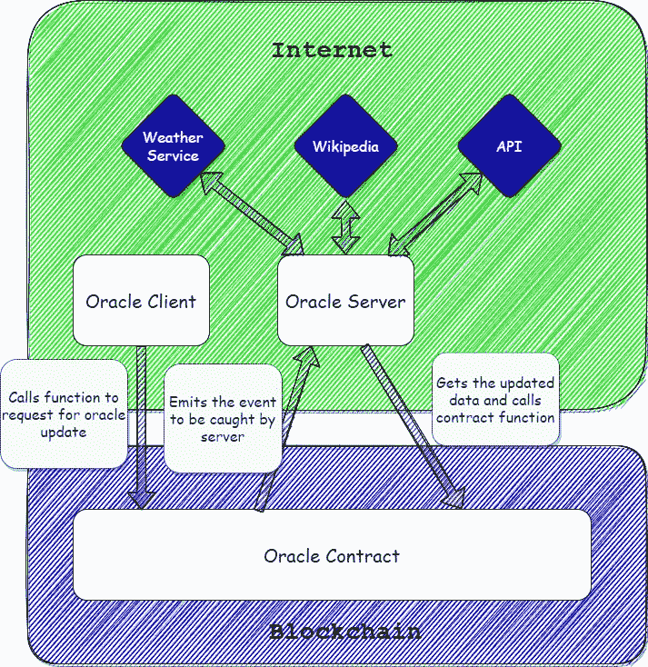
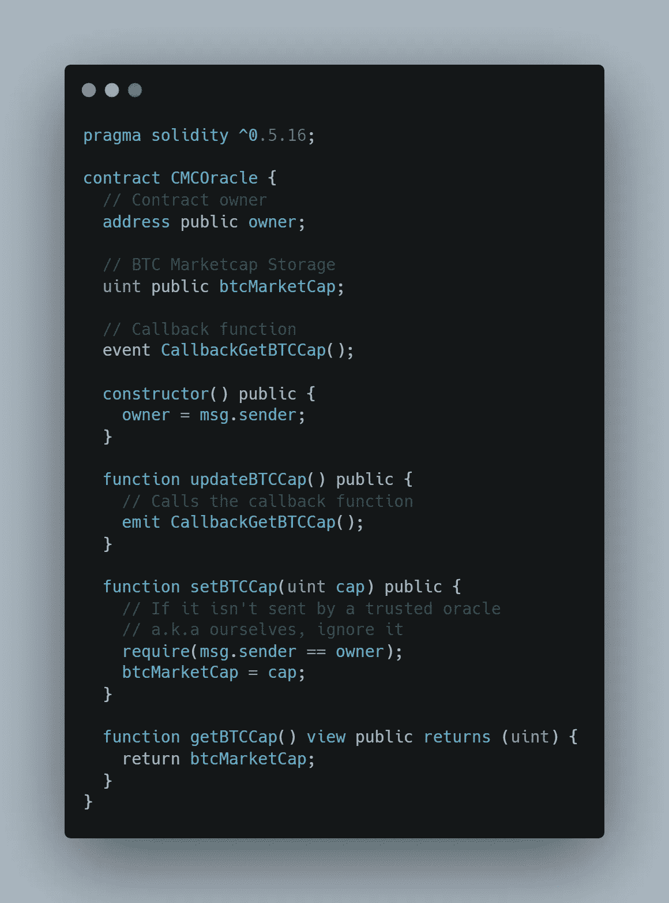
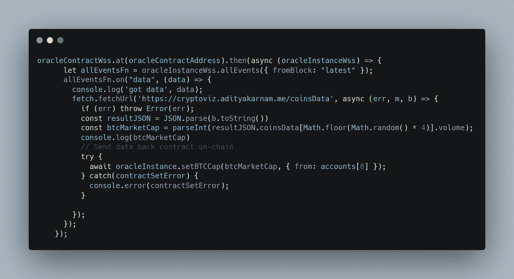

# 在 5 分钟内编写一份简单的区块链 oracle 合同、oracle 服务器和客户端

> 原文：<https://levelup.gitconnected.com/writing-a-simple-blockchain-oracle-contract-oracle-server-and-client-in-under-5-mins-7ec8ee33df91>

建立一个区块链甲骨文网络是很容易的。是的，它是。但是什么是甲骨文网络呢？让我们来分解一下，了解一下甲骨文网络为何如此重要，以及它是如何为区块链网络增添超能力的。

简而言之，oracle 网络是一个基本的 web 服务器，它允许信息从 internet 传输到区块链层。但是怎么做呢？让我们来看看这个架构。

1.  Oracle 客户端是请求的发起者。客户端调用智能协定上的一个函数，该函数发出一个事件。
2.  Oracle 服务器监听事件并通过互联网执行外部定义的请求或操作。
3.  然后，Oracle server 通过调用合同更新功能将信息传递给 Oracle 合同来更新信息。

让我们看看 Oracle 契约的代码:

1.  客户端调用 updateBTCCap()函数，该函数为服务器发出一个 internet 请求来获取 BTCCap。
2.  一旦服务器完成请求并获得 BTC 上限，它就调用 setBTCCap 函数，并以`cap`作为参数。
3.  一旦完成，客户端就可以调用 getBTCCap 函数来获取由服务器更新的最新 BTCCap。

下面的部分服务器代码:

1.  oracle 契约有两个实例。一个是基于 Websocket 的连接`oracleContractWss`，另一个是带有 HTTPS 提供者`oracleInstance`的简单实例。
2.  web socket 实例可以监听事件，我们从最新的块中获取事件。这意味着它将只考虑即将发生的事件。如果指定任何旧块，将获取从该块开始的事件。
3.  根据来自事件的数据，我们请求一个 API 来获取 BTC Cap。并使用契约的 HTTPS 实例调用`setBTCCap`函数。

该项目的完整源代码在下面的 Github 库中。

 [## GitHub-adityak 74/区块链-eth-simple-oracle:一个简单的基于以太坊的 oracle 网络，合同…

### 此时您不能执行该操作。您已使用另一个标签页或窗口登录。您已在另一个选项卡中注销，或者…

github.com](https://github.com/adityak74/blockchain-eth-simple-oracle) 

关注我，了解更多区块链内容。如果这些内容对你有帮助👏 👏