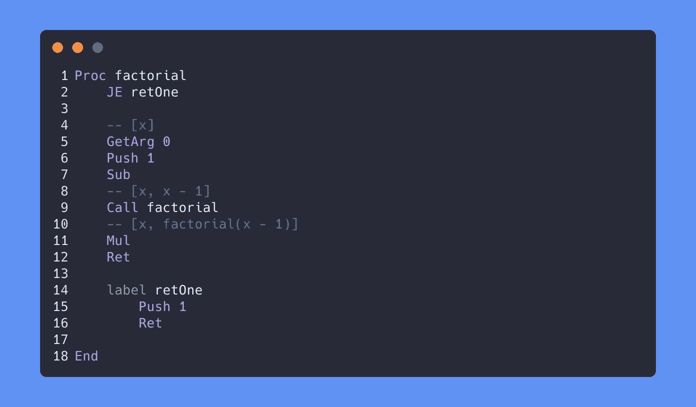

# 在 Rust 中编写微型堆栈虚拟机

> 原文：<https://levelup.gitconnected.com/writing-a-tiny-stack-vm-in-rust-e043cb6dcd40>



几天前，我写了一个超级简单的后缀表达式计算器来演示如何使用堆栈。后来，我决定最终开始学习全栈虚拟机是如何工作的，所以我将其扩展为一个全栈虚拟机，理论上你可以为其编写一个编译器。结果是超级简洁，速度也蛮快的。

本指南旨在补充阅读 TinyVM:[https://github.com/mkhan45/tinyvm/blob/main/src/main.rs](https://github.com/mkhan45/tinyvm/blob/main/src/main.rs)的代码。如果你熟悉 Rust，但对 Stack VM 一无所知，那么你应该能够通过阅读代码来理解 Stack VM 是如何工作的。否则，本指南可以解释一些设计决策，并对一些步骤进行更高层次的概述。为了了解这个虚拟机可以运行什么类型的程序，请查看测试文件[。](https://github.com/mkhan45/tinyvm/tree/main/test_files)

堆栈虚拟机有两个主要组成部分:一列指令和一堆值。对于这个堆栈虚拟机，值只是带符号的 64 位整数，因此在 Rust 中,`Stack`看起来像这样:

```
struct Stack(Vec<isize>);

// Since this is just a learning project
// there's no proper error handling.
// These helper methods are just so that 
// it's easier to ignore errors.
impl Stack {
    fn push(&mut self, v: isize) {
        self.0.push(v);
    }

    fn pop(&mut self) -> isize {
        self.0.pop().expect("popped an empty stack")
    }

    fn peek(&mut self) -> isize {
        *self.0.last().expect("peeked an empty stack")
    }

    fn peek_mut(&mut self) -> &mut isize {
        self.0.last_mut().expect("peeked an empty stack")
    }
}
```

下一个重要的部分是指令列表。在 Rust 中，很容易用枚举来表示这些。首先，我们需要的是:

```
enum Inst {
    Push(isize),
    Pop,
    Add,
    Sub,
}
```

对于非 Rustaceans，这意味着一个`Inst`要么是一个带有整数有效载荷的标签`Push`，要么是一个`Pop`、`Add`或`Sub`。

在我的 VM 中，我为列表`Inst`创建了一个类型别名 program:

```
type Program<'a> = &'a [Inst];
```

如果您不知道生存期注释(`'a`)的含义，可以放心地忽略它们。

有了这个，我们就可以放心地`interpret()`一`Program`了。

```
fn interpret<'a>(program: Program<'a>) -> isize {
    use Inst::*;

    // instantiate stack as an empty Vector
    let mut stack = Stack(Vec::new());

    for instruction in program {
        match instruction {
            // pushes the data to the stack
            Push(d) => stack.push(*d),
            // Pops a value off the stack
            Pop => stack.pop(),
            // Adds the top two values on the stack:
            // [3, 1, 1] -> [3, 2]
            Add => {
                let (a, b) = (stack.pop(), stack.pop());
                stack.push(a + b);
            }
            // Subtracts the top two values on the stack:
            // [3, 3, 1] -> [3, 2]
            Add => {
                let (a, b) = (stack.pop(), stack.pop());
                stack.push(b - a);
            }
        }
    }

    stack.pop()
}
```

运行`interpret(vec![Push(9), Push(3), Push(1), Add, Sub].as_slice())`返回 5。这是`(- (+ 1 3) 9)`，或者说`9 - (1 + 3)`的结果。

这很酷，但显然不是堆栈虚拟机。它可以处理算术表达式，但仅此而已。幸运的是，它实际上离能够做更多的事情不远了。第一步是添加`Print`指令，它只在堆栈顶部打印值。这是一个重要的里程碑，因为它把程序从本质上一个有输入和输出的纯函数变成了一个有明显副作用的完整解释器。

`Print`超级容易实现。第一步是将变量添加到`Inst`枚举中:

```
enum Inst {
    Push(isize),
    ...
    Print,
}
```

接下来，我们告诉解释器如何处理它:

```
fn interpret<'a>(program: Program<'a>) {
    use Inst::*;

    // instantiate stack as an empty Vector
    let mut stack = Stack(Vec::new());

    for instruction in program {
        match instruction {
            Push(d) => stack.push(*d),
            ...
            Print => println!("{}", stack.peek()),
        }
    }
}
```

注意，我还删除了返回，因为我们可以打印中间值。

现在，我们可以进行多次计算并打印结果:

```
interpret(vec![
    Push(5),
    Push(10),
    Add,
    Print,
    Push(25),
    Sub,
    Print,
    Push(10),
    Add,
    Print,
].as_slice())
```

它将打印:

```
15
-10
0
```

我们现在可以打印东西了，但是程序复杂性的上限仍然很低。在下一节中，我们将通过两步从一个简单的表达式求值器到一个完整的解释器。

首先，我们需要跳转和条件跳转。跳转将我们从代码中的一点带到另一点，条件跳转只有在满足条件时才会跳转，否则它只会继续前进。

为了增加这一点，我们需要能够在任何点访问指令表，而不仅仅是按顺序访问。在 Rust 中，只需添加当前指令指针作为可变变量，并将`for each`循环改为`while let`循环:

```
fn interpret<'a>(program: Program<'a>) {
    use Inst::*;

    // instantiate stack as an empty Vector
    let mut stack = Stack(Vec::new());
    let mut pointer = 0;

    while let Some(instruction) = program.get(pointer) {
        pointer += 1;

        match instruction {
            ...
        }
    }
}
```

接下来，我们添加`Jump`、`JE`和`JNE`指令。跳转无条件跳转，如果栈顶等于零，JE 跳转，如果栈顶不等于零，JNE 跳转。现在，我们将在指令列表中指定一个要跳转到的索引。

新的`Inst`枚举看起来像:

```
type Pointer = usize;

enum Inst {
    Push(Pointer),
    ...
    Jump(Pointer),
    JE(Pointer),
    JNE(Pointer),
}
```

对于`interpret`新指令，我们添加:

```
fn interpret<'a>(program: Program<'a>) {
    use Inst::*;

    // instantiate stack as an empty Vector
    let mut stack = Stack(Vec::new());
    let mut pointer = 0;

    while let Some(instruction) = program.get(pointer) {
        pointer += 1;

        match instruction {
            ...
            Jump(p) => pointer = *p;
            JE(p) => {
                if stack.peek() == 0 {
                    pointer = *p;
                }
            }
            JNE(p) => {
                if stack.peek() != 0 {
                    pointer = *p;
                }
            }
        }
    }
}
```

这开启了一个充满可能性的世界。我们可以很容易地用 JNE 做循环:

```
interpret(vec![
    Push(10),
    Print,
    Push(1),
    Sub,
    JNE(0),
].as_slice());
```

这将打印从 10 到 0 的所有数字:

```
10
9
8
7
6
5
4
3
2
1
```

下一步是使访问或更改任意堆栈值成为可能。在此之后，虚拟机将完成图灵。

以下是新的说明:

```
enum Inst {
    ...
    Get(Pointer),
    Set(Pointer),
}
```

`Get(p)`只在 n 处索引栈，复制到栈顶。`Set(p)`获取堆栈顶部的值，并将其复制到堆栈的索引 p 处。

```
while let Some(instruction) = program.get(pointer) {
    pointer += 1;

    match instruction {
        ...
        Get(p) => stack.push(*stack.0.get(*p).unwrap()),
        Set(p) => {
            let v = stack.pop();
            *stack.0.get_mut(*p).unwrap() = v;
        }
    }
}
```

此时，由于我们可以从堆栈中取出`Get`值，我们希望让我们的`JNE`和`JE`指令弹出比较值:

```
while let Some(instruction) = program.get(pointer) {
    pointer += 1;

    match instruction {
        ...
        JE(p) => {
            if stack.peek() == 0 {
                stack.pop();
                pointer = *p;
            }
        }
        JNE(p) => {
            if stack.peek() != 0 {
                stack.pop();
                pointer = *p;
            }
        }
    }
}
```

使用这些新指令，我们可以编写一些稍微复杂一点的程序。下面是一个对前 100 个整数求和的程序:

```
interpret(vec![
    // setup
    Push(0), // the accumulator
    Push(0), // the index

    // loop
    // First, add the index to the accumulator
    // stack: [accumulator, index]
    Get(0),
    Get(1),
    // stack: [accumulator, index, accumulator, index]
    Add,
    // stack: [accumulator, index, accumulator + index]
    Set(0),
    Pop,
    // stack: [accumulator + index, index]

    // next, increment the index
    Push(1), // the increment
    // stack: [accumulator, index, 1]
    Add,
    // stack: [accumulator, index + 1]

    // finally, compare the index with 100 and jump back to the start
    // if they're not equal.
    Get(1),
    // stack: [accumulator, index, index]
    Push(100),
    Sub,
    // stack: [accumulator, index, index - 100]
    JNE(2),

    // if index - 100 == 0, print the accumulator
    Get(0),
    // stack: [accumulator, index, 0, accumulator]
    Print
].as_slice())
```

就这样，虚拟机图灵完成了！不过用起来超级别扭。我们可以跳转到代码的不同部分，但是因为我们是按照行号跳转的，所以每当我们改变代码时，我们必须更新每次跳转。稍后，我们将通过编写一个将文本标签解析为行号的超级简单的编译器来解决这个问题。

```
// find_label takes a line split by spaces and the label it represents,
// or None if it does not represent a label.
fn find_label<'a>(i: Pointer, s: &'a [&'a str]) -> Option<Label> {
    if let ["label", l] = s {
        Some((l, i))
    } else {
        None
    }
}

let input = ...; // a String

let line_splits = input
        .split('\n')
        .map(|s| s.split_whitespace().collect::<Vec<_>>())
        .filter(|s| !matches!(s.as_slice(), [] | ["--", ..]))
        .collect::<Vec<_>>();

let labels: HashMap<&str, usize> = line_splits
    .iter()
    .enumerate()
    .filter_map(|(i, s)| find_label(i, s.as_slice()))
    .collect();
```

下面的代码非常生疏，所以我不会详细解释，但本质上它在空间上分割每一行，遍历它们，并构造一个标签名称到行号的散列表。

现在我们需要使用这些信息来编译指令。这也是相当生锈，但它非常简洁。

```
fn parse_instruction(s: &[&str], labels: &Labels) -> Instruction {
    use Instruction::*;

    match s {
        ["Push", x] => Push(x.parse::<isize>().unwrap()),
        ["Pop"] => Pop,
        ["Add"] => Add,
        ["Sub"] => Sub,
        ["Mul"] => Mul,
        ["Div"] => Div,
        ["Jump", l] => Jump(*labels.get(l).unwrap()),
        ["JE", l] => JE(*labels.get(l).unwrap()),
        ["JNE", l] => JNE(*labels.get(l).unwrap()),
        ["Get", p] => Get(p.parse::<Pointer>().unwrap()),
        ["Set", p] => Set(p.parse::<Pointer>().unwrap()),
        ["Print"] => Print,
        ["label", ..] => Noop,
        l => panic!("Invalid instruction: {:?}", l),
    }
}
```

您可能会注意到，以 label 开头的行被编译成 Noop。这只是为了便于跟踪行号；如果你把所有的错误一个一个的解决掉，你就可以不用它了。

我们将这个函数映射到行列表上，实际上将文本“编译”成指令:

```
let instructions: Vec<Instruction> = line_splits
    .iter()
    .map(|s| parse_instruction(s.as_slice(), &labels, &procedures))
    .collect();
```

现在我们可以很容易地用`interpret(instructions.as_slice())`解释编译后的指令。利用这一点，我们可以很容易地重写之前的 sum 示例:

```
Push 0
Push 0

label loop
    -- [accumulator, index]
    Get 0
    Get 1
    -- [accumulator, index, accumulator, index]
    Add
    -- [accumulator, index, accumulator + index]
    Set 0
    Pop
    -- [accumulator + index, index]

    -- [accumulator, index]
    Push 1
    Add
    -- [accumulator, index + 1]

    -- [accumulator, index]
    Get 1
    Push 100
    Sub
    -- [accumulator, index, index - 100]
    JNE loop
Pop

Get 0
Print
```

标签很整洁。现在让我们添加程序。

这个 VM 中的过程基本上只是跳回到它们被调用点的标签。这使得逻辑推理变得更加容易。这也意味着我们必须实现一个调用栈。调用堆栈只是一个堆栈框架列表，最初我们的堆栈框架看起来就像这样:

```
struct StackFrame {
    pub ip: usize, // ip is a common acronym for instruction pointer
}
```

因为我们的调用堆栈只是一堆调用帧，所以它看起来像这样:

```
type CallStack = Vec<StackFrame>;
```

第一步只是在解释函数开始时初始化我们的调用栈。

```
fn interpret<'a>(program: Program<'a>) {
    ...
    let mut stack = Stack(Vec::new());
    let mut call_stack = CallStack::new();
    ...
}
```

接下来，我们将添加一些说明:

```
enum Instruction {
    ...
    Call(Pointer),
    Ret,
}
```

Call 是我们用来进入一个过程的指令。这基本上是一个跳转，但它也将调用位置推送到调用堆栈。Ret 只是弹出调用堆栈，并返回到调用过程的位置。

```
match instruction {
    ...
    Call(p) => {
        call_stack.push(StackFrame {
            ip: pointer
        });
        pointer = *p;
    }
    Ret => pointer = call_stack.pop.unwrap().ip,
}
```

你可能已经注意到 Call 接受一个指针作为参数。不过，我们不想在代码中通过指针指定过程，所以我们将添加另一个编译步骤，就像我们对标签所做的那样。这有点复杂，因为我们需要知道一个过程的结束和开始的位置，否则当我们在代码中遇到这个过程而没有被调用时，我们将无法跳过它。

有更好的方法可以做到这一点，但是在 TinyVM 过程中，声明被解析为跳转。我们使用结束标记来标记过程声明的结束。

```
Proc proc_name // line n
    ...   
End // line n + l

...

Call proc_name
```

得到解决

```
Jump (n + 1)
    // procedure contents
    ...
...

Call (n)
```

这段代码也相当具体，所以我不会解释细节。

```
type Procedures<'a> = BTreeMap<&'a str, (Pointer, Pointer)>;

// find_procedures takes a list of lines split on space and
// returns the procedures declared.
fn find_procedures<'a>(lines: &'a [Vec<&str>]) -> Procedures<'a> {
    let mut ip = 0;
    let mut res = Procedures::new();

    while ip < lines.len() {
        if let ["Proc", proc_name] = lines[ip].as_slice() {
            let start_ip = ip;
            while lines[ip] != &["End"] {
                ip += 1;
            }
            res.insert(proc_name, (start_ip, ip + 1));
        } else {
            ip += 1;
        }
    }

    res
}
```

我们使用这个地图，就像我们在`parse_instruction`函数中使用 label one 一样。

```
fn parse_instruction(s: &[&str], labels: &Labels, procedures: &Procedures) -> Instruction {
    ...

    match s {
        ...
        ["Proc", proc] => Jump(procedures.get(proc).unwrap().1),
        ["Call", proc] => Call(procedures.get(proc).unwrap().0 + 1),
        ["Ret"] => Ret,
        ["label", ..] | ["End"] => Noop,

    }
}
```

有了它，我们可以编写一些简单的程序

```
-- assumes [a, b, c] top of stack
Proc addMul
    Add
    Mul
    Ret
End
```

这个程序取一个栈[…，a，b，c]并把它变成[…，a * b + c]。

这里的问题是很难进行重要的计算，因为我们不知道在栈上的哪个索引处访问变量。例如，我们如何编写一个过程来计算栈顶值的平方？我们早就将`Get`顶值化了，但我们不知道它的指数。

在 TinyVM 中，这是通过向每个堆栈帧添加另一个参数来解决的；调用堆栈时的堆栈偏移量或堆栈长度。然后我们添加两条新指令；`GetArg`和`SetArg`。这两条指令在堆栈偏移量之前引用堆栈索引*。例如，在 square 过程中，我们将使用`GetArg 0`来访问在过程被调用之前位于堆栈顶部的值。我们还必须更新 Get 和 Set，以便只访问堆栈偏移量*之后的索引*。*

```
Proc square
    -- stack is [..., x]
    GetArg 0
    -- stack is [..., x, x]
    Mul
    -- stack is [..., x * x]
    Ret
End
```

我们还可以写一些更有趣的程序。这是阶乘:

```
Proc fibStep
    GetArg 0
    GetArg 1
    -- [a, b, | b, a]
    Add
    -- [a, b, | b + a]
    GetArg 0
    -- [a, b, | b + a, b]
    SetArg 1
    Pop
    -- [b, b, | b + a]
    SetArg 0
    Pop
    -- [b, b + a | ]
    Ret
End
```

这个过程将堆栈[…，a，b]变成[…，b，b + a]。它用于迭代计算第 n 个斐波那契数:

```
Push 0
Push 1
Push 1

-- [i, a, b]
label loop
    Call fibStep
    -- [i, a, b]
    Get 0
    Push 1
    -- [i, a, b, i, 1]
    Add
    -- [i, a, b, i + 1]
    Set 0
    Pop
    -- [i + 1, a, b]
    -- [i, a, b]
    Get 0
    Push 40
    Sub
    -- [i, a, b, i - 40]
    JNE loop
    Pop
-- [i, a, b]

Print
```

实现这一点在逻辑上非常简单，但是有点容易出错。首先，我们只需更新 StackFrame 结构:

```
struct StackFrame {
    pub stack_offset: Pointer,
    pub ip: Pointer,
}
```

接下来，我们更新 Call、Get、Set、GetArg 和 SetArg 函数。

```
fn interpret<'a>(program: Program<'a>) {
    ...
    match instruction {
        // the .map_or just makes sure that the stack offset is treated as zero 
        // when the stack is empty.
        Get(i) => stack.push(*stack.get(*i + call_stack.last().map_or(0, |s| s.stack_offset))),
        Set(i) => {
            *stack
                .0
                .get_mut(*i + call_stack.last().map_or(0, |s| s.stack_offset))
                .unwrap() = stack.peek()
        }
        GetArg(i) => stack.push(
            *stack
                .0
                .get(call_stack.last().unwrap().stack_offset - 1 - *i)
                .unwrap(),
        ),
        SetArg(i) => {
            let offset_i = call_stack.last().unwrap().stack_offset - 1 - *i;
            let new_val = stack.peek();
            *stack.get_mut(offset_i) = new_val;
        }
        Call(p) => {
            call_stack.push(StackFrame {
                stack_offset: stack.0.len(),
                ip: pointer,
            });
            pointer = *p;
        }
    }
}
```

就是这样！使用这个虚拟机，你可以编写几乎任何计算。作为练习，您可以实现用户输入来添加更多的功能。您也可以尝试为这个 VM 实现一个编译器。它运行得非常快，因为它只支持一种类型的值。

最近我建了一个 Twitter 账户，在那里我发了很多关于我的项目的微博。考虑关注我[@ fiissshh](https://twitter.com/fiiissshh)。

*原载于 2021 年 4 月 6 日*[*https://mkhan 45 . github . io*](https://mkhan45.github.io/2021/04/06/Writing-a-Tiny-Stack-VM-in-Rust.html)*。*