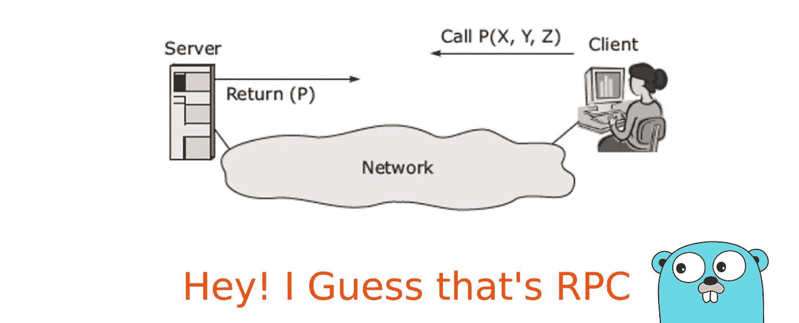

# 在 Go 中编写 RPC 服务器

> 原文：<https://levelup.gitconnected.com/writing-an-rpc-server-in-go-eb9afd56d1e1>



RPC 的图示

## *本文是 GoLang 系列文章* [*的一部分:构建 Web 服务器*](https://sumit-agarwal.medium.com/golang-building-a-web-server-2d34d4f90fa1)

嘿，各位编码员，在上一篇文章[中，我们学习了如何编写 Fx 模块，并在我们的项目中添加了一个日志模块。继续使用相同的代码库，我们将添加对服务 RPC 请求的支持。](/writing-fx-modules-517193b9c4f0)

## RPC 是什么？

RPC 代表[远程过程调用](https://users.cs.cf.ac.uk/Dave.Marshall/C/node33.html)。这是一种[进程间通信](https://www.geeksforgeeks.org/inter-process-communication-ipc),使用间接方法在接收方和发送方之间传递消息，以便在两者之间建立通道。

RPC 通常用于客户机/服务器体系结构中进行通信。RPC 被广泛使用和接受的主要原因是它能够分离物理层和逻辑层。参与通信的任何一方都不需要理解对方的实现细节或传输机制，他们只关心输入和输出。

## 一个基本的 RPC 服务器

我们将使用 Go 的`net/rpc`包来构建我们的 RPC 服务器。为此，我们需要对到目前为止编写的代码进行一些修改。

1.  我们将在`onStart`钩子块中添加一个`net.Listen`,这将确保我们监听 RPC 请求

```
// start the rpc server
l, err := net.Listen("tcp", ":8081")
logger.Errorf("Error while starting rpc server: %+v", err)
go func() {
   for {
      rpc.Accept(l)
   }
}()
logger.Info("Listening on port 8081 for RPC requests")
```

goroutine 中的 for 循环确保我们监听所有从端口 8081 上无限发出的请求。到目前为止，RPC 还没有什么特别的。

2.接下来，我们添加一个简单的 RPC 处理程序，它的工作是通过网络公开一个方法。

```
import (
   "net/rpc"
)// User message
type User struct {
   // The user name
   Name string
   // The user age
   Age int32
}// Handler is the struct which exposes the User Server methods
type Handler struct {
}

// New returns the object for the RPC handler
func New() *Handler {
   h := &Handler{}
   err := rpc.Register(h)
   if err != nil {
      panic(err)
   }
   return h
}

// GetUsers function returns the list of users
func (rh *Handler) GetUsers(payload int, reply *string) error {
   // add logic to return users
   return nil
}
```

*注意:为了便于理解，我在代码中添加了用户实体，它与 RPC 的核心逻辑无关。*

3.最后的改变是为我们的 Fx 模块提供服务器，这样它就可以被初始化了。

```
fx.New(
   ...
   fx.Provide(rpcServer.New),
).Run()
```

这样，我们就有了我们的 RPC 服务器。我们需要做的就是执行`go run main.go`

仍然没有答案的问题是，在没有 RPC 客户端的情况下，我如何测试我的 RPC 服务器？下面的代码片段帮助您测试您的服务器。您可以将它作为一个独立的 main 方法运行，并对其进行测试。发生了什么事！

```
client, _ := rpc.Dial("tcp", "localhost:8081")

if err := client.Call("Handler.GetUsers", 1, nil); err != nil {
    fmt.Printf("Error:1 user.GetUsers() %+v", err)
} else {
    fmt.Printf("user found")
}
```

请在 [GitHub](https://github.com/sumiet/medium_webserver_series/tree/master/4) 上找到上面写的代码。

当您必须在日常项目中使用 RPC 时，我们上面所做的既不可扩展也不容易编写/维护。这就是 gRPC 拯救世界的原因。在下一篇文章的[中，我们将探索如何使用 gRPC 和 Protobuf 来编写一个高质量的 Golang RPC 服务器。](https://sumit-agarwal.medium.com/using-grpc-and-protobuf-in-golang-9c218d662db3)

[](https://grpc.io/) [## gRPC

### gRPC 是一个现代的开源高性能 RPC 框架，可以在任何环境中运行。它可以高效地连接…

grpc.io](https://grpc.io/) [](https://developers.google.com/protocol-buffers) [## 协议缓冲区|谷歌开发者

### 协议缓冲区是 Google 的语言中立、平台中立、可扩展的机制，用于序列化结构化数据…

developers.google.com](https://developers.google.com/protocol-buffers) 

Co 有趣的事实:“C”编程语言的前身叫做“ [B](https://en.wikipedia.org/wiki/B_(programming_language))

***请求:*** *请在评论中添加您的宝贵反馈，这将真正帮助我提高内容的质量，并使其符合您的期望。*