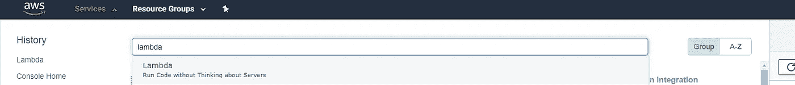
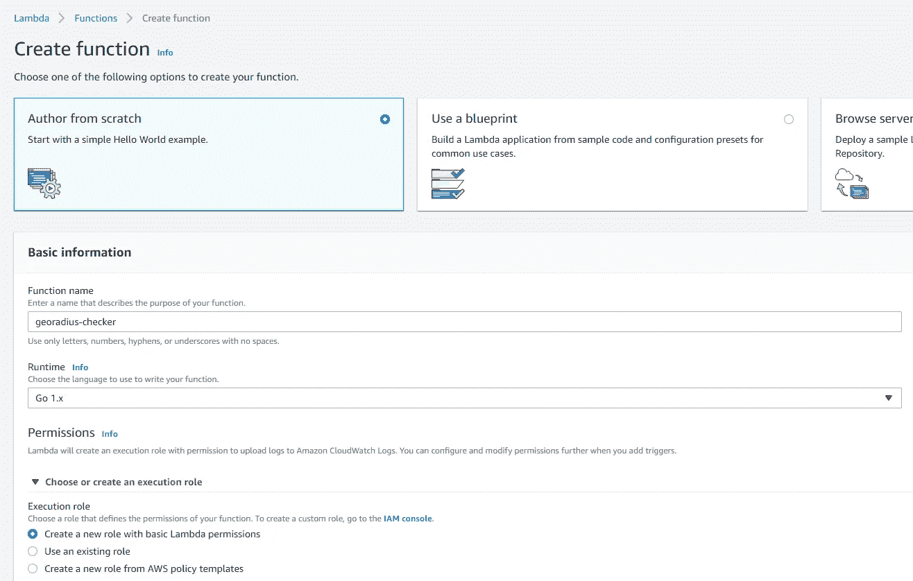
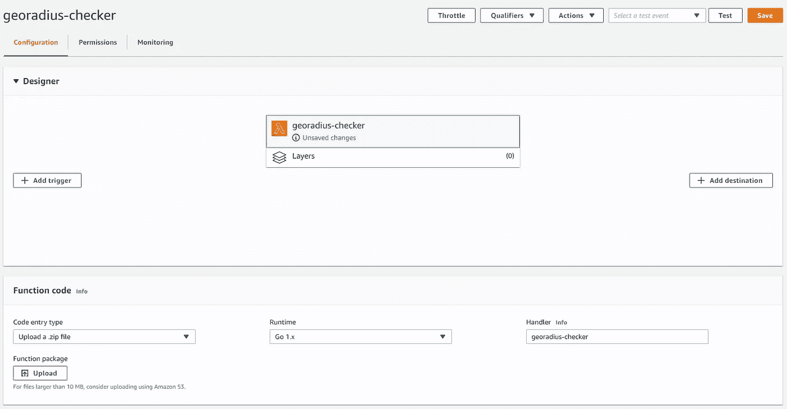
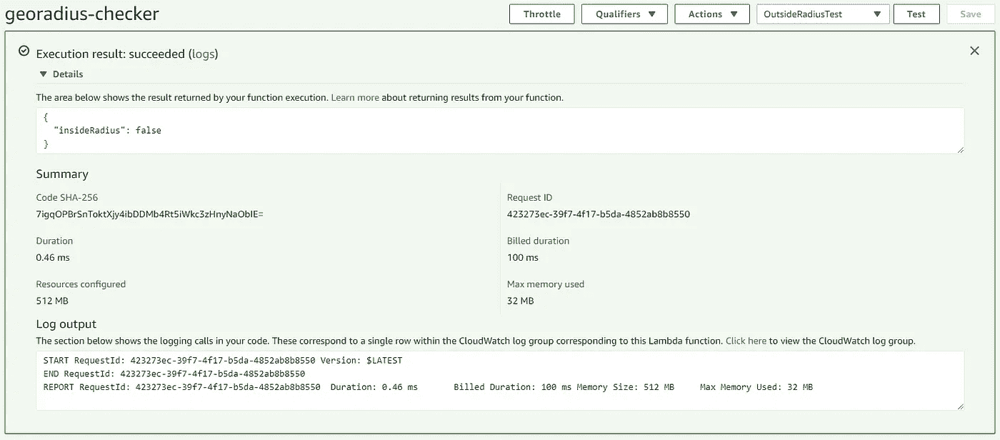

# 使用 Go 编写和部署您的第一个 AWS Lambda

> 原文：<https://levelup.gitconnected.com/writing-and-deploying-your-first-aws-lambda-7a6d5800b443>

这篇文章展示了如何使用 Go 编写和部署 AWS Lambda。


马库斯·斯皮斯克在 [Unsplash](https://unsplash.com?utm_source=medium&utm_medium=referral) 上的照片

# 重要的事情先来

写这篇文章的想法是向你展示我们如何开始开发云原生的小东西。为了达到这个结果，我选择了 Go 作为语言，AWS 作为我们的云提供商(S2)，下面的问题:*你是新来的，你要去一个广场，所以你在网上搜索一家餐馆，找到了一家不错的。现在，你想知道你(A 点)是否在餐馆(B 点)半径的旁边。给定 A 点(纬度和经度)，B 点(纬度和经度)和它的半径(米),你如何求解？*

不知道走就别跑。这很容易理解，正如我所说，主要目标是向您展示我们如何编写、部署和访问小型云原生解决方案。

为了解决这个问题，我们将使用余弦球面定律。我找到了一个[非常有用的页面](http://www.movable-type.co.uk/scripts/latlong.html)，解释了它的公式以及如何计算，比我能做的好得多。

因此，首先我将向您逐行展示 lambda 代码，向您介绍 AWS Lambda 环境，最后，我们将了解如何使用管理控制台部署和测试它。

**如果你对 AWS CLI 有所了解，我强烈建议你查看一下**[**lambda create-function**](https://docs.aws.amazon.com/cli/latest/reference/lambda/create-function.html)**命令参考，看看你如何以 CLI 方式部署我们的 lambda。**

最后但同样重要的是，我已经使用了 Go 1.13.4 ( [如何获得并安装它](https://golang.org/doc/install))，项目的代码可以从我的 [GitHub](https://github.com/diegohordi/awslambda-georadius-checker) 中访问。

所以，让我们把手弄脏吧！

## 环境

假设您已经安装了 [Go](https://golang.org/doc/install) ，为了编写其他 AWS Lambdas，您需要添加以下依赖项:

#1 — [AWS Lambda Go 套装](http://github.com/aws/aws-lambda-go)

```
go get github.com/aws/aws-lambda-go/lambda
```

#2 — AWS Lambda 部署包工具(仅限 Windows)

```
go get -u github.com/aws/aws-lambda-go/cmd/build-lambda-zip
```

## **创建项目**

要在 Go 中创建新项目，只需在提示工具中键入:

```
go mod init github.com/<your-username>/georadius-checker
```

创建项目后，只需用下面解释的代码行创建一个 **georadius-checker.go** 。

## 我们的λ

在文件的第一行，我们声明了将要使用的包和导入。

在第 3 行，我们创建了一个常数来保持余弦半径的球面定律不变。为了解决我们的问题，我们需要接收 5 个参数，因此，从第 6 行到第 12 行，我们创建了我们的*数据传输对象*【DTO】*来保存这些参数。请注意，对于您想要接收的所有属性，其名称必须大写。*

*在第 14 行，我们创建 DTO 来保存响应模型。按照我们的要求，DTO，所有你想输出的属性都必须大写。*

*在定义了我们的 DTO 之后，我们创建了一个简单的私有函数(它的名字以小写字母开头)来将度数转换成弧度，如下所示。*

*最后，我们把公式抄写下来。在第 2 行，我们创建了一个新的公共函数(名字以大写字母开头)，它接收我们的 5 个参数并返回一个布尔值。因此，在第 3 行，我们得到了从 B 点到 A 点的经度差，在第 4 行和第 5 行，我们得到了 A 点和 B 点的纬度差。在第 6 行，重要的一行，我们保存公式的结果。我们使用默认的包数学来使事情尽可能简单。在第 7 行，我们检查计算的差值是否小于或等于作为参数给出的半径。*

*除了上面的方法之外，下面几行包含了最重要的代码，它使我们能够在 AWS 上部署这个方法。*

*在第 2 行，我们声明了 [HandleRequest 方法](https://docs.aws.amazon.com/lambda/latest/dg/go-programming-model-handler-types.html)，它接收来自 AWS Lambda 环境的请求。这个方法签名只是遵循一些规则，但基本上，它可以接收一个上下文对象，为 lambda 调用提供运行时信息，一个您需要定义的某种类型的对象(在我们的例子中，我们接收一个坐标对象),最后，如果在 lambda 执行期间发生错误，它可以返回某个对象和一个标准错误。*

*AWS 负责将我们的请求反序列化为给定的数据类型。所以，在第 3 行，我们调用我们的方法，检查 A 点坐标是否在 B 点坐标的半径内。*

*最后，在第 7 行我们声明了 main 方法，这是执行 lambda 函数代码的入口点。*

## *建设*

*如果您使用的是 Windows，我在存储库上放了一个额外的文件，名为 **build-aws-zip.bat** ，您可以运行它。这个脚本基本上构建了我们的 Go 应用程序，并调用 **build-lambda-zip** 工具将其放入/target 目录下的一个 zip 文件中，我们将在 AWS 上部署这个文件。*

*在 UNIX 环境中，只需构建您的 Go 应用程序:*

```
*go build*
```

*并将生成的二进制文件放入 zip:*

```
***zip** georadius-checker**.zip** georadius-checker*
```

***展开***

*我假设你有一个 AWS 帐户。要部署 lambda，请访问您的管理控制台。登录后，在服务菜单中，只需输入 Lambda，然后点击它，如下图所示。*

**

*在 lambda 页面中，点击**创建函数**按钮，然后，我们如下设置我们的 Lambda。*

*从头开始选择**作者**选项，然后在字段**函数名**中，输入我们的 Go 文件的名称，不带扩展名(本例中为 georadius-checker)。所以，在**运行时**下拉列表中选择 Go 1.x。在权限设置中，保留选项“**创建一个具有基本 Lambda 权限的新角色**”(创建一个具有将日志上传到 CloudWatch 日志的权限的角色)。然后点击**创建功能**按钮。*

**

*下一个屏幕如下所示。*

**

*点击**上传**按钮，选择我们的 zip 文件，并在**处理程序**字段中，再次输入我们的 Go 文件的名称，不带扩展名，然后点击**保存**按钮。*

*为了测试我们的 lambda，我们将创建两个场景，内部径向测试和外部径向测试。首先，点击**测试**按钮，在**事件名称**字段，输入 **InsideRadiusTest，**然后粘贴下面的代码，点击**创建**按钮。*

```
*{
  "aLatitude": 38.6938,
  "aLongitude": -9.4204,
  "bLatitude": 38.7254,
  "bLongitude": -9.1502,
  "radius": 23710
}*
```

*现在，我们将创建**室外辐射测试**。在靠近测试按钮的下拉菜单中选择选项**配置测试事件**，并粘贴以下代码。*

```
*{
  "aLatitude": 38.6938,
  "aLongitude": -9.4204,
  "bLatitude": 38.7254,
  "bLongitude": -9.1502,
  "radius": 23700
}*
```

*创建测试事件后，只需在下拉列表中选择您想要测试的内容，然后点击**测试**按钮。结果似乎如下。*

**

## *结论*

*我打算与您分享一些关于如何使用 Go 语言编写 AWS Lambda 以及如何在您的 AWS 帐户中部署和测试它的基础知识。现在[您可以通过 AWS CLI](https://docs.aws.amazon.com/lambda/latest/dg/lambda-invocation.html) 访问它，甚至在 AWS API 网关中创建一个端点。*

*正如您所看到的，编写和部署 lambda 函数非常简单，AWS 有很多文档描述了如何使用其他语言来实现这一点，例如 Node.js、Python 和 Java。*

*但是，除了我们在这里看到的所有技术方面的东西之外，我希望您在发现和研究如何以云原生方式编写小东西的过程中获得一些乐趣。*

*所以，希望这个帖子有用。*

*感谢您的阅读，如果您有任何问题，请联系我！=)*

## *参考*

*[走](https://golang.org/)*

*[球面舒适定律](http://www.movable-type.co.uk/scripts/latlong.html)*

*[AWS Lambda 文档](https://docs.aws.amazon.com/en_us/lambda/?id=docs_gateway)*

*[用 GO 构建 Lambda 函数](https://docs.aws.amazon.com/lambda/latest/dg/go-programming-model.html)*

*[AWS Lambda 部署包即将发布](https://docs.aws.amazon.com/lambda/latest/dg/lambda-go-how-to-create-deployment-package.html)*

*[AWS CLI Lambda API 参考](https://docs.aws.amazon.com/cli/latest/reference/lambda/index.html#cli-aws-lambda)*