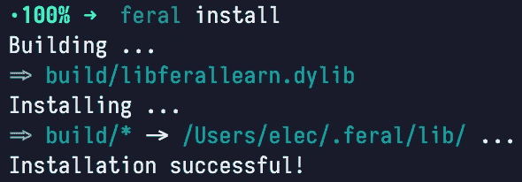

# 为 Feral 编写 C++模块

> 原文：<https://levelup.gitconnected.com/writing-c-modules-for-feral-391c30ac7739>

使用 C++扩展野生编程语言


为本文中创建的模块构建脚本

在我的[上一篇文章](https://medium.com/@ElectruxR/the-feral-programming-language-81f87deb58cc)中，我介绍了[野生](https://github.com/Feral-Lang)编程语言。这一次，我们将为它创建 C++扩展！这些扩展是为该语言添加功能和库支持的构建块。通常，一个通用任务可以用 Feral 本身实现，但是当任务需要本机性能时，用 C++编写它特别有用。

出于本文的目的，我们将实现一个 C++模块，包含一个野生变量和函数，来演示如何正确地利用可用的特性来为我们服务。

任何疑问、问题等。可以在 GitHub 或 Feral 的 discord 服务器上询问(链接在底部)。🙂

# 概念

在 Feral 中，C++扩展的工作方式如下:

1.  使用我们的脚本中的`mload()`函数在运行时加载扩展。在内部，这将打开给定的动态库(模块)并调用其中一个名为`init_<module_name>()`的特殊函数(使用`INIT_MODULE(module_name)`宏在模块中创建)。
2.  通过`init_<module_name>()`函数将所需的变量和函数注入/插入到 Feral 运行时。
3.  变量和函数现在可以从 Feral 源访问。
4.  如果有动态分配的变量，可以使用可选的`deinit_<module_name>()`函数(使用`DEINIT_MODULE(module_name)`宏创建)取消分配。这方面的一个例子是[野性语言/野性卷曲](https://github.com/Feral-Lang/Feral-Curl)模块。

根本就是这样！很简单，我想…我希望至少？😁 🙈

# 编写我们的模块——创建变量

对于一个带有解释和完整源代码的简单模块，请查看 **ImMaax** 的存储库:[ImMaax/Feral-hello world](https://github.com/ImMaax/Feral-HelloWorld)。

好吧，我们去找些有趣的东西吧！首先，我们需要为模块创建一个目录结构。Feral 附带了一个构建系统，当提供了一个特定的目录结构和一个构建脚本(`build.fer`)时，它会为你构建并安装你的 Feral C++模块。就这么简单。

目录结构如下:

```
<a_module_directory>/
    ├─ include/
    ├─ src/
    └─ build.fer
```

`src/`目录将包含 C++源文件，而`include/`目录将包含`.fer`导入脚本。注意，两者都不是必须的。我们将在`src/`目录下创建我们的`.cpp`模块源文件。现在，让我们把它命名为`learn.cpp`(是的，我知道——太有创意了！).

现在，我们的目录结构如下所示:

```
<a_module_directory>/
    ├─ include/
    ├─ src/
    │   └─ learn.cpp
    └─ build.fer
```

现在，我们已经准备好深入(华丽的)C++源代码了。

因为所有需要的声明都存在于你的野生安装的`PREFIX_DIR`中的`feral/VM/VM.hpp`头文件中(更多关于那个[这里是](https://feral-lang.github.io/Book/01-install.html#compiler-and-virtual-machine))，我们将不得不把那个文件包含在我们的源代码中。

我们还使用了`INIT_MODULE`宏，它为我们的模块提供了一个入口点。我们的源文件将如下所示:

我们的准系统 C++扩展源文件

**注意**模块名**必须**与源文件名相同(减去`.cpp`部分)，包括字母大写。

让我们创建一个源局部变量——比如说`pi` (3.14157)。

由于变量是源本地的(仅在调用`mload()`加载该模块的野生源文件中可用)，我们需要获取当前打开的野生源文件，然后我们可以将变量添加到其中。

为了获取当前源，我们基本上获取了野生虚拟机的源文件堆栈中的顶部元素，并将该元素存储在一个`var_src_t*`类型变量中。

这总结起来就是:`var_src_t * src = vm.current_source();`。

要在源代码中实际插入变量，我们必须在`src`指针上调用`add_native_var`函数。在源代码中插入`pi`的完整语句是:

```
src->add_native_var("pi", make_all<*var_flt_t*>(3.14157, src_id, idx));
```

我们来分析一下。

从最里面，我们看到了`make_all<var_flt_t>`。本质上，`var_flt_t`是一个用于存储浮点值的野生类型。`make_all`是一个允许我们用所需值初始化类型(此处为`var_flt_t`)的函数。

`var_flt_t`的论据是:

```
1\. float: the floating point value to be created
2\. size_t: the current source ID
3\. size_t: the current source location indexFor the first argument, we enter the pi's value - 3.14157.
src_id and idx are provided to us through the INIT_MODULE macro itself.
```

`src_id`和`idx`变量是至关重要的，因为在错误发生时，它们被用来显示源文件、发生错误的行和列。

`src->add_native_var()`的第一个参数是我们的变量在野性中的名字(这里是`pi`)。

嗯，就这样吧！我们在扩展中创建了第一个野性变量！整个源代码应该看起来像这样:

我们的带有 pi 变量的 C++扩展源文件

现在，剩下要做的就是创建我们的构建脚本(`build.fer`)并安装这个模块供我们测试。构建脚本如下所示:

```
let *sys* = import('std/sys');
let *builder* = import('std/builder');let *build* = builder.new().make_dll();
build.add_src('src/learn.cpp');sys.exit(build.perform('learn'));
```

现在我们在这个脚本中只需要注意两件事:`build.add_src('src/learn.cpp');`和`sys.exit(build.perform('learn'));`。

这分别是我们的源文件位置和构建名称。记住根据你的文件位置和模块名来命名它们。

之后，我们将使用`feral install`命令安装我们的模块。但是首先，确保 Feral 的模块目录是使用`feral init`命令初始化的。对我来说，`feral install`的输出是:



恶意安装

耶！是时候测试一下了！

只需创建一个脚本——比如说`test.fer`,在该文件中导入`io`模块和`mload()`我们的自定义模块，并使用`io.println()`函数看看我们是否可以打印 pi 值。其代码如下:

```
let io = import('std/io');
mload('learn');io.println('Value of pi is: ', pi);
```

您将获得以下输出:

```
Value of pi is: 3.14157000000000019568
```

耶！！我们做了第一个 C++扩展！！

但是，它还没有完成。注意到`mload()`而不是`import()`了吗？是的，我们不想那样。原因是其中的符号不能存储在变量中(如`io`)，这意味着它在这个脚本之外是不可用的。

因此，我们希望将这个`mload()`调用封装在一个我们将根据需要导入的野生脚本中，而不是一次又一次地使用`mload()`。

为此，创建一个野生脚本——比如说在`include/`目录中的`learn.fer`,并在该脚本中编写`mload()`函数调用:

```
mload('learn');
```

现在，再做一个`feral install`轰！我们已经完成了简单模块的创建！！

为了使用它，我们将调用`import()`，而不是调用`mload()`，并将它存储在一个包含我们的`pi`变量的变量中。我们最终的测试脚本将如下所示:

```
let io = import('std/io');
let learn = import('learn');io.println(learn.pi);
```

呜呜呜。我们的第一个 C++野生扩展！是不是很牛逼？！🤩😍

是时候为 Feral 创建一个 C++函数了！

# 编写我们的模块—创建一个函数

野生函数的 C++签名是特定的。我们必须使用这个签名来创建一个野生函数。签名是:

```
*var_base_t* * func(*vm_state_t* &, const *fn_data_t* &);
```

函数名(这里是`func`)可以是你想要的任何名字。该函数必须有两个参数:

```
1\. vm_state_t&: virtual machine state - provides access to the VM
2\. const fn_data_t&: the function call information - mainly arguments, keyword arguments, src_id, and idx
```

并且，该函数必须返回一个野生变量对象指针(`var_base_t*`)。

好吧，让我们创建一个返回字符串长度的函数！

我们知道，在 C++中，字符串的长度是由`std::string::size()`成员函数返回的。我们可以利用这一点。当然，Feral 有一个 C++的`string`类型的包装器。你猜对了——`var_str_t`。

我们将创建一个函数`len()`，它将字符串作为参数，并返回该字符串的长度。这方面的代码是:

绳子的长度(第一部分)

…是的，我们应该分解它。

第一行当然是我们讨论过的函数签名——这里的函数名是`len`。在函数体内，我们获取当前正在执行的源文件的`src_file`对象——这样做是为了正确地产生错误。然后，我们检查第一个参数(`fd.args[1]`)的类型是否是 string ( `VT_STR`)。如果不是字符串，我们使用`vm.fail()`函数显示第一个参数(`fd.args[1]->idx()`)的位置错误，并返回`nullptr`。

注意，第一个参数不是`fd.args[0]`，因为它是保留的。我们稍后会谈到这一点。此外，当我们返回`nullptr`时，实际上意味着函数已经失败，Feral 将在此之后停止执行。

最后，我们使用`STR()`宏将我们的基类对象`fd.args[1]`类型转换为`var_str_t`类型，然后我们`get()`包装的`std::string`对象并使用`size()`成员函数获取它的长度，之后，我们将该值包装到`var_int_t`并返回它。就是这样！

你一定注意到了，这次我们用的是`make<>()`函数，而不是之前我们用的`make_all<>()`。它们之间的区别在于，我们在使用`make`函数时不设置`src_id`和`idx`，这正是我们想要的，因为在函数调用之后，Feral 会自己设置那个值。

我们做到了！我们自己的野性功能！但是，我们也需要让 Feral 本身知道这个函数的存在。为此，我们将把它添加到 Feral 当前执行的源文件中(类似于我们之前添加变量的方式)。

因此，我们将在`INIT_MODULE`块中使用`src`变量的`add_native_fn()`成员函数。

该函数的参数如下:

```
1\. string: the name for function which will be visible in Feral
2\. nativefnptr_t: the function we created in the C++ source
3\. int (optional): number of arguments required by the function
4\. bool: does the function use variadic arguments
```

因为我们希望我们的`len`函数在 Feral 中被调用`len`，它采用`1`参数并且不是可变的，函数调用如下:

```
src->add_native_fn("len", len, 1);
```

没错。我们完了！！我们现在可以试试我们的功能了！😁

让我们再次使用`feral install`来更新我们的模块，并在`test.fer`中写入以下内容:

```
let *io* = import('std/io');
let *learn* = import('learn');io.println(learn.len("some string"));
```

当我们运行它时，我们将看到输出`11`，它是`some string`的长度。耶！成功了！！🤩

虽然，如果我们能做些类似… `"some string".len()`的事情不是更好吗？就这么办吧！

为了创建一个成员函数(或者正确地说，类型绑定函数),我们需要将函数绑定到一个特定的类型(这里是`VT_STR`)并稍微改变一下我们的函数体。

对于函数体，还记得我们保留了`fd.args[0]`吗？实际上，这个变量包含了调用这个函数的对象。换句话说，如果我们做了`"some string".len()`，`fd.args[0]`就会包含`"some string"`(同样，当我们做了`learn.len()`，`learn`的时候物体就被它包含了)。

此外，由于这个函数将被绑定到字符串类型，我们将不必像以前那样检查参数是否是字符串！

执行这些更改后，我们的新职能变成了:

字符串长度第 2 部分

请注意，我们还删除了`src_file`,因为不再需要它。

这个看起来很小很可爱吧！😍

最后，更新`INIT_MODULE`中的函数声明，我们用`vm.add_native_typefn()`替换`src->add_native_fn()`调用。该函数的参数如下:

```
1\. int: type to bind the function to
2\. string: the name for function which will be visible in Feral
3\. nativefnptr_t: the function we created in the C++ source
4\. int: number of arguments required by the function
5\. size_t: the current source ID
6\. size_t: the current source location index
```

因为这将是一个`string`类型的成员函数，我们不再需要为它提供任何参数。因此，参数计数现在将是`0`，而不是之前的`1`。因此，最后一个函数调用变成了:

```
vm.add_native_typefn(VT_STR, "len", len, 0, src_id, idx);
```

现在，使用`feral install`安装更新的模块，并将`test.fer`改为使用`"some string".len()`而不是`learn.len("some string")`。

代码变为:

```
let *io* = import('std/io');
let *learn* = import('learn');io.println("some string".len());
```

注意不再需要前缀`learn.`。

执行代码，我们将看到输出`11`，它是`some string`的长度。完美！！

我们的 C++模块的完整源代码是:

全模块源

# 结论

这是一篇关于如何为 Feral 创建 C++扩展的基础文章/教程。我希望它能增长见识，引人入胜。😁

如果你想要更多的例子，可以查看 [Feral-Lang/Feral-Std](https://github.com/Feral-Lang/Feral-Std) 库(Feral 的标准库)。相关链接见下一节。

一如既往，所有的问题，想法，建议和想法都是愉快的欢迎和非常感谢。

非常感谢你的阅读，祝你有美好的一天。下次见！❤️

# 链接

野性不和服务器:[https://discord.gg/zMAjSXn](https://discord.gg/zMAjSXn)

野狼(组织网址):[https://github.com/Feral-Lang](https://github.com/Feral-Lang)

野生编译器/虚拟机:[https://github.com/Feral-Lang/Feral](https://github.com/Feral-Lang/Feral)

野生 Std(标准库):https://github.com/Feral-Lang/Feral-Std

野性之书(WIP):[https://feral-lang.github.io/Book](https://feral-lang.github.io/Book)(来源:[https://github.com/Feral-Lang/Book](https://github.com/Feral-Lang/Book))

野生 HelloWorld(作者 ImMaax):[https://github.com/ImMaax/Feral-HelloWorld](https://github.com/ImMaax/Feral-HelloWorld)

上一篇:[https://medium . com/@ electr uxr/the-feral-programming-language-81 f 87 deb 58 cc](https://medium.com/@ElectruxR/the-feral-programming-language-81f87deb58cc)