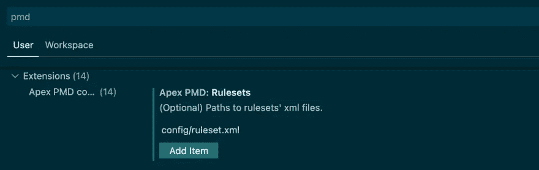
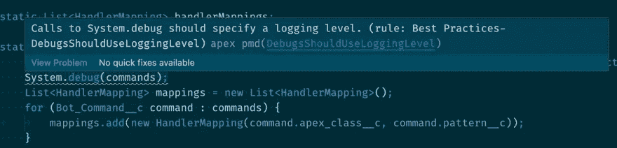

# 使用 PMD 和 Apex 通过静态分析编写干净一致的代码

> 原文：<https://levelup.gitconnected.com/writing-clean-and-consistent-code-with-static-analysis-using-pmd-and-apex-9c18863a9f68>

开发好的、可维护的软件的关键要求之一是确保它能在各种条件下工作。这通常是通过对应用程序可能采用的各种特性和代码路径进行一系列自动化测试来实现的。虽然单元测试对于确保您的应用程序在技术上运行是非常好的，但是还有另一类验证可以确保您的应用程序没有其他可检测的问题:静态分析。

静态分析是一种不需要执行就能分析你的代码*的方法。如果你曾经使用过像 Kotlin 这样的编译语言，编译器通过确保你的程序符合语言的语法规则来实现一种形式的静态分析。例如，如果您调用了一个函数，但忘记了传入必需的参数，静态分析器会在您编译应用程序之前提醒您出现此错误。这与解释型语言(如 JavaScript)形成对比，在解释型语言中，错误会在执行代码时发生，因为没有编译器来预测问题。*

(准确地说，静态分析器*可以*应用于解释语言，如 JavaScript、Ruby 或 Python，确保代码格式良好，没有逻辑缺失。)

# 静态分析的好处

虽然一个写得很好的测试套件可能会覆盖这样的代码路径，但是静态分析可以做得更多。静态分析器可以减少出现错误的可能性，比如当您意外地用另一个值覆盖了一个变量时。它还可以实现林挺和格式规则，这使得您的代码库一致且更容易审查。一些静态分析器甚至通过建议重写循环或其他函数调用的方式来带来性能优势。

几乎每种编程语言都有自己的静态分析器。例如，golang 有 [gofmt](https://pkg.go.dev/cmd/gofmt) ，它被烘焙到标准工具中，而 Ruby 有 [Rubocop](https://rubocop.org/) ，这是一个社区主导的项目。甚至像 C 这样的编译语言也通过[as style](http://astyle.sourceforge.net/astyle.html)拥有自己的静态分析器。然而，在多语言项目中运行几个分析器是很困难的(也是乏味的)。幸运的是，这正是像 PMD 这样的项目能有所帮助的地方。PMD 是一个静态分析器，它允许你定义一套可以应用于多种语言的标准规则。

在这篇文章中，我们将仔细研究 PMD，并学习如何在 Apex 代码上运行它。我们的 Apex 项目将有几个 PMD 可以报告和采取行动的问题。我们还将把 PMD 集成到您的编辑器以及您的 CI 环境中，以确保如果静态分析检测到任何问题，您的构建将会失败。

# 先决条件

在开始之前，您应该对 [Apex](https://developer.salesforce.com/docs/atlas.en-us.apexcode.meta/apexcode/apex_intro_what_is_apex.htm#!) 有所了解，这是 Salesforce 的编程语言，为您的组织开启了新的可能性。我们将使用 [VS 代码](https://code.visualstudio.com/)以及[Apex 插件](https://marketplace.visualstudio.com/items?itemName=salesforce.salesforcedx-vscode)。您还需要 [Salesforce CLI](https://developer.salesforce.com/tools/sfdxcli) ，这是一款由 Salesforce 设计的工具，用于简化与平台的交互。

接下来，继续按照 PMD 的[安装说明进行操作。](https://pmd.github.io/pmd-6.40.0/pmd_userdocs_installation.html#how-to-install-pmd-and-cpd)

最后，在这个 Git 存储库中克隆我们的示例 Apex 项目:[https://github.com/gjtorikian/sfdc-linting.git](https://github.com/gjtorikian/sfdc-linting.git)

这个库是 [dreamhouse-lwc 项目](https://github.com/trailheadapps/dreamhouse-lwc)的分叉副本，除了它已经(有意地)引入了一些错误。我们将用它来演示 PMD 是如何工作的。

# 整合 PMD

首先，[为您的 Salesforce 组织启用开发中心](https://developer.salesforce.com/docs/atlas.en-us.sfdx_dev.meta/sfdx_dev/sfdx_setup_enable_devhub.htm)。如果您没有 Salesforce 实例，不用担心。您可以[创建一个临时组织](https://developer.salesforce.com/docs/atlas.en-us.sfdx_dev.meta/sfdx_dev/sfdx_dev_scratch_orgs_create.htm)，它类似于一个临时的 Salesforce 组织。您可以使用 scratch org 来测试在 Salesforce 平台上开发是什么样子的。

无论您使用的是临时组织还是您自己的组织，您都需要通过登录将 sfdx 与该组织相关联。为此，请运行以下命令:

```
sfdx auth:web:login
```

这将打开一个新的浏览器窗口，要求您提供 Salesforce 凭据。完成后，Salesforce CLI 将在身份验证完成时通知您。

现在，让我们看看当我们试图将克隆的项目上传到我们的组织时会发生什么。导航到您克隆了`dreamhouse-sfdx`项目的目录，并运行以下命令:

```
sfdx force:source:push -u <admin_email_address>
```

您应该会看到以下输出:

```
*** Deploying with SOAP ***
Job ID | 0AfR000001XgjR1KAJ
SOURCE PROGRESS | ░░░░░░░░░░░░░░░░░░░░░░░░░░░░░░░░░░░░░░░░ | 0/2 Components
TYPE   PROJECT PATH                                      PROBLEM
─────  ────────────────────────────────────────────────  ──────────────────────────────────────────────
Error  force-app/main/default/classes/PagedResult.cls  Unexpected token '}'. (12:40)
Error  force-app/main/default/classes/PagedResult.cls  Unexpected token 'set'. (6:37)
ERROR running force:source:push:  Push failed.
```

啊哦！看起来这个文件中有几个问题，都是由于缺少分号引起的。(这是如何通过代码审查的？)

在 VS 代码中打开`force-app/main/default/classes/PagedResult.cls`，在第 6 行和第 12 行的语句末尾添加一个分号。这应该能解决问题，对吧？

嗯……也许不是。虽然我们的代码可以编译并且没有构建错误，但是我们的项目可能有一些我们不知道的其他问题。在命令行上，键入以下命令:

```
pmd -d . -R config/ruleset.xml
```

这里，我们在当前目录(`-d .`)上运行 PMD，并应用位于`config/ruleset.xml`的规则集。当您执行这个命令时，您会看到几十行如下所示:

```
main/default/classes/PostPriceChangeToSlackTest.cls:11: DebugsShouldUseLoggingLevel:    Calls to System.debug should specify a logging level.
main/default/classes/PropertyController.cls:1:  AvoidGlobalModifier:    Avoid using global modifier
main/default/classes/SampleDataController.cls:20:   UnusedLocalVariable:    Variable 'brokersJSON' defined but not used
```

这就是 PMD 的力量。根据我们的规则集，PMD 确定了我们项目中的几个问题:

*   我们遗漏了日志严重性级别。
*   我们使用了全局修改器，这可能会产生不必要的副作用。
*   我们正在创建未使用的局部变量，这是对内存和时间的浪费。

打开`config/ruleset.xml`文件，您会发现一个列出了几个`rules`的 XML 文档。这些规则对应于 PMD 将报告的问题。信不信由你，Apex 规则有*上百*，你可以在 [PMD 回购](https://github.com/pmd/pmd/blob/eb1f30cd660e02bed7079d26b30fb76ca6ed6026/pmd-apex/src/main/resources/rulesets/apex/quickstart.xml)找到全套。您可以完全控制要启用的规则。通常情况下，你会通过与队友就最重要的问题达成一致来确定哪些是重要的。毕竟，他们的代码也会被静态分析！

# 在 VS 代码中集成 PMD

切换到命令行来静态分析您的代码可能会变得有点乏味，如果不会彻底中断您的工作流的话。因为静态分析查看代码的结构而不编译它，所以你可以将像 PMD 这样的工具直接集成到你的编辑器中。这意味着您可以在编写代码时获得反馈。

幸运的是，有几个插件允许你将 PMD 集成到 VS 代码中。让我们安装一个，看看这个过程是什么样子的。访问 VS 代码市场上的 [Apex PMD 扩展主页](https://marketplace.visualstudio.com/items?itemName=chuckjonas.apex-pmd)并点击**安装**。这会下载插件并将其安装到您的编辑器中——但是我们还没有完成。

Apex PMD 扩展有自己的规则集，虽然方便，但可能与您为项目建立的规则不同。我们需要配置该工具来指向我们预先确定的规则集。

打开 VS 代码设置页面(可以在菜单栏中的**代码>首选项>设置**下找到)，键入`pmd`将设置过滤到该扩展名。然后，在 **Rulesets** 部分，设置我们在这个项目中创建的`ruleset.xml`文件的路径。



接下来，导航到项目中的任何`.cls`文件。你会看到不同的曲线表明 PMD 发现的问题。将鼠标悬停在这些行上还会出现一个对话框，指示问题是什么，以及哪个规则触发了它。



# 将 PMD 融入 CI

让 PMD 在编写代码的同时运行，是在问题进入生产之前捕捉到它们的一个很好的步骤。然而，最好的方法是将 PMD 分析作为 CI/CD 管道中测试套件的一部分。

第一步是在您的 CI 服务器上安装 PMD。你可以通过抓取程序的容器化版本来实现，或者通过下载 wget 的包并解压。

如果你正在使用 GitHub Actions，你可以集成[一个像这样的动作](https://github.com/rody/pmd-github-action)，它会为你完成所有的安装和配置。如果不是，您只需像在 CLI 上一样，在脚本中运行 PMD 即可:

```
#!/bin/shset -epmd -d . -R config/ruleset.xml
```

由于 PMD 以非零状态失败，如果有任何问题，运行此脚本也会将您的配置项标记为失败。

# 结论

静态分析不仅有助于保持代码的一致性和整洁，还可以通过指出可能导致更大问题的小的不一致来提高效率。它应该是你工具箱里的一个重要工具。此外，通过将静态分析与您的 CI 测试相集成，您可以放心，一旦您的代码被修复，它将保持不变。

为了了解如何编写更好的 Apex 代码，Salesforce 提供了一些带有一些高级主题的 [Trailhead 徽章](https://trailhead.salesforce.com/en/content/learn/modules/asynchronous_apex)。[PMD 文档](https://pmd.github.io/latest/pmd_rules_apex.html)还详细介绍了您可以使用的所有 Apex 规则。Salesforce 还有[一整套工具](https://marketplace.visualstudio.com/items?itemName=salesforce.salesforcedx-vscode)，可以作为插件安装，让编写代码变得更加容易！