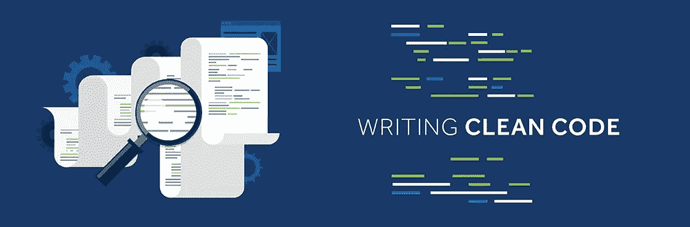
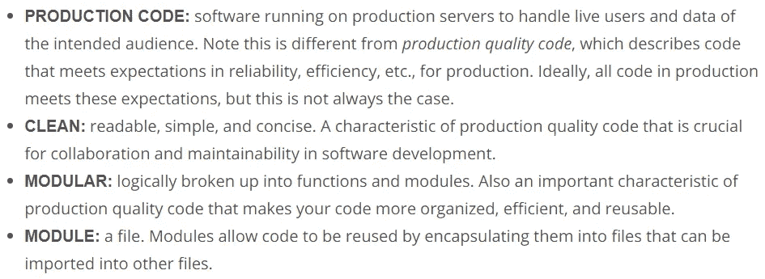
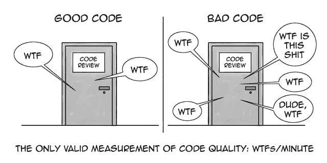
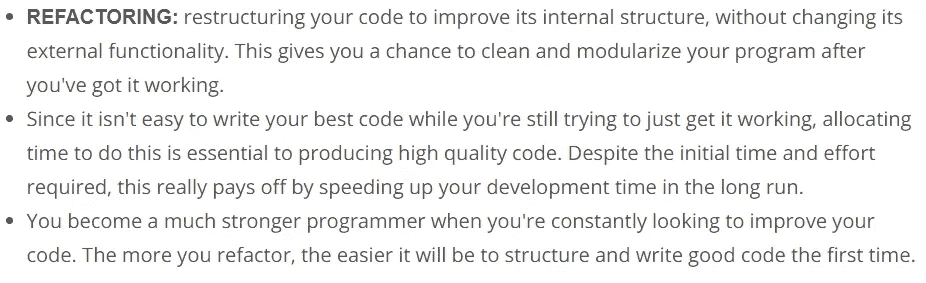

# 为数据科学家编写干净的代码

> 原文：<https://levelup.gitconnected.com/writing-clean-code-for-data-scientists-f141bf550d37>

"干净的代码看起来总是像是由关心它的人写的."
― **罗伯特·c·马丁，** [**干净代码:敏捷软件工艺手册**](https://www.goodreads.com/work/quotes/3779106)

[干净代码的四个关键原则| Jake Group](https://www.google.com/url?sa=i&source=images&cd=&ved=2ahUKEwieg83UrvjlAhVZA2MBHWhtCK0Qjhx6BAgBEAI&url=https%3A%2F%2Fjakegroup.com%2Fblog%2Ffour-principles-of-clean-code%2F&psig=AOvVaw3QAqG2x8a0kELXVl0txfO6&ust=1574324630835156)

当数据科学家第一次开始编码时，或者即使他们已经在更多的研究或学术环境中编码多年，他们也经常为此而挣扎。当您在行业中工作时，您的代码可能会在生产中使用。

Udacity —软件工程简介

**生产代码**只是指在生产服务器上运行的代码。例如，当你在笔记本电脑上使用像 Udacity、Google 或 Amazon 这样的软件产品时，运行你正在使用的服务的代码就是生产代码。理想情况下，生产中使用的代码在公开之前应该满足许多标准，以确保可靠性和效率。首先，代码需要干净。

**代码是干净的**当它可读、简单和简洁的时候。这里有一个例子，用简单的英语说，是一个不干净的句子。“人们可以观察到你的衬衫被弄脏了，因为你的衬衫是橙色的，看起来像是某种果汁的颜色。”这个句子是非常多余和复杂的。光是看这个就让我很沮丧。这可以改写为，“看起来像你把橙汁洒在你的衬衫上了”，并达到同样的效果。但是这句话简洁明了多了。在一个不断重复工作的团队中，编写干净的代码是非常重要的。这使得您自己和他人更容易理解和重用您的代码。除了干净之外，你的代码应该是模块化的。也就是说，你的程序在逻辑上被分解成功能和模块。在编程中，模块只是一个文件。

[http://the data ist . com/ten-good-coding-practices-for-data-scientists/](http://thedataist.com/ten-good-coding-practices-for-data-scientists/)

类似于如何将代码封装在函数中并通过在不同位置调用该函数来重用它，您可以将代码封装在模块或文件中，并通过将其导入其他文件来重用它。我们将在后面看到这样的例子。为了更好地理解什么是模块化代码，试着把它想象成把你的衣服放好。当然，你可以把所有的衣服都放在一个抽屉里，但是要找到任何东西都不太容易。也许因为你永远找不到任何东西，你有同一件衬衫或袜子的多个版本，因为你在他找不到的时候回购了它们。如果你有一个放 t 恤的抽屉，一个放衬衫的抽屉，一个放袜子的抽屉，等等，那就更好了。有了这种设计，如果你需要一套漂亮的衣服去面试，你就不用担心只因为他找不到合适的衣服就去买了。如果你需要告诉别人如何找到合适的衬衫、裤子和一双袜子，这种设计会更容易。

写模块化代码也是如此。将代码分割成逻辑函数和模块，可以让您快速找到相关的代码片段。您通常可以将这些代码段一般化，以便在不同的地方重用，从而避免自己编写额外的不必要的代码行。将这些细节抽象成这些函数和模块确实有助于提高代码的可读性。同样，以一种让团队更容易理解和迭代的方式编程对于生产来说是至关重要的。

## **代码重构**

当你第一次坐下来开始为一个新的想法或任务编写代码时，很容易很少注意编写好的代码，而是更多地关注如何让它工作。因此，在开发的这个阶段，您的代码通常会有点混乱和重复。

这没问题。

在代码完成之前，很难知道什么是编写代码的最佳方式。例如，如果您没有对代码进行足够的实验来理解这些步骤是什么，那么就很难确切地知道哪些函数最适合模块化代码中的步骤。这就是为什么在你获得一个工作模型之后，你应该总是回去做一些重构。

**代码重构**是一个术语，指的是在不改变外部功能的情况下，对代码进行重组，以改善其内部结构。重构给了你一个机会，在你产生了可以工作的代码之后，清理和模块化你的代码。从短期来看，你可能会认为这是浪费时间，因为你可能会转向下一个特性。

然而，从长远来看，分配时间来重构代码确实会加快你和你的团队开发代码的速度。始终如一地重构代码不仅使以后回到代码中变得更加容易，而且还允许您在不同的任务中重用不同的部分，并在此过程中学习强大的编程技术。你越是练习重构代码，它就变得越直观。您将开始发现自己在第一次通过时编写了更有组织的代码，当您回去时需要重新组织的代码更少了。

乌达城

乌达城

# 编写干净的代码:有意义的名字

> 提示:使用有意义的名字
> 
> **具有描述性并隐含类型** —例如，对于布尔值，您可以以`is_`或`has_`作为前缀，以清楚地表明这是一个条件。你也可以用词性来暗示类型，比如用动词表示函数，用名词表示变量。
> 
> **保持一致，但要明确区分**——例如`age_list`和`age`比`ages`和`age`更容易区分。
> 
> **避免使用缩写，尤其是单个字母**——(例外:计数器和常见的数学变量)选择何时可以使用这些例外可以根据代码的受众来决定。如果你和其他数据科学家一起工作，某些变量可能是常识。而如果您与全栈工程师一起工作，在这些情况下也可能需要提供更具描述性的名称。
> 
> **长长的名字！=描述性名称** —你应该是描述性的，但只包含相关信息。例如，好的函数名称描述了它们做得好的地方，但没有包括实现细节或非常具体的用途。

不看代码，让一个程序员同事根据名字猜测函数或变量的用途，试试看你的名字有多有效。想出有意义的名字通常需要努力才能正确。

# 编写干净的代码:漂亮的空白

> 提示:正确使用空格
> 
> 用一致的缩进来组织你的代码——标准是每个缩进使用 4 个空格。您可以在文本编辑器中将其设为默认值。
> 
> 用空行分隔各个部分，以保持代码组织良好，可读性强。
> 
> 尽量把你的行数限制在 79 个字符左右，这是 PEP 8 风格指南中给出的指导方针。在许多优秀的文本编辑器中，有一个设置显示一条微妙的线，表明 79 个字符的限制在哪里。

如需更多指导，请查看下面注释中的 PEP 8 代码布局部分。

## 编写干净的代码:漂亮的空白

[PEP 8 代码布局指南](https://www.python.org/dev/peps/pep-0008/?#code-lay-out)

# 编写模块化代码

乌达城

> **提示:干(不要重复自己)**
> 
> 不要重复自己！模块化允许你重用部分代码。概括和巩固函数或循环中重复的代码。
> 
> **提示:抽象出逻辑以提高可读性**
> 
> 将代码抽象成一个函数，不仅减少了代码的重复，还提高了描述性函数名的可读性。虽然当你把逻辑抽象成函数时，你的代码会变得更可读，但这可能会过度设计，有太多的模块，所以使用你的判断。
> 
> **提示:尽量减少实体(函数、类、模块等)的数量。)**
> 
> 用函数调用代替内联逻辑也有利弊。如果您已经将代码分解成了不必要的函数和模块，那么如果您想查看一些可能太小而不值得的东西的实现细节，您将不得不到处跳转。创建更多的模块不一定会导致有效的模块化。
> 
> **提示:函数应该做一件事**
> 
> 你写的每个函数都应该专注于做一件事。如果一个函数在做多件事情，那么泛化和重用就变得更加困难。一般来说，如果你的函数名中有一个“and ”,考虑重构。
> 
> **提示:任意变量名在某些函数中更有效**
> 
> 一般函数中的任意变量名实际上可以使代码更具可读性。
> 
> **提示:每个函数尽量少用三个参数**
> 
> 尽可能使用不超过三个参数。这不是一个硬性规则，有时使用许多参数更合适。但在很多情况下，使用更少的参数会更有效。记住，我们模块化是为了简化我们的代码，使它更有效地工作。如果您的函数有很多参数，您可能需要重新考虑如何将其拆分。

来源: [UDACITY](https://www.udacity.com/course/machine-learning-engineer-nanodegree--nd009t)